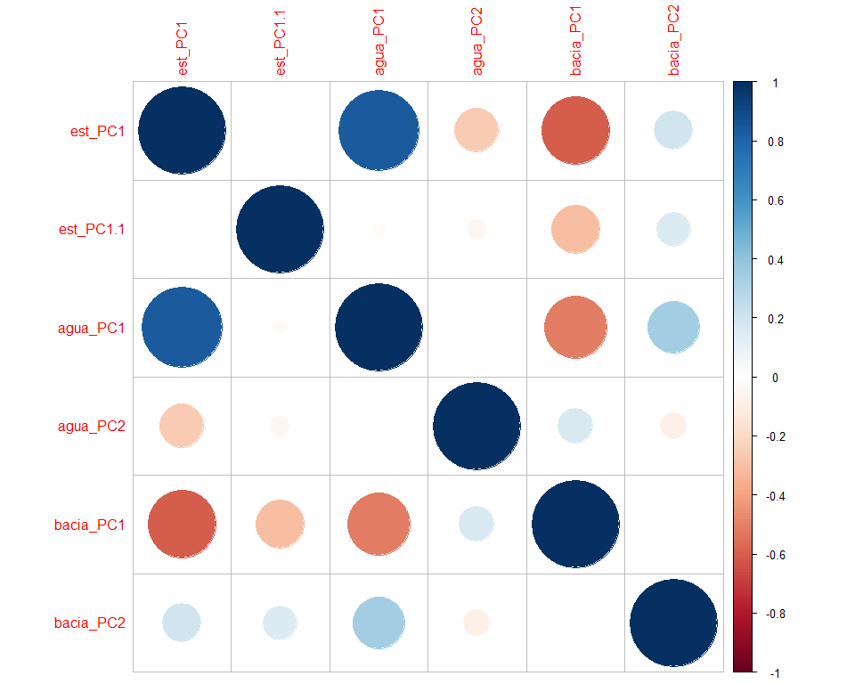
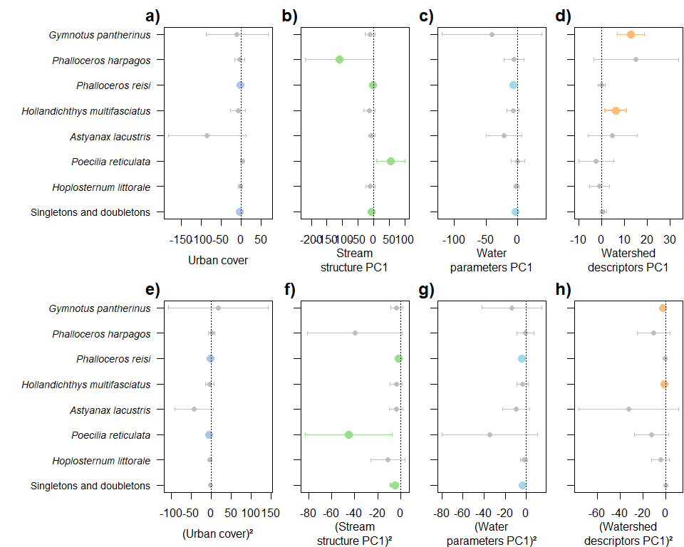
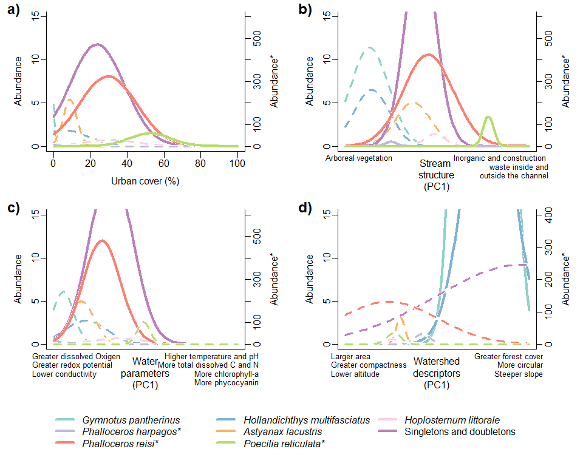
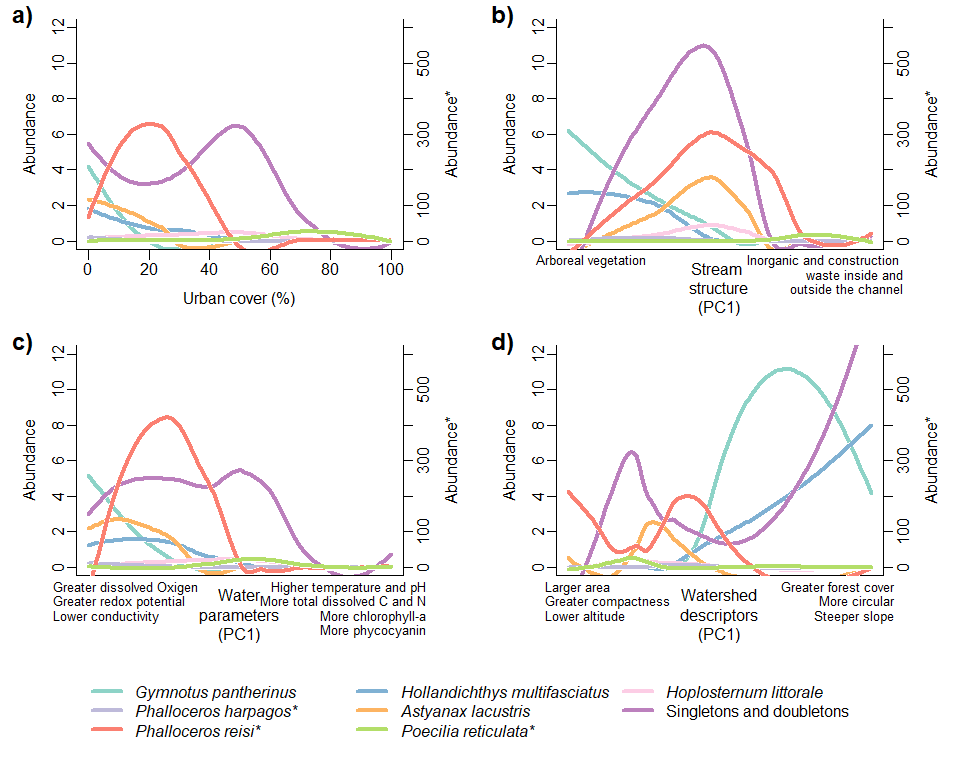

Manyglm_varpart
================
Rodolfo Pelinson
2025-06-28

``` r
dir<-("C:/Users/rodol/OneDrive/repos/Urban_fish_assemblages")
```

Loading important functions and packages

``` r
source(paste(sep = "/",dir,"functions/remove_sp.R"))
source(paste(sep = "/",dir,"functions/R2_manyglm.R"))
source(paste(sep = "/",dir,"functions/forward_sel_manyglm.R"))
source(paste(sep = "/",dir,"functions/varpart_manyglm.R"))
source(paste(sep = "/",dir,"functions/My_coefplot.R"))
source(paste(sep = "/",dir,"functions/letters.R"))
source(paste(sep = "/",dir,"functions/at_generator.R"))


library(mvabund)
library(vegan)
```

    ## Loading required package: permute

``` r
library(yarrr)
```

    ## Loading required package: jpeg

    ## Loading required package: BayesFactor

    ## Loading required package: coda

    ## Loading required package: Matrix

    ## ************
    ## Welcome to BayesFactor 0.9.12-4.7. If you have questions, please contact Richard Morey (richarddmorey@gmail.com).
    ## 
    ## Type BFManual() to open the manual.
    ## ************

    ## Loading required package: circlize

    ## ========================================
    ## circlize version 0.4.16
    ## CRAN page: https://cran.r-project.org/package=circlize
    ## Github page: https://github.com/jokergoo/circlize
    ## Documentation: https://jokergoo.github.io/circlize_book/book/
    ## 
    ## If you use it in published research, please cite:
    ## Gu, Z. circlize implements and enhances circular visualization
    ##   in R. Bioinformatics 2014.
    ## 
    ## This message can be suppressed by:
    ##   suppressPackageStartupMessages(library(circlize))
    ## ========================================

    ## yarrr v0.1.5. Citation info at citation('yarrr'). Package guide at yarrr.guide()

    ## Email me at Nathaniel.D.Phillips.is@gmail.com

``` r
library(ade4)
library(adespatial)
```

    ## Registered S3 methods overwritten by 'adegraphics':
    ##   method         from
    ##   biplot.dudi    ade4
    ##   kplot.foucart  ade4
    ##   kplot.mcoa     ade4
    ##   kplot.mfa      ade4
    ##   kplot.pta      ade4
    ##   kplot.sepan    ade4
    ##   kplot.statis   ade4
    ##   scatter.coa    ade4
    ##   scatter.dudi   ade4
    ##   scatter.nipals ade4
    ##   scatter.pco    ade4
    ##   score.acm      ade4
    ##   score.mix      ade4
    ##   score.pca      ade4
    ##   screeplot.dudi ade4

    ## Registered S3 method overwritten by 'spdep':
    ##   method   from
    ##   plot.mst ape

    ## Registered S3 method overwritten by 'adespatial':
    ##   method          from       
    ##   plot.multispati adegraphics

``` r
library(corrplot)
```

    ## corrplot 0.95 loaded

Loading data

``` r
assembleia_peixes <- read.csv(paste(sep = "/",dir,"data/com_por_bacia.csv"), row.names = 1)
agua_PCs <- read.csv(paste(sep = "/",dir,"data/pcas_amb/agua_PCs.csv"), row.names = 1)
estrutura_PCs <- read.csv(paste(sep = "/",dir,"data/pcas_amb/estrutura_PCs.csv"), row.names = 1)
bacia_PCs <- read.csv(paste(sep = "/",dir,"data/pcas_amb/bacia_PCs.csv"), row.names = 1)
delineamento <- read.csv(paste(sep = "/",dir,"data/delineamento.csv"))
dist_euclid <- read.csv(paste(sep = "/",dir,"data/dist/Matriz_distancia_matriz_euclidiana.csv"), row.names = 1)
```

Removing species with less than 2 presences and combining them into the
artificial “Singletons” species.

``` r
assembleia_peixes <- read.csv(paste(sep = "/",dir,"data/com_por_bacia.csv"), row.names = 1)
assembleia_peixes <- assembleia_peixes[,-c(4,11)]
assembleia_peixes_rm <- remove_sp(com = assembleia_peixes, n_sp = 2)

singletons_doubletons <- remove_sp(assembleia_peixes, 2, less_equal = TRUE)
doubletons <- remove_sp(singletons_doubletons, 1)

singletons <- remove_sp(assembleia_peixes, 1, less_equal = TRUE)

sing_doub_ab <- rowSums(singletons_doubletons)
sing_ab <- rowSums(singletons)

sing_doub <- rowSums(decostand(singletons_doubletons, method = "pa")) 
sing <- rowSums(decostand(singletons, method = "pa")) 

assembleia_peixes_rm <- data.frame(assembleia_peixes_rm, Singletons_and_doubletons = sing_doub_ab)
```

Preparing predictors

``` r
urb <- data.frame(urb = delineamento$urbana)

urb <- decostand(urb, method = "stand")
agua_PCs <- decostand(agua_PCs, method = "stand")
estrutura_PCs <- decostand(estrutura_PCs, method = "stand")
bacia_PCs <- decostand(bacia_PCs, method = "stand")
```

Producing spatial filters

``` r
dist_euclid <- as.dist(dist_euclid)

dbmem_euclid <- dbmem(dist_euclid, thresh = NULL, MEM.autocor = c("positive", "non-null", "all", "negative"), store.listw = TRUE, silent = FALSE)
```

    ## Truncation level = 0.3268453 
    ## Time to compute dbMEMs = 0.000000  sec

``` r
dbmem_euclid <- decostand(dbmem_euclid, method = "stand")
```

``` r
data.frame(
rownames(assembleia_peixes_rm),
rownames(agua_PCs),
rownames(bacia_PCs),
rownames(estrutura_PCs),
rownames(as.matrix(dist_euclid)),
delineamento$bacia_id
)
```

    ##    rownames.assembleia_peixes_rm. rownames.agua_PCs. rownames.bacia_PCs.
    ## 1                           ebbsn               b031                b031
    ## 2                           ebbrc               b034                b034
    ## 3                            b581               b039                b039
    ## 4                            b631               b040                b040
    ## 5                            b539               b066                b066
    ## 6                            b570               b202                b202
    ## 7                            b034               b204                b204
    ## 8                            b620               b309                b309
    ## 9                            b589               b310                b310
    ## 10                           b627               b320                b320
    ## 11                           b545               b321                b321
    ## 12                           b711               b344                b344
    ## 13                           b543               b539                b539
    ## 14                           b320               b543                b543
    ## 15                           b031               b545                b545
    ## 16                           b637               b570                b570
    ## 17                           b321               b574                b574
    ## 18                           b039               b578                b578
    ## 19                           b040               b579                b579
    ## 20                           b066               b581                b581
    ## 21                           b202               b589                b589
    ## 22                           b204               b594                b594
    ## 23                           b309               b620                b620
    ## 24                           b310               b627                b627
    ## 25                           b344               b631                b631
    ## 26                           b574               b637                b637
    ## 27                           b578               b673                b673
    ## 28                           b579               b711                b711
    ## 29                           b594              ebbrc               ebbrc
    ## 30                           b673              ebbsn               ebbsn
    ##    rownames.estrutura_PCs. rownames.as.matrix.dist_euclid..
    ## 1                     b031                             b031
    ## 2                     b034                             b034
    ## 3                     b039                             b039
    ## 4                     b040                             b040
    ## 5                     b066                             b066
    ## 6                     b202                             b202
    ## 7                     b204                             b204
    ## 8                     b309                             b309
    ## 9                     b310                             b310
    ## 10                    b320                             b320
    ## 11                    b321                             b321
    ## 12                    b344                             b344
    ## 13                    b539                             b539
    ## 14                    b543                             b543
    ## 15                    b545                             b545
    ## 16                    b570                             b570
    ## 17                    b574                             b574
    ## 18                    b578                             b578
    ## 19                    b579                             b579
    ## 20                    b581                             b581
    ## 21                    b589                             b589
    ## 22                    b594                             b594
    ## 23                    b620                             b620
    ## 24                    b627                             b627
    ## 25                    b631                             b631
    ## 26                    b637                             b637
    ## 27                    b673                             b673
    ## 28                    b711                             b711
    ## 29                   ebbrc                            ebbrc
    ## 30                   ebbsn                            ebbsn
    ##    delineamento.bacia_id
    ## 1                   b031
    ## 2                   b034
    ## 3                   b039
    ## 4                   b040
    ## 5                   b066
    ## 6                   b202
    ## 7                   b204
    ## 8                   b309
    ## 9                   b310
    ## 10                  b320
    ## 11                  b321
    ## 12                  b344
    ## 13                  b539
    ## 14                  b543
    ## 15                  b545
    ## 16                  b570
    ## 17                  b574
    ## 18                  b578
    ## 19                  b579
    ## 20                  b581
    ## 21                  b589
    ## 22                  b594
    ## 23                  b620
    ## 24                  b627
    ## 25                  b631
    ## 26                  b637
    ## 27                  b673
    ## 28                  b711
    ## 29                 ebbrc
    ## 30                 ebbsn

``` r
assembleia_peixes_rm <- assembleia_peixes_rm[match(delineamento$bacia_id, rownames(assembleia_peixes_rm) ),]

data.frame(
rownames(assembleia_peixes_rm),
rownames(agua_PCs),
rownames(bacia_PCs),
rownames(estrutura_PCs),
rownames(as.matrix(dist_euclid)),
delineamento$bacia_id
)
```

    ##    rownames.assembleia_peixes_rm. rownames.agua_PCs. rownames.bacia_PCs.
    ## 1                            b031               b031                b031
    ## 2                            b034               b034                b034
    ## 3                            b039               b039                b039
    ## 4                            b040               b040                b040
    ## 5                            b066               b066                b066
    ## 6                            b202               b202                b202
    ## 7                            b204               b204                b204
    ## 8                            b309               b309                b309
    ## 9                            b310               b310                b310
    ## 10                           b320               b320                b320
    ## 11                           b321               b321                b321
    ## 12                           b344               b344                b344
    ## 13                           b539               b539                b539
    ## 14                           b543               b543                b543
    ## 15                           b545               b545                b545
    ## 16                           b570               b570                b570
    ## 17                           b574               b574                b574
    ## 18                           b578               b578                b578
    ## 19                           b579               b579                b579
    ## 20                           b581               b581                b581
    ## 21                           b589               b589                b589
    ## 22                           b594               b594                b594
    ## 23                           b620               b620                b620
    ## 24                           b627               b627                b627
    ## 25                           b631               b631                b631
    ## 26                           b637               b637                b637
    ## 27                           b673               b673                b673
    ## 28                           b711               b711                b711
    ## 29                          ebbrc              ebbrc               ebbrc
    ## 30                          ebbsn              ebbsn               ebbsn
    ##    rownames.estrutura_PCs. rownames.as.matrix.dist_euclid..
    ## 1                     b031                             b031
    ## 2                     b034                             b034
    ## 3                     b039                             b039
    ## 4                     b040                             b040
    ## 5                     b066                             b066
    ## 6                     b202                             b202
    ## 7                     b204                             b204
    ## 8                     b309                             b309
    ## 9                     b310                             b310
    ## 10                    b320                             b320
    ## 11                    b321                             b321
    ## 12                    b344                             b344
    ## 13                    b539                             b539
    ## 14                    b543                             b543
    ## 15                    b545                             b545
    ## 16                    b570                             b570
    ## 17                    b574                             b574
    ## 18                    b578                             b578
    ## 19                    b579                             b579
    ## 20                    b581                             b581
    ## 21                    b589                             b589
    ## 22                    b594                             b594
    ## 23                    b620                             b620
    ## 24                    b627                             b627
    ## 25                    b631                             b631
    ## 26                    b637                             b637
    ## 27                    b673                             b673
    ## 28                    b711                             b711
    ## 29                   ebbrc                            ebbrc
    ## 30                   ebbsn                            ebbsn
    ##    delineamento.bacia_id
    ## 1                   b031
    ## 2                   b034
    ## 3                   b039
    ## 4                   b040
    ## 5                   b066
    ## 6                   b202
    ## 7                   b204
    ## 8                   b309
    ## 9                   b310
    ## 10                  b320
    ## 11                  b321
    ## 12                  b344
    ## 13                  b539
    ## 14                  b543
    ## 15                  b545
    ## 16                  b570
    ## 17                  b574
    ## 18                  b578
    ## 19                  b579
    ## 20                  b581
    ## 21                  b589
    ## 22                  b594
    ## 23                  b620
    ## 24                  b627
    ## 25                  b631
    ## 26                  b637
    ## 27                  b673
    ## 28                  b711
    ## 29                 ebbrc
    ## 30                 ebbsn

### Variation Partitioning - Environment, Urban cover and Spatial filters

First, lets just look at a corplot for all environmental filters. First
axys of all three PCAs are correlated with each other.

``` r
env_data.frame <- data.frame(est_PC1 = estrutura_PCs[,1],
                             est_PC1 = estrutura_PCs[,2],
                             #est_PC3 = estrutura_PCs[,3],
                             #est_PC4 = estrutura_PCs[,4],
                             #est_PC5 = estrutura_PCs[,5],
                             agua_PC1 = agua_PCs[,1],
                             agua_PC2 = agua_PCs[,2],
                             #agua_PC3 = agua_PCs[,3],
                             #agua_PC4 = agua_PCs[,4],
                             #agua_PC5 = agua_PCs[,5],
                             bacia_PC1 = bacia_PCs[,1],
                             bacia_PC2 = bacia_PCs[,2])
                             #bacia_PC3 = bacia_PCs[,3],
                             #bacia_PC4 = bacia_PCs[,4],
                             #bacia_PC5 = bacia_PCs[,5]) #considerarei apenas os 5 primeiros eixos

corrplot(cor(env_data.frame))
```

<!-- -->

Now lets see if it is worth it to consider quadratic effects for the
effect of urban cover.

``` r
assembleia_peixes_rm_mv <- mvabund(assembleia_peixes_rm)

model_null <- manyglm(assembleia_peixes_rm_mv ~ 1,data = urb)
model_urb <- manyglm(assembleia_peixes_rm_mv ~ urb,data = urb)
model_urb_quad <- manyglm(assembleia_peixes_rm_mv ~ urb + I(urb^2),data = urb)

anova_urb <- anova(model_null, model_urb, model_urb_quad)
```

    ## Time elapsed: 0 hr 0 min 24 sec

``` r
anova_urb2 <- anova(model_null, model_urb_quad)
```

    ## Time elapsed: 0 hr 0 min 12 sec

``` r
urb_quad <- urb^2
```

### Variation Partitioning - Stream struture, water parameters and watershed descriptors

Now we will repeat the variation partitioning only for environmental
predictors

First, forward selection

``` r
est_FS <- forward_sel_manyglm(y = assembleia_peixes_rm, x = data.frame(est_PC1 = estrutura_PCs[,1],
                                                                       est_PC2 = estrutura_PCs[,2]), nBoot=999, quad = TRUE) 
```

    ## testing for quadratic effects...

    ## Time elapsed: 0 hr 0 min 14 sec
    ## Time elapsed: 0 hr 0 min 25 sec
    ##         df.diff      Dev        R2     p
    ## est_PC1       2 91.13964 0.3966517 0.002
    ## est_PC2       2 37.88000 0.2232342 0.417

    ## testing for linear effects...

    ## Time elapsed: 0 hr 0 min 26 sec
    ##         df.diff      Dev         R2     p
    ## est_PC2       1 12.58174 0.08609846 0.632

    ## No linear effects were found

``` r
agua_FS <- forward_sel_manyglm(y = assembleia_peixes_rm, x = data.frame(agua_PC1 = agua_PCs[,1],
                                                                        agua_PC2 = agua_PCs[,2]), nBoot=999, quad = TRUE) 
```

    ## testing for quadratic effects...

    ## Time elapsed: 0 hr 0 min 12 sec
    ## Time elapsed: 0 hr 0 min 27 sec
    ##          df.diff      Dev        R2     p
    ## agua_PC1       2 79.72771 0.3354866 0.001
    ## agua_PC2       2 43.46037 0.2109107 0.242

    ## testing for linear effects...

    ## Time elapsed: 0 hr 0 min 28 sec
    ##          df.diff      Dev        R2     p
    ## agua_PC2       1 23.84259 0.1270791 0.179

    ## No linear effects were found

``` r
bacia_FS <- forward_sel_manyglm(y = assembleia_peixes_rm, x = data.frame(bacia_PC1 = bacia_PCs[,1],
                                                                         bacia_PC2 = bacia_PCs[,2]), nBoot=999, quad = TRUE) 
```

    ## testing for quadratic effects...

    ## Time elapsed: 0 hr 0 min 16 sec
    ## Time elapsed: 0 hr 0 min 28 sec
    ##           df.diff      Dev        R2     p
    ## bacia_PC1       2 58.56781 0.2659923 0.010
    ## bacia_PC2       2 73.00993 0.3858408 0.004

    ## testing for linear effects...

    ## Time elapsed: 0 hr 0 min 29 sec
    ##           df.diff      Dev        R2     p
    ## bacia_PC2       1 43.36181 0.2487927 0.001

    ## No linear effects were found

``` r
esp_FS <- forward_sel_manyglm(y = assembleia_peixes_rm, x = data.frame(dbmem_euclid), nBoot=999, quad = FALSE) 
```

    ## Time elapsed: 0 hr 0 min 9 sec
    ## Time elapsed: 0 hr 0 min 15 sec
    ##      df.diff      Dev        R2     p
    ## MEM2       1 22.97168 0.1243038 0.034
    ## MEM3       1 20.11421 0.1105914 0.158

Now, the variation partitioning

``` r
urb_df <-

predictors <- list(estrutura = est_FS$new_x,
                   agua = agua_FS$new_x,
                   bacia = bacia_FS$new_x,
                   urb =  data.frame(urb = c(urb)$urb, urb_squared = c(urb_quad)$urb),
                   esp = esp_FS$new_x)

varpart_peixes <- varpart_manyglm(resp = assembleia_peixes_rm, pred = predictors, DF_adj_r2 = TRUE)
varpart_peixes$R2_fractions_com
```

    ##           R2_full_fraction R2_pure_fraction
    ## estrutura        0.3829740      0.009886772
    ## agua             0.3239181      0.031152412
    ## bacia            0.2568201     -0.052717351
    ## urb              0.2750372     -0.044283726
    ## esp              0.1243038     -0.024570122

``` r
full_model2 <- varpart_peixes$R2_models$`estrutura-agua-bacia`
full_model2
```

    ## [1] 0.6437053

``` r
round(varpart_peixes$R2_fractions_sp$R2_full_fraction,4)
```

    ##                               estrutura   agua  bacia    urb    esp
    ## Gymnotus_pantherinus             0.3586 0.4334 0.6913 0.4918 0.0223
    ## Phalloceros_harpagos             0.5139 0.2896 0.2070 0.2837 0.3576
    ## Phalloceros_reisi                0.2169 0.5370 0.0147 0.2759 0.0398
    ## Hollandichthys_multifasciatus    0.4941 0.2711 0.5111 0.2415 0.0299
    ## Astyanax_lacustris               0.2293 0.3396 0.3374 0.3997 0.1074
    ## Poecilia_reticulata              0.2664 0.3161 0.1353 0.1266 0.0837
    ## Hoplosternum_littorale           0.4706 0.1540 0.1403 0.1602 0.3489
    ## Singletons_and_doubletons        0.5139 0.2505 0.0175 0.2208 0.0047

``` r
round(varpart_peixes$R2_fractions_sp$R2_pure_fraction,4)
```

    ##                               estrutura    agua   bacia     urb     esp
    ## Gymnotus_pantherinus            -0.0575 -0.0575 -0.0565 -0.0575 -0.0287
    ## Phalloceros_harpagos            -0.0571 -0.0584 -0.0581 -0.0584 -0.0291
    ## Phalloceros_reisi               -0.0330  0.2741 -0.0396 -0.0041 -0.0113
    ## Hollandichthys_multifasciatus   -0.0580 -0.0566 -0.0579 -0.0579 -0.0290
    ## Astyanax_lacustris              -0.0579 -0.0580 -0.0574 -0.0579 -0.0245
    ## Poecilia_reticulata              0.2197  0.2621 -0.0567 -0.0560 -0.0291
    ## Hoplosternum_littorale          -0.0559 -0.0563 -0.0563 -0.0563 -0.0278
    ## Singletons_and_doubletons        0.1788 -0.0002 -0.0393 -0.0062 -0.0170

``` r
full_model_sp <- varpart_peixes$R2_models_sp$estrutura.agua.bacia
names(full_model_sp) <- rownames(varpart_peixes$R2_fractions_sp$R2_full_fraction)
full_model_sp
```

    ##          Gymnotus_pantherinus          Phalloceros_harpagos 
    ##                     0.6899292                     0.6997901 
    ##             Phalloceros_reisi Hollandichthys_multifasciatus 
    ##                     0.5543890                     0.6958224 
    ##            Astyanax_lacustris           Poecilia_reticulata 
    ##                     0.6678112                     0.6962171 
    ##        Hoplosternum_littorale     Singletons_and_doubletons 
    ##                     0.6638765                     0.4818068

Looking at fractions related to the urbanization process

``` r
shared_urb_estrutura <- (varpart_peixes$R2_models$estrutura + varpart_peixes$R2_models$urb) - varpart_peixes$R2_models$`estrutura-urb`
shared_urb_agua <- (varpart_peixes$R2_models$agua + varpart_peixes$R2_models$urb) - varpart_peixes$R2_models$`agua-urb`
shared_urb_bacia <- (varpart_peixes$R2_models$bacia + varpart_peixes$R2_models$urb) - varpart_peixes$R2_models$`bacia-urb`
shared_urb_esp <- (varpart_peixes$R2_models$esp + varpart_peixes$R2_models$urb) - varpart_peixes$R2_models$`urb-esp`

shared_urb_estrutura
```

    ## [1] 0.1955743

``` r
shared_urb_agua
```

    ## [1] 0.2306456

``` r
shared_urb_bacia
```

    ## [1] 0.1115002

``` r
shared_urb_esp
```

    ## [1] 0.04218407

Tests of significance of fractions:

``` r
p_est <- anova(varpart_peixes$model_null,
               varpart_peixes$models$estrutura,nBoot=999)
```

    ## Time elapsed: 0 hr 0 min 13 sec

``` r
p_est
```

    ## Analysis of Deviance Table
    ## 
    ## varpart_peixes$model_null: resp_mv ~ 1
    ## varpart_peixes$models$estrutura: resp_mv ~ est_PC1 + est_PC1_squared
    ## 
    ## Multivariate test:
    ##                                 Res.Df Df.diff   Dev Pr(>Dev)    
    ## varpart_peixes$model_null           29                           
    ## varpart_peixes$models$estrutura     27       2 91.14    0.001 ***
    ## ---
    ## Signif. codes:  0 '***' 0.001 '**' 0.01 '*' 0.05 '.' 0.1 ' ' 1
    ## Arguments:
    ##  Test statistics calculated assuming uncorrelated response (for faster computation) 
    ##  P-value calculated using 999 iterations via PIT-trap resampling.

``` r
p_bacia <- anova(varpart_peixes$model_null,
                 varpart_peixes$models$bacia,nBoot=999)
```

    ## Time elapsed: 0 hr 0 min 16 sec

``` r
p_bacia
```

    ## Analysis of Deviance Table
    ## 
    ## varpart_peixes$model_null: resp_mv ~ 1
    ## varpart_peixes$models$bacia: resp_mv ~ bacia_PC1 + bacia_PC1_squared
    ## 
    ## Multivariate test:
    ##                             Res.Df Df.diff   Dev Pr(>Dev)   
    ## varpart_peixes$model_null       29                          
    ## varpart_peixes$models$bacia     27       2 58.57    0.004 **
    ## ---
    ## Signif. codes:  0 '***' 0.001 '**' 0.01 '*' 0.05 '.' 0.1 ' ' 1
    ## Arguments:
    ##  Test statistics calculated assuming uncorrelated response (for faster computation) 
    ##  P-value calculated using 999 iterations via PIT-trap resampling.

``` r
p_agua <- anova(varpart_peixes$model_null,
                varpart_peixes$models$agua,nBoot=999)
```

    ## Time elapsed: 0 hr 0 min 12 sec

``` r
p_agua
```

    ## Analysis of Deviance Table
    ## 
    ## varpart_peixes$model_null: resp_mv ~ 1
    ## varpart_peixes$models$agua: resp_mv ~ agua_PC1 + agua_PC1_squared
    ## 
    ## Multivariate test:
    ##                            Res.Df Df.diff   Dev Pr(>Dev)    
    ## varpart_peixes$model_null      29                           
    ## varpart_peixes$models$agua     27       2 79.73    0.001 ***
    ## ---
    ## Signif. codes:  0 '***' 0.001 '**' 0.01 '*' 0.05 '.' 0.1 ' ' 1
    ## Arguments:
    ##  Test statistics calculated assuming uncorrelated response (for faster computation) 
    ##  P-value calculated using 999 iterations via PIT-trap resampling.

``` r
p_esp <- anova(varpart_peixes$model_null,
                varpart_peixes$models$esp,nBoot=999)
```

    ## Time elapsed: 0 hr 0 min 9 sec

``` r
p_esp
```

    ## Analysis of Deviance Table
    ## 
    ## varpart_peixes$model_null: resp_mv ~ 1
    ## varpart_peixes$models$esp: resp_mv ~ MEM2
    ## 
    ## Multivariate test:
    ##                           Res.Df Df.diff   Dev Pr(>Dev)  
    ## varpart_peixes$model_null     29                         
    ## varpart_peixes$models$esp     28       1 22.97     0.03 *
    ## ---
    ## Signif. codes:  0 '***' 0.001 '**' 0.01 '*' 0.05 '.' 0.1 ' ' 1
    ## Arguments:
    ##  Test statistics calculated assuming uncorrelated response (for faster computation) 
    ##  P-value calculated using 999 iterations via PIT-trap resampling.

``` r
p_urb <- anova(varpart_peixes$model_null,
                varpart_peixes$models$urb,nBoot=999)
```

    ## Time elapsed: 0 hr 0 min 12 sec

``` r
p_urb
```

    ## Analysis of Deviance Table
    ## 
    ## varpart_peixes$model_null: resp_mv ~ 1
    ## varpart_peixes$models$urb: resp_mv ~ urb + urb_squared
    ## 
    ## Multivariate test:
    ##                           Res.Df Df.diff   Dev Pr(>Dev)   
    ## varpart_peixes$model_null     29                          
    ## varpart_peixes$models$urb     27       2 61.56    0.004 **
    ## ---
    ## Signif. codes:  0 '***' 0.001 '**' 0.01 '*' 0.05 '.' 0.1 ' ' 1
    ## Arguments:
    ##  Test statistics calculated assuming uncorrelated response (for faster computation) 
    ##  P-value calculated using 999 iterations via PIT-trap resampling.

``` r
p_est_pure <- anova(varpart_peixes$models$`agua-bacia-urb-esp`,
                    varpart_peixes$models$`estrutura-agua-bacia-urb-esp`,nBoot=999)
```

    ## Time elapsed: 0 hr 0 min 15 sec

``` r
p_est_pure
```

    ## Analysis of Deviance Table
    ## 
    ## varpart_peixes$models$`agua-bacia-urb-esp`: resp_mv ~ agua_PC1 + agua_PC1_squared + bacia_PC1 + bacia_PC1_squared + urb + urb_squared + MEM2
    ## varpart_peixes$models$`estrutura-agua-bacia-urb-esp`: resp_mv ~ est_PC1 + est_PC1_squared + agua_PC1 + agua_PC1_squared + bacia_PC1 + bacia_PC1_squared + urb + urb_squared + MEM2
    ## 
    ## Multivariate test:
    ##                                                      Res.Df Df.diff   Dev
    ## varpart_peixes$models$`agua-bacia-urb-esp`               22              
    ## varpart_peixes$models$`estrutura-agua-bacia-urb-esp`     20       2 36.17
    ##                                                      Pr(>Dev)  
    ## varpart_peixes$models$`agua-bacia-urb-esp`                     
    ## varpart_peixes$models$`estrutura-agua-bacia-urb-esp`    0.076 .
    ## ---
    ## Signif. codes:  0 '***' 0.001 '**' 0.01 '*' 0.05 '.' 0.1 ' ' 1
    ## Arguments:
    ##  Test statistics calculated assuming uncorrelated response (for faster computation) 
    ##  P-value calculated using 999 iterations via PIT-trap resampling.

``` r
p_bacia_pure <- anova(varpart_peixes$models$`estrutura-agua-urb-esp`,
                      varpart_peixes$models$`estrutura-agua-bacia-urb-esp`,nBoot=999)
```

    ## Time elapsed: 0 hr 0 min 17 sec

``` r
p_bacia_pure
```

    ## Analysis of Deviance Table
    ## 
    ## varpart_peixes$models$`estrutura-agua-urb-esp`: resp_mv ~ est_PC1 + est_PC1_squared + agua_PC1 + agua_PC1_squared + urb + urb_squared + MEM2
    ## varpart_peixes$models$`estrutura-agua-bacia-urb-esp`: resp_mv ~ est_PC1 + est_PC1_squared + agua_PC1 + agua_PC1_squared + bacia_PC1 + bacia_PC1_squared + urb + urb_squared + MEM2
    ## 
    ## Multivariate test:
    ##                                                      Res.Df Df.diff   Dev
    ## varpart_peixes$models$`estrutura-agua-urb-esp`           22              
    ## varpart_peixes$models$`estrutura-agua-bacia-urb-esp`     20       2 2.268
    ##                                                      Pr(>Dev)
    ## varpart_peixes$models$`estrutura-agua-urb-esp`               
    ## varpart_peixes$models$`estrutura-agua-bacia-urb-esp`    0.956
    ## Arguments:
    ##  Test statistics calculated assuming uncorrelated response (for faster computation) 
    ##  P-value calculated using 999 iterations via PIT-trap resampling.

``` r
p_agua_pure <- anova(varpart_peixes$models$`estrutura-bacia-urb-esp`,
                     varpart_peixes$models$`estrutura-agua-bacia-urb-esp`,nBoot=999)
```

    ## Time elapsed: 0 hr 0 min 18 sec

``` r
p_agua_pure
```

    ## Analysis of Deviance Table
    ## 
    ## varpart_peixes$models$`estrutura-bacia-urb-esp`: resp_mv ~ est_PC1 + est_PC1_squared + bacia_PC1 + bacia_PC1_squared + urb + urb_squared + MEM2
    ## varpart_peixes$models$`estrutura-agua-bacia-urb-esp`: resp_mv ~ est_PC1 + est_PC1_squared + agua_PC1 + agua_PC1_squared + bacia_PC1 + bacia_PC1_squared + urb + urb_squared + MEM2
    ## 
    ## Multivariate test:
    ##                                                      Res.Df Df.diff   Dev
    ## varpart_peixes$models$`estrutura-bacia-urb-esp`          22              
    ## varpart_peixes$models$`estrutura-agua-bacia-urb-esp`     20       2 51.98
    ##                                                      Pr(>Dev)  
    ## varpart_peixes$models$`estrutura-bacia-urb-esp`                
    ## varpart_peixes$models$`estrutura-agua-bacia-urb-esp`    0.085 .
    ## ---
    ## Signif. codes:  0 '***' 0.001 '**' 0.01 '*' 0.05 '.' 0.1 ' ' 1
    ## Arguments:
    ##  Test statistics calculated assuming uncorrelated response (for faster computation) 
    ##  P-value calculated using 999 iterations via PIT-trap resampling.

``` r
p_urb_pure <- anova(varpart_peixes$models$`estrutura-agua-bacia-esp`,
                     varpart_peixes$models$`estrutura-agua-bacia-urb-esp`,nBoot=999)
```

    ## Time elapsed: 0 hr 0 min 21 sec

``` r
p_urb_pure
```

    ## Analysis of Deviance Table
    ## 
    ## varpart_peixes$models$`estrutura-agua-bacia-esp`: resp_mv ~ est_PC1 + est_PC1_squared + agua_PC1 + agua_PC1_squared + bacia_PC1 + bacia_PC1_squared + MEM2
    ## varpart_peixes$models$`estrutura-agua-bacia-urb-esp`: resp_mv ~ est_PC1 + est_PC1_squared + agua_PC1 + agua_PC1_squared + bacia_PC1 + bacia_PC1_squared + urb + urb_squared + MEM2
    ## 
    ## Multivariate test:
    ##                                                      Res.Df Df.diff   Dev
    ## varpart_peixes$models$`estrutura-agua-bacia-esp`         22              
    ## varpart_peixes$models$`estrutura-agua-bacia-urb-esp`     20       2 9.343
    ##                                                      Pr(>Dev)
    ## varpart_peixes$models$`estrutura-agua-bacia-esp`             
    ## varpart_peixes$models$`estrutura-agua-bacia-urb-esp`    0.578
    ## Arguments:
    ##  Test statistics calculated assuming uncorrelated response (for faster computation) 
    ##  P-value calculated using 999 iterations via PIT-trap resampling.

``` r
p_esp_pure <- anova(varpart_peixes$models$`estrutura-agua-bacia-urb`,
                     varpart_peixes$models$`estrutura-agua-bacia-urb-esp`,nBoot=999)
```

    ## Time elapsed: 0 hr 0 min 18 sec

``` r
p_esp_pure
```

    ## Analysis of Deviance Table
    ## 
    ## varpart_peixes$models$`estrutura-agua-bacia-urb`: resp_mv ~ est_PC1 + est_PC1_squared + agua_PC1 + agua_PC1_squared + bacia_PC1 + bacia_PC1_squared + urb + urb_squared
    ## varpart_peixes$models$`estrutura-agua-bacia-urb-esp`: resp_mv ~ est_PC1 + est_PC1_squared + agua_PC1 + agua_PC1_squared + bacia_PC1 + bacia_PC1_squared + urb + urb_squared + MEM2
    ## 
    ## Multivariate test:
    ##                                                      Res.Df Df.diff   Dev
    ## varpart_peixes$models$`estrutura-agua-bacia-urb`         21              
    ## varpart_peixes$models$`estrutura-agua-bacia-urb-esp`     20       1 2.828
    ##                                                      Pr(>Dev)
    ## varpart_peixes$models$`estrutura-agua-bacia-urb`             
    ## varpart_peixes$models$`estrutura-agua-bacia-urb-esp`    0.863
    ## Arguments:
    ##  Test statistics calculated assuming uncorrelated response (for faster computation) 
    ##  P-value calculated using 999 iterations via PIT-trap resampling.

``` r
p_full_model <- anova(varpart_peixes$model_null,
                    varpart_peixes$models$`estrutura-agua-bacia-urb-esp`,nBoot=999)
```

    ## Time elapsed: 0 hr 0 min 18 sec

``` r
p_full_model
```

    ## Analysis of Deviance Table
    ## 
    ## varpart_peixes$model_null: resp_mv ~ 1
    ## varpart_peixes$models$`estrutura-agua-bacia-urb-esp`: resp_mv ~ est_PC1 + est_PC1_squared + agua_PC1 + agua_PC1_squared + bacia_PC1 + bacia_PC1_squared + urb + urb_squared + MEM2
    ## 
    ## Multivariate test:
    ##                                                      Res.Df Df.diff   Dev
    ## varpart_peixes$model_null                                29              
    ## varpart_peixes$models$`estrutura-agua-bacia-urb-esp`     20       9 234.8
    ##                                                      Pr(>Dev)   
    ## varpart_peixes$model_null                                       
    ## varpart_peixes$models$`estrutura-agua-bacia-urb-esp`    0.002 **
    ## ---
    ## Signif. codes:  0 '***' 0.001 '**' 0.01 '*' 0.05 '.' 0.1 ' ' 1
    ## Arguments:
    ##  Test statistics calculated assuming uncorrelated response (for faster computation) 
    ##  P-value calculated using 999 iterations via PIT-trap resampling.

Now, lets plot these R² values:

We will make the same procedures as before:

``` r
names(full_model_sp) <- rownames(varpart_peixes$R2_models_sp)
ord_sp <- order(full_model_sp, decreasing = TRUE)

full_model_sp <- full_model_sp[ord_sp]

full_est <- varpart_peixes$R2_fractions_sp$R2_full_fraction$estrutura
names(full_est) <- rownames(varpart_peixes$R2_fractions_sp$R2_full_fraction)

full_agua <- varpart_peixes$R2_fractions_sp$R2_full_fraction$agua
names(full_agua) <- rownames(varpart_peixes$R2_fractions_sp$R2_full_fraction)

full_bacia <- varpart_peixes$R2_fractions_sp$R2_full_fraction$bacia
names(full_bacia) <- rownames(varpart_peixes$R2_fractions_sp$R2_full_fraction)

full_urb <- varpart_peixes$R2_fractions_sp$R2_full_fraction$urb
names(full_urb) <- rownames(varpart_peixes$R2_fractions_sp$R2_full_fraction)

full_esp <- varpart_peixes$R2_fractions_sp$R2_full_fraction$esp
names(full_esp) <- rownames(varpart_peixes$R2_fractions_sp$R2_full_fraction)


pure_est <- varpart_peixes$R2_fractions_sp$R2_pure_fraction$estrutura
names(pure_est) <- rownames(varpart_peixes$R2_fractions_sp$R2_pure_fraction)

pure_agua <- varpart_peixes$R2_fractions_sp$R2_pure_fraction$agua
names(pure_agua) <- rownames(varpart_peixes$R2_fractions_sp$R2_pure_fraction)

pure_bacia <- varpart_peixes$R2_fractions_sp$R2_pure_fraction$bacia
names(pure_bacia) <- rownames(varpart_peixes$R2_fractions_sp$R2_pure_fraction)

pure_urb <- varpart_peixes$R2_fractions_sp$R2_pure_fraction$urb
names(pure_urb) <- rownames(varpart_peixes$R2_fractions_sp$R2_pure_fraction)

pure_esp <- varpart_peixes$R2_fractions_sp$R2_pure_fraction$esp
names(pure_esp) <- rownames(varpart_peixes$R2_fractions_sp$R2_pure_fraction)


full_est<- full_est[ord_sp]
full_agua<- full_agua[ord_sp]
full_bacia<- full_bacia[ord_sp]
full_urb<- full_urb[ord_sp]
full_esp<- full_esp[ord_sp]


pure_est<- pure_est[ord_sp]
pure_agua<- pure_agua[ord_sp]
pure_bacia<- pure_bacia[ord_sp]
pure_urb<- pure_urb[ord_sp]
pure_esp<- pure_esp[ord_sp]

pure_est[pure_est < 0] <- 0
pure_agua[pure_agua < 0] <- 0
pure_bacia[pure_bacia < 0] <- 0
pure_urb[pure_urb < 0] <- 0
pure_esp[pure_esp < 0] <- 0


pure_frac_summed <- pure_est + pure_agua + pure_bacia + pure_urb + pure_esp

scale <- full_model_sp / pure_frac_summed

scale[scale > 1] <- 1

pure_frac_summed_scaled <- pure_frac_summed * scale

cbind(pure_frac_summed_scaled, full_model_sp)
```

    ##                               pure_frac_summed_scaled full_model_sp
    ## Phalloceros_harpagos                         0.000000     0.6997901
    ## Poecilia_reticulata                          0.481855     0.6962171
    ## Hollandichthys_multifasciatus                0.000000     0.6958224
    ## Gymnotus_pantherinus                         0.000000     0.6899292
    ## Astyanax_lacustris                           0.000000     0.6678112
    ## Hoplosternum_littorale                       0.000000     0.6638765
    ## Phalloceros_reisi                            0.274102     0.5543890
    ## Singletons_and_doubletons                    0.178790     0.4818068

``` r
pure_est_scaled  <- pure_est * scale
pure_agua_scaled  <- pure_agua * scale
pure_bacia_scaled  <- pure_bacia * scale
pure_urb_scaled  <- pure_urb * scale
pure_esp_scaled  <- pure_esp * scale


###########


full_model <- varpart_peixes$R2_models$`estrutura-agua-bacia-urb-esp`

pure_fracs <- varpart_peixes$R2_fractions_com$R2_pure_fraction

pure_fracs[pure_fracs < 0] <- 0

pure_summed <- pure_fracs

scale_com <- full_model / pure_summed

scale_com[scale_com > 1] <- 1

pure_comm_scaled <- as.matrix(pure_fracs * scale_com)

rownames(pure_comm_scaled) <- rownames(varpart_peixes$R2_fractions_com)
```

Now we can plot all of these fractions:

Pure and shared fractions fisrt:

``` r
#pdf("plots/varpart_pure.pdf", width = 8, height = 8, pointsize = 12)


close.screen(all.screens = TRUE)
```

    ## [1] FALSE

``` r
split.screen(matrix(c(0,0.3,0.625,1,
                      0.3,1,0.625,1,
                      0,0.3,0.25,0.625,
                      0.3,1,0.25,0.625), ncol = 4, nrow = 4, byrow = TRUE))
```

    ## [1] 1 2 3 4

``` r
screen(2)
par(mar = c(2,1,1,1))
full_sp <- rbind(full_est, full_agua, full_bacia, full_urb, full_esp)

barplot(full_sp, ylim = c(0,1), las = 2, col = c("#98DF8A", "#9EDAE5", "#FFBB78", "#AEC7E8", "#C49C94"),
        border = "transparent", xaxt = "n", xaxs = "i", width = 1, space = c(0,2), xlim = c(0,57), yaxt = "n", beside = TRUE)

box(bty = "l")
names <- names(pure_frac_summed_scaled)
names <- gsub("_"," ", names)

axis(1, at = at_generator(first = 4.5, spacing = 7, n = length(names)), gap.axis = -10, tick = TRUE, labels = FALSE, las = 2, font = 3, line = 0)

#SaD <- which(names == "Singletons and doubletons")
#axis(1, at = at_generator(first = 1, spacing = 1.5, n = length(names))[-SaD], gap.axis = -10, tick = TRUE, labels = names[-SaD], las = 2, font = 3, line = 0)
#axis(1, at = at_generator(first = 1, spacing = 1.5, n = length(names))[SaD], gap.axis = -10, tick = TRUE, labels = names[SaD], las = 2, font = 1, line = 0)

#title(ylab = "Likelihood ratio R²", cex.lab = 1.25)
axis(2, las = 2, line = 0, labels = FALSE)
par(new = TRUE, mar = c(0,0,0,0), bty = "n")
plot(NA, xlim = c(0,100), ylim = c(0,100), xaxt = "n", yaxt = "n", xaxs = "i", yaxs = "i", )

legend(x = 99, y = 99, xjust = 1, yjust = 1, fill = c("#98DF8A", "#9EDAE5", "#FFBB78", "#AEC7E8", "#C49C94"),
       legend = c("Stream structure", "Water parameters", "Watershed descriptors", "Urban cover", "Spatial filters"), border = "transparent", bty = "n")


screen(1)
par(mar = c(2,4,1,1))

full_comm <- as.matrix(varpart_peixes$R2_fractions_com$R2_full_fraction)


barplot(full_comm, ylim = c(0,1), las = 2, col = c("#98DF8A", "#9EDAE5", "#FFBB78", "#AEC7E8", "#C49C94"),
        border = "transparent", xaxt = "n", xaxs = "i", width = 1, space = c(0,1), xlim = c(0,7), yaxt = "n", beside = TRUE)
box(bty = "l")
#axis(1, at = c(2.5), gap.axis = -10, tick = FALSE, labels = "Community", las = 1, font = 1, line = -0.5)
#title(ylab = "Likelihood ratio R²", cex.lab = 1.25)

title(ylab = "Likelihood ratio R²", cex.lab = 1.25)
axis(2, las = 2, line = 0)
letters(x = 92, y = 96, "b)", cex = 1.5)
letters(x = 7, y = 96, "a)", cex = 1.5)


screen(4)
par(mar = c(2,1,1,1))
barplot(full_model_sp, ylim = c(0,1), las = 2, border = "transparent", col = "#C7C7C7", xaxt = "n", xaxs = "i", width = 1, space = 0.5, xlim = c(0,12.5), yaxt = "n")
par(new = TRUE)
pure_scaleds <- rbind(pure_est_scaled, pure_agua_scaled, pure_bacia_scaled, pure_urb_scaled, pure_esp_scaled)
barplot(pure_scaleds, ylim = c(0,1), las = 2, col = c("#98DF8A", "#9EDAE5", "#FFBB78", "#AEC7E8", "#C49C94"), border = "transparent", xaxt = "n", xaxs = "i", width = 1, space = 0.5, xlim = c(0,12.5), yaxt = "n")
box(bty = "l")
names <- colnames(pure_scaleds)
names <- gsub("_"," ", names)

SaD <- which(names == "Singletons and doubletons")
axis(1, at = at_generator(first = 1, spacing = 1.5, n = length(names))[-SaD], gap.axis = -10, tick = TRUE, labels = names[-SaD], las = 2, font = 3, line = 0, cex.axis = 1)
axis(1, at = at_generator(first = 1, spacing = 1.5, n = length(names))[SaD], gap.axis = -10, tick = TRUE, labels = names[SaD], las = 2, font = 1, line = 0, cex.axis = 1)

axis(2, las = 2, line = 0, labels = FALSE)
par(new = TRUE, mar = c(0,0,0,0), bty = "n")
plot(NA, xlim = c(0,100), ylim = c(0,100), xaxt = "n", yaxt = "n", xaxs = "i", yaxs = "i", )

legend(x = 99, y = 99, xjust = 1, yjust = 1, fill = c("#C7C7C7"),
       legend = c("Shared"), border = "transparent", bty = "n")


screen(3)
par(mar = c(2,4,1,1))
barplot(full_model, ylim = c(0,1), las = 2, border = "transparent", col = "#C7C7C7", xaxt = "n", xaxs = "i", width = 1, space = 0.5, xlim = c(0,2), yaxt = "n")
par(new = TRUE)

barplot(pure_comm_scaled, ylim = c(0,1), las = 2, col = c("#98DF8A", "#9EDAE5", "#FFBB78", "#AEC7E8", "#C49C94"), border = "transparent", xaxt = "n", xaxs = "i", width = 1, space = 0.5, xlim = c(0,2), yaxt = "n")
box(bty = "l")
axis(1, at = c(1), gap.axis = -10, tick = FALSE, labels = "Community", las = 1, font = 1, line = -0.5)
#title(ylab = "Likelihood ratio R²", cex.lab = 1.25)

title(ylab = "Likelihood ratio R²", cex.lab = 1.25)
axis(2, las = 2, line = 0)
letters(x = 92, y = 96, "d)", cex = 1.5)
letters(x = 7, y = 96, "c)", cex = 1.5)


#dev.off()
```

<!-- -->

### Ploting coeffitients and predicted values

Now, we will plot coeffitients for predictors that were important to
describe fish community structure. We will focus on the effects of urban
cover alone, and that of significant sets of environmental descriptors,
which in this case are predictors of stream structure.

``` r
urb_coefs <- varpart_peixes$models$urb$coefficients[2,]
urb_IC_coefs <- varpart_peixes$models$urb$stderr.coefficients[2,] * qnorm(0.975)
urb_upper_coefs <- urb_coefs + urb_IC_coefs
urb_lower_coefs <- urb_coefs - urb_IC_coefs

urb_2_coefs <- varpart_peixes$models$urb$coefficients[3,]
urb_2_IC_coefs <- varpart_peixes$models$urb$stderr.coefficients[3,] * qnorm(0.975)
urb_2_upper_coefs <- urb_2_coefs + urb_2_IC_coefs
urb_2_lower_coefs <- urb_2_coefs - urb_2_IC_coefs


est_coefs <- varpart_peixes$models$estrutura$coefficients[2,]
est_IC_coefs <- varpart_peixes$models$estrutura$stderr.coefficients[2,] * qnorm(0.975)
est_upper_coefs <- est_coefs + est_IC_coefs
est_lower_coefs <- est_coefs - est_IC_coefs

est_2_coefs <- varpart_peixes$models$estrutura$coefficients[3,]
est_2_IC_coefs <- varpart_peixes$models$estrutura$stderr.coefficients[3,] * qnorm(0.975)
est_2_upper_coefs <- est_2_coefs + est_2_IC_coefs
est_2_lower_coefs <- est_2_coefs - est_2_IC_coefs


agua_coefs <- varpart_peixes$models$agua$coefficients[2,]
agua_IC_coefs <- varpart_peixes$models$agua$stderr.coefficients[2,] * qnorm(0.975)
agua_upper_coefs <- agua_coefs + agua_IC_coefs
agua_lower_coefs <- agua_coefs - agua_IC_coefs

agua_2_coefs <- varpart_peixes$models$agua$coefficients[3,]
agua_2_IC_coefs <- varpart_peixes$models$agua$stderr.coefficients[3,] * qnorm(0.975)
agua_2_upper_coefs <- agua_2_coefs + agua_2_IC_coefs
agua_2_lower_coefs <- agua_2_coefs - agua_2_IC_coefs


bacia_coefs <- varpart_peixes$models$bacia$coefficients[2,]
bacia_IC_coefs <- varpart_peixes$models$bacia$stderr.coefficients[2,] * qnorm(0.975)
bacia_upper_coefs <- bacia_coefs + bacia_IC_coefs
bacia_lower_coefs <- bacia_coefs - bacia_IC_coefs

bacia_2_coefs <- varpart_peixes$models$bacia$coefficients[3,]
bacia_2_IC_coefs <- varpart_peixes$models$bacia$stderr.coefficients[3,] * qnorm(0.975)
bacia_2_upper_coefs <- bacia_2_coefs + bacia_2_IC_coefs
bacia_2_lower_coefs <- bacia_2_coefs - bacia_2_IC_coefs


names <- names(urb_coefs)
names <- gsub("_"," ", names)

#pdf("plots/coefficients.pdf", width = 11, height = 8, pointsize = 12)

close.screen(all.screens = TRUE)
split.screen(matrix(c(0,0.2,0.5,1,
                      0.2,0.4,0.5,1,
                      0.4,0.6,0.5,1, 
                      0.6,0.8,0.5,1,
                      0.8,1,0.5,1,
                      0,0.2,0,0.5,
                      0.2,0.4,0,0.5,
                      0.4,0.6,0,0.5, 
                      0.6,0.8,0,0.5,
                      0.8,1,0,0.5), ncol = 4, nrow = 10, byrow = TRUE))
```

    ##  [1]  1  2  3  4  5  6  7  8  9 10

``` r
sp_font <- rep(3, length(names))
sp_font[names == "Singletons and doubletons"] <- 1

screen(1)
screen(2, new = FALSE)
par(mar = c(4,2,2,0.1))
My_coefplot(mles = urb_coefs, upper = urb_upper_coefs,
            lower = urb_lower_coefs, col_sig = "#AEC7E8",
            cex_sig = 1.5, species_labels = names, yaxis_font = sp_font, cex.axis = 0.9)
title(xlab = "Urban cover", cex.lab = 1, line = 2.5)
#screen(2, new = FALSE)
letters(x = 12, y = 94, "a)", cex = 1.5)

screen(3, new = FALSE)
par(mar = c(4,2,2,0.1))
My_coefplot(mles = est_coefs, upper = est_upper_coefs,
            lower = est_lower_coefs, col_sig = "#98DF8A",
            cex_sig = 1.5, species_labels = FALSE, yaxis_font = 3)
title(xlab = "Stream", cex.lab = 1, line = 2)
title(xlab = "structure PC1", cex.lab = 1, line = 3)
letters(x = 12, y = 94, "b)", cex = 1.5)

screen(4, new = FALSE)
par(mar = c(4,2,2,0.1))
My_coefplot(mles = agua_coefs, upper = agua_upper_coefs,
            lower = agua_lower_coefs, col_sig = "#9EDAE5",
            cex_sig = 1.5, species_labels = FALSE, yaxis_font = 3)
title(xlab = "Water", cex.lab = 1, line = 2)
title(xlab = "parameters PC1", cex.lab = 1, line = 3)
letters(x = 12, y = 94, "c)", cex = 1.5)

screen(5, new = FALSE)
par(mar = c(4,2,2,0.1))
My_coefplot(mles = bacia_coefs, upper = bacia_upper_coefs,
            lower = bacia_lower_coefs, col_sig = "#FFBB78",
            cex_sig = 1.5, species_labels = FALSE, yaxis_font = 3)
title(xlab = "Watershed", cex.lab = 1, line = 2)
title(xlab = "descriptors PC1", cex.lab = 1, line = 3)
letters(x = 12, y = 94, "d)", cex = 1.5)

screen(6)
screen(7, new = FALSE)
par(mar = c(4,2,2,0.1))
My_coefplot(mles = urb_2_coefs, upper = urb_2_upper_coefs,
            lower = urb_2_lower_coefs, col_sig = "#AEC7E8",
            cex_sig = 1.5, species_labels = names, yaxis_font = sp_font, cex.axis = 0.9)
title(xlab = "(Urban cover)²", cex.lab = 1, line = 2.5)
#screen(2, new = FALSE)
letters(x = 12, y = 94, "e)", cex = 1.5)

screen(8, new = FALSE)
par(mar = c(4,2,2,0.1))
My_coefplot(mles = est_2_coefs, upper = est_2_upper_coefs,
            lower = est_2_lower_coefs, col_sig = "#98DF8A",
            cex_sig = 1.5, species_labels = FALSE, yaxis_font = 3)
title(xlab = "(Stream", cex.lab = 1, line = 2)
title(xlab = "structure PC1)²", cex.lab = 1, line = 3)
letters(x = 12, y = 94, "f)", cex = 1.5)


screen(9, new = FALSE)
par(mar = c(4,2,2,0.1))
My_coefplot(mles = agua_2_coefs, upper = agua_2_upper_coefs,
            lower = agua_2_lower_coefs, col_sig = "#9EDAE5",
            cex_sig = 1.5, species_labels = FALSE, yaxis_font = 3)
title(xlab = "(Water", cex.lab = 1, line = 2)
title(xlab = "parameters PC1)²", cex.lab = 1, line = 3)
letters(x = 12, y = 94, "g)", cex = 1.5)

screen(10, new = FALSE)
par(mar = c(4,2,2,0.1))
My_coefplot(mles = bacia_2_coefs, upper = bacia_2_upper_coefs,
            lower = bacia_2_lower_coefs, col_sig = "#FFBB78",
            cex_sig = 1.5, species_labels = FALSE, yaxis_font = 3)
title(xlab = "(Watershed", cex.lab = 1, line = 2)
title(xlab = "descriptors PC1)²", cex.lab = 1, line = 3)
letters(x = 12, y = 94, "h)", cex = 1.5)


#dev.off()
```

<!-- -->

``` r
#dev.off()
```

Now, we can also plot species predictions for the models we fitted,
specifically, we can plot the effects of urban cover and stream
structure on fish abundances.

First, lets generate predictions:

``` r
newdata_urb <- data.frame(urb = seq(from = min(urb), to = max(urb), length.out = 100))
newdata_urb$urb_squared <- newdata_urb$urb^2
predicted_urb <- predict.manyglm(varpart_peixes$models$urb, newdata = newdata_urb, type = "response")
scaled_ubr <- scale(delineamento$urbana)
center <- attr(scaled_ubr, "scaled:center")
scale <- attr(scaled_ubr, "scaled:scale")
urb_plot <- (newdata_urb$urb * scale) + center

names <- colnames(predicted_urb)
names <- gsub("_"," ", names)

names[names == "Poecilia reticulata"] <- "Poecilia reticulata*"
names[names == "Phalloceros reisi"] <- "Phalloceros reisi*"
names[names == "Phalloceros harpagos"] <- "Phalloceros harpagos*"


colors <- c("#8DD3C7", "#BEBADA", "#FB8072", "#80B1D3", "#FDB462", "#B3DE69", "#FCCDE5","#BC80BD")

names(colors) <- names

line_bg <- c(rep("white", ncol(predicted_urb)))
line_tp <- rep(2, ncol(predicted_urb))
lwd <- rep(3, ncol(predicted_urb))


line_tp_urb <- rep(2, ncol(predicted_urb))
line_tp_urb[which(urb_IC_coefs < abs(urb_coefs))] <- 1
line_tp_urb[which(urb_2_IC_coefs < abs(urb_2_coefs))] <- 1

lwd_urb <- rep(3, ncol(predicted_urb))
lwd_urb[which(urb_IC_coefs < abs(urb_coefs))] <- 4
lwd_urb[which(urb_2_IC_coefs < abs(urb_2_coefs))] <- 4

###################################################

newdata_est <- data.frame(est_PC1 = seq(from = min(est_FS$new_x$est_PC1), to = max(est_FS$new_x$est_PC1), length.out = 100))
newdata_est$est_PC1_squared <- newdata_est$est_PC1^2
predicted_est <- predict.manyglm(varpart_peixes$models$estrutura, newdata = newdata_est, type = "response")

line_tp_est <- rep(2, ncol(predicted_est))
line_tp_est[which(est_IC_coefs < abs(est_coefs))] <- 1
line_tp_est[which(est_2_IC_coefs < abs(est_2_coefs))] <- 1

lwd_est <- rep(3, ncol(predicted_est))
lwd_est[which(est_IC_coefs < abs(est_coefs))] <- 4
lwd_est[which(est_2_IC_coefs < abs(est_2_coefs))] <- 4

###################################################

newdata_agua <- data.frame(agua_PC1 = seq(from = min(agua_FS$new_x$agua_PC1), to = max(agua_FS$new_x$agua_PC1), length.out = 100))
newdata_agua$agua_PC1_squared <- newdata_agua$agua_PC1^2
predicted_agua <- predict.manyglm(varpart_peixes$models$agua, newdata = newdata_agua, type = "response")

line_tp_agua <- rep(2, ncol(predicted_agua))
line_tp_agua[which(agua_IC_coefs < abs(agua_coefs))] <- 1
line_tp_agua[which(agua_2_IC_coefs < abs(agua_2_coefs))] <- 1

lwd_agua <- rep(3, ncol(predicted_agua))
lwd_agua[which(agua_IC_coefs < abs(agua_coefs))] <- 4
lwd_agua[which(agua_2_IC_coefs < abs(agua_2_coefs))] <- 4


###################################################

newdata_bacia <- data.frame(bacia_PC1 = seq(from = min(bacia_FS$new_x$bacia_PC1), to = max(bacia_FS$new_x$bacia_PC1), length.out = 100))
newdata_bacia$bacia_PC1_squared <- newdata_bacia$bacia_PC1^2
predicted_bacia <- predict.manyglm(varpart_peixes$models$bacia, newdata = newdata_bacia, type = "response")

line_tp_bacia <- rep(2, ncol(predicted_bacia))
line_tp_bacia[which(bacia_IC_coefs < abs(bacia_coefs))] <- 1
line_tp_bacia[which(bacia_2_IC_coefs < abs(bacia_2_coefs))] <- 1

lwd_bacia <- rep(3, ncol(predicted_bacia))
lwd_bacia[which(bacia_IC_coefs < abs(bacia_coefs))] <- 4
lwd_bacia[which(bacia_2_IC_coefs < abs(bacia_2_coefs))] <- 4


poecilidae <- which(colnames(predicted_urb) == "Phalloceros_reisi" | colnames(predicted_urb) == "Phalloceros_harpagos" | colnames(predicted_urb) == "Poecilia_reticulata")
NOT_poecilidae <- which(colnames(predicted_urb) != "Phalloceros_reisi" & colnames(predicted_urb) != "Phalloceros_harpagos" & colnames(predicted_urb) != "Poecilia_reticulata")
```

``` r
#pdf("plots/predictions.pdf", width = 11, height = 9, pointsize = 12)


close.screen(all.screens = TRUE)
split.screen(matrix(c(0  , 0.5, 0.575, 1  ,
                      0.5, 1  , 0.575, 1  ,
                      0  , 0.5, 0.15, 0.575,
                      0.5, 1  , 0.15, 0.575, 
                      0  , 1  , 0  , 0.15), ncol = 4, nrow = 5, byrow = TRUE))
```

    ## [1] 1 2 3 4 5

``` r
###################################################################### FIRST PLOT
screen(1)

par(mar = c(4,4,1,4), bty = "u")
plot(NA, ylim = c(0,15), xlim = c(0,100), xlab = "", ylab = "", xaxt = "n", yaxt = "n")


for(i in 1:ncol(predicted_urb[,NOT_poecilidae])){
  lines(x = urb_plot, y = predicted_urb[,NOT_poecilidae][,i], col = "white", lwd = 5)
  lines(x = urb_plot, y = predicted_urb[,NOT_poecilidae][,i], col = colors[NOT_poecilidae][i], lwd = lwd_urb[NOT_poecilidae][i], lty = line_tp_urb[NOT_poecilidae][i])
}

axis(2, labels = FALSE)
axis(2, labels = TRUE, tick = FALSE, line = -0.5)

par(new = TRUE)
plot(NA, ylim = c(0,600), xlim = c(0,100), xlab = "", ylab = "", xaxt = "n", yaxt = "n")

for(i in 1:ncol(predicted_urb[,poecilidae])){
  lines(x = urb_plot, y = predicted_urb[,poecilidae][,i], col = "white", lwd = 5)
  lines(x = urb_plot, y = predicted_urb[,poecilidae][,i], col = colors[poecilidae][i], lwd = lwd_urb[poecilidae][i], lty = line_tp_urb[poecilidae][i])
}

axis(4, labels = FALSE)
axis(4, labels = TRUE, tick = FALSE, line = -0.5)

mtext("Abundance", side = 2, line = 2)
mtext("Abundance*", side = 4, line = 2)

axis(1, labels = FALSE)
axis(1, labels = TRUE, tick = FALSE, line = -0.5)
title(xlab = "Urban cover (%)", line = 2)
letters(x = 5, y = 95, "a)", cex = 1.5)

###################################################################### SECOND PLOT
screen(2)

par(mar = c(4,4,1,4), bty = "u")
plot(NA, ylim = c(0,15), xlim = c(min(newdata_est$est_PC1),max(newdata_est$est_PC1)), xlab = "", ylab = "", xaxt = "n", yaxt = "n")


for(i in 1:ncol(predicted_est[,NOT_poecilidae])){
  lines(x = newdata_est$est_PC1, y = predicted_est[,NOT_poecilidae][,i], col = "white", lwd = 5)
  lines(x = newdata_est$est_PC1, y = predicted_est[,NOT_poecilidae][,i], col = colors[NOT_poecilidae][i], lwd = lwd_est[NOT_poecilidae][i], lty = line_tp_est[NOT_poecilidae][i])
}

axis(2, labels = FALSE)
axis(2, labels = TRUE, tick = FALSE, line = -0.5)

par(new = TRUE)
plot(NA, ylim = c(0,600), xlim = c(min(newdata_est$est_PC1),max(newdata_est$est_PC1)), xlab = "", ylab = "", xaxt = "n", yaxt = "n")

for(i in 1:ncol(predicted_est[,poecilidae])){
  lines(x = newdata_est$est_PC1, y = predicted_est[,poecilidae][,i], col = "white", lwd = 5)
  lines(x = newdata_est$est_PC1, y = predicted_est[,poecilidae][,i], col = colors[poecilidae][i], lwd = lwd_est[poecilidae][i], lty = line_tp_est[poecilidae][i])
}

axis(4, labels = FALSE)
axis(4, labels = TRUE, tick = FALSE, line = -0.5)

mtext("Abundance", side = 2, line = 2)
mtext("Abundance*", side = 4, line = 2)

#axis(1, labels = FALSE)
#axis(1, labels = TRUE, tick = FALSE, line = -0.5)

mtext("Inorganic and construction ", side = 1, line = 0 , adj = 1, cex = 0.8, at = max(newdata_est$est_PC1)+0.4)
mtext("waste inside and",       side = 1, line = 0.75    , adj = 1, cex = 0.8, at = max(newdata_est$est_PC1)+0.4)
mtext("outside the channel",       side = 1, line = 1.5    , adj = 1, cex = 0.8, at = max(newdata_est$est_PC1)+0.4)

mtext("Arboreal vegetation", side = 1, line = 0 , adj = 0, cex = 0.8, at = min(newdata_est$est_PC1)-0.4)


title(xlab = "Stream ", line = 0.5)
title(xlab = "structure", line = 1.5)
title(xlab = "(PC1)", line = 2.5)

letters(x = 5, y = 95, "b)", cex = 1.5)


###################################################################### THIRD PLOT

screen(3)

par(mar = c(4,4,1,4), bty = "u")
plot(NA, ylim = c(0,15), xlim = c(min(newdata_agua$agua_PC1),max(newdata_agua$agua_PC1)), xlab = "", ylab = "", xaxt = "n", yaxt = "n")


for(i in 1:ncol(predicted_agua[,NOT_poecilidae])){
  lines(x = newdata_agua$agua_PC1, y = predicted_agua[,NOT_poecilidae][,i], col = "white", lwd = 5)
  lines(x = newdata_agua$agua_PC1, y = predicted_agua[,NOT_poecilidae][,i], col = colors[NOT_poecilidae][i], lwd = lwd_agua[NOT_poecilidae][i], lty = line_tp_agua[NOT_poecilidae][i])
}

axis(2, labels = FALSE)
axis(2, labels = TRUE, tick = FALSE, line = -0.5)

par(new = TRUE)
plot(NA, ylim = c(0,600), xlim = c(min(newdata_agua$agua_PC1),max(newdata_agua$agua_PC1)), xlab = "", ylab = "", xaxt = "n", yaxt = "n")

for(i in 1:ncol(predicted_agua[,poecilidae])){
  lines(x = newdata_agua$agua_PC1, y = predicted_agua[,poecilidae][,i], col = "white", lwd = 5)
  lines(x = newdata_agua$agua_PC1, y = predicted_agua[,poecilidae][,i], col = colors[poecilidae][i], lwd = lwd_agua[poecilidae][i], lty = line_tp_agua[poecilidae][i])
}

axis(4, labels = FALSE)
axis(4, labels = TRUE, tick = FALSE, line = -0.5)

mtext("Abundance", side = 2, line = 2)
mtext("Abundance*", side = 4, line = 2)

#axis(1, labels = FALSE)
#axis(1, labels = TRUE, tick = FALSE, line = -0.5)

mtext("Higher temperature and pH",       side = 1, line = 0    , adj = 1, cex = 0.8, at = max(newdata_agua$agua_PC1)+0.4)
mtext("More total dissolved C and N",       side = 1, line = 0.75    , adj = 1, cex = 0.8, at = max(newdata_agua$agua_PC1)+0.4)
mtext("More chlorophyll-a", side = 1, line = 1.5 , adj = 1, cex = 0.8, at = max(newdata_agua$agua_PC1)+0.4)
mtext("More phycocyanin",       side = 1, line = 2.25    , adj = 1, cex = 0.8, at = max(newdata_agua$agua_PC1)+0.4)


mtext("Greater dissolved Oxigen", side = 1, line = 0 , adj = 0, cex = 0.8, at = min(newdata_agua$agua_PC1)-0.4)
mtext("Greater redox potential", side = 1, line = 0.75 , adj = 0, cex = 0.8,  at = min(newdata_agua$agua_PC1)-0.4)
mtext("Lower conductivity", side = 1, line = 1.5 , adj = 0, cex = 0.8, at = min(newdata_agua$agua_PC1)-0.4)

title(xlab = "Water", line = 0.5)
title(xlab = "parameters", line = 1.5)
title(xlab = "(PC1)", line = 2.5)

letters(x = 5, y = 95, "c)", cex = 1.5)


###################################################################### FOURTH PLOT


screen(4)

par(mar = c(4,4,1,4), bty = "u")
plot(NA, ylim = c(0,15), xlim = c(min(newdata_bacia$bacia_PC1),max(newdata_bacia$bacia_PC1)), xlab = "", ylab = "", xaxt = "n", yaxt = "n")


for(i in 1:ncol(predicted_bacia[,NOT_poecilidae])){
  lines(x = newdata_bacia$bacia_PC1, y = predicted_bacia[,NOT_poecilidae][,i], col = "white", lwd = 5)
  lines(x = newdata_bacia$bacia_PC1, y = predicted_bacia[,NOT_poecilidae][,i], col = colors[NOT_poecilidae][i], lwd = lwd_bacia[NOT_poecilidae][i], lty = line_tp_bacia[NOT_poecilidae][i])
}

axis(2, labels = FALSE)
axis(2, labels = TRUE, tick = FALSE, line = -0.5)

par(new = TRUE)
plot(NA, ylim = c(0,400), xlim = c(min(newdata_bacia$bacia_PC1),max(newdata_bacia$bacia_PC1)), xlab = "", ylab = "", xaxt = "n", yaxt = "n")

for(i in 1:ncol(predicted_bacia[,poecilidae])){
  lines(x = newdata_bacia$bacia_PC1, y = predicted_bacia[,poecilidae][,i], col = "white", lwd = 5)
  lines(x = newdata_bacia$bacia_PC1, y = predicted_bacia[,poecilidae][,i], col = colors[poecilidae][i], lwd = lwd_bacia[poecilidae][i], lty = line_tp_bacia[poecilidae][i])
}

axis(4, labels = FALSE)
axis(4, labels = TRUE, tick = FALSE, line = -0.5)

mtext("Abundance", side = 2, line = 2)
mtext("Abundance*", side = 4, line = 2)

#axis(1, labels = FALSE)
#axis(1, labels = TRUE, tick = FALSE, line = -0.5)

mtext("Greater forest cover", side = 1, line = 0 , adj = 1, cex = 0.8, at = max(newdata_bacia$bacia_PC1)+0.4)
mtext("More circular",       side = 1, line = 0.75    , adj = 1, cex = 0.8, at = max(newdata_bacia$bacia_PC1)+0.4)
mtext("Steeper slope",       side = 1, line = 1.5    , adj = 1, cex = 0.8, at = max(newdata_bacia$bacia_PC1)+0.4)

mtext("Larger area", side = 1, line = 0 , adj = 0, cex = 0.8, at = min(newdata_bacia$bacia_PC1)-0.4)
mtext("Greater compactness", side = 1, line = 0.75 , adj = 0, cex = 0.8,  at = min(newdata_bacia$bacia_PC1)-0.4)
mtext("Lower altitude", side = 1, line = 1.5 , adj = 0, cex = 0.8, at = min(newdata_bacia$bacia_PC1)-0.4)

title(xlab = "Watershed", line = 0.5)
title(xlab = "descriptors", line = 1.5)
title(xlab = "(PC1)", line = 2.5)

letters(x = 5, y = 95, "d)", cex = 1.5)


###################################################################### 
screen(5)
par(mar = c(0,0,0,0))
plot(NA, xlim = c(0,100), ylim = c(0,100), xaxt = "n", yaxt = "n", , xaxs = "i", yaxs = "i", bty = "n")

font <- rep(3, length(names))
font[which(names == "Singletons and doubletons")] <- 1

legend(x = 50, y = 50, col = colors, lty = 1, lwd = 4, legend = names, ncol = 3, xjust = 0.5, yjust = 0.5, box.lty = 0, text.font = font)
```

<!-- -->

``` r
#dev.off()
```

It is also usefull to plot loess predictions to compare with the
predictions from our models:

``` r
degree <- 2
span <- 0.75


loess_pred_urb <- matrix(data = NA, nrow = 100, ncol = ncol(varpart_peixes$models$estrutura$y))

for(i in 1:ncol(loess_pred_urb)){
  loess <- loess(varpart_peixes$models$estrutura$y[,i] ~ urb,  span = span, data = predictors$urb, degree = degree)
  newdata_urb <- data.frame(urb = seq(from = min(predictors$urb), to = max(predictors$urb), length.out = 100))
  loess_pred_urb[,i] <- predict(loess, newdata = newdata_urb)
}

colnames(loess_pred_urb) <- colnames(varpart_peixes$models$estrutura$y)

scaled_ubr <- scale(delineamento$urbana)
center <- attr(scaled_ubr, "scaled:center")
scale <- attr(scaled_ubr, "scaled:scale")
urb_plot <- (newdata_urb$urb * scale) + center

names <- colnames(loess_pred_urb)
names <- gsub("_"," ", names)

names[names == "Poecilia reticulata"] <- "Poecilia reticulata*"
names[names == "Phalloceros reisi"] <- "Phalloceros reisi*"
names[names == "Phalloceros harpagos"] <- "Phalloceros harpagos*"


colors <- c("#8DD3C7", "#BEBADA", "#FB8072", "#80B1D3", "#FDB462", "#B3DE69", "#FCCDE5","#BC80BD")

names(colors) <- names


###################################################
loess_pred_est <- matrix(data = NA, nrow = 100, ncol = ncol(varpart_peixes$models$estrutura$y))

for(i in 1:ncol(loess_pred_est)){
  loess <- loess(varpart_peixes$models$estrutura$y[,i] ~ est_PC1,  span = span, data = predictors$est, degree = degree)
  newdata_est <- data.frame(est_PC1 = seq(from = min(predictors$est$est_PC1), to = max(predictors$est$est_PC1), length.out = 100))
  loess_pred_est[,i] <- predict(loess, newdata = newdata_est)
}

colnames(loess_pred_est) <- colnames(varpart_peixes$models$estrutura$y)

est_plot <- newdata_est$est_PC1


###################################################
loess_pred_agua <- matrix(data = NA, nrow = 100, ncol = ncol(varpart_peixes$models$agua$y))

for(i in 1:ncol(loess_pred_agua)){
  loess <- loess(varpart_peixes$models$agua$y[,i] ~ agua_PC1,  span = span, data = predictors$agua, degree = degree)
  newdata_agua <- data.frame(agua_PC1 = seq(from = min(predictors$agua$agua_PC1), to = max(predictors$agua$agua_PC1), length.out = 100))
  loess_pred_agua[,i] <- predict(loess, newdata = newdata_agua)
}

colnames(loess_pred_agua) <- colnames(varpart_peixes$models$agua$y)

agua_plot <- newdata_agua$agua_PC1

###################################################
loess_pred_bacia <- matrix(data = NA, nrow = 100, ncol = ncol(varpart_peixes$models$bacia$y))

for(i in 1:ncol(loess_pred_bacia)){
  loess <- loess(varpart_peixes$models$bacia$y[,i] ~ bacia_PC1,  span = span, data = predictors$bacia, degree = degree)
  newdata_bacia <- data.frame(bacia_PC1 = seq(from = min(predictors$bacia$bacia_PC1), to = max(predictors$bacia$bacia_PC1), length.out = 100))
  loess_pred_bacia[,i] <- predict(loess, newdata = newdata_bacia)
}

colnames(loess_pred_bacia) <- colnames(varpart_peixes$models$bacia$y)

bacia_plot <- newdata_bacia$bacia_PC1


poecilidae <- which(colnames(loess_pred_urb) == "Phalloceros_reisi" | colnames(loess_pred_urb) == "Phalloceros_harpagos" | colnames(loess_pred_urb) == "Poecilia_reticulata")
NOT_poecilidae <- which(colnames(loess_pred_urb) != "Phalloceros_reisi" & colnames(loess_pred_urb) != "Phalloceros_harpagos" & colnames(loess_pred_urb) != "Poecilia_reticulata")
```

``` r
#pdf("plots/predictions_loess.pdf", width = 11, height = 9, pointsize = 12)


close.screen(all.screens = TRUE)
split.screen(matrix(c(0  , 0.5, 0.575, 1  ,
                      0.5, 1  , 0.575, 1  ,
                      0  , 0.5, 0.15, 0.575,
                      0.5, 1  , 0.15, 0.575, 
                      0  , 1  , 0  , 0.15), ncol = 4, nrow = 5, byrow = TRUE))
```

    ## [1] 1 2 3 4 5

``` r
###################################################################### FIRST PLOT
screen(1)

par(mar = c(4,4,1,4), bty = "u")
plot(NA, ylim = c(0,12), xlim = c(0,100), xlab = "", ylab = "", xaxt = "n", yaxt = "n")


for(i in 1:ncol(loess_pred_urb[,NOT_poecilidae])){
  lines(x = urb_plot, y = loess_pred_urb[,NOT_poecilidae][,i], col = "white", lwd = 5)
  lines(x = urb_plot, y = loess_pred_urb[,NOT_poecilidae][,i], col = colors[NOT_poecilidae][i], lwd = 4, lty = 1)
}

axis(2, labels = FALSE)
axis(2, labels = TRUE, tick = FALSE, line = -0.5)

par(new = TRUE)
plot(NA, ylim = c(0,600), xlim = c(0,100), xlab = "", ylab = "", xaxt = "n", yaxt = "n")

for(i in 1:ncol(loess_pred_urb[,poecilidae])){
  lines(x = urb_plot, y = loess_pred_urb[,poecilidae][,i], col = "white", lwd = 5)
  lines(x = urb_plot, y = loess_pred_urb[,poecilidae][,i], col = colors[poecilidae][i], lwd = 4, lty = 1)
}

axis(4, labels = FALSE)
axis(4, labels = TRUE, tick = FALSE, line = -0.5)

mtext("Abundance", side = 2, line = 2)
mtext("Abundance*", side = 4, line = 2)

axis(1, labels = FALSE)
axis(1, labels = TRUE, tick = FALSE, line = -0.5)
title(xlab = "Urban cover (%)", line = 2)
letters(x = 5, y = 95, "a)", cex = 1.5)

###################################################################### SECOND PLOT
screen(2)

par(mar = c(4,4,1,4), bty = "u")
plot(NA, ylim = c(0,12), xlim = c(min(newdata_est$est_PC1),max(newdata_est$est_PC1)), xlab = "", ylab = "", xaxt = "n", yaxt = "n")


for(i in 1:ncol(loess_pred_est[,NOT_poecilidae])){
  lines(x = newdata_est$est_PC1, y = loess_pred_est[,NOT_poecilidae][,i], col = "white", lwd = 5)
  lines(x = newdata_est$est_PC1, y = loess_pred_est[,NOT_poecilidae][,i], col = colors[NOT_poecilidae][i], lwd = 4, lty = 1)
}

axis(2, labels = FALSE)
axis(2, labels = TRUE, tick = FALSE, line = -0.5)

par(new = TRUE)
plot(NA, ylim = c(0,600), xlim = c(min(newdata_est$est_PC1),max(newdata_est$est_PC1)), xlab = "", ylab = "", xaxt = "n", yaxt = "n")

for(i in 1:ncol(loess_pred_est[,poecilidae])){
  lines(x = newdata_est$est_PC1, y = loess_pred_est[,poecilidae][,i], col = "white", lwd = 5)
  lines(x = newdata_est$est_PC1, y = loess_pred_est[,poecilidae][,i], col = colors[poecilidae][i], lwd = 4, lty = 1)
}

axis(4, labels = FALSE)
axis(4, labels = TRUE, tick = FALSE, line = -0.5)

mtext("Abundance", side = 2, line = 2)
mtext("Abundance*", side = 4, line = 2)

#axis(1, labels = FALSE)
#axis(1, labels = TRUE, tick = FALSE, line = -0.5)

mtext("Inorganic and construction ", side = 1, line = 0 , adj = 1, cex = 0.8, at = max(newdata_est$est_PC1)+0.4)
mtext("waste inside and",       side = 1, line = 0.75    , adj = 1, cex = 0.8, at = max(newdata_est$est_PC1)+0.4)
mtext("outside the channel",       side = 1, line = 1.5    , adj = 1, cex = 0.8, at = max(newdata_est$est_PC1)+0.4)

mtext("Arboreal vegetation", side = 1, line = 0 , adj = 0, cex = 0.8, at = min(newdata_est$est_PC1)-0.4)


title(xlab = "Stream ", line = 0.5)
title(xlab = "structure", line = 1.5)
title(xlab = "(PC1)", line = 2.5)

letters(x = 5, y = 95, "b)", cex = 1.5)


###################################################################### THIRD PLOT

screen(3)

par(mar = c(4,4,1,4), bty = "u")
plot(NA, ylim = c(0,12), xlim = c(min(newdata_agua$agua_PC1),max(newdata_agua$agua_PC1)), xlab = "", ylab = "", xaxt = "n", yaxt = "n")


for(i in 1:ncol(loess_pred_agua[,NOT_poecilidae])){
  lines(x = newdata_agua$agua_PC1, y = loess_pred_agua[,NOT_poecilidae][,i], col = "white", lwd = 5)
  lines(x = newdata_agua$agua_PC1, y = loess_pred_agua[,NOT_poecilidae][,i], col = colors[NOT_poecilidae][i], lwd = 4, lty = 1)
}

axis(2, labels = FALSE)
axis(2, labels = TRUE, tick = FALSE, line = -0.5)

par(new = TRUE)
plot(NA, ylim = c(0,600), xlim = c(min(newdata_agua$agua_PC1),max(newdata_agua$agua_PC1)), xlab = "", ylab = "", xaxt = "n", yaxt = "n")

for(i in 1:ncol(loess_pred_agua[,poecilidae])){
  lines(x = newdata_agua$agua_PC1, y = loess_pred_agua[,poecilidae][,i], col = "white", lwd = 5)
  lines(x = newdata_agua$agua_PC1, y = loess_pred_agua[,poecilidae][,i], col = colors[poecilidae][i], lwd = 4, lty = 1)
}

axis(4, labels = FALSE)
axis(4, labels = TRUE, tick = FALSE, line = -0.5)

mtext("Abundance", side = 2, line = 2)
mtext("Abundance*", side = 4, line = 2)

#axis(1, labels = FALSE)
#axis(1, labels = TRUE, tick = FALSE, line = -0.5)

mtext("Higher temperature and pH",       side = 1, line = 0    , adj = 1, cex = 0.8, at = max(newdata_agua$agua_PC1)+0.4)
mtext("More total dissolved C and N",       side = 1, line = 0.75    , adj = 1, cex = 0.8, at = max(newdata_agua$agua_PC1)+0.4)
mtext("More chlorophyll-a", side = 1, line = 1.5 , adj = 1, cex = 0.8, at = max(newdata_agua$agua_PC1)+0.4)
mtext("More phycocyanin",       side = 1, line = 2.25    , adj = 1, cex = 0.8, at = max(newdata_agua$agua_PC1)+0.4)


mtext("Greater dissolved Oxigen", side = 1, line = 0 , adj = 0, cex = 0.8, at = min(newdata_agua$agua_PC1)-0.4)
mtext("Greater redox potential", side = 1, line = 0.75 , adj = 0, cex = 0.8,  at = min(newdata_agua$agua_PC1)-0.4)
mtext("Lower conductivity", side = 1, line = 1.5 , adj = 0, cex = 0.8, at = min(newdata_agua$agua_PC1)-0.4)

title(xlab = "Water", line = 0.5)
title(xlab = "parameters", line = 1.5)
title(xlab = "(PC1)", line = 2.5)

letters(x = 5, y = 95, "c)", cex = 1.5)


###################################################################### FOURTH PLOT


screen(4)

par(mar = c(4,4,1,4), bty = "u")
plot(NA, ylim = c(0,12), xlim = c(min(newdata_bacia$bacia_PC1),max(newdata_bacia$bacia_PC1)), xlab = "", ylab = "", xaxt = "n", yaxt = "n")


for(i in 1:ncol(loess_pred_bacia[,NOT_poecilidae])){
  lines(x = newdata_bacia$bacia_PC1, y = loess_pred_bacia[,NOT_poecilidae][,i], col = "white", lwd = 5)
  lines(x = newdata_bacia$bacia_PC1, y = loess_pred_bacia[,NOT_poecilidae][,i], col = colors[NOT_poecilidae][i], lwd = 4, lty = 1)
}

axis(2, labels = FALSE)
axis(2, labels = TRUE, tick = FALSE, line = -0.5)

par(new = TRUE)
plot(NA, ylim = c(0,600), xlim = c(min(newdata_bacia$bacia_PC1),max(newdata_bacia$bacia_PC1)), xlab = "", ylab = "", xaxt = "n", yaxt = "n")

for(i in 1:ncol(loess_pred_bacia[,poecilidae])){
  lines(x = newdata_bacia$bacia_PC1, y = loess_pred_bacia[,poecilidae][,i], col = "white", lwd = 5)
  lines(x = newdata_bacia$bacia_PC1, y = loess_pred_bacia[,poecilidae][,i], col = colors[poecilidae][i], lwd = 4, lty = 1)
}

axis(4, labels = FALSE)
axis(4, labels = TRUE, tick = FALSE, line = -0.5)

mtext("Abundance", side = 2, line = 2)
mtext("Abundance*", side = 4, line = 2)

#axis(1, labels = FALSE)
#axis(1, labels = TRUE, tick = FALSE, line = -0.5)

mtext("Greater forest cover", side = 1, line = 0 , adj = 1, cex = 0.8, at = max(newdata_bacia$bacia_PC1)+0.4)
mtext("More circular",       side = 1, line = 0.75    , adj = 1, cex = 0.8, at = max(newdata_bacia$bacia_PC1)+0.4)
mtext("Steeper slope",       side = 1, line = 1.5    , adj = 1, cex = 0.8, at = max(newdata_bacia$bacia_PC1)+0.4)

mtext("Larger area", side = 1, line = 0 , adj = 0, cex = 0.8, at = min(newdata_bacia$bacia_PC1)-0.4)
mtext("Greater compactness", side = 1, line = 0.75 , adj = 0, cex = 0.8,  at = min(newdata_bacia$bacia_PC1)-0.4)
mtext("Lower altitude", side = 1, line = 1.5 , adj = 0, cex = 0.8, at = min(newdata_bacia$bacia_PC1)-0.4)

title(xlab = "Watershed", line = 0.5)
title(xlab = "descriptors", line = 1.5)
title(xlab = "(PC1)", line = 2.5)

letters(x = 5, y = 95, "d)", cex = 1.5)


###################################################################### 
screen(5)
par(mar = c(0,0,0,0))
plot(NA, xlim = c(0,100), ylim = c(0,100), xaxt = "n", yaxt = "n", , xaxs = "i", yaxs = "i", bty = "n")

font <- rep(3, length(names))
font[which(names == "Singletons and doubletons")] <- 1

legend(x = 50, y = 50, col = colors, lty = 1, lwd = 4, legend = names, ncol = 3, xjust = 0.5, yjust = 0.5, box.lty = 0, text.font = font)
```

<!-- -->

``` r
#dev.off()
```
