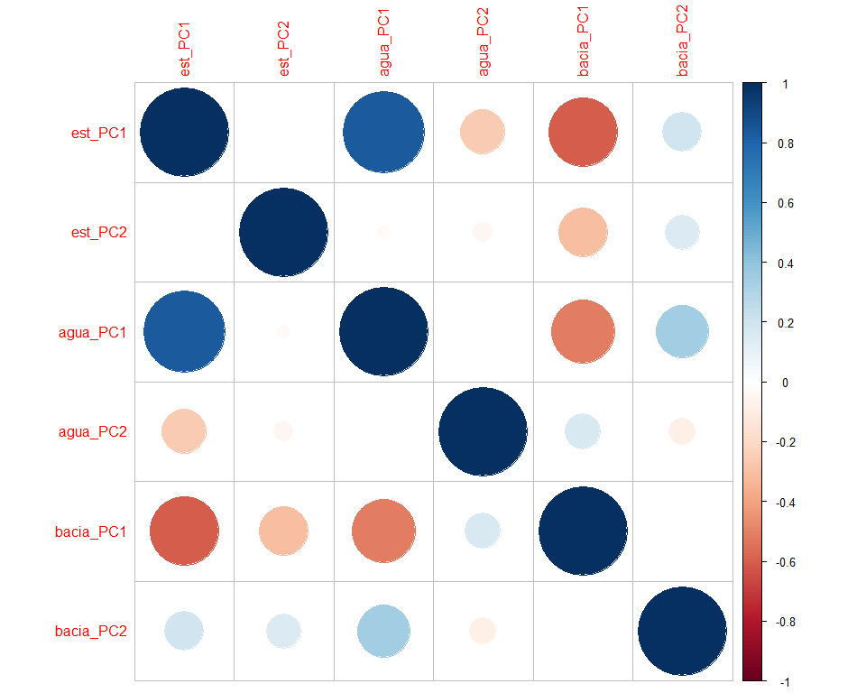
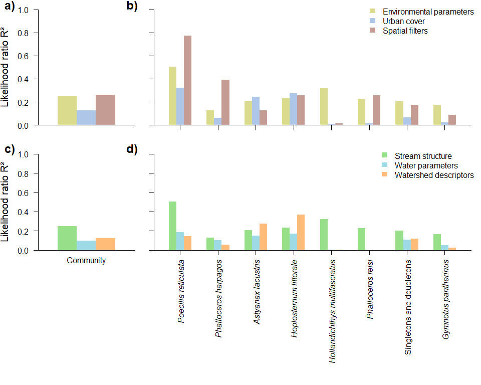
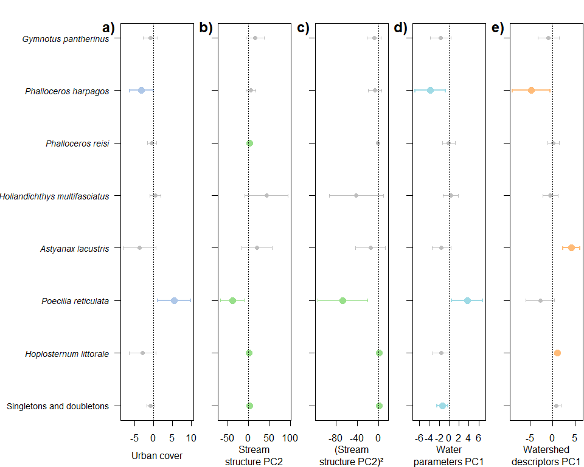
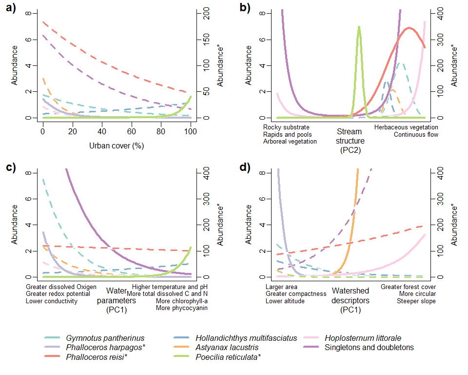

Manyglm_varpart
================
Rodolfo Pelinson
2025-05-21

``` r
dir<-("C:/Users/rodol/OneDrive/repos/Urban_fish_assemblages")
```

Loading important functions and packages

``` r
source(paste(sep = "/",dir,"functions/remove_sp.R"))
source(paste(sep = "/",dir,"functions/R2_manyglm.R"))
source(paste(sep = "/",dir,"functions/forward_sel_manyglm.R"))
source(paste(sep = "/",dir,"functions/varpart_manyglm.R"))
source(paste(sep = "/",dir,"functions/My_coefplot.R"))
source(paste(sep = "/",dir,"functions/letters.R"))
source(paste(sep = "/",dir,"functions/at_generator.R"))


library(mvabund)
library(vegan)
```

    ## Carregando pacotes exigidos: permute

    ## Carregando pacotes exigidos: lattice

    ## This is vegan 2.6-8

``` r
library(yarrr)
```

    ## Carregando pacotes exigidos: jpeg

    ## Carregando pacotes exigidos: BayesFactor

    ## Carregando pacotes exigidos: coda

    ## Carregando pacotes exigidos: Matrix

    ## ************
    ## Welcome to BayesFactor 0.9.12-4.7. If you have questions, please contact Richard Morey (richarddmorey@gmail.com).
    ## 
    ## Type BFManual() to open the manual.
    ## ************

    ## Carregando pacotes exigidos: circlize

    ## ========================================
    ## circlize version 0.4.16
    ## CRAN page: https://cran.r-project.org/package=circlize
    ## Github page: https://github.com/jokergoo/circlize
    ## Documentation: https://jokergoo.github.io/circlize_book/book/
    ## 
    ## If you use it in published research, please cite:
    ## Gu, Z. circlize implements and enhances circular visualization
    ##   in R. Bioinformatics 2014.
    ## 
    ## This message can be suppressed by:
    ##   suppressPackageStartupMessages(library(circlize))
    ## ========================================

    ## yarrr v0.1.5. Citation info at citation('yarrr'). Package guide at yarrr.guide()

    ## Email me at Nathaniel.D.Phillips.is@gmail.com

``` r
library(ade4)
library(adespatial)
```

    ## Registered S3 methods overwritten by 'adegraphics':
    ##   method         from
    ##   biplot.dudi    ade4
    ##   kplot.foucart  ade4
    ##   kplot.mcoa     ade4
    ##   kplot.mfa      ade4
    ##   kplot.pta      ade4
    ##   kplot.sepan    ade4
    ##   kplot.statis   ade4
    ##   scatter.coa    ade4
    ##   scatter.dudi   ade4
    ##   scatter.nipals ade4
    ##   scatter.pco    ade4
    ##   score.acm      ade4
    ##   score.mix      ade4
    ##   score.pca      ade4
    ##   screeplot.dudi ade4

    ## Registered S3 method overwritten by 'spdep':
    ##   method   from
    ##   plot.mst ape

    ## Registered S3 method overwritten by 'adespatial':
    ##   method          from       
    ##   plot.multispati adegraphics

``` r
library(corrplot)
```

    ## corrplot 0.95 loaded

Loading data

``` r
assembleia_peixes <- read.csv(paste(sep = "/",dir,"data/com_por_bacia.csv"), row.names = 1)
agua_PCs <- read.csv(paste(sep = "/",dir,"data/pcas_amb/agua_PCs.csv"), row.names = 1)
estrutura_PCs <- read.csv(paste(sep = "/",dir,"data/pcas_amb/estrutura_PCs.csv"), row.names = 1)
bacia_PCs <- read.csv(paste(sep = "/",dir,"data/pcas_amb/bacia_PCs.csv"), row.names = 1)
delineamento <- read.csv(paste(sep = "/",dir,"data/delineamento.csv"))
dist_euclid <- read.csv(paste(sep = "/",dir,"data/dist/Matriz_distancia_matriz_euclidiana.csv"), row.names = 1)
```

Removing species with less than 2 presences and combining them into the
artificial “Singletons” species.

``` r
assembleia_peixes <- read.csv(paste(sep = "/",dir,"data/com_por_bacia.csv"), row.names = 1)
assembleia_peixes <- assembleia_peixes[,-c(4,11)]
assembleia_peixes_rm <- remove_sp(com = assembleia_peixes, n_sp = 2)

singletons_doubletons <- remove_sp(assembleia_peixes, 2, less_equal = TRUE)
doubletons <- remove_sp(singletons_doubletons, 1)

singletons <- remove_sp(assembleia_peixes, 1, less_equal = TRUE)

sing_doub_ab <- rowSums(singletons_doubletons)
sing_ab <- rowSums(singletons)

sing_doub <- rowSums(decostand(singletons_doubletons, method = "pa")) 
sing <- rowSums(decostand(singletons, method = "pa")) 

assembleia_peixes_rm <- data.frame(assembleia_peixes_rm, Singletons_and_doubletons = sing_doub_ab)
```

Preparing predictors

``` r
urb <- data.frame(urb = delineamento$urbana)

urb <- decostand(urb, method = "stand")
agua_PCs <- decostand(agua_PCs, method = "stand")
estrutura_PCs <- decostand(estrutura_PCs, method = "stand")
bacia_PCs <- decostand(bacia_PCs, method = "stand")
```

Producing spatial filters

``` r
dist_euclid <- as.dist(dist_euclid)

dbmem_euclid <- dbmem(dist_euclid, thresh = NULL, MEM.autocor = c("positive", "non-null", "all", "negative"), store.listw = TRUE, silent = FALSE)
```

    ## Truncation level = 0.3268453 
    ## Time to compute dbMEMs = 0.020000  sec

``` r
dbmem_euclid <- decostand(dbmem_euclid, method = "stand")
```

### Variation Partitioning - Environment, Urban cover and Spatial filters

First, lets just look at a corplot for all environmental filters. First
axys of all three PCAs are correlated with each other.

``` r
env_data.frame <- data.frame(est_PC1 = estrutura_PCs[,1],
                             est_PC2 = estrutura_PCs[,2],
                             #est_PC3 = estrutura_PCs[,3],
                             #est_PC4 = estrutura_PCs[,4],
                             #est_PC5 = estrutura_PCs[,5],
                             agua_PC1 = agua_PCs[,1],
                             agua_PC2 = agua_PCs[,2],
                             #agua_PC3 = agua_PCs[,3],
                             #agua_PC4 = agua_PCs[,4],
                             #agua_PC5 = agua_PCs[,5],
                             bacia_PC1 = bacia_PCs[,1],
                             bacia_PC2 = bacia_PCs[,2])
                             #bacia_PC3 = bacia_PCs[,3],
                             #bacia_PC4 = bacia_PCs[,4],
                             #bacia_PC5 = bacia_PCs[,5]) #considerarei apenas os 5 primeiros eixos

corrplot(cor(env_data.frame))
```

<!-- -->

Now lets perform forward selection for environmental variables and
spatial filters. Forward selection for environmental filters will first
consider quadratic effects. Quadratic effects will not be considered for
spatial filters.

``` r
amb_FS <- forward_sel_manyglm(y = assembleia_peixes_rm, x = env_data.frame, nBoot=999, quad = TRUE)
```

    ## testing for quadratic effects...

    ## Time elapsed: 0 hr 0 min 15 sec
    ## Time elapsed: 0 hr 0 min 35 sec
    ##         df.diff      Dev        R2     p
    ## est_PC2       2 55.82190 0.2567644 0.006
    ## est_PC1       2 34.25453 0.2235896 0.410

    ## testing for linear effects...

    ## Time elapsed: 0 hr 0 min 36 sec
    ##           df.diff      Dev        R2     p
    ## bacia_PC1       1 29.87567 0.1685371 0.059

    ## No linear effects were found

``` r
esp_FS <- forward_sel_manyglm(y = assembleia_peixes_rm, x = data.frame(dbmem_euclid), nBoot=999, quad = FALSE) 
```

    ## Time elapsed: 0 hr 0 min 9 sec
    ## Time elapsed: 0 hr 0 min 12 sec
    ## Time elapsed: 0 hr 0 min 12 sec
    ##      df.diff      Dev         R2     p
    ## MEM1       1 37.45295 0.17856989 0.003
    ## MEM4       1 28.06294 0.12199454 0.041
    ## MEM5       1 14.74115 0.08963072 0.283

Now lets see if it is worth it to consider quadratic effects for the
effect of urban cover.

``` r
assembleia_peixes_rm_mv <- mvabund(assembleia_peixes_rm)

model_null <- manyglm(assembleia_peixes_rm_mv ~ 1,data = urb)
model_urb <- manyglm(assembleia_peixes_rm_mv ~ urb,data = urb)
model_urb_quad <- manyglm(assembleia_peixes_rm_mv ~ urb + I(urb^2),data = urb)

anova(model_null, model_urb, model_urb_quad)
```

    ## Time elapsed: 0 hr 0 min 25 sec

    ## Analysis of Deviance Table
    ## 
    ## model_null: assembleia_peixes_rm_mv ~ 1
    ## model_urb: assembleia_peixes_rm_mv ~ urb
    ## model_urb_quad: assembleia_peixes_rm_mv ~ urb + I(urb^2)
    ## 
    ## Multivariate test:
    ##                Res.Df Df.diff    Dev Pr(>Dev)  
    ## model_null         29                          
    ## model_urb          28       1 23.999    0.029 *
    ## model_urb_quad     27       1  9.543    0.614  
    ## ---
    ## Signif. codes:  0 '***' 0.001 '**' 0.01 '*' 0.05 '.' 0.1 ' ' 1
    ## Arguments:
    ##  Test statistics calculated assuming uncorrelated response (for faster computation) 
    ##  P-value calculated using 999 iterations via PIT-trap resampling.

``` r
anova(model_null, model_urb_quad)
```

    ## Time elapsed: 0 hr 0 min 12 sec

    ## Analysis of Deviance Table
    ## 
    ## model_null: assembleia_peixes_rm_mv ~ 1
    ## model_urb_quad: assembleia_peixes_rm_mv ~ urb + I(urb^2)
    ## 
    ## Multivariate test:
    ##                Res.Df Df.diff   Dev Pr(>Dev)
    ## model_null         29                       
    ## model_urb_quad     27       2 33.54    0.193
    ## Arguments:
    ##  Test statistics calculated assuming uncorrelated response (for faster computation) 
    ##  P-value calculated using 999 iterations via PIT-trap resampling.

Now, lets perform the the variation partitioning with all of the
variables we have at hand.

``` r
predictors <- list(ambiente = amb_FS$new_x,
                   urbanizacao = data.frame(urbanizacao = urb$urb),
                   MEMs = esp_FS$new_x)

varpart_peixes <- varpart_manyglm(resp = assembleia_peixes_rm, pred = predictors, DF_adj_r2 = TRUE)
```

Lets look at community full and pure R² fractions

``` r
varpart_peixes$R2_fractions_com
```

    ##             R2_full_fraction R2_pure_fraction
    ## ambiente           0.2479105        0.1359351
    ## urbanizacao        0.1259077        0.1151565
    ## MEMs               0.2597674        0.2354700

``` r
full_model <- varpart_peixes$R2_models$`ambiente-urbanizacao-MEMs`
```

Same for species:

``` r
round(varpart_peixes$R2_fractions_sp$R2_full_fraction,4)
```

    ##                               ambiente urbanizacao   MEMs
    ## Gymnotus_pantherinus            0.1676      0.0227 0.0880
    ## Phalloceros_harpagos            0.1267      0.0596 0.3921
    ## Phalloceros_reisi               0.2271      0.0136 0.2565
    ## Hollandichthys_multifasciatus   0.3191      0.0096 0.0132
    ## Astyanax_lacustris              0.2057      0.2432 0.1263
    ## Poecilia_reticulata             0.5020      0.3196 0.7731
    ## Hoplosternum_littorale          0.2320      0.2754 0.2554
    ## Singletons_and_doubletons       0.2029      0.0636 0.1735

``` r
round(varpart_peixes$R2_fractions_sp$R2_pure_fraction,4)
```

    ##                               ambiente urbanizacao    MEMs
    ## Gymnotus_pantherinus            0.0661     -0.0469 -0.0158
    ## Phalloceros_harpagos            0.3399      0.2323  0.5415
    ## Phalloceros_reisi               0.1632      0.0513  0.1767
    ## Hollandichthys_multifasciatus   0.4822      0.1694  0.1310
    ## Astyanax_lacustris              0.0405      0.3057  0.3770
    ## Poecilia_reticulata            -0.0585     -0.0276  0.2417
    ## Hoplosternum_littorale         -0.0555      0.2149  0.3458
    ## Singletons_and_doubletons       0.1095      0.0223  0.0859

``` r
full_model_sp <- varpart_peixes$R2_models_sp$ambiente.urbanizacao.MEMs
```

Lets look at significance values for the community full fractions

``` r
p_amb <- anova(varpart_peixes$model_null,
               varpart_peixes$models$ambiente,nBoot=999)
```

    ## Time elapsed: 0 hr 0 min 15 sec

``` r
p_amb
```

    ## Analysis of Deviance Table
    ## 
    ## varpart_peixes$model_null: resp_mv ~ 1
    ## varpart_peixes$models$ambiente: resp_mv ~ est_PC2 + est_PC2_squared
    ## 
    ## Multivariate test:
    ##                                Res.Df Df.diff   Dev Pr(>Dev)   
    ## varpart_peixes$model_null          29                          
    ## varpart_peixes$models$ambiente     27       2 55.82     0.01 **
    ## ---
    ## Signif. codes:  0 '***' 0.001 '**' 0.01 '*' 0.05 '.' 0.1 ' ' 1
    ## Arguments:
    ##  Test statistics calculated assuming uncorrelated response (for faster computation) 
    ##  P-value calculated using 999 iterations via PIT-trap resampling.

``` r
p_MEMs <- anova(varpart_peixes$model_null,
                 varpart_peixes$models$MEMs,nBoot=999)
```

    ## Time elapsed: 0 hr 0 min 10 sec

``` r
p_MEMs
```

    ## Analysis of Deviance Table
    ## 
    ## varpart_peixes$model_null: resp_mv ~ 1
    ## varpart_peixes$models$MEMs: resp_mv ~ MEM1 + MEM4
    ## 
    ## Multivariate test:
    ##                            Res.Df Df.diff   Dev Pr(>Dev)    
    ## varpart_peixes$model_null      29                           
    ## varpart_peixes$models$MEMs     27       2 65.52    0.001 ***
    ## ---
    ## Signif. codes:  0 '***' 0.001 '**' 0.01 '*' 0.05 '.' 0.1 ' ' 1
    ## Arguments:
    ##  Test statistics calculated assuming uncorrelated response (for faster computation) 
    ##  P-value calculated using 999 iterations via PIT-trap resampling.

``` r
p_urbanizacao <- anova(varpart_peixes$model_null,
                varpart_peixes$models$urbanizacao,nBoot=999)
```

    ## Time elapsed: 0 hr 0 min 9 sec

``` r
p_urbanizacao
```

    ## Analysis of Deviance Table
    ## 
    ## varpart_peixes$model_null: resp_mv ~ 1
    ## varpart_peixes$models$urbanizacao: resp_mv ~ urbanizacao
    ## 
    ## Multivariate test:
    ##                                   Res.Df Df.diff Dev Pr(>Dev)  
    ## varpart_peixes$model_null             29                       
    ## varpart_peixes$models$urbanizacao     28       1  24    0.029 *
    ## ---
    ## Signif. codes:  0 '***' 0.001 '**' 0.01 '*' 0.05 '.' 0.1 ' ' 1
    ## Arguments:
    ##  Test statistics calculated assuming uncorrelated response (for faster computation) 
    ##  P-value calculated using 999 iterations via PIT-trap resampling.

``` r
p_full_model <- anova(varpart_peixes$model_null,
                    varpart_peixes$models$`ambiente-urbanizacao-MEMs`,nBoot=999)
```

    ## Time elapsed: 0 hr 0 min 18 sec

``` r
p_full_model
```

    ## Analysis of Deviance Table
    ## 
    ## varpart_peixes$model_null: resp_mv ~ 1
    ## varpart_peixes$models$`ambiente-urbanizacao-MEMs`: resp_mv ~ est_PC2 + est_PC2_squared + urbanizacao + MEM1 + MEM4
    ## 
    ## Multivariate test:
    ##                                                   Res.Df Df.diff   Dev Pr(>Dev)
    ## varpart_peixes$model_null                             29                       
    ## varpart_peixes$models$`ambiente-urbanizacao-MEMs`     24       5 162.1    0.001
    ##                                                      
    ## varpart_peixes$model_null                            
    ## varpart_peixes$models$`ambiente-urbanizacao-MEMs` ***
    ## ---
    ## Signif. codes:  0 '***' 0.001 '**' 0.01 '*' 0.05 '.' 0.1 ' ' 1
    ## Arguments:
    ##  Test statistics calculated assuming uncorrelated response (for faster computation) 
    ##  P-value calculated using 999 iterations via PIT-trap resampling.

They are all significant.

Now lets look at the significance of their pure fractions:

``` r
p_amb_pure <- anova(varpart_peixes$models$`urbanizacao-MEMs`,
                    varpart_peixes$models$`ambiente-urbanizacao-MEMs`,nBoot=999)
```

    ## Time elapsed: 0 hr 0 min 13 sec

``` r
p_amb_pure
```

    ## Analysis of Deviance Table
    ## 
    ## varpart_peixes$models$`urbanizacao-MEMs`: resp_mv ~ urbanizacao + MEM1 + MEM4
    ## varpart_peixes$models$`ambiente-urbanizacao-MEMs`: resp_mv ~ est_PC2 + est_PC2_squared + urbanizacao + MEM1 + MEM4
    ## 
    ## Multivariate test:
    ##                                                   Res.Df Df.diff   Dev Pr(>Dev)
    ## varpart_peixes$models$`urbanizacao-MEMs`              26                       
    ## varpart_peixes$models$`ambiente-urbanizacao-MEMs`     24       2 57.77    0.095
    ##                                                    
    ## varpart_peixes$models$`urbanizacao-MEMs`           
    ## varpart_peixes$models$`ambiente-urbanizacao-MEMs` .
    ## ---
    ## Signif. codes:  0 '***' 0.001 '**' 0.01 '*' 0.05 '.' 0.1 ' ' 1
    ## Arguments:
    ##  Test statistics calculated assuming uncorrelated response (for faster computation) 
    ##  P-value calculated using 999 iterations via PIT-trap resampling.

``` r
p_MEMs_pure <- anova(varpart_peixes$models$`ambiente-urbanizacao`,
                      varpart_peixes$models$`ambiente-urbanizacao-MEMs`,nBoot=999)
```

    ## Time elapsed: 0 hr 0 min 28 sec

``` r
p_MEMs_pure
```

    ## Analysis of Deviance Table
    ## 
    ## varpart_peixes$models$`ambiente-urbanizacao`: resp_mv ~ est_PC2 + est_PC2_squared + urbanizacao
    ## varpart_peixes$models$`ambiente-urbanizacao-MEMs`: resp_mv ~ est_PC2 + est_PC2_squared + urbanizacao + MEM1 + MEM4
    ## 
    ## Multivariate test:
    ##                                                   Res.Df Df.diff  Dev Pr(>Dev)
    ## varpart_peixes$models$`ambiente-urbanizacao`          26                      
    ## varpart_peixes$models$`ambiente-urbanizacao-MEMs`     24       2 92.3    0.009
    ##                                                     
    ## varpart_peixes$models$`ambiente-urbanizacao`        
    ## varpart_peixes$models$`ambiente-urbanizacao-MEMs` **
    ## ---
    ## Signif. codes:  0 '***' 0.001 '**' 0.01 '*' 0.05 '.' 0.1 ' ' 1
    ## Arguments:
    ##  Test statistics calculated assuming uncorrelated response (for faster computation) 
    ##  P-value calculated using 999 iterations via PIT-trap resampling.

``` r
p_urbanizacao_pure <- anova(varpart_peixes$models$`ambiente-MEMs`,
                     varpart_peixes$models$`ambiente-urbanizacao-MEMs`,nBoot=999)
```

    ## Time elapsed: 0 hr 0 min 20 sec

``` r
p_urbanizacao_pure
```

    ## Analysis of Deviance Table
    ## 
    ## varpart_peixes$models$`ambiente-MEMs`: resp_mv ~ est_PC2 + est_PC2_squared + MEM1 + MEM4
    ## varpart_peixes$models$`ambiente-urbanizacao-MEMs`: resp_mv ~ est_PC2 + est_PC2_squared + urbanizacao + MEM1 + MEM4
    ## 
    ## Multivariate test:
    ##                                                   Res.Df Df.diff   Dev Pr(>Dev)
    ## varpart_peixes$models$`ambiente-MEMs`                 25                       
    ## varpart_peixes$models$`ambiente-urbanizacao-MEMs`     24       1 49.33    0.087
    ##                                                    
    ## varpart_peixes$models$`ambiente-MEMs`              
    ## varpart_peixes$models$`ambiente-urbanizacao-MEMs` .
    ## ---
    ## Signif. codes:  0 '***' 0.001 '**' 0.01 '*' 0.05 '.' 0.1 ' ' 1
    ## Arguments:
    ##  Test statistics calculated assuming uncorrelated response (for faster computation) 
    ##  P-value calculated using 999 iterations via PIT-trap resampling.

Now, lets plot these R² values:

First we reorder species by they total R² values

``` r
names(full_model_sp) <- rownames(varpart_peixes$R2_models_sp)
ord_sp <- order(full_model_sp, decreasing = TRUE)

full_model_sp <- full_model_sp[ord_sp]


######PLOTS species
full_amb <- varpart_peixes$R2_fractions_sp$R2_full_fraction$ambiente
names(full_amb) <- rownames(varpart_peixes$R2_fractions_sp$R2_full_fraction)

full_urb <- varpart_peixes$R2_fractions_sp$R2_full_fraction$urbanizacao
names(full_urb) <- rownames(varpart_peixes$R2_fractions_sp$R2_full_fraction)

full_MEMs <- varpart_peixes$R2_fractions_sp$R2_full_fraction$MEMs
names(full_MEMs) <- rownames(varpart_peixes$R2_fractions_sp$R2_full_fraction)


pure_amb <- varpart_peixes$R2_fractions_sp$R2_pure_fraction$ambiente
names(pure_amb) <- rownames(varpart_peixes$R2_fractions_sp$R2_pure_fraction)

pure_urb <- varpart_peixes$R2_fractions_sp$R2_pure_fraction$urbanizacao
names(pure_urb) <- rownames(varpart_peixes$R2_fractions_sp$R2_pure_fraction)

pure_MEMs <- varpart_peixes$R2_fractions_sp$R2_pure_fraction$MEMs
names(pure_MEMs) <- rownames(varpart_peixes$R2_fractions_sp$R2_pure_fraction)


full_amb<- full_amb[ord_sp]
full_urb<- full_urb[ord_sp]
full_MEMs<- full_MEMs[ord_sp]

pure_amb<- pure_amb[ord_sp]
pure_urb<- pure_urb[ord_sp]
pure_MEMs<- pure_MEMs[ord_sp]
```

Variation partitioning have a few mathematical artifacts. One of them is
when two sets of variables combined explain more variance than they do
individually, in this case shared effects are negative and adding up
pure fractions will result in R² values greater than the total R²
considering all variables combined. Thus we will convert negative values
to zero and rescale pure fractios so their sum will be smaller or equal
to the total R² of the predictors combined.

``` r
pure_amb[pure_amb < 0] <- 0
pure_urb[pure_urb < 0] <- 0
pure_MEMs[pure_MEMs < 0] <- 0


pure_frac_summed <- pure_amb + pure_urb + pure_MEMs

scale <- full_model_sp / pure_frac_summed

scale[scale > 1] <- 1

pure_frac_summed_scaled <- pure_frac_summed * scale

cbind(pure_frac_summed_scaled, full_model_sp)
```

    ##                               pure_frac_summed_scaled full_model_sp
    ## Poecilia_reticulata                        0.24166402     0.7321504
    ## Phalloceros_harpagos                       0.72730184     0.7273018
    ## Astyanax_lacustris                         0.72321491     0.7246993
    ## Hoplosternum_littorale                     0.56063736     0.7039396
    ## Hollandichthys_multifasciatus              0.53820197     0.5382020
    ## Phalloceros_reisi                          0.39123364     0.4176359
    ## Singletons_and_doubletons                  0.21773119     0.2818490
    ## Gymnotus_pantherinus                       0.06612593     0.1530002

``` r
pure_amb_scaled  <- pure_amb * scale
pure_urb_scaled  <- pure_urb * scale
pure_MEMs_scaled  <- pure_MEMs * scale
```

We will do the exact same procedure to R² for thw whole community.

``` r
full_model <- varpart_peixes$R2_models$`ambiente-urbanizacao-MEMs`

pure_summed <- sum(varpart_peixes$R2_fractions_com$R2_pure_fraction)

scale_com <- full_model / pure_summed

scale_com[scale_com > 1] <- 1

pure_comm_scaled <- as.matrix(varpart_peixes$R2_fractions_com$R2_pure_fraction * scale_com)
```

### Variation Partitioning - Stream struture, water parameters and watershed descriptors

Now we will repeat the variation partitioning only for environmental
predictors

First, forward selection

``` r
est_FS <- forward_sel_manyglm(y = assembleia_peixes_rm, x = data.frame(est_PC1 = estrutura_PCs[,1],
                                                                       est_PC2 = estrutura_PCs[,2]), nBoot=999, quad = TRUE) 
```

    ## testing for quadratic effects...

    ## Time elapsed: 0 hr 0 min 15 sec
    ## Time elapsed: 0 hr 0 min 35 sec
    ##         df.diff      Dev        R2     p
    ## est_PC2       2 55.82190 0.2567644 0.011
    ## est_PC1       2 34.25453 0.2235896 0.412

    ## testing for linear effects...

    ## Time elapsed: 0 hr 0 min 35 sec
    ##         df.diff      Dev         R2     p
    ## est_PC1       1 9.256594 0.05576858 0.706

    ## No linear effects were found

``` r
agua_FS <- forward_sel_manyglm(y = assembleia_peixes_rm, x = data.frame(agua_PC1 = agua_PCs[,1],
                                                                        agua_PC2 = agua_PCs[,2]), nBoot=999, quad = TRUE) 
```

    ## testing for quadratic effects...

    ## Time elapsed: 0 hr 0 min 13 sec
    ##          df.diff      Dev        R2     p
    ## agua_PC1       2 37.93605 0.1942477 0.148

    ## No quadratic effects were found, testing for linear ones...

    ## Time elapsed: 0 hr 0 min 9 sec
    ##          df.diff     Dev         R2     p
    ## agua_PC1       1 17.9818 0.09586666 0.066

    ## No linear effects were found, adding the first predictor to new_x

``` r
bacia_FS <- forward_sel_manyglm(y = assembleia_peixes_rm, x = data.frame(bacia_PC1 = bacia_PCs[,1],
                                                                         bacia_PC2 = bacia_PCs[,2]), nBoot=999, quad = TRUE) 
```

    ## testing for quadratic effects...

    ## Time elapsed: 0 hr 0 min 16 sec
    ##           df.diff      Dev        R2     p
    ## bacia_PC1       2 40.88607 0.2101458 0.069

    ## No quadratic effects were found, testing for linear ones...

    ## Time elapsed: 0 hr 0 min 9 sec
    ## Time elapsed: 0 hr 0 min 12 sec
    ##           df.diff       Dev         R2     p
    ## bacia_PC1       1 22.839097 0.12302655 0.023
    ## bacia_PC2       1  5.945264 0.03535575 0.750

Now, the variation partitioning

``` r
predictors <- list(estrutura = est_FS$new_x,
                   agua = agua_FS$new_x,
                   bacia = bacia_FS$new_x)

varpart_peixes2 <- varpart_manyglm(resp = assembleia_peixes_rm, pred = predictors, DF_adj_r2 = TRUE)
varpart_peixes2$R2_fractions_com
```

    ##           R2_full_fraction R2_pure_fraction
    ## estrutura       0.24791048       0.26221862
    ## agua            0.09586666       0.07313995
    ## bacia           0.12302655       0.13956712

``` r
full_model2 <- varpart_peixes2$R2_models$`estrutura-agua-bacia`
full_model2
```

    ## [1] 0.4177146

``` r
round(varpart_peixes2$R2_fractions_sp$R2_full_fraction,4)
```

    ##                               estrutura   agua  bacia
    ## Gymnotus_pantherinus             0.1676 0.0530 0.0222
    ## Phalloceros_harpagos             0.1267 0.1011 0.0568
    ## Phalloceros_reisi                0.2271 0.0001 0.0007
    ## Hollandichthys_multifasciatus    0.3191 0.0018 0.0048
    ## Astyanax_lacustris               0.2057 0.1473 0.2731
    ## Poecilia_reticulata              0.5020 0.1845 0.1427
    ## Hoplosternum_littorale           0.2320 0.1704 0.3660
    ## Singletons_and_doubletons        0.2029 0.1088 0.1179

``` r
round(varpart_peixes2$R2_fractions_sp$R2_pure_fraction,4)
```

    ##                               estrutura    agua   bacia
    ## Gymnotus_pantherinus             0.1283  0.0309  0.0230
    ## Phalloceros_harpagos             0.2578  0.1592  0.2152
    ## Phalloceros_reisi                0.2570  0.0325 -0.0065
    ## Hollandichthys_multifasciatus    0.3724 -0.0145  0.0460
    ## Astyanax_lacustris               0.2871 -0.0050  0.3112
    ## Poecilia_reticulata              0.5786  0.4088  0.2686
    ## Hoplosternum_littorale           0.1261 -0.0183  0.2314
    ## Singletons_and_doubletons        0.0905 -0.0084  0.0277

``` r
full_model_sp2 <- varpart_peixes2$R2_models_sp$estrutura.agua.bacia
names(full_model_sp2) <- rownames(varpart_peixes2$R2_fractions_sp$R2_full_fraction)
full_model_sp2
```

    ##          Gymnotus_pantherinus          Phalloceros_harpagos 
    ##                     0.2020117                     0.4540861 
    ##             Phalloceros_reisi Hollandichthys_multifasciatus 
    ##                     0.2577644                     0.3771066 
    ##            Astyanax_lacustris           Poecilia_reticulata 
    ##                     0.5639065                     0.7578229 
    ##        Hoplosternum_littorale     Singletons_and_doubletons 
    ##                     0.5007195                     0.2282989

Tests of significance of fractions:

``` r
p_est <- anova(varpart_peixes2$model_null,
               varpart_peixes2$models$estrutura,nBoot=999)
```

    ## Time elapsed: 0 hr 0 min 14 sec

``` r
p_est
```

    ## Analysis of Deviance Table
    ## 
    ## varpart_peixes2$model_null: resp_mv ~ 1
    ## varpart_peixes2$models$estrutura: resp_mv ~ est_PC2 + est_PC2_squared
    ## 
    ## Multivariate test:
    ##                                  Res.Df Df.diff   Dev Pr(>Dev)   
    ## varpart_peixes2$model_null           29                          
    ## varpart_peixes2$models$estrutura     27       2 55.82    0.009 **
    ## ---
    ## Signif. codes:  0 '***' 0.001 '**' 0.01 '*' 0.05 '.' 0.1 ' ' 1
    ## Arguments:
    ##  Test statistics calculated assuming uncorrelated response (for faster computation) 
    ##  P-value calculated using 999 iterations via PIT-trap resampling.

``` r
p_bacia <- anova(varpart_peixes2$model_null,
                 varpart_peixes2$models$bacia,nBoot=999)
```

    ## Time elapsed: 0 hr 0 min 9 sec

``` r
p_bacia
```

    ## Analysis of Deviance Table
    ## 
    ## varpart_peixes2$model_null: resp_mv ~ 1
    ## varpart_peixes2$models$bacia: resp_mv ~ bacia_PC1
    ## 
    ## Multivariate test:
    ##                              Res.Df Df.diff   Dev Pr(>Dev)  
    ## varpart_peixes2$model_null       29                         
    ## varpart_peixes2$models$bacia     28       1 22.84    0.029 *
    ## ---
    ## Signif. codes:  0 '***' 0.001 '**' 0.01 '*' 0.05 '.' 0.1 ' ' 1
    ## Arguments:
    ##  Test statistics calculated assuming uncorrelated response (for faster computation) 
    ##  P-value calculated using 999 iterations via PIT-trap resampling.

``` r
p_agua <- anova(varpart_peixes2$model_null,
                varpart_peixes2$models$agua,nBoot=999)
```

    ## Time elapsed: 0 hr 0 min 9 sec

``` r
p_agua
```

    ## Analysis of Deviance Table
    ## 
    ## varpart_peixes2$model_null: resp_mv ~ 1
    ## varpart_peixes2$models$agua: resp_mv ~ agua_PC1
    ## 
    ## Multivariate test:
    ##                             Res.Df Df.diff   Dev Pr(>Dev)  
    ## varpart_peixes2$model_null      29                         
    ## varpart_peixes2$models$agua     28       1 17.98    0.081 .
    ## ---
    ## Signif. codes:  0 '***' 0.001 '**' 0.01 '*' 0.05 '.' 0.1 ' ' 1
    ## Arguments:
    ##  Test statistics calculated assuming uncorrelated response (for faster computation) 
    ##  P-value calculated using 999 iterations via PIT-trap resampling.

``` r
p_est_pure <- anova(varpart_peixes2$models$`agua-bacia`,
                    varpart_peixes2$models$`estrutura-agua-bacia`,nBoot=999)
```

    ## Time elapsed: 0 hr 0 min 15 sec

``` r
p_est_pure
```

    ## Analysis of Deviance Table
    ## 
    ## varpart_peixes2$models$`agua-bacia`: resp_mv ~ agua_PC1 + bacia_PC1
    ## varpart_peixes2$models$`estrutura-agua-bacia`: resp_mv ~ est_PC2 + est_PC2_squared + agua_PC1 + bacia_PC1
    ## 
    ## Multivariate test:
    ##                                               Res.Df Df.diff   Dev Pr(>Dev)   
    ## varpart_peixes2$models$`agua-bacia`               27                          
    ## varpart_peixes2$models$`estrutura-agua-bacia`     25       2 80.89    0.005 **
    ## ---
    ## Signif. codes:  0 '***' 0.001 '**' 0.01 '*' 0.05 '.' 0.1 ' ' 1
    ## Arguments:
    ##  Test statistics calculated assuming uncorrelated response (for faster computation) 
    ##  P-value calculated using 999 iterations via PIT-trap resampling.

``` r
p_bacia_pure <- anova(varpart_peixes2$models$`estrutura-agua`,
                      varpart_peixes2$models$`estrutura-agua-bacia`,nBoot=999)
```

    ## Time elapsed: 0 hr 0 min 30 sec

``` r
p_bacia_pure
```

    ## Analysis of Deviance Table
    ## 
    ## varpart_peixes2$models$`estrutura-agua`: resp_mv ~ est_PC2 + est_PC2_squared + agua_PC1
    ## varpart_peixes2$models$`estrutura-agua-bacia`: resp_mv ~ est_PC2 + est_PC2_squared + agua_PC1 + bacia_PC1
    ## 
    ## Multivariate test:
    ##                                               Res.Df Df.diff  Dev Pr(>Dev)  
    ## varpart_peixes2$models$`estrutura-agua`           26                        
    ## varpart_peixes2$models$`estrutura-agua-bacia`     25       1 46.2    0.023 *
    ## ---
    ## Signif. codes:  0 '***' 0.001 '**' 0.01 '*' 0.05 '.' 0.1 ' ' 1
    ## Arguments:
    ##  Test statistics calculated assuming uncorrelated response (for faster computation) 
    ##  P-value calculated using 999 iterations via PIT-trap resampling.

``` r
p_agua_pure <- anova(varpart_peixes2$models$`estrutura-bacia`,
                     varpart_peixes2$models$`estrutura-agua-bacia`,nBoot=999)
```

    ## Time elapsed: 0 hr 0 min 24 sec

``` r
p_agua_pure
```

    ## Analysis of Deviance Table
    ## 
    ## varpart_peixes2$models$`estrutura-bacia`: resp_mv ~ est_PC2 + est_PC2_squared + bacia_PC1
    ## varpart_peixes2$models$`estrutura-agua-bacia`: resp_mv ~ est_PC2 + est_PC2_squared + agua_PC1 + bacia_PC1
    ## 
    ## Multivariate test:
    ##                                               Res.Df Df.diff  Dev Pr(>Dev)  
    ## varpart_peixes2$models$`estrutura-bacia`          26                        
    ## varpart_peixes2$models$`estrutura-agua-bacia`     25       1 31.7     0.05 *
    ## ---
    ## Signif. codes:  0 '***' 0.001 '**' 0.01 '*' 0.05 '.' 0.1 ' ' 1
    ## Arguments:
    ##  Test statistics calculated assuming uncorrelated response (for faster computation) 
    ##  P-value calculated using 999 iterations via PIT-trap resampling.

``` r
p_full_model <- anova(varpart_peixes2$model_null,
                    varpart_peixes2$models$`estrutura-agua-bacia`,nBoot=999)
```

    ## Time elapsed: 0 hr 0 min 17 sec

``` r
p_full_model
```

    ## Analysis of Deviance Table
    ## 
    ## varpart_peixes2$model_null: resp_mv ~ 1
    ## varpart_peixes2$models$`estrutura-agua-bacia`: resp_mv ~ est_PC2 + est_PC2_squared + agua_PC1 + bacia_PC1
    ## 
    ## Multivariate test:
    ##                                               Res.Df Df.diff   Dev Pr(>Dev)   
    ## varpart_peixes2$model_null                        29                          
    ## varpart_peixes2$models$`estrutura-agua-bacia`     25       4 111.3    0.004 **
    ## ---
    ## Signif. codes:  0 '***' 0.001 '**' 0.01 '*' 0.05 '.' 0.1 ' ' 1
    ## Arguments:
    ##  Test statistics calculated assuming uncorrelated response (for faster computation) 
    ##  P-value calculated using 999 iterations via PIT-trap resampling.

Now, lets plot these R² values:

We will make the same procedures as before:

``` r
#names(full_model_sp2) <- rownames(varpart_peixes2$R2_models_sp)
#ord_sp2 <- order(full_model_sp2, decreasing = TRUE)

full_model_sp2 <- full_model_sp2[ord_sp]

full_est <- varpart_peixes2$R2_fractions_sp$R2_full_fraction$estrutura
names(full_est) <- rownames(varpart_peixes2$R2_fractions_sp$R2_full_fraction)

full_agua <- varpart_peixes2$R2_fractions_sp$R2_full_fraction$agua
names(full_agua) <- rownames(varpart_peixes2$R2_fractions_sp$R2_full_fraction)

full_bacia <- varpart_peixes2$R2_fractions_sp$R2_full_fraction$bacia
names(full_bacia) <- rownames(varpart_peixes2$R2_fractions_sp$R2_full_fraction)


pure_est <- varpart_peixes2$R2_fractions_sp$R2_pure_fraction$estrutura
names(pure_est) <- rownames(varpart_peixes2$R2_fractions_sp$R2_pure_fraction)

pure_agua <- varpart_peixes2$R2_fractions_sp$R2_pure_fraction$agua
names(pure_agua) <- rownames(varpart_peixes2$R2_fractions_sp$R2_pure_fraction)

pure_bacia <- varpart_peixes2$R2_fractions_sp$R2_pure_fraction$bacia
names(pure_bacia) <- rownames(varpart_peixes2$R2_fractions_sp$R2_pure_fraction)


full_est<- full_est[ord_sp]
full_agua<- full_agua[ord_sp]
full_bacia<- full_bacia[ord_sp]

pure_est<- pure_est[ord_sp]
pure_agua<- pure_agua[ord_sp]
pure_bacia<- pure_bacia[ord_sp]

pure_est[pure_est < 0] <- 0
pure_agua[pure_agua < 0] <- 0
pure_bacia[pure_bacia < 0] <- 0


pure_frac_summed2 <- pure_est + pure_agua + pure_bacia

scale2 <- full_model_sp2 / pure_frac_summed2

scale2[scale2 > 1] <- 1

pure_frac_summed_scaled2 <- pure_frac_summed2 * scale2

cbind(pure_frac_summed_scaled2, full_model_sp2)
```

    ##                               pure_frac_summed_scaled2 full_model_sp2
    ## Poecilia_reticulata                          0.7578229      0.7578229
    ## Phalloceros_harpagos                         0.4540861      0.4540861
    ## Astyanax_lacustris                           0.5639065      0.5639065
    ## Hoplosternum_littorale                       0.3574875      0.5007195
    ## Hollandichthys_multifasciatus                0.3771066      0.3771066
    ## Phalloceros_reisi                            0.2577644      0.2577644
    ## Singletons_and_doubletons                    0.1181091      0.2282989
    ## Gymnotus_pantherinus                         0.1821178      0.2020117

``` r
pure_est_scaled  <- pure_est * scale2
pure_agua_scaled  <- pure_agua * scale2
pure_bacia_scaled  <- pure_bacia * scale2

###########


full_model2 <- varpart_peixes2$R2_models$`estrutura-agua-bacia`

pure_summed2 <- sum(varpart_peixes2$R2_fractions_com$R2_pure_fraction)

scale_com2 <- full_model2 / pure_summed2

scale_com2[scale_com2 > 1] <- 1

pure_comm_scaled2 <- as.matrix(varpart_peixes2$R2_fractions_com$R2_pure_fraction * scale_com2)
```

Now we can plot all of these fractions:

Pure and shared fractions fisrt:

``` r
#pdf("plots/varpart_pure.pdf", width = 8, height = 8, pointsize = 12)


close.screen(all.screens = TRUE)
```

    ## [1] FALSE

``` r
split.screen(matrix(c(0,0.3,0.625,1,
                      0.3,1,0.625,1,
                      0,0.3,0.25,0.625,
                      0.3,1,0.25,0.625), ncol = 4, nrow = 4, byrow = TRUE))
```

    ## [1] 1 2 3 4

``` r
screen(2)
par(mar = c(2,1,1,1))
barplot(full_model_sp, ylim = c(0,1), las = 2, border = "transparent", col = "#C7C7C7", xaxt = "n", xaxs = "i", width = 1, space = 0.5, xlim = c(0,12.5), yaxt = "n")
par(new = TRUE)
pure_scaleds <- rbind(pure_amb_scaled, pure_urb_scaled, pure_MEMs_scaled)
barplot(pure_scaleds, ylim = c(0,1), las = 2, col = c("#DBDB8D", "#AEC7E8", "#C49C94"), border = "transparent", xaxt = "n", xaxs = "i", width = 1, space = 0.5, xlim = c(0,12.5), yaxt = "n")
box(bty = "l")
names <- colnames(pure_scaleds)
names <- gsub("_"," ", names)

axis(1, at = at_generator(first = 1, spacing = 1.5, n = length(names)), gap.axis = -10, tick = TRUE, labels = FALSE, las = 2, font = 3, line = 0)

#SaD <- which(names == "Singletons and doubletons")
#axis(1, at = at_generator(first = 1, spacing = 1.5, n = length(names))[-SaD], gap.axis = -10, tick = TRUE, labels = names[-SaD], las = 2, font = 3, line = 0)
#axis(1, at = at_generator(first = 1, spacing = 1.5, n = length(names))[SaD], gap.axis = -10, tick = TRUE, labels = names[SaD], las = 2, font = 1, line = 0)

#title(ylab = "Likelihood ratio R²", cex.lab = 1.25)
axis(2, las = 2, line = 0, labels = FALSE)
par(new = TRUE, mar = c(0,0,0,0), bty = "n")
plot(NA, xlim = c(0,100), ylim = c(0,100), xaxt = "n", yaxt = "n", xaxs = "i", yaxs = "i", )

legend(x = 99, y = 99, xjust = 1, yjust = 1, fill = c("#DBDB8D", "#AEC7E8", "#C49C94","#C7C7C7"),
       legend = c("Environmental parameters", "Urban cover", "Spatial filters", "Shared"), border = "transparent", bty = "n")


screen(1)
par(mar = c(2,4,1,1))
barplot(full_model, ylim = c(0,1), las = 2, border = "transparent", col = "#C7C7C7", xaxt = "n", xaxs = "i", width = 1, space = 0.5, xlim = c(0,2), yaxt = "n")
par(new = TRUE)

barplot(pure_comm_scaled, ylim = c(0,1), las = 2, col = c("#DBDB8D", "#AEC7E8", "#C49C94"), border = "transparent", xaxt = "n", xaxs = "i", width = 1, space = 0.5, xlim = c(0,2), yaxt = "n")
box(bty = "l")
#axis(1, at = c(1), gap.axis = -10, tick = FALSE, labels = "Community", las = 1, font = 1, line = -0.5)
#title(ylab = "Likelihood ratio R²", cex.lab = 1.25)

title(ylab = "Likelihood ratio R²", cex.lab = 1.25)
axis(2, las = 2, line = 0)
letters(x = 92, y = 96, "b)", cex = 1.5)
letters(x = 7, y = 96, "a)", cex = 1.5)


screen(4)
par(mar = c(2,1,1,1))
barplot(full_model_sp2, ylim = c(0,1), las = 2, border = "transparent", col = "#C7C7C7", xaxt = "n", xaxs = "i", width = 1, space = 0.5, xlim = c(0,12.5), yaxt = "n")
par(new = TRUE)
pure_scaleds2 <- rbind(pure_est_scaled, pure_agua_scaled, pure_bacia_scaled)
barplot(pure_scaleds, ylim = c(0,1), las = 2, col = c("#98DF8A", "#9EDAE5", "#FFBB78"), border = "transparent", xaxt = "n", xaxs = "i", width = 1, space = 0.5, xlim = c(0,12.5), yaxt = "n")
box(bty = "l")
names <- colnames(pure_scaleds)
names <- gsub("_"," ", names)

SaD <- which(names == "Singletons and doubletons")
axis(1, at = at_generator(first = 1, spacing = 1.5, n = length(names))[-SaD], gap.axis = -10, tick = TRUE, labels = names[-SaD], las = 2, font = 3, line = 0, cex.axis = 1)
axis(1, at = at_generator(first = 1, spacing = 1.5, n = length(names))[SaD], gap.axis = -10, tick = TRUE, labels = names[SaD], las = 2, font = 1, line = 0, cex.axis = 1)

axis(2, las = 2, line = 0, labels = FALSE)
par(new = TRUE, mar = c(0,0,0,0), bty = "n")
plot(NA, xlim = c(0,100), ylim = c(0,100), xaxt = "n", yaxt = "n", xaxs = "i", yaxs = "i", )

legend(x = 99, y = 99, xjust = 1, yjust = 1, fill = c("#98DF8A", "#9EDAE5", "#FFBB78","#C7C7C7"),
       legend = c("Stream structure", "Water parameters", "Watershed descriptors", "Shared"), border = "transparent", bty = "n")


screen(3)
par(mar = c(2,4,1,1))
barplot(full_model2, ylim = c(0,1), las = 2, border = "transparent", col = "#C7C7C7", xaxt = "n", xaxs = "i", width = 1, space = 0.5, xlim = c(0,2), yaxt = "n")
par(new = TRUE)

barplot(pure_comm_scaled2, ylim = c(0,1), las = 2, col = c("#98DF8A", "#9EDAE5", "#FFBB78"), border = "transparent", xaxt = "n", xaxs = "i", width = 1, space = 0.5, xlim = c(0,2), yaxt = "n")
box(bty = "l")
axis(1, at = c(1), gap.axis = -10, tick = FALSE, labels = "Community", las = 1, font = 1, line = -0.5)
#title(ylab = "Likelihood ratio R²", cex.lab = 1.25)

title(ylab = "Likelihood ratio R²", cex.lab = 1.25)
axis(2, las = 2, line = 0)
letters(x = 92, y = 96, "c)", cex = 1.5)
letters(x = 7, y = 96, "d)", cex = 1.5)


#dev.off()
```

<!-- -->

Then we plot full fractions:

``` r
#pdf("plots/varpart_full.pdf", width = 8, height = 8, pointsize = 12)


close.screen(all.screens = TRUE)
split.screen(matrix(c(0,0.3,0.625,1,
                      0.3,1,0.625,1,
                      0,0.3,0.3,0.625,
                      0.3,1,0.3,0.625), ncol = 4, nrow = 4, byrow = TRUE))
```

    ## [1] 1 2 3 4

``` r
screen(2)
par(mar = c(2,1,1,1))
full_sp <- rbind(full_amb, full_urb, full_MEMs)

barplot(full_sp, ylim = c(0,1), las = 2, col = c("#DBDB8D", "#AEC7E8", "#C49C94"),
        border = "transparent", xaxt = "n", xaxs = "i", width = 1, space = c(0,2), xlim = c(0,42), yaxt = "n", beside = TRUE)

box(bty = "l")
names <- colnames(pure_scaleds)
names <- gsub("_"," ", names)

axis(1, at = at_generator(first = 3.5, spacing = 5, n = length(names)), gap.axis = -10, tick = TRUE, labels = FALSE, las = 2, font = 3, line = 0)

#SaD <- which(names == "Singletons and doubletons")
#axis(1, at = at_generator(first = 1, spacing = 1.5, n = length(names))[-SaD], gap.axis = -10, tick = TRUE, labels = names[-SaD], las = 2, font = 3, line = 0)
#axis(1, at = at_generator(first = 1, spacing = 1.5, n = length(names))[SaD], gap.axis = -10, tick = TRUE, labels = names[SaD], las = 2, font = 1, line = 0)

#title(ylab = "Likelihood ratio R²", cex.lab = 1.25)
axis(2, las = 2, line = 0, labels = FALSE)
par(new = TRUE, mar = c(0,0,0,0), bty = "n")
plot(NA, xlim = c(0,100), ylim = c(0,100), xaxt = "n", yaxt = "n", xaxs = "i", yaxs = "i", )

legend(x = 99, y = 99, xjust = 1, yjust = 1, fill = c("#DBDB8D", "#AEC7E8", "#C49C94"),
       legend = c("Environmental parameters", "Urban cover", "Spatial filters"), border = "transparent", bty = "n")


screen(1)
par(mar = c(2,4,1,1))

full_comm <- as.matrix(varpart_peixes$R2_fractions_com$R2_full_fraction)


barplot(full_comm, ylim = c(0,1), las = 2, col = c("#DBDB8D", "#AEC7E8", "#C49C94"),
        border = "transparent", xaxt = "n", xaxs = "i", width = 1, space = c(0,1), xlim = c(0,5), yaxt = "n", beside = TRUE)
box(bty = "l")
#axis(1, at = c(2.5), gap.axis = -10, tick = FALSE, labels = "Community", las = 1, font = 1, line = -0.5)
#title(ylab = "Likelihood ratio R²", cex.lab = 1.25)

title(ylab = "Likelihood ratio R²", cex.lab = 1.25)
axis(2, las = 2, line = 0)
letters(x = 92, y = 96, "b)", cex = 1.5)
letters(x = 7, y = 96, "a)", cex = 1.5)


screen(4)
par(mar = c(2,1,1,1))
full_sp2 <- rbind(full_est, full_agua, full_bacia)

barplot(full_sp2, ylim = c(0,1), las = 2, col = c("#98DF8A", "#9EDAE5", "#FFBB78"),
        border = "transparent", xaxt = "n", xaxs = "i", width = 1, space = c(0,2), xlim = c(0,42), yaxt = "n", beside = TRUE)

box(bty = "l")
names2 <- colnames(pure_scaleds)
names2 <- gsub("_"," ", names2)

SaD <- which(names == "Singletons and doubletons")
axis(1, at = at_generator(first = 3.5, spacing = 5, n = length(names2))[-SaD], gap.axis = -10, tick = TRUE, labels = names2[-SaD], las = 2, font = 3, line = 0, cex.axis = 1)
axis(1, at = at_generator(first = 3.5, spacing = 5, n = length(names2))[SaD], gap.axis = -10, tick = TRUE, labels = names2[SaD], las = 2, font = 1, line = 0, cex.axis = 1)

#title(ylab = "Likelihood ratio R²", cex.lab = 1.25)
axis(2, las = 2, line = 0, labels = FALSE)
par(new = TRUE, mar = c(0,0,0,0), bty = "n")
plot(NA, xlim = c(0,100), ylim = c(0,100), xaxt = "n", yaxt = "n", xaxs = "i", yaxs = "i", )

legend(x = 99, y = 99, xjust = 1, yjust = 1, fill = c("#98DF8A", "#9EDAE5", "#FFBB78"),
       legend = c("Stream structure", "Water parameters", "Watershed descriptors"), border = "transparent", bty = "n")


screen(3)
par(mar = c(2,4,1,1))

full_comm2 <- as.matrix(varpart_peixes2$R2_fractions_com$R2_full_fraction)


barplot(full_comm2, ylim = c(0,1), las = 2, col = c("#98DF8A", "#9EDAE5", "#FFBB78"),
        border = "transparent", xaxt = "n", xaxs = "i", width = 1, space = c(0,1), xlim = c(0,5), yaxt = "n", beside = TRUE)
box(bty = "l")
axis(1, at = c(2.5), gap.axis = -10, tick = FALSE, labels = "Community", las = 1, font = 1, line = -0.5)
#title(ylab = "Likelihood ratio R²", cex.lab = 1.25)

title(ylab = "Likelihood ratio R²", cex.lab = 1.25)
axis(2, las = 2, line = 0)
letters(x = 92, y = 96, "d)", cex = 1.5)
letters(x = 7, y = 96, "c)", cex = 1.5)


#dev.off()
```

<!-- -->

### Ploting coeffitients and predicted values

Now, we will plot coeffitients for predictors that were important to
describe fish community structure. We will focus on the effects of urban
cover alone, and that of significant sets of environmental descriptors,
which in this case are predictors of stream structure.

``` r
urb_coefs <- varpart_peixes$models$urbanizacao$coefficients[2,]
urb_IC_coefs <- varpart_peixes$models$urbanizacao$stderr.coefficients[2,] * qnorm(0.975)
urb_upper_coefs <- urb_coefs + urb_IC_coefs
urb_lower_coefs <- urb_coefs - urb_IC_coefs

est_coefs <- varpart_peixes2$models$estrutura$coefficients[2,]
est_IC_coefs <- varpart_peixes2$models$estrutura$stderr.coefficients[2,] * qnorm(0.975)
est_upper_coefs <- est_coefs + est_IC_coefs
est_lower_coefs <- est_coefs - est_IC_coefs

est_2_coefs <- varpart_peixes2$models$estrutura$coefficients[3,]
est_2_IC_coefs <- varpart_peixes2$models$estrutura$stderr.coefficients[3,] * qnorm(0.975)
est_2_upper_coefs <- est_2_coefs + est_2_IC_coefs
est_2_lower_coefs <- est_2_coefs - est_2_IC_coefs

agua_coefs <- varpart_peixes2$models$agua$coefficients[2,]
agua_IC_coefs <- varpart_peixes2$models$agua$stderr.coefficients[2,] * qnorm(0.975)
agua_upper_coefs <- agua_coefs + agua_IC_coefs
agua_lower_coefs <- agua_coefs - agua_IC_coefs

bacia_coefs <- varpart_peixes2$models$bacia$coefficients[2,]
bacia_IC_coefs <- varpart_peixes2$models$bacia$stderr.coefficients[2,] * qnorm(0.975)
bacia_upper_coefs <- bacia_coefs + bacia_IC_coefs
bacia_lower_coefs <- bacia_coefs - bacia_IC_coefs


names <- names(urb_coefs)
names <- gsub("_"," ", names)

#pdf("plots/coefficients.pdf", width = 11, height = 6, pointsize = 12)

close.screen(all.screens = TRUE)
split.screen(matrix(c(0,0.1666667,0,1,
                      0.1666667,0.3333334,0,1,
                      0.3333334,0.5000001,0,1, 
                      0.5000001,0.6666668,0,1,
                      0.6666668,0.8333335,0,1,
                      0.8333335,1,0,1), ncol = 4, nrow = 6, byrow = TRUE))
```

    ## [1] 1 2 3 4 5 6

``` r
sp_font <- rep(3, length(names))
sp_font[names == "Singletons and doubletons"] <- 1

screen(1)
screen(2, new = FALSE)
par(mar = c(4,2,2,0.1))
My_coefplot(mles = urb_coefs, upper = urb_upper_coefs,
            lower = urb_lower_coefs, col_sig = "#AEC7E8",
            cex_sig = 1.5, species_labels = names, yaxis_font = sp_font, cex.axis = 0.9)
title(xlab = "Urban cover", cex.lab = 1, line = 2.5)
#screen(2, new = FALSE)
letters(x = 12, y = 94, "a)", cex = 1.5)

screen(3, new = FALSE)
par(mar = c(4,2,2,0.1))
My_coefplot(mles = est_coefs, upper = est_upper_coefs,
            lower = est_lower_coefs, col_sig = "#98DF8A",
            cex_sig = 1.5, species_labels = FALSE, yaxis_font = 3)
title(xlab = "Stream", cex.lab = 1, line = 2)
title(xlab = "structure PC2", cex.lab = 1, line = 3)
letters(x = 12, y = 94, "b)", cex = 1.5)

screen(4, new = FALSE)
par(mar = c(4,2,2,0.1))
My_coefplot(mles = est_2_coefs, upper = est_2_upper_coefs,
            lower = est_2_lower_coefs, col_sig = "#98DF8A",
            cex_sig = 1.5, species_labels = FALSE, yaxis_font = 3, at.xaxis = c(-120, -80, -40, 0))
title(xlab = "(Stream", cex.lab = 1, line = 2)
title(xlab = "structure PC2)²", cex.lab = 1, line = 3)
letters(x = 12, y = 94, "c)", cex = 1.5)

screen(5, new = FALSE)
par(mar = c(4,2,2,0.1))
My_coefplot(mles = agua_coefs, upper = agua_upper_coefs,
            lower = agua_lower_coefs, col_sig = "#9EDAE5",
            cex_sig = 1.5, species_labels = FALSE, yaxis_font = 3)
title(xlab = "Water", cex.lab = 1, line = 2)
title(xlab = "parameters PC1", cex.lab = 1, line = 3)
letters(x = 12, y = 94, "d)", cex = 1.5)

screen(6, new = FALSE)
par(mar = c(4,2,2,0.1))
My_coefplot(mles = bacia_coefs, upper = bacia_upper_coefs,
            lower = bacia_lower_coefs, col_sig = "#FFBB78",
            cex_sig = 1.5, species_labels = FALSE, yaxis_font = 3)
title(xlab = "Watershed", cex.lab = 1, line = 2)
title(xlab = "descriptors PC1", cex.lab = 1, line = 3)
letters(x = 12, y = 94, "e)", cex = 1.5)

#dev.off()
```

<!-- -->

Now, we can also plot species predictions for the models we fitted,
specifically, we can plot the effects of urban cover and stream
structure on fish abundances.

First, lets generate predictions:

``` r
newdata_urb <- data.frame(urbanizacao = seq(from = min(urb), to = max(urb), length.out = 100))
predicted_urb <- predict.manyglm(varpart_peixes$models$urbanizacao, newdata = newdata_urb, type = "response")
scaled_ubr <- scale(delineamento$urbana)
center <- attr(scaled_ubr, "scaled:center")
scale <- attr(scaled_ubr, "scaled:scale")
urb_plot <- (newdata_urb$urbanizacao * scale) + center

names <- colnames(predicted_urb)
names <- gsub("_"," ", names)

names[names == "Poecilia reticulata"] <- "Poecilia reticulata*"
names[names == "Phalloceros reisi"] <- "Phalloceros reisi*"
names[names == "Phalloceros harpagos"] <- "Phalloceros harpagos*"


colors <- c("#8DD3C7", "#BEBADA", "#FB8072", "#80B1D3", "#FDB462", "#B3DE69", "#FCCDE5","#BC80BD")

names(colors) <- names

line_bg <- c(rep("white", ncol(predicted_urb)))
line_tp <- rep(2, ncol(predicted_urb))
lwd <- rep(3, ncol(predicted_urb))


line_tp_urb <- line_tp
line_tp_urb[which(urb_IC_coefs < abs(urb_coefs))] <- 1

lwd_urb <- lwd
lwd_urb[which(urb_IC_coefs < abs(urb_coefs))] <- 4

###################################################

newdata_est <- data.frame(est_PC2 = seq(from = min(est_FS$new_x$est_PC2), to = max(est_FS$new_x$est_PC2), length.out = 100))
newdata_est$est_PC2_squared <- newdata_est$est_PC2^2
predicted_est <- predict.manyglm(varpart_peixes2$models$estrutura, newdata = newdata_est, type = "response")

line_tp_est <- rep(2, ncol(predicted_est))
line_tp_est[which(est_IC_coefs < abs(est_coefs))] <- 1
line_tp_est[which(est_2_IC_coefs < abs(est_2_coefs))] <- 1

lwd_est <- rep(3, ncol(predicted_est))
lwd_est[which(est_IC_coefs < abs(est_coefs))] <- 4
lwd_est[which(est_2_IC_coefs < abs(est_2_coefs))] <- 4

###################################################


newdata_agua <- data.frame(agua_PC1 = seq(from = min(agua_FS$new_x$agua_PC1), to = max(agua_FS$new_x$agua_PC1), length.out = 100))
predicted_agua <- predict.manyglm(varpart_peixes2$models$agua, newdata = newdata_agua, type = "response")

line_tp_agua <- rep(2, ncol(predicted_agua))
line_tp_agua[which(agua_IC_coefs < abs(agua_coefs))] <- 1

lwd_agua <- rep(3, ncol(predicted_agua))
lwd_agua[which(agua_IC_coefs < abs(agua_coefs))] <- 4

###################################################

newdata_bacia <- data.frame(bacia_PC1 = seq(from = min(bacia_FS$new_x$bacia_PC1), to = max(bacia_FS$new_x$bacia_PC1), length.out = 100))
predicted_bacia <- predict.manyglm(varpart_peixes2$models$bacia, newdata = newdata_bacia, type = "response")

line_tp_bacia <- rep(2, ncol(predicted_bacia))
line_tp_bacia[which(bacia_IC_coefs < abs(bacia_coefs))] <- 1

lwd_bacia <- rep(3, ncol(predicted_bacia))
lwd_bacia[which(bacia_IC_coefs < abs(bacia_coefs))] <- 4


poecilidae <- which(colnames(predicted_urb) == "Phalloceros_reisi" | colnames(predicted_urb) == "Phalloceros_harpagos" | colnames(predicted_urb) == "Poecilia_reticulata")
NOT_poecilidae <- which(colnames(predicted_urb) != "Phalloceros_reisi" & colnames(predicted_urb) != "Phalloceros_harpagos" & colnames(predicted_urb) != "Poecilia_reticulata")
```

``` r
#pdf("plots/predictions.pdf", width = 11, height = 9, pointsize = 12)


close.screen(all.screens = TRUE)
split.screen(matrix(c(0  , 0.5, 0.575, 1  ,
                      0.5, 1  , 0.575, 1  ,
                      0  , 0.5, 0.15, 0.575,
                      0.5, 1  , 0.15, 0.575, 
                      0  , 1  , 0  , 0.15), ncol = 4, nrow = 5, byrow = TRUE))
```

    ## [1] 1 2 3 4 5

``` r
###################################################################### FIRST PLOT
screen(1)

par(mar = c(4,4,1,4), bty = "u")
plot(NA, ylim = c(0,8), xlim = c(0,100), xlab = "", ylab = "", xaxt = "n", yaxt = "n")


for(i in 1:ncol(predicted_urb[,NOT_poecilidae])){
  lines(x = urb_plot, y = predicted_urb[,NOT_poecilidae][,i], col = "white", lwd = 5)
  lines(x = urb_plot, y = predicted_urb[,NOT_poecilidae][,i], col = colors[NOT_poecilidae][i], lwd = lwd_urb[NOT_poecilidae][i], lty = line_tp_urb[NOT_poecilidae][i])
}

axis(2, labels = FALSE)
axis(2, labels = TRUE, tick = FALSE, line = -0.5)

par(new = TRUE)
plot(NA, ylim = c(0,200), xlim = c(0,100), xlab = "", ylab = "", xaxt = "n", yaxt = "n")

for(i in 1:ncol(predicted_urb[,poecilidae])){
  lines(x = urb_plot, y = predicted_urb[,poecilidae][,i], col = "white", lwd = 5)
  lines(x = urb_plot, y = predicted_urb[,poecilidae][,i], col = colors[poecilidae][i], lwd = lwd_urb[poecilidae][i], lty = line_tp_urb[poecilidae][i])
}

axis(4, labels = FALSE)
axis(4, labels = TRUE, tick = FALSE, line = -0.5)

mtext("Abundance", side = 2, line = 2)
mtext("Abundance*", side = 4, line = 2)

axis(1, labels = FALSE)
axis(1, labels = TRUE, tick = FALSE, line = -0.5)
title(xlab = "Urban cover (%)", line = 2)
letters(x = 5, y = 95, "a)", cex = 1.5)

###################################################################### SECOND PLOT
screen(2)

par(mar = c(4,4,1,4), bty = "u")
plot(NA, ylim = c(0,8), xlim = c(min(newdata_est$est_PC2),max(newdata_est$est_PC2)), xlab = "", ylab = "", xaxt = "n", yaxt = "n")


for(i in 1:ncol(predicted_est[,NOT_poecilidae])){
  lines(x = newdata_est$est_PC2, y = predicted_est[,NOT_poecilidae][,i], col = "white", lwd = 5)
  lines(x = newdata_est$est_PC2, y = predicted_est[,NOT_poecilidae][,i], col = colors[NOT_poecilidae][i], lwd = lwd_est[NOT_poecilidae][i], lty = line_tp_est[NOT_poecilidae][i])
}

axis(2, labels = FALSE)
axis(2, labels = TRUE, tick = FALSE, line = -0.5)

par(new = TRUE)
plot(NA, ylim = c(0,400), xlim = c(min(newdata_est$est_PC2),max(newdata_est$est_PC2)), xlab = "", ylab = "", xaxt = "n", yaxt = "n")

for(i in 1:ncol(predicted_est[,poecilidae])){
  lines(x = newdata_est$est_PC2, y = predicted_est[,poecilidae][,i], col = "white", lwd = 5)
  lines(x = newdata_est$est_PC2, y = predicted_est[,poecilidae][,i], col = colors[poecilidae][i], lwd = lwd_est[poecilidae][i], lty = line_tp_est[poecilidae][i])
}

axis(4, labels = FALSE)
axis(4, labels = TRUE, tick = FALSE, line = -0.5)

mtext("Abundance", side = 2, line = 2)
mtext("Abundance*", side = 4, line = 2)

#axis(1, labels = FALSE)
#axis(1, labels = TRUE, tick = FALSE, line = -0.5)

mtext("Herbaceous vegetation", side = 1, line = 0 , adj = 1, cex = 0.8, at = max(newdata_est$est_PC2)+0.4)
mtext("Continuous flow",       side = 1, line = 0.75    , adj = 1, cex = 0.8, at = max(newdata_est$est_PC2)+0.4)

mtext("Rocky substrate", side = 1, line = 0 , adj = 0, cex = 0.8, at = min(newdata_est$est_PC2)-0.4)
mtext("Rapids and pools", side = 1, line = 0.75 , adj = 0, cex = 0.8,  at = min(newdata_est$est_PC2)-0.4)
mtext("Arboreal vegetation", side = 1, line = 1.5 , adj = 0, cex = 0.8, at = min(newdata_est$est_PC2)-0.4)

title(xlab = "Stream ", line = 0.5)
title(xlab = "structure", line = 1.5)
title(xlab = "(PC2)", line = 2.5)

letters(x = 5, y = 95, "b)", cex = 1.5)


###################################################################### THIRD PLOT

screen(3)

par(mar = c(4,4,1,4), bty = "u")
plot(NA, ylim = c(0,8), xlim = c(min(newdata_agua$agua_PC1),max(newdata_agua$agua_PC1)), xlab = "", ylab = "", xaxt = "n", yaxt = "n")


for(i in 1:ncol(predicted_agua[,NOT_poecilidae])){
  lines(x = newdata_agua$agua_PC1, y = predicted_agua[,NOT_poecilidae][,i], col = "white", lwd = 5)
  lines(x = newdata_agua$agua_PC1, y = predicted_agua[,NOT_poecilidae][,i], col = colors[NOT_poecilidae][i], lwd = lwd_agua[NOT_poecilidae][i], lty = line_tp_agua[NOT_poecilidae][i])
}

axis(2, labels = FALSE)
axis(2, labels = TRUE, tick = FALSE, line = -0.5)

par(new = TRUE)
plot(NA, ylim = c(0,400), xlim = c(min(newdata_agua$agua_PC1),max(newdata_agua$agua_PC1)), xlab = "", ylab = "", xaxt = "n", yaxt = "n")

for(i in 1:ncol(predicted_agua[,poecilidae])){
  lines(x = newdata_agua$agua_PC1, y = predicted_agua[,poecilidae][,i], col = "white", lwd = 5)
  lines(x = newdata_agua$agua_PC1, y = predicted_agua[,poecilidae][,i], col = colors[poecilidae][i], lwd = lwd_agua[poecilidae][i], lty = line_tp_agua[poecilidae][i])
}

axis(4, labels = FALSE)
axis(4, labels = TRUE, tick = FALSE, line = -0.5)

mtext("Abundance", side = 2, line = 2)
mtext("Abundance*", side = 4, line = 2)

#axis(1, labels = FALSE)
#axis(1, labels = TRUE, tick = FALSE, line = -0.5)

mtext("Higher temperature and pH",       side = 1, line = 0    , adj = 1, cex = 0.8, at = max(newdata_agua$agua_PC1)+0.4)
mtext("More total dissolved C and N",       side = 1, line = 0.75    , adj = 1, cex = 0.8, at = max(newdata_agua$agua_PC1)+0.4)
mtext("More chlorophyll-a", side = 1, line = 1.5 , adj = 1, cex = 0.8, at = max(newdata_agua$agua_PC1)+0.4)
mtext("More phycocyanin",       side = 1, line = 2.25    , adj = 1, cex = 0.8, at = max(newdata_agua$agua_PC1)+0.4)


mtext("Greater dissolved Oxigen", side = 1, line = 0 , adj = 0, cex = 0.8, at = min(newdata_agua$agua_PC1)-0.4)
mtext("Greater redox potential", side = 1, line = 0.75 , adj = 0, cex = 0.8,  at = min(newdata_agua$agua_PC1)-0.4)
mtext("Lower conductivity", side = 1, line = 1.5 , adj = 0, cex = 0.8, at = min(newdata_agua$agua_PC1)-0.4)

title(xlab = "Water", line = 0.5)
title(xlab = "parameters", line = 1.5)
title(xlab = "(PC1)", line = 2.5)

letters(x = 5, y = 95, "c)", cex = 1.5)


###################################################################### FOURTH PLOT


screen(4)

par(mar = c(4,4,1,4), bty = "u")
plot(NA, ylim = c(0,8), xlim = c(min(newdata_bacia$bacia_PC1),max(newdata_bacia$bacia_PC1)), xlab = "", ylab = "", xaxt = "n", yaxt = "n")


for(i in 1:ncol(predicted_bacia[,NOT_poecilidae])){
  lines(x = newdata_bacia$bacia_PC1, y = predicted_bacia[,NOT_poecilidae][,i], col = "white", lwd = 5)
  lines(x = newdata_bacia$bacia_PC1, y = predicted_bacia[,NOT_poecilidae][,i], col = colors[NOT_poecilidae][i], lwd = lwd_bacia[NOT_poecilidae][i], lty = line_tp_bacia[NOT_poecilidae][i])
}

axis(2, labels = FALSE)
axis(2, labels = TRUE, tick = FALSE, line = -0.5)

par(new = TRUE)
plot(NA, ylim = c(0,400), xlim = c(min(newdata_bacia$bacia_PC1),max(newdata_bacia$bacia_PC1)), xlab = "", ylab = "", xaxt = "n", yaxt = "n")

for(i in 1:ncol(predicted_bacia[,poecilidae])){
  lines(x = newdata_bacia$bacia_PC1, y = predicted_bacia[,poecilidae][,i], col = "white", lwd = 5)
  lines(x = newdata_bacia$bacia_PC1, y = predicted_bacia[,poecilidae][,i], col = colors[poecilidae][i], lwd = lwd_bacia[poecilidae][i], lty = line_tp_bacia[poecilidae][i])
}

axis(4, labels = FALSE)
axis(4, labels = TRUE, tick = FALSE, line = -0.5)

mtext("Abundance", side = 2, line = 2)
mtext("Abundance*", side = 4, line = 2)

#axis(1, labels = FALSE)
#axis(1, labels = TRUE, tick = FALSE, line = -0.5)

mtext("Greater forest cover", side = 1, line = 0 , adj = 1, cex = 0.8, at = max(newdata_bacia$bacia_PC1)+0.4)
mtext("More circular",       side = 1, line = 0.75    , adj = 1, cex = 0.8, at = max(newdata_bacia$bacia_PC1)+0.4)
mtext("Steeper slope",       side = 1, line = 1.5    , adj = 1, cex = 0.8, at = max(newdata_bacia$bacia_PC1)+0.4)

mtext("Larger area", side = 1, line = 0 , adj = 0, cex = 0.8, at = min(newdata_bacia$bacia_PC1)-0.4)
mtext("Greater compactness", side = 1, line = 0.75 , adj = 0, cex = 0.8,  at = min(newdata_bacia$bacia_PC1)-0.4)
mtext("Lower altitude", side = 1, line = 1.5 , adj = 0, cex = 0.8, at = min(newdata_bacia$bacia_PC1)-0.4)

title(xlab = "Watershed", line = 0.5)
title(xlab = "descriptors", line = 1.5)
title(xlab = "(PC1)", line = 2.5)

letters(x = 5, y = 95, "d)", cex = 1.5)


###################################################################### 
screen(5)
par(mar = c(0,0,0,0))
plot(NA, xlim = c(0,100), ylim = c(0,100), xaxt = "n", yaxt = "n", , xaxs = "i", yaxs = "i", bty = "n")

font <- rep(3, length(names))
font[which(names == "Singletons and doubletons")] <- 1

legend(x = 50, y = 50, col = colors, lty = 1, lwd = 4, legend = names, ncol = 3, xjust = 0.5, yjust = 0.5, box.lty = 0, text.font = font)
```

<!-- -->

``` r
#dev.off()
```
