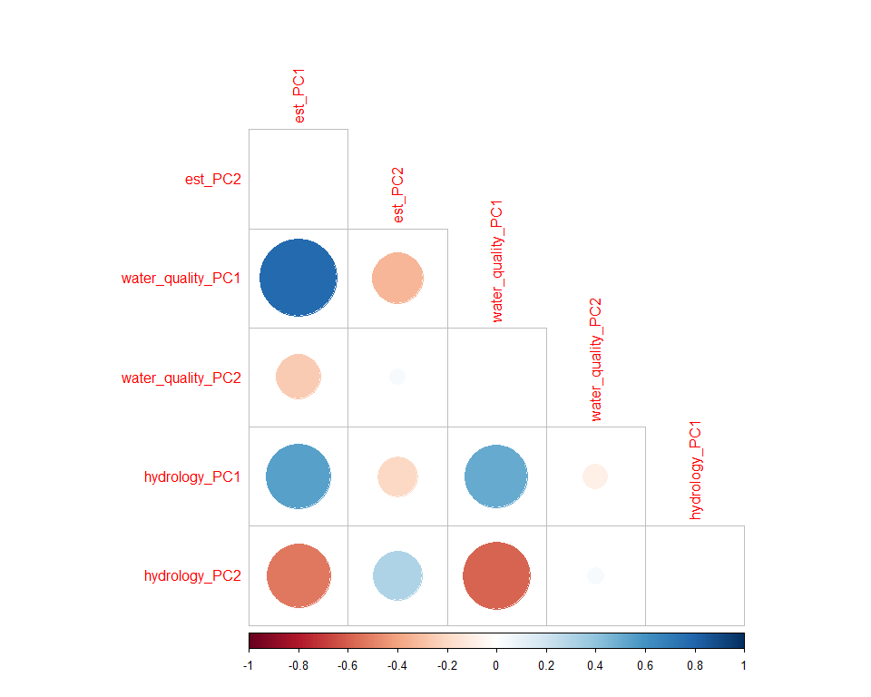
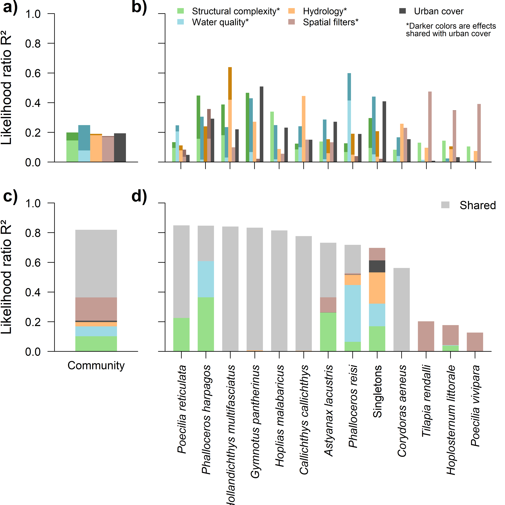
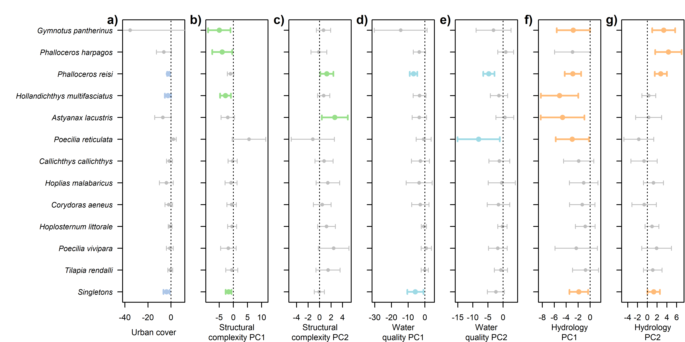
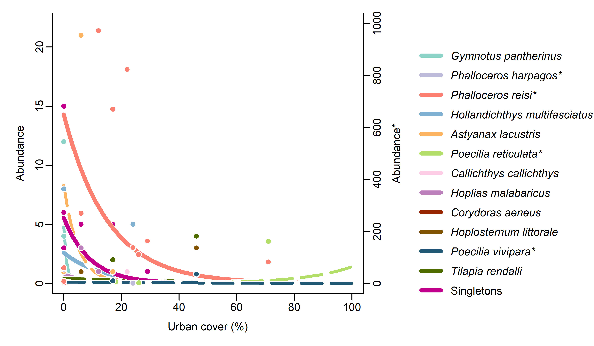
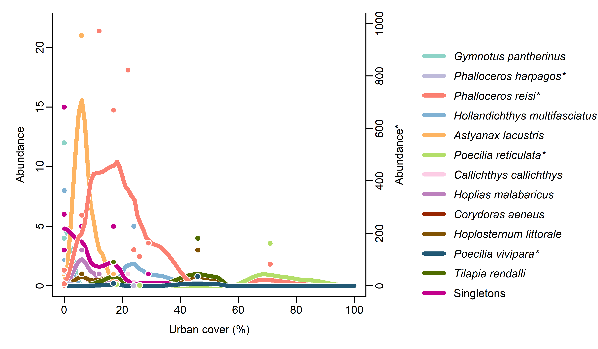
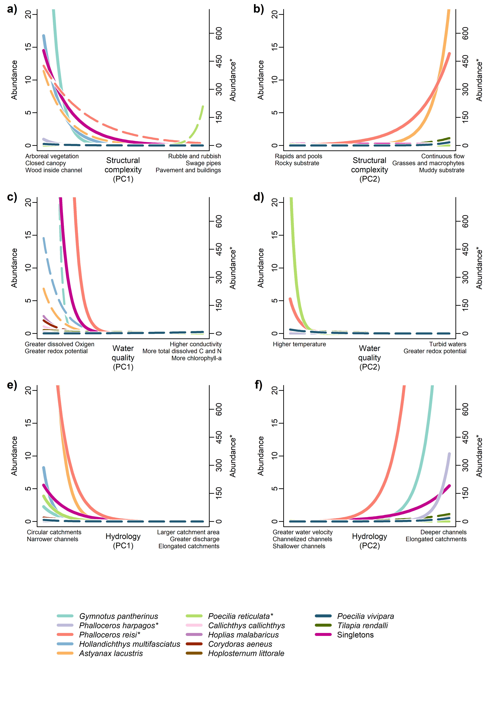

Manyglm_varpart
================
Rodolfo Pelinson
2026-07-20

``` r
dir<-("C:/Users/rodol/OneDrive/repos/Urban_fish_assemblages")
```

Loading important functions and packages

``` r
source(paste(sep = "/",dir,"functions/remove_sp.R"))
source(paste(sep = "/",dir,"functions/R2_manyglm.R"))
source(paste(sep = "/",dir,"functions/forward_sel_manyglm.R"))
source(paste(sep = "/",dir,"functions/varpart_manyglm.R"))
source(paste(sep = "/",dir,"functions/My_coefplot.R"))
source(paste(sep = "/",dir,"functions/letters.R"))
source(paste(sep = "/",dir,"functions/at_generator.R"))
source(paste(sep = "/",dir,"functions/text_repositioning.R"))
source(paste(sep = "/",dir,"functions/text_contour.R"))


library(mvabund)
library(vegan)
```

    ## Carregando pacotes exigidos: permute

``` r
library(yarrr)
```

    ## Carregando pacotes exigidos: jpeg

    ## Carregando pacotes exigidos: BayesFactor

    ## Carregando pacotes exigidos: coda

    ## Carregando pacotes exigidos: Matrix

    ## ************
    ## Welcome to BayesFactor 0.9.12-4.7. If you have questions, please contact Richard Morey (richarddmorey@gmail.com).
    ## 
    ## Type BFManual() to open the manual.
    ## ************

    ## Carregando pacotes exigidos: circlize

    ## ========================================
    ## circlize version 0.4.17
    ## CRAN page: https://cran.r-project.org/package=circlize
    ## Github page: https://github.com/jokergoo/circlize
    ## Documentation: https://jokergoo.github.io/circlize_book/book/
    ## 
    ## If you use it in published research, please cite:
    ## Gu, Z. circlize implements and enhances circular visualization
    ##   in R. Bioinformatics 2014.
    ## 
    ## This message can be suppressed by:
    ##   suppressPackageStartupMessages(library(circlize))
    ## ========================================

``` r
library(ade4)
library(adespatial)
```

    ## Registered S3 methods overwritten by 'adegraphics':
    ##   method         from
    ##   biplot.dudi    ade4
    ##   kplot.foucart  ade4
    ##   kplot.mcoa     ade4
    ##   kplot.mfa      ade4
    ##   kplot.pta      ade4
    ##   kplot.sepan    ade4
    ##   kplot.statis   ade4
    ##   scatter.coa    ade4
    ##   scatter.dudi   ade4
    ##   scatter.nipals ade4
    ##   scatter.pco    ade4
    ##   score.acm      ade4
    ##   score.mix      ade4
    ##   score.pca      ade4
    ##   screeplot.dudi ade4

    ## Registered S3 method overwritten by 'spdep':
    ##   method   from
    ##   plot.mst ape

    ## Registered S3 method overwritten by 'adespatial':
    ##   method          from       
    ##   plot.multispati adegraphics

``` r
library(corrplot)
```

    ## corrplot 0.95 loaded

``` r
library(colorspace)

set.seed(1)
```

# Loading data

``` r
assembleia_peixes <- read.csv(paste(sep = "/",dir,"data/com_por_bacia.csv"), row.names = 1)
water_quality_PCs <- read.csv(paste(sep = "/",dir,"data/pcas_amb/water_quality_PCs.csv"), row.names = 1)
structural_complexity_PCs <- read.csv(paste(sep = "/",dir,"data/pcas_amb/structural_complexity_PCs.csv"), row.names = 1)
hydrology_PCs <- read.csv(paste(sep = "/",dir,"data/pcas_amb/hydrology_PCs.csv"), row.names = 1)
delineamento <- read.csv(paste(sep = "/",dir,"data/delineamento.csv"))
dist_euclid <- read.csv(paste(sep = "/",dir,"data/dist/Matriz_distancia_matriz_euclidiana.csv"), row.names = 1)
```

Removing species with less than 2 presences and combining them into the
artificial “Singletons and doubletons” species.

``` r
assembleia_peixes <- read.csv(paste(sep = "/",dir,"data/com_por_bacia.csv"), row.names = 1)
assembleia_peixes <- assembleia_peixes[,-c(4,11)]

ncol(assembleia_peixes)
```

    ## [1] 23

``` r
assembleia_peixes_rm <- remove_sp(com = assembleia_peixes, n_sp = 1)

singletons_doubletons <- remove_sp(assembleia_peixes, 2, less_equal = TRUE)
doubletons <- remove_sp(singletons_doubletons, 1)

ncol(doubletons)
```

    ## [1] 5

``` r
singletons <- remove_sp(assembleia_peixes, 1, less_equal = TRUE)

ncol(singletons)
```

    ## [1] 11

``` r
sing_doub_ab <- rowSums(singletons_doubletons)
sing_ab <- rowSums(singletons)

sing_doub <- rowSums(decostand(singletons_doubletons, method = "pa")) 
sing <- rowSums(decostand(singletons, method = "pa")) 

assembleia_peixes_rm <- data.frame(assembleia_peixes_rm, Singletons = sing_ab)
```

``` r
colSums(assembleia_peixes)[order(colSums(assembleia_peixes), decreasing = TRUE)]
```

    ##             Phalloceros_reisi           Poecilia_reticulata 
    ##                          3316                           170 
    ##          Phalloceros_harpagos             Poecilia_vivipara 
    ##                            57                            46 
    ##          Gymnotus_pantherinus            Astyanax_lacustris 
    ##                            24                            23 
    ## Hollandichthys_multifasciatus         Characidium_oiticicai 
    ##                            17                            14 
    ##        Hoplosternum_littorale              Tilapia_rendalli 
    ##                             6                             6 
    ##           Hoplias_malabaricus          Psalidodon_fasciatus 
    ##                             4                             4 
    ##       Trichomycterus_iheringi               Pareiorhina_sp. 
    ##                             3                             3 
    ##            Psalidodon_paranae              Corydoras_aeneus 
    ##                             3                             3 
    ##       Callichthys_callichthys                Rhamdia_quelen 
    ##                             2                             2 
    ##    Hyphessobrycon_reticulatus       Hypostomus_ancistroides 
    ##                             2                             1 
    ##              Gymnotus_sylvius         Cichlasoma_paranaense 
    ##                             1                             1 
    ##           Taunayia_bifasciata 
    ##                             1

``` r
assembleia_peixes_oc <- colSums(decostand(assembleia_peixes, method = "pa"))

assembleia_peixes_oc[order(assembleia_peixes_oc, decreasing = TRUE)]
```

    ##             Phalloceros_reisi Hollandichthys_multifasciatus 
    ##                            13                             4 
    ##          Gymnotus_pantherinus          Phalloceros_harpagos 
    ##                             3                             3 
    ##            Astyanax_lacustris           Poecilia_reticulata 
    ##                             3                             3 
    ##        Hoplosternum_littorale       Callichthys_callichthys 
    ##                             3                             2 
    ##           Hoplias_malabaricus              Corydoras_aeneus 
    ##                             2                             2 
    ##             Poecilia_vivipara              Tilapia_rendalli 
    ##                             2                             2 
    ##       Trichomycterus_iheringi               Pareiorhina_sp. 
    ##                             1                             1 
    ##            Psalidodon_paranae       Hypostomus_ancistroides 
    ##                             1                             1 
    ##                Rhamdia_quelen              Gymnotus_sylvius 
    ##                             1                             1 
    ##    Hyphessobrycon_reticulatus          Psalidodon_fasciatus 
    ##                             1                             1 
    ##         Cichlasoma_paranaense         Characidium_oiticicai 
    ##                             1                             1 
    ##           Taunayia_bifasciata 
    ##                             1

Percentage of Poecilidae

``` r
abundances <- rowSums(assembleia_peixes)
total_ind <- sum(abundances)
total_ind
```

    ## [1] 3709

``` r
abundances_poecilidae <- rowSums(assembleia_peixes[,c(3,4,9,18)])
total_ind_poecilidae <- sum(abundances_poecilidae)
total_ind_poecilidae
```

    ## [1] 3589

``` r
total_ind_poecilidae/total_ind
```

    ## [1] 0.9676463

# Preparing and standardizing predictors

``` r
urb <- data.frame(urb = delineamento$urbana)

urb <- decostand(urb, method = "stand")
water_quality_PCs <- decostand(water_quality_PCs, method = "stand")
structural_complexity_PCs <- decostand(structural_complexity_PCs, method = "stand")
hydrology_PCs <- decostand(hydrology_PCs, method = "stand")
```

## Producing spatial filters

``` r
dist_euclid <- as.dist(dist_euclid)

dbmem_euclid <- dbmem(dist_euclid, thresh = NULL, MEM.autocor = c("positive", "non-null", "all", "negative"), store.listw = TRUE, silent = FALSE)
```

    ## Truncation level = 0.3268453 
    ## Time to compute dbMEMs = 0.000000  sec

``` r
dbmem_euclid <- decostand(dbmem_euclid, method = "stand")
```

Checking if the rows of all data frames match

``` r
data.frame(
rownames(assembleia_peixes_rm),
rownames(water_quality_PCs),
rownames(hydrology_PCs),
rownames(structural_complexity_PCs),
rownames(as.matrix(dist_euclid)),
delineamento$bacia_id
)
```

    ##    rownames.assembleia_peixes_rm. rownames.water_quality_PCs.
    ## 1                           ebbsn                        b031
    ## 2                           ebbrc                        b034
    ## 3                            b581                        b039
    ## 4                            b631                        b040
    ## 5                            b539                        b066
    ## 6                            b570                        b202
    ## 7                            b034                        b204
    ## 8                            b620                        b309
    ## 9                            b589                        b310
    ## 10                           b627                        b320
    ## 11                           b545                        b321
    ## 12                           b711                        b344
    ## 13                           b543                        b539
    ## 14                           b320                        b543
    ## 15                           b031                        b545
    ## 16                           b637                        b570
    ## 17                           b321                        b574
    ## 18                           b039                        b578
    ## 19                           b040                        b579
    ## 20                           b066                        b581
    ## 21                           b202                        b589
    ## 22                           b204                        b594
    ## 23                           b309                        b620
    ## 24                           b310                        b627
    ## 25                           b344                        b631
    ## 26                           b574                        b637
    ## 27                           b578                        b673
    ## 28                           b579                        b711
    ## 29                           b594                       ebbrc
    ## 30                           b673                       ebbsn
    ##    rownames.hydrology_PCs. rownames.structural_complexity_PCs.
    ## 1                     b031                                b031
    ## 2                     b034                                b034
    ## 3                     b039                                b039
    ## 4                     b040                                b040
    ## 5                     b066                                b066
    ## 6                     b202                                b202
    ## 7                     b204                                b204
    ## 8                     b309                                b309
    ## 9                     b310                                b310
    ## 10                    b320                                b320
    ## 11                    b321                                b321
    ## 12                    b344                                b344
    ## 13                    b539                                b539
    ## 14                    b543                                b543
    ## 15                    b545                                b545
    ## 16                    b570                                b570
    ## 17                    b574                                b574
    ## 18                    b578                                b578
    ## 19                    b579                                b579
    ## 20                    b581                                b581
    ## 21                    b589                                b589
    ## 22                    b594                                b594
    ## 23                    b620                                b620
    ## 24                    b627                                b627
    ## 25                    b631                                b631
    ## 26                    b637                                b637
    ## 27                    b673                                b673
    ## 28                    b711                                b711
    ## 29                   ebbrc                               ebbrc
    ## 30                   ebbsn                               ebbsn
    ##    rownames.as.matrix.dist_euclid.. delineamento.bacia_id
    ## 1                              b031                  b031
    ## 2                              b034                  b034
    ## 3                              b039                  b039
    ## 4                              b040                  b040
    ## 5                              b066                  b066
    ## 6                              b202                  b202
    ## 7                              b204                  b204
    ## 8                              b309                  b309
    ## 9                              b310                  b310
    ## 10                             b320                  b320
    ## 11                             b321                  b321
    ## 12                             b344                  b344
    ## 13                             b539                  b539
    ## 14                             b543                  b543
    ## 15                             b545                  b545
    ## 16                             b570                  b570
    ## 17                             b574                  b574
    ## 18                             b578                  b578
    ## 19                             b579                  b579
    ## 20                             b581                  b581
    ## 21                             b589                  b589
    ## 22                             b594                  b594
    ## 23                             b620                  b620
    ## 24                             b627                  b627
    ## 25                             b631                  b631
    ## 26                             b637                  b637
    ## 27                             b673                  b673
    ## 28                             b711                  b711
    ## 29                            ebbrc                 ebbrc
    ## 30                            ebbsn                 ebbsn

``` r
assembleia_peixes_rm <- assembleia_peixes_rm[match(delineamento$bacia_id, rownames(assembleia_peixes_rm) ),]

data.frame(
rownames(assembleia_peixes_rm),
rownames(water_quality_PCs),
rownames(hydrology_PCs),
rownames(structural_complexity_PCs),
rownames(as.matrix(dist_euclid)),
delineamento$bacia_id
)
```

    ##    rownames.assembleia_peixes_rm. rownames.water_quality_PCs.
    ## 1                            b031                        b031
    ## 2                            b034                        b034
    ## 3                            b039                        b039
    ## 4                            b040                        b040
    ## 5                            b066                        b066
    ## 6                            b202                        b202
    ## 7                            b204                        b204
    ## 8                            b309                        b309
    ## 9                            b310                        b310
    ## 10                           b320                        b320
    ## 11                           b321                        b321
    ## 12                           b344                        b344
    ## 13                           b539                        b539
    ## 14                           b543                        b543
    ## 15                           b545                        b545
    ## 16                           b570                        b570
    ## 17                           b574                        b574
    ## 18                           b578                        b578
    ## 19                           b579                        b579
    ## 20                           b581                        b581
    ## 21                           b589                        b589
    ## 22                           b594                        b594
    ## 23                           b620                        b620
    ## 24                           b627                        b627
    ## 25                           b631                        b631
    ## 26                           b637                        b637
    ## 27                           b673                        b673
    ## 28                           b711                        b711
    ## 29                          ebbrc                       ebbrc
    ## 30                          ebbsn                       ebbsn
    ##    rownames.hydrology_PCs. rownames.structural_complexity_PCs.
    ## 1                     b031                                b031
    ## 2                     b034                                b034
    ## 3                     b039                                b039
    ## 4                     b040                                b040
    ## 5                     b066                                b066
    ## 6                     b202                                b202
    ## 7                     b204                                b204
    ## 8                     b309                                b309
    ## 9                     b310                                b310
    ## 10                    b320                                b320
    ## 11                    b321                                b321
    ## 12                    b344                                b344
    ## 13                    b539                                b539
    ## 14                    b543                                b543
    ## 15                    b545                                b545
    ## 16                    b570                                b570
    ## 17                    b574                                b574
    ## 18                    b578                                b578
    ## 19                    b579                                b579
    ## 20                    b581                                b581
    ## 21                    b589                                b589
    ## 22                    b594                                b594
    ## 23                    b620                                b620
    ## 24                    b627                                b627
    ## 25                    b631                                b631
    ## 26                    b637                                b637
    ## 27                    b673                                b673
    ## 28                    b711                                b711
    ## 29                   ebbrc                               ebbrc
    ## 30                   ebbsn                               ebbsn
    ##    rownames.as.matrix.dist_euclid.. delineamento.bacia_id
    ## 1                              b031                  b031
    ## 2                              b034                  b034
    ## 3                              b039                  b039
    ## 4                              b040                  b040
    ## 5                              b066                  b066
    ## 6                              b202                  b202
    ## 7                              b204                  b204
    ## 8                              b309                  b309
    ## 9                              b310                  b310
    ## 10                             b320                  b320
    ## 11                             b321                  b321
    ## 12                             b344                  b344
    ## 13                             b539                  b539
    ## 14                             b543                  b543
    ## 15                             b545                  b545
    ## 16                             b570                  b570
    ## 17                             b574                  b574
    ## 18                             b578                  b578
    ## 19                             b579                  b579
    ## 20                             b581                  b581
    ## 21                             b589                  b589
    ## 22                             b594                  b594
    ## 23                             b620                  b620
    ## 24                             b627                  b627
    ## 25                             b631                  b631
    ## 26                             b637                  b637
    ## 27                             b673                  b673
    ## 28                             b711                  b711
    ## 29                            ebbrc                 ebbrc
    ## 30                            ebbsn                 ebbsn

# Variation Partitioning

First, lets just look at a corplot for all environmental filters.

``` r
env_data.frame <- data.frame(est_PC1 = structural_complexity_PCs[,1],
                             est_PC2 = structural_complexity_PCs[,2],
                             #est_PC3 = structural_complexity_PCs[,3],
                             #est_PC4 = structural_complexity_PCs[,4],
                             #est_PC5 = structural_complexity_PCs[,5],
                             water_quality_PC1 = water_quality_PCs[,1],
                             water_quality_PC2 = water_quality_PCs[,2],
                             #water_quality_PC3 = water_quality_PCs[,3],
                             hydrology_PC1 = hydrology_PCs[,1],
                             hydrology_PC2 = hydrology_PCs[,2])
                             #hydrology_PC3 = hydrology_PCs[,3]) 

corrplot(cor(env_data.frame), type = "lower", diag = FALSE)
```

<!-- -->

The first PCs seem all correlated with each other.

## Quadratic effect of urban cover

``` r
urb_pred <-  data.frame(urb = urb$urb, urb_squared =  urb$urb^2)
assembleia_peixes_rm_mv <- mvabund(assembleia_peixes_rm)

mod_null <- manyglm(assembleia_peixes_rm_mv ~ 1, data = urb_pred)
mod_lin <- manyglm(assembleia_peixes_rm_mv ~ urb, data = urb_pred)
mod_quad <- manyglm(assembleia_peixes_rm_mv ~ urb + urb_squared, data = urb_pred)

anova(mod_null, mod_lin, mod_quad, nBoot=999, show.time = "all")
```

    ## Resampling begins for test 1.
    ##  Resampling run 0 finished. Time elapsed: 0.00 minutes...
    ##  Resampling run 100 finished. Time elapsed: 0.04 minutes...
    ##  Resampling run 200 finished. Time elapsed: 0.07 minutes...
    ##  Resampling run 300 finished. Time elapsed: 0.10 minutes...
    ##  Resampling run 400 finished. Time elapsed: 0.14 minutes...
    ##  Resampling run 500 finished. Time elapsed: 0.17 minutes...
    ##  Resampling run 600 finished. Time elapsed: 0.20 minutes...
    ##  Resampling run 700 finished. Time elapsed: 0.23 minutes...
    ##  Resampling run 800 finished. Time elapsed: 0.27 minutes...
    ##  Resampling run 900 finished. Time elapsed: 0.30 minutes...
    ## Resampling begins for test 2.
    ##  Resampling run 0 finished. Time elapsed: 0.00 minutes...
    ##  Resampling run 100 finished. Time elapsed: 0.02 minutes...
    ##  Resampling run 200 finished. Time elapsed: 0.03 minutes...
    ##  Resampling run 300 finished. Time elapsed: 0.05 minutes...
    ##  Resampling run 400 finished. Time elapsed: 0.07 minutes...
    ##  Resampling run 500 finished. Time elapsed: 0.08 minutes...
    ##  Resampling run 600 finished. Time elapsed: 0.10 minutes...
    ##  Resampling run 700 finished. Time elapsed: 0.12 minutes...
    ##  Resampling run 800 finished. Time elapsed: 0.13 minutes...
    ##  Resampling run 900 finished. Time elapsed: 0.15 minutes...
    ## Time elapsed: 0 hr 0 min 29 sec

    ## Analysis of Deviance Table
    ## 
    ## mod_null: assembleia_peixes_rm_mv ~ 1
    ## mod_lin: assembleia_peixes_rm_mv ~ urb
    ## mod_quad: assembleia_peixes_rm_mv ~ urb + urb_squared
    ## 
    ## Multivariate test:
    ##          Res.Df Df.diff   Dev Pr(>Dev)    
    ## mod_null     29                           
    ## mod_lin      28       1 62.26    0.001 ***
    ## mod_quad     27       1 33.80    0.114    
    ## ---
    ## Signif. codes:  0 '***' 0.001 '**' 0.01 '*' 0.05 '.' 0.1 ' ' 1
    ## Arguments:
    ##  Test statistics calculated assuming uncorrelated response (for faster computation) 
    ##  P-value calculated using 999 iterations via PIT-trap resampling.

## Forward selection

``` r
set.seed(1); esp_FS <- forward_sel_manyglm(y = assembleia_peixes_rm, x = data.frame(dbmem_euclid), nBoot=999, quad = FALSE, adj_R2 = FALSE) 
```

    ## testing for linear effects...

    ## testing for Global Model...

    ## Time elapsed: 0 hr 0 min 33 sec

    ## Global linear model is significant with p value of 0.005 and R2 of  0.592212485765701

    ## Executing forward selection...

    ## Time elapsed: 0 hr 0 min 13 sec
    ## Time elapsed: 0 hr 0 min 28 sec
    ##      df.diff      Dev        R2     p
    ## MEM2       1 46.97309 0.1755213 0.015
    ## MEM3       1 37.05634 0.2977625 0.070

## Variation partitioning

``` r
#predictors <- list(structural_complexity = est_FS$new_x,
#                   water_quality = water_quality_FS$new_x,
#                   hydrology = hydrology_FS$new_x,
#                   urb =  data.frame(urb = urb$urb),
#                   esp = esp_FS$new_x)

structural_complexity <- data.frame(est_PC1 = structural_complexity_PCs[,1], est_PC2 = structural_complexity_PCs[,2])
water_quality <- data.frame(water_quality_PC1 = water_quality_PCs[,1], water_quality_PC2 = water_quality_PCs[,2])
hydrology <- data.frame(hydrology_PC1 = hydrology_PCs[,1], hydrology_PC2 = hydrology_PCs[,2])
urb <- data.frame(urb = urb$urb)


predictors <- list(structural_complexity = structural_complexity,
                  water_quality = water_quality,
                   hydrology = hydrology,
                   urb =  urb,
                   esp = esp_FS$new_x)

varpart_peixes <- varpart_manyglm(resp = assembleia_peixes_rm, pred = predictors, DF_adj_r2 = FALSE)
varpart_peixes$R2_fractions_com
```

    ##                       R2_full_fraction R2_pure_fraction
    ## structural_complexity        0.1993373      0.102198976
    ## water_quality                0.2492397      0.066426063
    ## hydrology                    0.1903480      0.029258591
    ## urb                          0.1939071      0.009055757
    ## esp                          0.1755213      0.156861287

``` r
full_model2 <- varpart_peixes$R2_models$`structural_complexity-water_quality-hydrology`
full_model2
```

    ## [1] 0.6291509

``` r
round(varpart_peixes$R2_fractions_sp$R2_full_fraction,4)
```

    ##                               structural_complexity water_quality hydrology
    ## Gymnotus_pantherinus                         0.4664        0.4299    0.1782
    ## Phalloceros_harpagos                         0.4481        0.3057    0.2402
    ## Phalloceros_reisi                            0.1261        0.5989    0.1908
    ## Hollandichthys_multifasciatus                0.3880        0.2353    0.6391
    ## Astyanax_lacustris                           0.1050        0.2863    0.1540
    ## Poecilia_reticulata                          0.1339        0.2476    0.1122
    ## Callichthys_callichthys                      0.1241        0.2410    0.3240
    ## Hoplias_malabaricus                          0.1011        0.2492    0.0640
    ## Corydoras_aeneus                             0.0289        0.1664    0.0904
    ## Hoplosternum_littorale                       0.1429        0.0241    0.1058
    ## Poecilia_vivipara                            0.1009        0.0057    0.0720
    ## Tilapia_rendalli                             0.1297        0.0093    0.0958
    ## Singletons                                   0.2963        0.4408    0.2080
    ##                                  urb    esp
    ## Gymnotus_pantherinus          0.5088 0.0223
    ## Phalloceros_harpagos          0.2923 0.3576
    ## Phalloceros_reisi             0.1896 0.0398
    ## Hollandichthys_multifasciatus 0.2205 0.0299
    ## Astyanax_lacustris            0.2719 0.1074
    ## Poecilia_reticulata           0.0485 0.0837
    ## Callichthys_callichthys       0.1506 0.1499
    ## Hoplias_malabaricus           0.2320 0.0313
    ## Corydoras_aeneus              0.1541 0.2278
    ## Hoplosternum_littorale        0.0325 0.3489
    ## Poecilia_vivipara             0.0025 0.3897
    ## Tilapia_rendalli              0.0084 0.4712
    ## Singletons                    0.4092 0.0221

``` r
round(varpart_peixes$R2_fractions_sp$R2_pure_fraction,4)
```

    ##                               structural_complexity water_quality hydrology
    ## Gymnotus_pantherinus                         0.0001        0.0001    0.0070
    ## Phalloceros_harpagos                         0.3642        0.2440    0.0000
    ## Phalloceros_reisi                            0.0647        0.3823    0.0688
    ## Hollandichthys_multifasciatus                0.0002        0.0000    0.0001
    ## Astyanax_lacustris                           0.2616        0.0001    0.0003
    ## Poecilia_reticulata                          0.2253        0.0000    0.0005
    ## Callichthys_callichthys                      0.0004        0.0020    0.0024
    ## Hoplias_malabaricus                          0.0002        0.0014    0.0002
    ## Corydoras_aeneus                             0.0001        0.0002    0.0000
    ## Hoplosternum_littorale                       0.1726        0.0172    0.0025
    ## Poecilia_vivipara                            0.0001        0.0003    0.0009
    ## Tilapia_rendalli                             0.0001        0.0004    0.0011
    ## Singletons                                   0.2390        0.2155    0.2966
    ##                                  urb    esp
    ## Gymnotus_pantherinus          0.0000 0.0000
    ## Phalloceros_harpagos          0.0000 0.0001
    ## Phalloceros_reisi             0.0022 0.0086
    ## Hollandichthys_multifasciatus 0.0000 0.0000
    ## Astyanax_lacustris            0.0000 0.1023
    ## Poecilia_reticulata           0.0000 0.0001
    ## Callichthys_callichthys       0.0000 0.0000
    ## Hoplias_malabaricus           0.0000 0.0000
    ## Corydoras_aeneus              0.0001 0.0004
    ## Hoplosternum_littorale        0.0006 0.6085
    ## Poecilia_vivipara             0.0001 0.6157
    ## Tilapia_rendalli              0.0002 0.5843
    ## Singletons                    0.1143 0.1191

``` r
full_model_sp <- varpart_peixes$R2_models_sp$structural_complexity.water_quality.hydrology
names(full_model_sp) <- rownames(varpart_peixes$R2_fractions_sp$R2_full_fraction)
full_model_sp
```

    ##          Gymnotus_pantherinus          Phalloceros_harpagos 
    ##                     0.8336196                     0.8467111 
    ##             Phalloceros_reisi Hollandichthys_multifasciatus 
    ##                     0.7181902                     0.8410076 
    ##            Astyanax_lacustris           Poecilia_reticulata 
    ##                     0.7320550                     0.8490664 
    ##       Callichthys_callichthys           Hoplias_malabaricus 
    ##                     0.7767439                     0.8147784 
    ##              Corydoras_aeneus        Hoplosternum_littorale 
    ##                     0.5623126                     0.1771894 
    ##             Poecilia_vivipara              Tilapia_rendalli 
    ##                     0.1270552                     0.2027522 
    ##                    Singletons 
    ##                     0.6974805

Looking at fractions related to the urbanization process

``` r
shared_urb_structural_complexity <- (varpart_peixes$R2_models$structural_complexity + varpart_peixes$R2_models$urb) - varpart_peixes$R2_models$`structural_complexity-urb`
shared_urb_water_quality <- (varpart_peixes$R2_models$water_quality + varpart_peixes$R2_models$urb) - varpart_peixes$R2_models$`water_quality-urb`
shared_urb_hydrology <- (varpart_peixes$R2_models$hydrology + varpart_peixes$R2_models$urb) - varpart_peixes$R2_models$`hydrology-urb`
shared_urb_esp <- (varpart_peixes$R2_models$esp + varpart_peixes$R2_models$urb) - varpart_peixes$R2_models$`urb-esp`


sp_shared_urb_structural_complexity <- (varpart_peixes$R2_models_sp$structural_complexity + varpart_peixes$R2_models_sp$urb) - varpart_peixes$R2_models_sp$`structural_complexity.urb`
sp_shared_urb_water_quality <- (varpart_peixes$R2_models_sp$water_quality + varpart_peixes$R2_models_sp$urb) - varpart_peixes$R2_models_sp$`water_quality.urb`
sp_shared_urb_hydrology <- (varpart_peixes$R2_models_sp$hydrology + varpart_peixes$R2_models_sp$urb) - varpart_peixes$R2_models_sp$`hydrology.urb`
sp_shared_urb_esp <- (varpart_peixes$R2_models_sp$esp + varpart_peixes$R2_models_sp$urb) - varpart_peixes$R2_models_sp$`urb.esp`


structural_complexity_without_urb <- (varpart_peixes$R2_models$`structural_complexity-urb` - varpart_peixes$R2_models$urb)
water_quality_without_urb <- (varpart_peixes$R2_models$`water_quality-urb` - varpart_peixes$R2_models$urb)
hydrology_without_urb <- (varpart_peixes$R2_models$`hydrology-urb` - varpart_peixes$R2_models$urb)
esp_without_urb <- (varpart_peixes$R2_models$`urb-esp` - varpart_peixes$R2_models$urb)


sp_structural_complexity_without_urb <- (varpart_peixes$R2_models_sp$`structural_complexity.urb` - varpart_peixes$R2_models_sp$urb)
sp_water_quality_without_urb <- (varpart_peixes$R2_models_sp$`water_quality.urb` - varpart_peixes$R2_models_sp$urb)
sp_hydrology_without_urb <- (varpart_peixes$R2_models_sp$`hydrology.urb` - varpart_peixes$R2_models_sp$urb)
sp_esp_without_urb <- (varpart_peixes$R2_models_sp$`urb.esp` - varpart_peixes$R2_models_sp$urb)


urb_without_structural_complexity <- (varpart_peixes$R2_models$`structural_complexity-urb` - varpart_peixes$R2_models$structural_complexity)
urb_without_water_quality <- (varpart_peixes$R2_models$`water_quality-urb` - varpart_peixes$R2_models$water_quality)
urb_without_hydrology <- (varpart_peixes$R2_models$`hydrology-urb` - varpart_peixes$R2_models$hydrology)
urb_without_esp <- (varpart_peixes$R2_models$`urb-esp` - varpart_peixes$R2_models$esp)


sp_urb_without_structural_complexity <- (varpart_peixes$R2_models_sp$`structural_complexity.urb` - varpart_peixes$R2_models_sp$structural_complexity)
sp_urb_without_water_quality <- (varpart_peixes$R2_models_sp$`water_quality.urb` - varpart_peixes$R2_models_sp$water_quality)
sp_urb_without_hydrology <- (varpart_peixes$R2_models_sp$`hydrology.urb` - varpart_peixes$R2_models_sp$hydrology)
sp_urb_without_esp <- (varpart_peixes$R2_models_sp$`urb.esp` - varpart_peixes$R2_models_sp$esp)


full_urb_structural_complexity <- varpart_peixes$R2_models$`structural_complexity-urb`
full_urb_water_quality <- varpart_peixes$R2_models$`water_quality-urb`
full_urb_hydrology <- varpart_peixes$R2_models$`hydrology-urb`
full_urb_esp <- varpart_peixes$R2_models$`urb-esp`

sp_full_urb_structural_complexity <- varpart_peixes$R2_models_sp$`structural_complexity.urb`
sp_full_urb_water_quality <- varpart_peixes$R2_models_sp$`water_quality.urb`
sp_full_urb_hydrology <- varpart_peixes$R2_models_sp$`hydrology.urb`
sp_full_urb_esp <- varpart_peixes$R2_models_sp$`urb.esp`
```

## Tests of significance

``` r
p_est <- anova(varpart_peixes$model_null,
               varpart_peixes$models$structural_complexity,nBoot=9999)
```

    ## Time elapsed: 0 hr 2 min 44 sec

``` r
p_est
```

    ## Analysis of Deviance Table
    ## 
    ## varpart_peixes$model_null: resp_mv ~ 1
    ## varpart_peixes$models$structural_complexity: resp_mv ~ est_PC1 + est_PC2
    ## 
    ## Multivariate test:
    ##                                             Res.Df Df.diff  Dev Pr(>Dev)  
    ## varpart_peixes$model_null                       29                        
    ## varpart_peixes$models$structural_complexity     27       2 68.3    0.023 *
    ## ---
    ## Signif. codes:  0 '***' 0.001 '**' 0.01 '*' 0.05 '.' 0.1 ' ' 1
    ## Arguments:
    ##  Test statistics calculated assuming uncorrelated response (for faster computation) 
    ##  P-value calculated using 9999 iterations via PIT-trap resampling.

``` r
p_hydrology <- anova(varpart_peixes$model_null,
                 varpart_peixes$models$hydrology,nBoot=9999)
```

    ## Time elapsed: 0 hr 2 min 41 sec

``` r
p_hydrology
```

    ## Analysis of Deviance Table
    ## 
    ## varpart_peixes$model_null: resp_mv ~ 1
    ## varpart_peixes$models$hydrology: resp_mv ~ hydrology_PC1 + hydrology_PC2
    ## 
    ## Multivariate test:
    ##                                 Res.Df Df.diff   Dev Pr(>Dev)  
    ## varpart_peixes$model_null           29                         
    ## varpart_peixes$models$hydrology     27       2 51.42     0.09 .
    ## ---
    ## Signif. codes:  0 '***' 0.001 '**' 0.01 '*' 0.05 '.' 0.1 ' ' 1
    ## Arguments:
    ##  Test statistics calculated assuming uncorrelated response (for faster computation) 
    ##  P-value calculated using 9999 iterations via PIT-trap resampling.

``` r
p_water_quality <- anova(varpart_peixes$model_null,
                varpart_peixes$models$water_quality,nBoot=9999)
```

    ## Time elapsed: 0 hr 1 min 41 sec

``` r
p_water_quality
```

    ## Analysis of Deviance Table
    ## 
    ## varpart_peixes$model_null: resp_mv ~ 1
    ## varpart_peixes$models$water_quality: resp_mv ~ water_quality_PC1 + water_quality_PC2
    ## 
    ## Multivariate test:
    ##                                     Res.Df Df.diff Dev Pr(>Dev)   
    ## varpart_peixes$model_null               29                        
    ## varpart_peixes$models$water_quality     27       2  90    0.005 **
    ## ---
    ## Signif. codes:  0 '***' 0.001 '**' 0.01 '*' 0.05 '.' 0.1 ' ' 1
    ## Arguments:
    ##  Test statistics calculated assuming uncorrelated response (for faster computation) 
    ##  P-value calculated using 9999 iterations via PIT-trap resampling.

``` r
p_esp <- anova(varpart_peixes$model_null,
                varpart_peixes$models$esp,nBoot=9999)
```

    ## Time elapsed: 0 hr 1 min 29 sec

``` r
p_esp
```

    ## Analysis of Deviance Table
    ## 
    ## varpart_peixes$model_null: resp_mv ~ 1
    ## varpart_peixes$models$esp: resp_mv ~ MEM2
    ## 
    ## Multivariate test:
    ##                           Res.Df Df.diff   Dev Pr(>Dev)  
    ## varpart_peixes$model_null     29                         
    ## varpart_peixes$models$esp     28       1 46.97    0.011 *
    ## ---
    ## Signif. codes:  0 '***' 0.001 '**' 0.01 '*' 0.05 '.' 0.1 ' ' 1
    ## Arguments:
    ##  Test statistics calculated assuming uncorrelated response (for faster computation) 
    ##  P-value calculated using 9999 iterations via PIT-trap resampling.

``` r
p_urb <- anova(varpart_peixes$model_null,
                varpart_peixes$models$urb,nBoot=9999)
```

    ## Time elapsed: 0 hr 1 min 27 sec

``` r
p_urb
```

    ## Analysis of Deviance Table
    ## 
    ## varpart_peixes$model_null: resp_mv ~ 1
    ## varpart_peixes$models$urb: resp_mv ~ urb
    ## 
    ## Multivariate test:
    ##                           Res.Df Df.diff   Dev Pr(>Dev)    
    ## varpart_peixes$model_null     29                           
    ## varpart_peixes$models$urb     28       1 62.26    0.001 ***
    ## ---
    ## Signif. codes:  0 '***' 0.001 '**' 0.01 '*' 0.05 '.' 0.1 ' ' 1
    ## Arguments:
    ##  Test statistics calculated assuming uncorrelated response (for faster computation) 
    ##  P-value calculated using 9999 iterations via PIT-trap resampling.

``` r
p_est_pure <- anova(varpart_peixes$models$`water_quality-hydrology-urb-esp`,
                    varpart_peixes$models$`structural_complexity-water_quality-hydrology-urb-esp`,nBoot=9999)
```

    ## Time elapsed: 0 hr 1 min 36 sec

``` r
p_est_pure
```

    ## Analysis of Deviance Table
    ## 
    ## varpart_peixes$models$`water_quality-hydrology-urb-esp`: resp_mv ~ water_quality_PC1 + water_quality_PC2 + hydrology_PC1 + hydrology_PC2 + urb + MEM2
    ## varpart_peixes$models$`structural_complexity-water_quality-hydrology-urb-esp`: resp_mv ~ est_PC1 + est_PC2 + water_quality_PC1 + water_quality_PC2 + hydrology_PC1 + hydrology_PC2 + urb + MEM2
    ## 
    ## Multivariate test:
    ##                                                                               Res.Df
    ## varpart_peixes$models$`water_quality-hydrology-urb-esp`                           23
    ## varpart_peixes$models$`structural_complexity-water_quality-hydrology-urb-esp`     21
    ##                                                                               Df.diff
    ## varpart_peixes$models$`water_quality-hydrology-urb-esp`                              
    ## varpart_peixes$models$`structural_complexity-water_quality-hydrology-urb-esp`       2
    ##                                                                                 Dev
    ## varpart_peixes$models$`water_quality-hydrology-urb-esp`                            
    ## varpart_peixes$models$`structural_complexity-water_quality-hydrology-urb-esp` 32.58
    ##                                                                               Pr(>Dev)
    ## varpart_peixes$models$`water_quality-hydrology-urb-esp`                               
    ## varpart_peixes$models$`structural_complexity-water_quality-hydrology-urb-esp`    0.085
    ##                                                                                
    ## varpart_peixes$models$`water_quality-hydrology-urb-esp`                        
    ## varpart_peixes$models$`structural_complexity-water_quality-hydrology-urb-esp` .
    ## ---
    ## Signif. codes:  0 '***' 0.001 '**' 0.01 '*' 0.05 '.' 0.1 ' ' 1
    ## Arguments:
    ##  Test statistics calculated assuming uncorrelated response (for faster computation) 
    ##  P-value calculated using 9999 iterations via PIT-trap resampling.

``` r
p_hydrology_pure <- anova(varpart_peixes$models$`structural_complexity-water_quality-urb-esp`,
                      varpart_peixes$models$`structural_complexity-water_quality-hydrology-urb-esp`,nBoot=9999)
```

    ## Time elapsed: 0 hr 1 min 44 sec

``` r
p_hydrology_pure
```

    ## Analysis of Deviance Table
    ## 
    ## varpart_peixes$models$`structural_complexity-water_quality-urb-esp`: resp_mv ~ est_PC1 + est_PC2 + water_quality_PC1 + water_quality_PC2 + urb + MEM2
    ## varpart_peixes$models$`structural_complexity-water_quality-hydrology-urb-esp`: resp_mv ~ est_PC1 + est_PC2 + water_quality_PC1 + water_quality_PC2 + hydrology_PC1 + hydrology_PC2 + urb + MEM2
    ## 
    ## Multivariate test:
    ##                                                                               Res.Df
    ## varpart_peixes$models$`structural_complexity-water_quality-urb-esp`               23
    ## varpart_peixes$models$`structural_complexity-water_quality-hydrology-urb-esp`     21
    ##                                                                               Df.diff
    ## varpart_peixes$models$`structural_complexity-water_quality-urb-esp`                  
    ## varpart_peixes$models$`structural_complexity-water_quality-hydrology-urb-esp`       2
    ##                                                                                 Dev
    ## varpart_peixes$models$`structural_complexity-water_quality-urb-esp`                
    ## varpart_peixes$models$`structural_complexity-water_quality-hydrology-urb-esp` 23.61
    ##                                                                               Pr(>Dev)
    ## varpart_peixes$models$`structural_complexity-water_quality-urb-esp`                   
    ## varpart_peixes$models$`structural_complexity-water_quality-hydrology-urb-esp`     0.07
    ##                                                                                
    ## varpart_peixes$models$`structural_complexity-water_quality-urb-esp`            
    ## varpart_peixes$models$`structural_complexity-water_quality-hydrology-urb-esp` .
    ## ---
    ## Signif. codes:  0 '***' 0.001 '**' 0.01 '*' 0.05 '.' 0.1 ' ' 1
    ## Arguments:
    ##  Test statistics calculated assuming uncorrelated response (for faster computation) 
    ##  P-value calculated using 9999 iterations via PIT-trap resampling.

``` r
p_water_quality_pure <- anova(varpart_peixes$models$`structural_complexity-hydrology-urb-esp`,
                     varpart_peixes$models$`structural_complexity-water_quality-hydrology-urb-esp`,nBoot=9999)
```

    ## Time elapsed: 0 hr 1 min 57 sec

``` r
p_water_quality_pure
```

    ## Analysis of Deviance Table
    ## 
    ## varpart_peixes$models$`structural_complexity-hydrology-urb-esp`: resp_mv ~ est_PC1 + est_PC2 + hydrology_PC1 + hydrology_PC2 + urb + MEM2
    ## varpart_peixes$models$`structural_complexity-water_quality-hydrology-urb-esp`: resp_mv ~ est_PC1 + est_PC2 + water_quality_PC1 + water_quality_PC2 + hydrology_PC1 + hydrology_PC2 + urb + MEM2
    ## 
    ## Multivariate test:
    ##                                                                               Res.Df
    ## varpart_peixes$models$`structural_complexity-hydrology-urb-esp`                   23
    ## varpart_peixes$models$`structural_complexity-water_quality-hydrology-urb-esp`     21
    ##                                                                               Df.diff
    ## varpart_peixes$models$`structural_complexity-hydrology-urb-esp`                      
    ## varpart_peixes$models$`structural_complexity-water_quality-hydrology-urb-esp`       2
    ##                                                                                 Dev
    ## varpart_peixes$models$`structural_complexity-hydrology-urb-esp`                    
    ## varpart_peixes$models$`structural_complexity-water_quality-hydrology-urb-esp` 55.28
    ##                                                                               Pr(>Dev)
    ## varpart_peixes$models$`structural_complexity-hydrology-urb-esp`                       
    ## varpart_peixes$models$`structural_complexity-water_quality-hydrology-urb-esp`    0.095
    ##                                                                                
    ## varpart_peixes$models$`structural_complexity-hydrology-urb-esp`                
    ## varpart_peixes$models$`structural_complexity-water_quality-hydrology-urb-esp` .
    ## ---
    ## Signif. codes:  0 '***' 0.001 '**' 0.01 '*' 0.05 '.' 0.1 ' ' 1
    ## Arguments:
    ##  Test statistics calculated assuming uncorrelated response (for faster computation) 
    ##  P-value calculated using 9999 iterations via PIT-trap resampling.

``` r
p_urb_pure <- anova(varpart_peixes$models$`structural_complexity-water_quality-hydrology-esp`,
                     varpart_peixes$models$`structural_complexity-water_quality-hydrology-urb-esp`,nBoot=9999)
```

    ## Time elapsed: 0 hr 1 min 16 sec

``` r
p_urb_pure
```

    ## Analysis of Deviance Table
    ## 
    ## varpart_peixes$models$`structural_complexity-water_quality-hydrology-esp`: resp_mv ~ est_PC1 + est_PC2 + water_quality_PC1 + water_quality_PC2 + hydrology_PC1 + hydrology_PC2 + MEM2
    ## varpart_peixes$models$`structural_complexity-water_quality-hydrology-urb-esp`: resp_mv ~ est_PC1 + est_PC2 + water_quality_PC1 + water_quality_PC2 + hydrology_PC1 + hydrology_PC2 + urb + MEM2
    ## 
    ## Multivariate test:
    ##                                                                               Res.Df
    ## varpart_peixes$models$`structural_complexity-water_quality-hydrology-esp`         22
    ## varpart_peixes$models$`structural_complexity-water_quality-hydrology-urb-esp`     21
    ##                                                                               Df.diff
    ## varpart_peixes$models$`structural_complexity-water_quality-hydrology-esp`            
    ## varpart_peixes$models$`structural_complexity-water_quality-hydrology-urb-esp`       1
    ##                                                                                 Dev
    ## varpart_peixes$models$`structural_complexity-water_quality-hydrology-esp`          
    ## varpart_peixes$models$`structural_complexity-water_quality-hydrology-urb-esp` 4.033
    ##                                                                               Pr(>Dev)
    ## varpart_peixes$models$`structural_complexity-water_quality-hydrology-esp`             
    ## varpart_peixes$models$`structural_complexity-water_quality-hydrology-urb-esp`    0.373
    ## Arguments:
    ##  Test statistics calculated assuming uncorrelated response (for faster computation) 
    ##  P-value calculated using 9999 iterations via PIT-trap resampling.

``` r
p_esp_pure <- anova(varpart_peixes$models$`structural_complexity-water_quality-hydrology-urb`,
                     varpart_peixes$models$`structural_complexity-water_quality-hydrology-urb-esp`,nBoot=9999)
```

    ## Time elapsed: 0 hr 1 min 41 sec

``` r
p_esp_pure
```

    ## Analysis of Deviance Table
    ## 
    ## varpart_peixes$models$`structural_complexity-water_quality-hydrology-urb`: resp_mv ~ est_PC1 + est_PC2 + water_quality_PC1 + water_quality_PC2 + hydrology_PC1 + hydrology_PC2 + urb
    ## varpart_peixes$models$`structural_complexity-water_quality-hydrology-urb-esp`: resp_mv ~ est_PC1 + est_PC2 + water_quality_PC1 + water_quality_PC2 + hydrology_PC1 + hydrology_PC2 + urb + MEM2
    ## 
    ## Multivariate test:
    ##                                                                               Res.Df
    ## varpart_peixes$models$`structural_complexity-water_quality-hydrology-urb`         22
    ## varpart_peixes$models$`structural_complexity-water_quality-hydrology-urb-esp`     21
    ##                                                                               Df.diff
    ## varpart_peixes$models$`structural_complexity-water_quality-hydrology-urb`            
    ## varpart_peixes$models$`structural_complexity-water_quality-hydrology-urb-esp`       1
    ##                                                                                 Dev
    ## varpart_peixes$models$`structural_complexity-water_quality-hydrology-urb`          
    ## varpart_peixes$models$`structural_complexity-water_quality-hydrology-urb-esp` 52.41
    ##                                                                               Pr(>Dev)
    ## varpart_peixes$models$`structural_complexity-water_quality-hydrology-urb`             
    ## varpart_peixes$models$`structural_complexity-water_quality-hydrology-urb-esp`    0.018
    ##                                                                                
    ## varpart_peixes$models$`structural_complexity-water_quality-hydrology-urb`      
    ## varpart_peixes$models$`structural_complexity-water_quality-hydrology-urb-esp` *
    ## ---
    ## Signif. codes:  0 '***' 0.001 '**' 0.01 '*' 0.05 '.' 0.1 ' ' 1
    ## Arguments:
    ##  Test statistics calculated assuming uncorrelated response (for faster computation) 
    ##  P-value calculated using 9999 iterations via PIT-trap resampling.

``` r
p_full_model <- anova(varpart_peixes$model_null,
                    varpart_peixes$models$`structural_complexity-water_quality-hydrology-urb-esp`,nBoot=9999)
```

    ## Time elapsed: 0 hr 2 min 47 sec

``` r
p_full_model
```

    ## Analysis of Deviance Table
    ## 
    ## varpart_peixes$model_null: resp_mv ~ 1
    ## varpart_peixes$models$`structural_complexity-water_quality-hydrology-urb-esp`: resp_mv ~ est_PC1 + est_PC2 + water_quality_PC1 + water_quality_PC2 + hydrology_PC1 + hydrology_PC2 + urb + MEM2
    ## 
    ## Multivariate test:
    ##                                                                               Res.Df
    ## varpart_peixes$model_null                                                         29
    ## varpart_peixes$models$`structural_complexity-water_quality-hydrology-urb-esp`     21
    ##                                                                               Df.diff
    ## varpart_peixes$model_null                                                            
    ## varpart_peixes$models$`structural_complexity-water_quality-hydrology-urb-esp`       8
    ##                                                                                 Dev
    ## varpart_peixes$model_null                                                          
    ## varpart_peixes$models$`structural_complexity-water_quality-hydrology-urb-esp` 325.1
    ##                                                                               Pr(>Dev)
    ## varpart_peixes$model_null                                                             
    ## varpart_peixes$models$`structural_complexity-water_quality-hydrology-urb-esp`   <2e-16
    ##                                                                                  
    ## varpart_peixes$model_null                                                        
    ## varpart_peixes$models$`structural_complexity-water_quality-hydrology-urb-esp` ***
    ## ---
    ## Signif. codes:  0 '***' 0.001 '**' 0.01 '*' 0.05 '.' 0.1 ' ' 1
    ## Arguments:
    ##  Test statistics calculated assuming uncorrelated response (for faster computation) 
    ##  P-value calculated using 9999 iterations via PIT-trap resampling.

## Plot of R²

Now, lets plot these R² values:

We will make the same procedures as before:

``` r
#names(full_model_sp) <- rownames(varpart_peixes$R2_models_sp)
ord_sp <- order(full_model_sp, decreasing = TRUE)

full_model_sp <- full_model_sp[ord_sp]

full_est <- varpart_peixes$R2_fractions_sp$R2_full_fraction$structural_complexity
names(full_est) <- rownames(varpart_peixes$R2_fractions_sp$R2_full_fraction)

full_water_quality <- varpart_peixes$R2_fractions_sp$R2_full_fraction$water_quality
names(full_water_quality) <- rownames(varpart_peixes$R2_fractions_sp$R2_full_fraction)

full_hydrology <- varpart_peixes$R2_fractions_sp$R2_full_fraction$hydrology
names(full_hydrology) <- rownames(varpart_peixes$R2_fractions_sp$R2_full_fraction)

full_urb <- varpart_peixes$R2_fractions_sp$R2_full_fraction$urb
names(full_urb) <- rownames(varpart_peixes$R2_fractions_sp$R2_full_fraction)

full_esp <- varpart_peixes$R2_fractions_sp$R2_full_fraction$esp
names(full_esp) <- rownames(varpart_peixes$R2_fractions_sp$R2_full_fraction)


pure_est <- varpart_peixes$R2_fractions_sp$R2_pure_fraction$structural_complexity
names(pure_est) <- rownames(varpart_peixes$R2_fractions_sp$R2_pure_fraction)

pure_water_quality <- varpart_peixes$R2_fractions_sp$R2_pure_fraction$water_quality
names(pure_water_quality) <- rownames(varpart_peixes$R2_fractions_sp$R2_pure_fraction)

pure_hydrology <- varpart_peixes$R2_fractions_sp$R2_pure_fraction$hydrology
names(pure_hydrology) <- rownames(varpart_peixes$R2_fractions_sp$R2_pure_fraction)

pure_urb <- varpart_peixes$R2_fractions_sp$R2_pure_fraction$urb
names(pure_urb) <- rownames(varpart_peixes$R2_fractions_sp$R2_pure_fraction)

pure_esp <- varpart_peixes$R2_fractions_sp$R2_pure_fraction$esp
names(pure_esp) <- rownames(varpart_peixes$R2_fractions_sp$R2_pure_fraction)


full_est<- full_est[ord_sp]
full_water_quality<- full_water_quality[ord_sp]
full_hydrology<- full_hydrology[ord_sp]
full_urb<- full_urb[ord_sp]
full_esp<- full_esp[ord_sp]


pure_est<- pure_est[ord_sp]
pure_water_quality<- pure_water_quality[ord_sp]
pure_hydrology<- pure_hydrology[ord_sp]
pure_urb<- pure_urb[ord_sp]
pure_esp<- pure_esp[ord_sp]

#pure_est[pure_est < 0] <- 0
#pure_water_quality[pure_water_quality < 0] <- 0
#pure_hydrology[pure_hydrology < 0] <- 0
#pure_urb[pure_urb < 0] <- 0
#pure_esp[pure_esp < 0] <- 0

scale_fractions <- function(full, pures){
  
  pures[pures < 0] <- 0
  
  sumed_pure <- apply(pures, MARGIN = 1, sum)
  
  scale <- full / sumed_pure
  
  scale[scale > 1] <- 1
  
  scaled_pures <- pures * scale
  
  return(scaled_pures)
}

#pure_frac_summed <- pure_est + pure_water_quality + pure_hydrology + pure_urb + pure_esp

#scale <- full_model_sp / pure_frac_summed

#scale[scale > 1] <- 1

#pure_frac_summed_scaled <- pure_frac_summed * scale

#cbind(pure_frac_summed_scaled, full_model_sp)

#pure_est_scaled  <- pure_est * scale
#pure_water_quality_scaled  <- pure_water_quality * scale
#pure_hydrology_scaled  <- pure_hydrology * scale
#pure_urb_scaled  <- pure_urb * scale
#pure_esp_scaled  <- pure_esp * scale

sp_pure_frac <- data.frame(pure_est, pure_water_quality, pure_hydrology, pure_urb, pure_esp)

sp_pure_frac_scaled <- scale_fractions(full_model_sp, sp_pure_frac)

###########


full_model <- varpart_peixes$R2_models$`structural_complexity-water_quality-hydrology-urb-esp`

#pure_com <- varpart_peixes$R2_fractions_com$R2_pure_fraction

pure_fracs <- varpart_peixes$R2_fractions_com$R2_pure_fraction

pure_comm_scaled <- scale_fractions(full_model, data.frame(pure_fracs))

rownames(pure_comm_scaled) <- rownames(varpart_peixes$R2_fractions_com)
```

``` r
#Scale structural_complexity

structural_complexity_urb_scaled <- scale_fractions(full_urb_structural_complexity, data.frame(structural_complexity_without_urb, urb_without_structural_complexity))
water_quality_urb_scaled <- scale_fractions(full_urb_water_quality, data.frame(water_quality_without_urb, urb_without_water_quality))
hydrology_urb_scaled <- scale_fractions(full_urb_hydrology, data.frame(hydrology_without_urb, urb_without_hydrology))
esp_urb_scaled <- scale_fractions(full_urb_esp, data.frame(esp_without_urb, urb_without_esp))

sp_structural_complexity_urb_scaled <- scale_fractions(sp_full_urb_structural_complexity, data.frame(sp_structural_complexity_without_urb, sp_urb_without_structural_complexity))
sp_water_quality_urb_scaled <- scale_fractions(sp_full_urb_water_quality, data.frame(sp_water_quality_without_urb, sp_urb_without_water_quality))
sp_hydrology_urb_scaled <- scale_fractions(sp_full_urb_hydrology, data.frame(sp_hydrology_without_urb, sp_urb_without_hydrology))
sp_esp_urb_scaled <- scale_fractions(sp_full_urb_esp, data.frame(sp_esp_without_urb, sp_urb_without_esp))

sp_structural_complexity_urb_scaled <- sp_structural_complexity_urb_scaled[ord_sp,]
sp_water_quality_urb_scaled <- sp_water_quality_urb_scaled[ord_sp,]
sp_hydrology_urb_scaled <- sp_hydrology_urb_scaled[ord_sp,]
sp_esp_urb_scaled <- sp_esp_urb_scaled[ord_sp,]
```

What are the percentages of the full effects of stream structure, water
parameters and watershed predictores are redundant with urban cover

``` r
structural_complexity_without_urb
```

    ## [1] 0.1452527

``` r
water_quality_without_urb
```

    ## [1] 0.07787295

``` r
hydrology_without_urb
```

    ## [1] 0.1807798

``` r
esp_without_urb
```

    ## [1] 0.1686099

``` r
#Stream structure
1 - structural_complexity_without_urb/varpart_peixes$R2_fractions_com[1,1]
```

    ## [1] 0.271322

``` r
#Water parametersc
1 - water_quality_without_urb/varpart_peixes$R2_fractions_com[2,1]
```

    ## [1] 0.687558

``` r
#Watershed descriptors
1 - hydrology_without_urb/varpart_peixes$R2_fractions_com[3,1]
```

    ## [1] 0.05026665

``` r
#Spatial filters
1 - esp_without_urb/varpart_peixes$R2_fractions_com[5,1]
```

    ## [1] 0.03937667

Are these fractions significant after the removal of urban cover
explanation?

``` r
p_est_no_urb <- anova(varpart_peixes$models$urb,
               varpart_peixes$models$`structural_complexity-urb`,nBoot=9999)
```

    ## Time elapsed: 0 hr 2 min 42 sec

``` r
p_est_no_urb
```

    ## Analysis of Deviance Table
    ## 
    ## varpart_peixes$models$urb: resp_mv ~ urb
    ## varpart_peixes$models$`structural_complexity-urb`: resp_mv ~ est_PC1 + est_PC2 + urb
    ## 
    ## Multivariate test:
    ##                                                   Res.Df Df.diff   Dev Pr(>Dev)
    ## varpart_peixes$models$urb                             28                       
    ## varpart_peixes$models$`structural_complexity-urb`     26       2 45.63    0.456
    ## Arguments:
    ##  Test statistics calculated assuming uncorrelated response (for faster computation) 
    ##  P-value calculated using 9999 iterations via PIT-trap resampling.

``` r
p_water_quality_no_urb <- anova(varpart_peixes$models$urb,
               varpart_peixes$models$`water_quality-urb`,nBoot=9999)
```

    ## Time elapsed: 0 hr 2 min 47 sec

``` r
p_water_quality_no_urb
```

    ## Analysis of Deviance Table
    ## 
    ## varpart_peixes$models$urb: resp_mv ~ urb
    ## varpart_peixes$models$`water_quality-urb`: resp_mv ~ water_quality_PC1 + water_quality_PC2 + urb
    ## 
    ## Multivariate test:
    ##                                           Res.Df Df.diff   Dev Pr(>Dev)
    ## varpart_peixes$models$urb                     28                       
    ## varpart_peixes$models$`water_quality-urb`     26       2 36.56    0.519
    ## Arguments:
    ##  Test statistics calculated assuming uncorrelated response (for faster computation) 
    ##  P-value calculated using 9999 iterations via PIT-trap resampling.

``` r
p_hydrology_no_urb <- anova(varpart_peixes$models$urb,
               varpart_peixes$models$`hydrology-urb`,nBoot=9999)
```

    ## Time elapsed: 0 hr 2 min 40 sec

``` r
p_hydrology_no_urb
```

    ## Analysis of Deviance Table
    ## 
    ## varpart_peixes$models$urb: resp_mv ~ urb
    ## varpart_peixes$models$`hydrology-urb`: resp_mv ~ hydrology_PC1 + hydrology_PC2 + urb
    ## 
    ## Multivariate test:
    ##                                       Res.Df Df.diff   Dev Pr(>Dev)  
    ## varpart_peixes$models$urb                 28                         
    ## varpart_peixes$models$`hydrology-urb`     26       2 63.75    0.093 .
    ## ---
    ## Signif. codes:  0 '***' 0.001 '**' 0.01 '*' 0.05 '.' 0.1 ' ' 1
    ## Arguments:
    ##  Test statistics calculated assuming uncorrelated response (for faster computation) 
    ##  P-value calculated using 9999 iterations via PIT-trap resampling.

``` r
p_esp_no_urb <- anova(varpart_peixes$models$urb,
               varpart_peixes$models$`urb-esp`,nBoot=9999)
```

    ## Time elapsed: 0 hr 2 min 39 sec

``` r
p_esp_no_urb
```

    ## Analysis of Deviance Table
    ## 
    ## varpart_peixes$models$urb: resp_mv ~ urb
    ## varpart_peixes$models$`urb-esp`: resp_mv ~ urb + MEM2
    ## 
    ## Multivariate test:
    ##                                 Res.Df Df.diff   Dev Pr(>Dev)  
    ## varpart_peixes$models$urb           28                         
    ## varpart_peixes$models$`urb-esp`     27       1 46.93    0.018 *
    ## ---
    ## Signif. codes:  0 '***' 0.001 '**' 0.01 '*' 0.05 '.' 0.1 ' ' 1
    ## Arguments:
    ##  Test statistics calculated assuming uncorrelated response (for faster computation) 
    ##  P-value calculated using 9999 iterations via PIT-trap resampling.

Now we can plot all of these fractions:

Pure and shared fractions fisrt:

``` r
#svg("plots/varpart_pure.svg", width = 8, height = 8, pointsize = 13)


close.screen(all.screens = TRUE)
```

    ## [1] FALSE

``` r
split.screen(matrix(c(0,0.3,0.625,1,
                      0.3,1,0.625,1,
                      0,0.3,0.25,0.625,
                      0.3,1,0.25,0.625), ncol = 4, nrow = 4, byrow = TRUE))
```

    ## [1] 1 2 3 4

``` r
screen(2)
par(mar = c(2,1,1,1))

fulls_urb <- rbind(full_est, full_water_quality, full_hydrology, full_esp, full_urb)
pures_urb <- rbind(t(sp_structural_complexity_urb_scaled)[1,], t(sp_water_quality_urb_scaled)[1,],  t(sp_hydrology_urb_scaled)[1,], t(sp_esp_urb_scaled)[1,], rep(0, 13))

barplot(fulls_urb, ylim = c(0,1), las = 2, col = c(darken("#98DF8A", amount = 0.25), darken("#9EDAE5", amount = 0.25), darken("#FFBB78", amount = 0.25), darken("#C49C94", amount = 0.25), "grey30"),
        border = "transparent", xaxt = "n", xaxs = "i", width = 1, space = c(0,2), xlim = c(0,93), yaxt = "n", beside = TRUE)
par(new = TRUE)
barplot(pures_urb, ylim = c(0,1), las = 2, col = c("#98DF8A", "#9EDAE5", "#FFBB78", "#C49C94", "grey30"),
        border = "transparent", xaxt = "n", xaxs = "i", width = 1, space = c(0,2), xlim = c(0,93), yaxt = "n", beside = TRUE)

box(bty = "l")
names <- colnames(fulls_urb)
names <- gsub("_"," ", names)

axis(1, at = at_generator(first = 4.5, spacing = 7, n = length(names)), gap.axis = -10, tick = TRUE, labels = FALSE, las = 2, font = 3, line = 0)

#SaD <- which(names == "Singletons and doubletons")
#axis(1, at = at_generator(first = 1, spacing = 1.5, n = length(names))[-SaD], gap.axis = -10, tick = TRUE, labels = names[-SaD], las = 2, font = 3, line = 0)
#axis(1, at = at_generator(first = 1, spacing = 1.5, n = length(names))[SaD], gap.axis = -10, tick = TRUE, labels = names[SaD], las = 2, font = 1, line = 0)

#title(ylab = "Likelihood ratio R²", cex.lab = 1.25)
axis(2, las = 2, line = 0, labels = FALSE)
par(new = TRUE, mar = c(0,0,0,0), bty = "n")
plot(NA, xlim = c(0,100), ylim = c(0,100), xaxt = "n", yaxt = "n", xaxs = "i", yaxs = "i", )

legend(x = 5, y = 100, xjust = 0, yjust = 1, fill = c("#98DF8A", "#9EDAE5", "#FFBB78", "#C49C94", "grey30"),
       legend = c("Structural complexity*", "Water quality*", "Hydrology*", "Spatial filters*", "Urban cover"), border = "transparent", bty = "n", cex = 0.8, ncol = 3)

text(x = 72, y = 88, adj = c(0,1), labels = "*Darker colors are effects", cex = 0.7)
text(x = 72, y = 84, adj = c(0,1), labels = "shared with urban cover", cex = 0.7)


screen(1)
par(mar = c(2,4,1,1))

full_comm <- as.matrix(varpart_peixes$R2_fractions_com$R2_full_fraction[c(1,2,3,5,4)])
pure_comm <- rbind(t(structural_complexity_urb_scaled[1]), t(water_quality_urb_scaled[1]), t(hydrology_urb_scaled[1]), t(esp_urb_scaled[1]), 0)


barplot(full_comm, ylim = c(0,1), las = 2, col = c(darken("#98DF8A", amount = 0.25), darken("#9EDAE5", amount = 0.25), darken("#FFBB78", amount = 0.25), darken("#C49C94", amount = 0.25), "grey30"),
        border = "transparent", xaxt = "n", xaxs = "i", width = 1, space = c(0,1), xlim = c(0,7), yaxt = "n", beside = TRUE)
par(new = TRUE)
barplot(pure_comm, ylim = c(0,1), las = 2, col = c("#98DF8A", "#9EDAE5", "#FFBB78", "#C49C94", "grey30"),
        border = "transparent", xaxt = "n", xaxs = "i", width = 1, space = c(0,1), xlim = c(0,7), yaxt = "n", beside = TRUE)

box(bty = "l")
#axis(1, at = c(2.5), gap.axis = -10, tick = FALSE, labels = "Community", las = 1, font = 1, line = -0.5)
#title(ylab = "Likelihood ratio R²", cex.lab = 1.25)

title(ylab = "Likelihood ratio R\u00B2", cex.lab = 1.25)
axis(2, las = 2, line = 0)
letters(x = 92, y = 96, "b)", cex = 1.5)
letters(x = 7, y = 96, "a)", cex = 1.5)


screen(4)
par(mar = c(2,1,1,1))
barplot(full_model_sp, ylim = c(0,1), las = 2, border = "transparent", col = "#C7C7C7", xaxt = "n", xaxs = "i", width = 1, space = 0.5, xlim = c(0,20), yaxt = "n")
par(new = TRUE)
#pure_scaleds <- rbind(pure_est_scaled, pure_water_quality_scaled, pure_hydrology_scaled, pure_urb_scaled, pure_esp_scaled)
pure_scaleds <- t(sp_pure_frac_scaled)
barplot(pure_scaleds, ylim = c(0,1), las = 2, col = c("#98DF8A", "#9EDAE5", "#FFBB78", "grey30", "#C49C94"), border = "transparent", xaxt = "n", xaxs = "i", width = 1, space = 0.5, xlim = c(0,20), yaxt = "n")
box(bty = "l")
names <- colnames(pure_scaleds)
names <- gsub("_"," ", names)

SaD <- which(names == "Singletons")
axis(1, at = at_generator(first = 1, spacing = 1.5, n = length(names))[-SaD], gap.axis = -10, tick = TRUE, labels = names[-SaD], las = 2, font = 3, line = 0, cex.axis = 1)
axis(1, at = at_generator(first = 1, spacing = 1.5, n = length(names))[SaD], gap.axis = -10, tick = TRUE, labels = names[SaD], las = 2, font = 1, line = 0, cex.axis = 1)

axis(2, las = 2, line = 0, labels = FALSE)
par(new = TRUE, mar = c(0,0,0,0), bty = "n")
plot(NA, xlim = c(0,100), ylim = c(0,100), xaxt = "n", yaxt = "n", xaxs = "i", yaxs = "i", )

legend(x = 99, y = 99, xjust = 1, yjust = 1, fill = c("#C7C7C7"),
       legend = c("Shared"), border = "transparent", bty = "n")


screen(3)
par(mar = c(2,4,1,1))
barplot(as.matrix(full_model), ylim = c(0,1), las = 2, border = "transparent", col = "#C7C7C7", xaxt = "n", xaxs = "i", width = 1, space = 0.5, xlim = c(0,2), yaxt = "n")
par(new = TRUE)

barplot(as.matrix(pure_comm_scaled), ylim = c(0,1), las = 2, col = c("#98DF8A", "#9EDAE5", "#FFBB78", "grey30", "#C49C94"), border = "transparent", xaxt = "n", xaxs = "i", width = 1, space = 0.5, xlim = c(0,2), yaxt = "n")
box(bty = "l")
axis(1, at = c(1), gap.axis = -10, tick = FALSE, labels = "Community", las = 1, font = 1, line = -0.5)
#title(ylab = "Likelihood ratio R²", cex.lab = 1.25)

title(ylab = "Likelihood ratio R\u00B2", cex.lab = 1.25)
axis(2, las = 2, line = 0)
letters(x = 92, y = 96, "d)", cex = 1.5)
letters(x = 7, y = 96, "c)", cex = 1.5)


#dev.off()
```

<!-- -->

# Model coefficients

``` r
urb_coefs <- varpart_peixes$models$urb$coefficients[2,]
urb_IC_coefs <- varpart_peixes$models$urb$stderr.coefficients[2,] * qnorm(0.975)
urb_upper_coefs <- urb_coefs + urb_IC_coefs
urb_lower_coefs <- urb_coefs - urb_IC_coefs

#urb_2_coefs <- varpart_peixes$models$urb$coefficients[3,]
#urb_2_IC_coefs <- varpart_peixes$models$urb$stderr.coefficients[3,] * qnorm(0.975)
#urb_2_upper_coefs <- urb_2_coefs + urb_2_IC_coefs
#urb_2_lower_coefs <- urb_2_coefs - urb_2_IC_coefs


est_coefs <- varpart_peixes$models$structural_complexity$coefficients[2,]
est_IC_coefs <- varpart_peixes$models$structural_complexity$stderr.coefficients[2,] * qnorm(0.975)
est_upper_coefs <- est_coefs + est_IC_coefs
est_lower_coefs <- est_coefs - est_IC_coefs

est_2_coefs <- varpart_peixes$models$structural_complexity$coefficients[3,]
est_2_IC_coefs <- varpart_peixes$models$structural_complexity$stderr.coefficients[3,] * qnorm(0.975)
est_2_upper_coefs <- est_2_coefs + est_2_IC_coefs
est_2_lower_coefs <- est_2_coefs - est_2_IC_coefs


water_quality_coefs <- varpart_peixes$models$water_quality$coefficients[2,]
water_quality_IC_coefs <- varpart_peixes$models$water_quality$stderr.coefficients[2,] * qnorm(0.975)
water_quality_upper_coefs <- water_quality_coefs + water_quality_IC_coefs
water_quality_lower_coefs <- water_quality_coefs - water_quality_IC_coefs

water_quality_2_coefs <- varpart_peixes$models$water_quality$coefficients[3,]
water_quality_2_IC_coefs <- varpart_peixes$models$water_quality$stderr.coefficients[3,] * qnorm(0.975)
water_quality_2_upper_coefs <- water_quality_2_coefs + water_quality_2_IC_coefs
water_quality_2_lower_coefs <- water_quality_2_coefs - water_quality_2_IC_coefs


hydrology_coefs <- varpart_peixes$models$hydrology$coefficients[2,]
hydrology_IC_coefs <- varpart_peixes$models$hydrology$stderr.coefficients[2,] * qnorm(0.975)
hydrology_upper_coefs <- hydrology_coefs + hydrology_IC_coefs
hydrology_lower_coefs <- hydrology_coefs - hydrology_IC_coefs

hydrology_2_coefs <- varpart_peixes$models$hydrology$coefficients[3,]
hydrology_2_IC_coefs <- varpart_peixes$models$hydrology$stderr.coefficients[3,] * qnorm(0.975)
hydrology_2_upper_coefs <- hydrology_2_coefs + hydrology_2_IC_coefs
hydrology_2_lower_coefs <- hydrology_2_coefs - hydrology_2_IC_coefs
```

``` r
names <- names(urb_coefs)
names <- gsub("_"," ", names)

#svg("plots/coefficients.svg", width = 11, height = 8, pointsize = 13)

close.screen(all.screens = TRUE)
split.screen(matrix(c(0,0.15,0,1,
                      0.15,0.2714286,0,1,
                      0.2714286,0.3928572,0,1,
                      0.3928572,0.5142858,0,1,
                      0.5142858,0.6357144,0,1,
                      0.6357144,0.757143,0,1,
                      0.757143,0.8785716,0,1,
                      0.8785716,1,0,1
                      
                      #0,0.15,0,0.5,
                      #0.15,0.2714286,0,0.5,
                      #0.2714286,0.3928572,0,0.5,
                      #0.3928572,0.5142858,0,0.5,
                      #0.5142858,0.6357144,0,0.5,
                      #0.6357144,0.757143,0,0.5,
                      #0.757143,0.8785716,0,0.5,
                      #0.8785716,1,0,0.5
                      ), ncol = 4, nrow = 16, byrow = TRUE))
```

    ##  [1]  1  2  3  4  5  6  7  8  9 10 11 12 13 14 15 16

``` r
sp_font <- rep(3, length(names))
sp_font[names == "Singletons and doubletons"] <- 1

#screen(1)
screen(2, new = TRUE)
par(mar = c(4,2,2,0.1))
My_coefplot(mles = urb_coefs, upper = urb_upper_coefs,
            lower = urb_lower_coefs, col_sig = "#AEC7E8",
            cex_sig = 1.5, species_labels = names, yaxis_font = sp_font, cex.axis = 0.9, xlim = c(-40,10), at.xaxis = c(-40, -20, 0))
title(xlab = "Urban cover", cex.lab = 1, line = 2.5)
#screen(2, new = FALSE)
letters(x = 12, y = 94, "a)", cex = 1.5)

screen(3, new = FALSE)
par(mar = c(4,2,2,0.1))
My_coefplot(mles = est_coefs, upper = est_upper_coefs,
            lower = est_lower_coefs, col_sig = "#98DF8A",
            cex_sig = 1.5, species_labels = FALSE, yaxis_font = 3)
title(xlab = "Structural", cex.lab = 1, line = 2)
title(xlab = "complexity PC1", cex.lab = 1, line = 3)
letters(x = 12, y = 94, "b)", cex = 1.5)


screen(4, new = FALSE)
par(mar = c(4,2,2,0.1))
My_coefplot(mles = est_2_coefs, upper = est_2_upper_coefs,
            lower = est_2_lower_coefs, col_sig = "#98DF8A",
            cex_sig = 1.5, species_labels = FALSE, yaxis_font = 3)
title(xlab = "Structural", cex.lab = 1, line = 2)
title(xlab = "complexity PC2", cex.lab = 1, line = 3)
letters(x = 12, y = 94, "c)", cex = 1.5)


screen(5, new = FALSE)
par(mar = c(4,2,2,0.1))
My_coefplot(mles = water_quality_coefs, upper = water_quality_upper_coefs,
            lower = water_quality_lower_coefs, col_sig = "#9EDAE5",
            cex_sig = 1.5, species_labels = FALSE, yaxis_font = 3, at.xaxis = c(-30, -20, -10, 0, 10))
title(xlab = "Water", cex.lab = 1, line = 2)
title(xlab = "quality PC1", cex.lab = 1, line = 3)
letters(x = 12, y = 94, "d)", cex = 1.5)

screen(6, new = FALSE)
par(mar = c(4,2,2,0.1))
My_coefplot(mles = water_quality_2_coefs, upper = water_quality_2_upper_coefs,
            lower = water_quality_2_lower_coefs, col_sig = "#9EDAE5",
            cex_sig = 1.5, species_labels = FALSE, yaxis_font = 3)
title(xlab = "Water", cex.lab = 1, line = 2)
title(xlab = "quality PC2", cex.lab = 1, line = 3)
letters(x = 12, y = 94, "e)", cex = 1.5)


screen(7, new = FALSE)
par(mar = c(4,2,2,0.1))
My_coefplot(mles = hydrology_coefs, upper = hydrology_upper_coefs,
            lower = hydrology_lower_coefs, col_sig = "#FFBB78",
            cex_sig = 1.5, species_labels = FALSE, yaxis_font = 3)
title(xlab = "Hydrology", cex.lab = 1, line = 2)
title(xlab = "PC1", cex.lab = 1, line = 3)
letters(x = 12, y = 94, "f)", cex = 1.5)


screen(8, new = FALSE)
par(mar = c(4,2,2,0.1))
My_coefplot(mles = hydrology_2_coefs, upper = hydrology_2_upper_coefs,
            lower = hydrology_2_lower_coefs, col_sig = "#FFBB78",
            cex_sig = 1.5, species_labels = FALSE, yaxis_font = 3)
title(xlab = "Hydrology", cex.lab = 1, line = 2)
title(xlab = "PC2", cex.lab = 1, line = 3)
letters(x = 12, y = 94, "g)", cex = 1.5)


###################################################################################################
###################################################################################################


#dev.off()
```

<!-- -->

# Plot urban cover predictons and loess

## Predicted

``` r
newdata_urb <- data.frame(urb = seq(from = min(urb), to = max(urb), length.out = 100))
newdata_urb$urb_squared <- newdata_urb$urb^2
predicted_urb <- predict.manyglm(varpart_peixes$models$urb, newdata = newdata_urb, type = "response")
scaled_ubr <- scale(delineamento$urbana)
center <- attr(scaled_ubr, "scaled:center")
scale <- attr(scaled_ubr, "scaled:scale")
urb_plot <- (newdata_urb$urb * scale) + center

urb_plot_pt <- ((urb * scale) + center)[,1]


names <- colnames(predicted_urb)
names <- gsub("_"," ", names)

names[names == "Poecilia reticulata"] <- "Poecilia reticulata*"
names[names == "Phalloceros reisi"] <- "Phalloceros reisi*"
names[names == "Phalloceros harpagos"] <- "Phalloceros harpagos*"
names[names == "Phalloceros vivipara"] <- "Phalloceros vivipara*"


colors <- c("#8DD3C7", "#BEBADA", "#FB8072", "#80B1D3", "#FDB462", "#B3DE69", "#FCCDE5","#BC80BD", darken("#FB8072", 0.5), darken("#FDB462", 0.5), darken("#80B1D3", 0.5), darken("#B3DE69", 0.5), darken("#FCCDE5", 0.5))

names(colors) <- names

line_bg <- c(rep("white", ncol(predicted_urb)))
line_tp <- rep(3, ncol(predicted_urb))
lwd <- rep(3, ncol(predicted_urb))


line_tp_urb <- rep(5, ncol(predicted_urb))
line_tp_urb[which(urb_lower_coefs > 0 )] <- 1
line_tp_urb[which(urb_upper_coefs < 0 )] <- 1

lwd_urb <- rep(3, ncol(predicted_urb))
lwd_urb[which(urb_lower_coefs > 0 )] <- 4
lwd_urb[which(urb_upper_coefs < 0 )] <- 4


poecilidae <- which(colnames(predicted_urb) == "Phalloceros_reisi" | colnames(predicted_urb) == "Phalloceros_harpagos" | colnames(predicted_urb) == "Poecilia_reticulata" | colnames(predicted_urb) == "Poecilia_vivipara")
NOT_poecilidae <- which(colnames(predicted_urb) != "Phalloceros_reisi" & colnames(predicted_urb) != "Phalloceros_harpagos" & colnames(predicted_urb) != "Poecilia_reticulata" & colnames(predicted_urb) != "Poecilia_vivipara")
```

## Loess

``` r
degree <- 0
span <- 0.2


loess_pred_urb <- matrix(data = NA, nrow = 100, ncol = ncol(varpart_peixes$models$structural_complexity$y))

for(i in 1:ncol(loess_pred_urb)){
  loess <- loess(varpart_peixes$models$structural_complexity$y[,i] ~ urb,  span = span, data = predictors$urb, degree = degree)
  newdata_urb <- data.frame(urb = seq(from = min(predictors$urb), to = max(predictors$urb), length.out = 100))
  loess_pred_urb[,i] <- predict(loess, newdata = newdata_urb)
}

colnames(loess_pred_urb) <- colnames(varpart_peixes$models$structural_complexity$y)

scaled_ubr <- scale(delineamento$urbana)
center <- attr(scaled_ubr, "scaled:center")
scale <- attr(scaled_ubr, "scaled:scale")
urb_plot <- (newdata_urb$urb * scale) + center

names <- colnames(loess_pred_urb)
names <- gsub("_"," ", names)

names[names == "Poecilia reticulata"] <- "Poecilia reticulata*"
names[names == "Phalloceros reisi"] <- "Phalloceros reisi*"
names[names == "Phalloceros harpagos"] <- "Phalloceros harpagos*"
names[names == "Poecilia vivipara"] <- "Poecilia vivipara*"


colors <- c("#8DD3C7", "#BEBADA", "#FB8072", "#80B1D3", "#FDB462", "#B3DE69", "#FCCDE5","#BC80BD", darken("#FB8072", 0.5), darken("#FDB462", 0.5), darken("#80B1D3", 0.5), darken("#B3DE69", 0.5), darken("#FCCDE5", 0.5))

names(colors) <- names
```

``` r
# left, right, bottom, and top
points <- TRUE
lines <- TRUE


close.screen(all.screens = TRUE)
split.screen(matrix(c(0  , 0.7, 0, 1,
                      0.7, 1  , 0, 1), ncol = 4, nrow = 3, byrow = TRUE))
```

    ## Warning in matrix(c(0, 0.7, 0, 1, 0.7, 1, 0, 1), ncol = 4, nrow = 3, byrow =
    ## TRUE): data length [8] is not a sub-multiple or multiple of the number of rows
    ## [3]

    ## [1] 1 2 3

``` r
###################################################################### FIRST PLOT
screen(1)

#par(gap.axis= -10)


ymax2 <- 22
ymax3 <- 1000

par(mar = c(4,4,1,4), bty = "u")
plot(NA, ylim = c(0,ymax2), xlim = c(0,100), xlab = "", ylab = "", xaxt = "n", yaxt = "n")


for(i in 1:ncol(predicted_urb[,NOT_poecilidae])){
  lines(x = urb_plot, y = predicted_urb[,NOT_poecilidae][,i], col = "white", lwd = 5)
  lines(x = urb_plot, y = predicted_urb[,NOT_poecilidae][,i], col = colors[NOT_poecilidae][i], lwd = lwd_urb[NOT_poecilidae][i], lty = line_tp_urb[NOT_poecilidae][i])
  
}

if(isTRUE(points)){
  for(i in 1:ncol(loess_pred_urb[,NOT_poecilidae])){
  
  y <- assembleia_peixes_rm[,NOT_poecilidae][,i]
  y_zeros <- y == 0
  y_non_zeros <- y != 0
  
  points(x =  urb_plot_pt[y_non_zeros],y = y[y_non_zeros], pch = 21, col = "white", bg = colors[NOT_poecilidae][i], cex = 1.25)
  }
}

axis(2, labels = FALSE, gap.axis= -10)
axis(2, labels = TRUE, tick = FALSE, line = -0.5, gap.axis= -10)

par(new = TRUE)
plot(NA, ylim = c(0,ymax3), xlim = c(0,100), xlab = "", ylab = "", xaxt = "n", yaxt = "n")

for(i in 1:ncol(predicted_urb[,poecilidae])){
  lines(x = urb_plot, y = predicted_urb[,poecilidae][,i], col = "white", lwd = 5)
  lines(x = urb_plot, y = predicted_urb[,poecilidae][,i], col = colors[poecilidae][i], lwd = lwd_urb[poecilidae][i], lty = line_tp_urb[poecilidae][i])
}


if(isTRUE(points)){
  for(i in 1:ncol(loess_pred_urb[,poecilidae])){
  y <- assembleia_peixes_rm[,poecilidae][,i]
  y_zeros <- y == 0
  y_non_zeros <- y != 0
  
  #y[y > 300] <- y[y > 300] - 300

  points(x =  urb_plot_pt[y_non_zeros],y = y[y_non_zeros], pch = 21, col = "white", bg = colors[poecilidae][i], cex = 1.25)
}
}

axis(4, labels = FALSE, gap.axis= -10, at = c(0, 200, 400, 600, 800, 1000))
axis(4, labels = TRUE, tick = FALSE, line = -0.5, gap.axis= -10, at = c(0, 200, 400, 600, 800, 1000))

mtext("Abundance", side = 2, line = 2)
mtext("Abundance*", side = 4, line = 2)

axis(1, labels = FALSE)
axis(1, labels = TRUE, tick = FALSE, line = -0.5)
title(xlab = "Urban cover (%)", line = 2)
#letters(x = 5, y = 95, "a)", cex = 1.5)


screen(2)
par(mar = c(0,0,0,0))
plot(NA, xlim = c(0,100), ylim = c(0,100), xaxt = "n", yaxt = "n", , xaxs = "i", yaxs = "i", bty = "n")

font <- rep(3, length(names))
font[which(names == "Singletons")] <- 1

legend(x = 20, y = 50, col = colors, lty = 1, lwd = 4, legend = names, ncol = 1, xjust = 0.5, yjust = 0.5, box.lty = 0, text.font = font, y.intersp = 1.5, text.width = 20)
```

<!-- -->

``` r
# left, right, bottom, and top
points <- TRUE
lines <- TRUE


close.screen(all.screens = TRUE)
split.screen(matrix(c(0  , 0.7, 0, 1,
                      0.7, 1  , 0, 1), ncol = 4, nrow = 3, byrow = TRUE))
```

    ## Warning in matrix(c(0, 0.7, 0, 1, 0.7, 1, 0, 1), ncol = 4, nrow = 3, byrow =
    ## TRUE): data length [8] is not a sub-multiple or multiple of the number of rows
    ## [3]

    ## [1] 1 2 3

``` r
###################################################################### FIRST PLOT
screen(1)

ymax2 <- 22
ymax3 <- 1000

par(mar = c(4,4,1,4), bty = "u")
plot(NA, ylim = c(0,ymax2), xlim = c(0,100), xlab = "", ylab = "", xaxt = "n", yaxt = "n")

if(isTRUE(lines)){
  for(i in 1:ncol(loess_pred_urb[,NOT_poecilidae])){
  lines(x = urb_plot, y = loess_pred_urb[,NOT_poecilidae][,i], col = "white", lwd = 5)
  lines(x = urb_plot, y = loess_pred_urb[,NOT_poecilidae][,i], col = colors[NOT_poecilidae][i], lwd = 4, lty = 1)
}
}


if(isTRUE(points)){
  for(i in 1:ncol(loess_pred_urb[,NOT_poecilidae])){
  
  y <- assembleia_peixes_rm[,NOT_poecilidae][,i]
  y_zeros <- y == 0
  y_non_zeros <- y != 0

  points(x =  urb_plot_pt[y_non_zeros],y = y[y_non_zeros], pch = 21, col = "white", bg = colors[NOT_poecilidae][i], cex = 1.25)
}
  

}


axis(2, labels = FALSE, gap.axis= -10)
axis(2, labels = TRUE, tick = FALSE, line = -0.5, gap.axis= -10)

par(new = TRUE)
plot(NA, ylim = c(0,ymax3), xlim = c(0,100), xlab = "", ylab = "", xaxt = "n", yaxt = "n")

if(isTRUE(lines)){
  for(i in 1:ncol(loess_pred_urb[,poecilidae])){

  lines(x = urb_plot, y = loess_pred_urb[,poecilidae][,i], col = "white", lwd = 5)
  lines(x = urb_plot, y = loess_pred_urb[,poecilidae][,i], col = colors[poecilidae][i], lwd = 4, lty = 1)
}
}


if(isTRUE(points)){
  for(i in 1:ncol(loess_pred_urb[,poecilidae])){
  y <- assembleia_peixes_rm[,poecilidae][,i]
  y_zeros <- y == 0
  y_non_zeros <- y != 0

  points(x =  urb_plot_pt[y_non_zeros],y = y[y_non_zeros], pch = 21, col = "white", bg = colors[poecilidae][i], cex = 1.25)
}

}

axis(4, labels = FALSE, gap.axis= -10, at = c(0, 200, 400, 600, 800, 1000))
axis(4, labels = TRUE, tick = FALSE, line = -0.5, gap.axis= -10, at = c(0, 200, 400, 600, 800, 1000))

mtext("Abundance", side = 2, line = 2)
mtext("Abundance*", side = 4, line = 2)

axis(1, labels = FALSE)
axis(1, labels = TRUE, tick = FALSE, line = -0.5)
title(xlab = "Urban cover (%)", line = 2)
#letters(x = 5, y = 95, "b)", cex = 1.5)


screen(2)
par(mar = c(0,0,0,0))
plot(NA, xlim = c(0,100), ylim = c(0,100), xaxt = "n", yaxt = "n", , xaxs = "i", yaxs = "i", bty = "n")

font <- rep(3, length(names))
font[which(names == "Singletons")] <- 1

legend(x = 20, y = 50, col = colors, lty = 1, lwd = 4, legend = names, ncol = 1, xjust = 0.5, yjust = 0.5, box.lty = 0, text.font = font, y.intersp = 1.5, text.width = 20)
```

<!-- -->

\#Plot environmental predictions

## Full environmental predictions

Now, we can also plot species predictions for the models we fitted,
specifically, we can plot the effects of urban cover and stream
structure on fish abundances.

First, lets generate predictions:

``` r
names <- colnames(assembleia_peixes_rm)
names <- gsub("_"," ", names)

names[names == "Poecilia reticulata"] <- "Poecilia reticulata*"
names[names == "Phalloceros reisi"] <- "Phalloceros reisi*"
names[names == "Phalloceros harpagos"] <- "Phalloceros harpagos*"
names[names == "Phalloceros vivipara"] <- "Phalloceros vivipara*"


colors <- c("#8DD3C7", "#BEBADA", "#FB8072", "#80B1D3", "#FDB462", "#B3DE69", "#FCCDE5","#BC80BD", darken("#FB8072", 0.5), darken("#FDB462", 0.5), darken("#80B1D3", 0.5), darken("#B3DE69", 0.5), darken("#FCCDE5", 0.5))


###################################################

newdata_est1 <- data.frame(est_PC1 = seq(from = min(predictors$structural_complexity$est_PC1), to = max(predictors$structural_complexity$est_PC1), length.out = 100),
                          est_PC2 = rep(median(predictors$structural_complexity$est_PC2),100))
predicted_est1 <- predict.manyglm(varpart_peixes$models$structural_complexity, newdata = newdata_est1, type = "response")

line_tp_est1 <- rep(5, ncol(predicted_est1))
line_tp_est1[which(est_lower_coefs > 0 )] <- 1
line_tp_est1[which(est_upper_coefs < 0 )] <- 1

lwd_est1 <- rep(3, ncol(predicted_est1))
lwd_est1[which(est_lower_coefs > 0)] <- 4
lwd_est1[which(est_upper_coefs < 0 )] <- 4

###################################################

newdata_est2 <- data.frame(est_PC2 = seq(from = min(predictors$structural_complexity$est_PC2), to = max(predictors$structural_complexity$est_PC2), length.out = 100),
                          est_PC1 = rep(median(predictors$structural_complexity$est_PC1),100))
predicted_est2 <- predict.manyglm(varpart_peixes$models$structural_complexity, newdata = newdata_est2, type = "response")

line_tp_est2 <- rep(5, ncol(predicted_est2))
line_tp_est2[which(est_2_lower_coefs > 0 )] <- 1
line_tp_est2[which(est_2_upper_coefs < 0 )] <- 1

lwd_est2 <- rep(3, ncol(predicted_est2))
lwd_est2[which(est_2_lower_coefs > 0)] <- 4
lwd_est2[which(est_2_upper_coefs < 0 )] <- 4

###################################################


###################################################

newdata_water_quality1 <- data.frame(water_quality_PC1 = seq(from = min(predictors$water_quality$water_quality_PC1), to = max(predictors$water_quality$water_quality_PC1), length.out = 100),
                           water_quality_PC2 = rep(median(predictors$water_quality$water_quality_PC2),100))
predicted_water_quality1 <- predict.manyglm(varpart_peixes$models$water_quality, newdata = newdata_water_quality1, type = "response")

line_tp_water_quality1 <- rep(5, ncol(predicted_water_quality1))
line_tp_water_quality1[which(water_quality_lower_coefs > 0)] <- 1
line_tp_water_quality1[which(water_quality_upper_coefs < 0)] <- 1

lwd_water_quality1 <- rep(3, ncol(predicted_water_quality1))
lwd_water_quality1[which(water_quality_lower_coefs > 0)] <- 4
lwd_water_quality1[which(water_quality_upper_coefs < 0)] <- 4

###################################################

newdata_water_quality2 <- data.frame(water_quality_PC2 = seq(from = min(predictors$water_quality$water_quality_PC2), to = max(predictors$water_quality$water_quality_PC2), length.out = 100),
                           water_quality_PC1 = rep(median(predictors$water_quality$water_quality_PC1),100))
predicted_water_quality2 <- predict.manyglm(varpart_peixes$models$water_quality, newdata = newdata_water_quality2, type = "response")

line_tp_water_quality2 <- rep(5, ncol(predicted_water_quality2))
line_tp_water_quality2[which(water_quality_2_lower_coefs > 0)] <- 1
line_tp_water_quality2[which(water_quality_2_upper_coefs < 0 )] <- 1

lwd_water_quality2 <- rep(3, ncol(predicted_water_quality2))
lwd_water_quality2[which(water_quality_2_lower_coefs > 0)] <- 4
lwd_water_quality2[which(water_quality_2_upper_coefs < 0 )] <- 4


###################################################

newdata_hydrology1 <- data.frame(hydrology_PC1 = seq(from = min(predictors$hydrology$hydrology_PC1), to = max(predictors$hydrology$hydrology_PC1), length.out = 100),
                           hydrology_PC2 = rep(median(predictors$hydrology$hydrology_PC2),100))
predicted_hydrology1 <- predict.manyglm(varpart_peixes$models$hydrology, newdata = newdata_hydrology1, type = "response")

line_tp_hydrology1 <- rep(5, ncol(predicted_hydrology1))
line_tp_hydrology1[which(hydrology_lower_coefs > 0)] <- 1
line_tp_hydrology1[which(hydrology_upper_coefs < 0)] <- 1

lwd_hydrology1 <- rep(3, ncol(predicted_hydrology1))
lwd_hydrology1[which(hydrology_lower_coefs > 0)] <- 4
lwd_hydrology1[which(hydrology_upper_coefs < 0)] <- 4

###################################################

modelo_hydrology <- manyglm(assembleia_peixes_rm_mv ~ hydrology_PC1 + hydrology_PC2, data = predictors$hydrology, family = "negative.binomial")

newdata_hydrology2 <- data.frame(hydrology_PC2 = seq(from = min(predictors$hydrology$hydrology_PC2), to = max(predictors$hydrology$hydrology_PC2), length.out = 100),
                           hydrology_PC1 = rep(median(predictors$hydrology$hydrology_PC1),100))

predicted_hydrology2 <- predict.manyglm(modelo_hydrology, newdata = newdata_hydrology2, type = "response")

line_tp_hydrology2 <- rep(5, ncol(predicted_hydrology2))
line_tp_hydrology2[which(hydrology_2_lower_coefs > 0)] <- 1
line_tp_hydrology2[which(hydrology_2_upper_coefs < 0 )] <- 1

lwd_hydrology2 <- rep(3, ncol(predicted_hydrology2))
lwd_hydrology2[which(hydrology_2_lower_coefs > 0)] <- 4
lwd_hydrology2[which(hydrology_2_upper_coefs < 0 )] <- 4


poecilidae <- which(colnames(predicted_est1) == "Phalloceros_reisi" | colnames(predicted_est1) == "Phalloceros_harpagos" | colnames(predicted_est1) == "Poecilia_reticulata" | colnames(predicted_est1) == "Poecilia_vivipara")
NOT_poecilidae <- which(colnames(predicted_est1) != "Phalloceros_reisi" & colnames(predicted_est1) != "Phalloceros_harpagos" & colnames(predicted_est1) != "Poecilia_reticulata" & colnames(predicted_est1) != "Poecilia_vivipara")
```

## Plot

``` r
#svg("plots/predictions.svg", width = 11, height = 10, pointsize = 13)


close.screen(all.screens = TRUE)
split.screen(matrix(c(0  , 0.5, 0.7333334, 1,
                      0.5, 1  , 0.7333334, 1, 
                      0  , 0.5, 0.4666667, 0.7333334,
                      0.5, 1  , 0.4666667, 0.7333334,
                      0,   0.5, 0.2, 0.4666667,
                      0.5,   1  , 0.2, 0.4666667,
                      0, 1, 0, 0.2), ncol = 4, nrow = 7, byrow = TRUE))
```

    ## [1] 1 2 3 4 5 6 7

``` r
###################################################################### FIRST PLOT


###################################################################### SECOND PLOT
screen(1)

par(mar = c(4,4,1,4), bty = "u")
plot(NA, ylim = c(0,20), xlim = c(min(newdata_est1$est_PC1),max(newdata_est1$est_PC1)), xlab = "", ylab = "", xaxt = "n", yaxt = "n")


for(i in 1:ncol(predicted_est1[,NOT_poecilidae])){
  lines(x = newdata_est1$est_PC1, y = predicted_est1[,NOT_poecilidae][,i], col = "white", lwd = 5)
  lines(x = newdata_est1$est_PC1, y = predicted_est1[,NOT_poecilidae][,i], col = colors[NOT_poecilidae][i], lwd = lwd_est1[NOT_poecilidae][i], lty = line_tp_est1[NOT_poecilidae][i])
}

axis(2, labels = FALSE, gap.axis= -10)
axis(2, labels = TRUE, tick = FALSE, line = -0.5, gap.axis= -10)

par(new = TRUE)
plot(NA, ylim = c(0,700), xlim = c(min(newdata_est1$est_PC1),max(newdata_est1$est_PC1)), xlab = "", ylab = "", xaxt = "n", yaxt = "n")

for(i in 1:ncol(predicted_est1[,poecilidae])){
  lines(x = newdata_est1$est_PC1, y = predicted_est1[,poecilidae][,i], col = "white", lwd = 5)
  lines(x = newdata_est1$est_PC1, y = predicted_est1[,poecilidae][,i], col = colors[poecilidae][i], lwd = lwd_est1[poecilidae][i], lty = line_tp_est1[poecilidae][i])
}

axis(4, labels = FALSE, at = c(0, 150, 300, 450, 600))
axis(4, labels = TRUE, tick = FALSE, line = -0.5, at = c(0, 150, 300, 450, 600), gap.axis = -10)

mtext("Abundance", side = 2, line = 2)
mtext("Abundance*", side = 4, line = 2)

#axis(1, labels = FALSE)
#axis(1, labels = TRUE, tick = FALSE, line = -0.5)

mtext("Rubble and rubbish", side = 1, line = 0 , adj = 1, cex = 0.8, at = max(newdata_est1$est_PC1)+0.4)
mtext("Swage pipes",       side = 1, line = 0.75    , adj = 1, cex = 0.8, at = max(newdata_est1$est_PC1)+0.4)
mtext("Pavement and buildings",       side = 1, line = 1.5    , adj = 1, cex = 0.8, at = max(newdata_est1$est_PC1)+0.4)

mtext("Arboreal vegetation", side = 1, line = 0 , adj = 0, cex = 0.8, at = min(newdata_est1$est_PC1)-0.4)
mtext("Closed canopy", side = 1, line = 0.75 , adj = 0, cex = 0.8, at = min(newdata_est1$est_PC1)-0.4)
mtext("Wood inside channel", side = 1, line = 1.5 , adj = 0, cex = 0.8, at = min(newdata_est1$est_PC1)-0.4)


title(xlab = "Structural", line = 0.5)
title(xlab = "complexity", line = 1.5)
title(xlab = "(PC1)", line = 2.5)

letters(x = 5, y = 95, "a)", cex = 1.5)


###################################################################### SECOND PLOT
screen(2)


par(mar = c(4,4,1,4), bty = "u")
plot(NA, ylim = c(0,20), xlim = c(min(newdata_est2$est_PC2),max(newdata_est2$est_PC2)), xlab = "", ylab = "", xaxt = "n", yaxt = "n")


for(i in 1:ncol(predicted_est2[,NOT_poecilidae])){
  lines(x = newdata_est2$est_PC2, y = predicted_est2[,NOT_poecilidae][,i], col = "white", lwd = 5)
  lines(x = newdata_est2$est_PC2, y = predicted_est2[,NOT_poecilidae][,i], col = colors[NOT_poecilidae][i], lwd = lwd_est2[NOT_poecilidae][i], lty = line_tp_est2[NOT_poecilidae][i])
}

axis(2, labels = FALSE, gap.axis= -10)
axis(2, labels = TRUE, tick = FALSE, line = -0.5, gap.axis= -10)

par(new = TRUE)
plot(NA, ylim = c(0,700), xlim = c(min(newdata_est2$est_PC2),max(newdata_est2$est_PC2)), xlab = "", ylab = "", xaxt = "n", yaxt = "n")

for(i in 1:ncol(predicted_est2[,poecilidae])){
  lines(x = newdata_est2$est_PC2, y = predicted_est2[,poecilidae][,i], col = "white", lwd = 5)
  lines(x = newdata_est2$est_PC2, y = predicted_est2[,poecilidae][,i], col = colors[poecilidae][i], lwd = lwd_est2[poecilidae][i], lty = line_tp_est2[poecilidae][i])
}

axis(4, labels = FALSE, at = c(0, 150, 300, 450, 600))
axis(4, labels = TRUE, tick = FALSE, line = -0.5, at = c(0, 150, 300, 450, 600), gap.axis = -10)

mtext("Abundance", side = 2, line = 2)
mtext("Abundance*", side = 4, line = 2)

#axis(1, labels = FALSE)
#axis(1, labels = TRUE, tick = FALSE, line = -0.5)


mtext("Continuous flow", side = 1, line = 0 , adj = 1, cex = 0.8, at = max(newdata_est2$est_PC2)+0.4)
mtext("Grasses and macrophytes",       side = 1, line = 0.75    , adj = 1, cex = 0.8, at = max(newdata_est2$est_PC2)+0.4)
mtext("Muddy substrate",   side = 1, line = 1.5    , adj = 1, cex = 0.8, at = max(newdata_est2$est_PC2)+0.4)

mtext("Rapids and pools", side = 1, line = 0 , adj = 0, cex = 0.8, at = min(newdata_est2$est_PC2)-0.4)
mtext("Rocky substrate", side = 1, line = 0.75 , adj = 0, cex = 0.8, at = min(newdata_est2$est_PC2)-0.4)


title(xlab = "Structural", line = 0.5)
title(xlab = "complexity", line = 1.5)
title(xlab = "(PC2)", line = 2.5)

letters(x = 5, y = 95, "b)", cex = 1.5)


###################################################################### THIRD PLOT

screen(3)

par(mar = c(4,4,1,4), bty = "u")
plot(NA, ylim = c(0,20), xlim = c(min(newdata_water_quality1$water_quality_PC1),max(newdata_water_quality1$water_quality_PC1)), xlab = "", ylab = "", xaxt = "n", yaxt = "n")


for(i in 1:ncol(predicted_water_quality1[,NOT_poecilidae])){
  lines(x = newdata_water_quality1$water_quality_PC1, y = predicted_water_quality1[,NOT_poecilidae][,i], col = "white", lwd = 5)
  lines(x = newdata_water_quality1$water_quality_PC1, y = predicted_water_quality1[,NOT_poecilidae][,i], col = colors[NOT_poecilidae][i], lwd = lwd_water_quality1[NOT_poecilidae][i], lty = line_tp_water_quality1[NOT_poecilidae][i])
}

axis(2, labels = FALSE, gap.axis= -10)
axis(2, labels = TRUE, tick = FALSE, line = -0.5, gap.axis= -10)

par(new = TRUE)
plot(NA, ylim = c(0,700), xlim = c(min(newdata_water_quality1$water_quality_PC1),max(newdata_water_quality1$water_quality_PC1)), xlab = "", ylab = "", xaxt = "n", yaxt = "n")

for(i in 1:ncol(predicted_water_quality1[,poecilidae])){
  lines(x = newdata_water_quality1$water_quality_PC1, y = predicted_water_quality1[,poecilidae][,i], col = "white", lwd = 5)
  lines(x = newdata_water_quality1$water_quality_PC1, y = predicted_water_quality1[,poecilidae][,i], col = colors[poecilidae][i], lwd = lwd_water_quality1[poecilidae][i], lty = line_tp_water_quality1[poecilidae][i])
}

axis(4, labels = FALSE, gap.axis= -10, at = c(0, 150, 300, 450, 600))
axis(4, labels = TRUE, tick = FALSE, line = -0.5, gap.axis= -10, at = c(0, 150, 300, 450, 600))

mtext("Abundance", side = 2, line = 2)
mtext("Abundance*", side = 4, line = 2)

#axis(1, labels = FALSE)
#axis(1, labels = TRUE, tick = FALSE, line = -0.5)

### PAREI AQUI!!!!


mtext("Higher conductivity",       side = 1, line = 0    , adj = 1, cex = 0.8, at = max(newdata_water_quality1$water_quality_PC1)+0.4)
mtext("More total dissolved C and N",       side = 1, line = 0.75    , adj = 1, cex = 0.8, at = max(newdata_water_quality1$water_quality_PC1)+0.4)
mtext("More chlorophyll-a", side = 1, line = 1.5 , adj = 1, cex = 0.8, at = max(newdata_water_quality1$water_quality_PC1)+0.4)


mtext("Greater dissolved Oxigen", side = 1, line = 0 , adj = 0, cex = 0.8, at = min(newdata_water_quality1$water_quality_PC1)-0.4)
mtext("Greater redox potential", side = 1, line = 0.75 , adj = 0, cex = 0.8,  at = min(newdata_water_quality1$water_quality_PC1)-0.4)

title(xlab = "Water", line = 0.5)
title(xlab = "quality", line = 1.5)
title(xlab = "(PC1)", line = 2.5)

letters(x = 5, y = 95, "c)", cex = 1.5)


###################################################################### THIRD PLOT

screen(4)


par(mar = c(4,4,1,4), bty = "u")
plot(NA, ylim = c(0,20), xlim = c(min(newdata_water_quality2$water_quality_PC2),max(newdata_water_quality2$water_quality_PC2)), xlab = "", ylab = "", xaxt = "n", yaxt = "n")


for(i in 1:ncol(predicted_water_quality2[,NOT_poecilidae])){
  lines(x = newdata_water_quality2$water_quality_PC2, y = predicted_water_quality2[,NOT_poecilidae][,i], col = "white", lwd = 5)
  lines(x = newdata_water_quality2$water_quality_PC2, y = predicted_water_quality2[,NOT_poecilidae][,i], col = colors[NOT_poecilidae][i], lwd = lwd_water_quality2[NOT_poecilidae][i], lty = line_tp_water_quality2[NOT_poecilidae][i])
}

axis(2, labels = FALSE, gap.axis= -10)
axis(2, labels = TRUE, tick = FALSE, line = -0.5, gap.axis= -10)

par(new = TRUE)
plot(NA, ylim = c(0,700), xlim = c(min(newdata_water_quality2$water_quality_PC2),max(newdata_water_quality2$water_quality_PC2)), xlab = "", ylab = "", xaxt = "n", yaxt = "n")

for(i in 1:ncol(predicted_water_quality2[,poecilidae])){
  lines(x = newdata_water_quality2$water_quality_PC2, y = predicted_water_quality2[,poecilidae][,i], col = "white", lwd = 5)
  lines(x = newdata_water_quality2$water_quality_PC2, y = predicted_water_quality2[,poecilidae][,i], col = colors[poecilidae][i], lwd = lwd_water_quality2[poecilidae][i], lty = line_tp_water_quality2[poecilidae][i])
}

axis(4, labels = FALSE, gap.axis= -10, at = c(0, 150, 300, 450, 600))
axis(4, labels = TRUE, tick = FALSE, line = -0.5, gap.axis= -10, at = c(0, 150, 300, 450, 600))

mtext("Abundance", side = 2, line = 2)
mtext("Abundance*", side = 4, line = 2)

#axis(1, labels = FALSE)
#axis(1, labels = TRUE, tick = FALSE, line = -0.5)

mtext("Turbid waters",       side = 1, line = 0    , adj = 1, cex = 0.8, at = max(newdata_water_quality2$water_quality_PC2)+0.4)
mtext("Greater redox potential",       side = 1, line = 0.75    , adj = 1, cex = 0.8, at = max(newdata_water_quality2$water_quality_PC2)+0.4)

mtext("Higher temperature", side = 1, line = 0 , adj = 0, cex = 0.8, at = min(newdata_water_quality2$water_quality_PC2)-0.4)

title(xlab = "Water", line = 0.5)
title(xlab = "quality", line = 1.5)
title(xlab = "(PC2)", line = 2.5)


letters(x = 5, y = 95, "d)", cex = 1.5)


###################################################################### FOURTH PLOT


screen(5)

par(mar = c(4,4,1,4), bty = "u")
plot(NA, ylim = c(0,20), xlim = c(min(newdata_hydrology1$hydrology_PC1),max(newdata_hydrology1$hydrology_PC1)), xlab = "", ylab = "", xaxt = "n", yaxt = "n")


for(i in 1:ncol(predicted_hydrology1[,NOT_poecilidae])){
  lines(x = newdata_hydrology1$hydrology_PC1, y = predicted_hydrology1[,NOT_poecilidae][,i], col = "white", lwd = 5)
  lines(x = newdata_hydrology1$hydrology_PC1, y = predicted_hydrology1[,NOT_poecilidae][,i], col = colors[NOT_poecilidae][i], lwd = lwd_hydrology1[NOT_poecilidae][i], lty = line_tp_hydrology1[NOT_poecilidae][i])
}

axis(2, labels = FALSE, gap.axis= -10)
axis(2, labels = TRUE, tick = FALSE, line = -0.5, gap.axis= -10)

par(new = TRUE)
plot(NA, ylim = c(0,700), xlim = c(min(newdata_hydrology1$hydrology_PC1),max(newdata_hydrology1$hydrology_PC1)), xlab = "", ylab = "", xaxt = "n", yaxt = "n")

for(i in 1:ncol(predicted_hydrology1[,poecilidae])){
  lines(x = newdata_hydrology1$hydrology_PC1, y = predicted_hydrology1[,poecilidae][,i], col = "white", lwd = 5)
  lines(x = newdata_hydrology1$hydrology_PC1, y = predicted_hydrology1[,poecilidae][,i], col = colors[poecilidae][i], lwd = lwd_hydrology1[poecilidae][i], lty = line_tp_hydrology1[poecilidae][i])
}

axis(4, labels = FALSE, gap.axis= -10, at = c(0, 150, 300, 450, 600))
axis(4, labels = TRUE, tick = FALSE, line = -0.5, gap.axis= -10, at = c(0, 150, 300, 450, 600))

mtext("Abundance", side = 2, line = 2)
mtext("Abundance*", side = 4, line = 2)

#axis(1, labels = FALSE)
#axis(1, labels = TRUE, tick = FALSE, line = -0.5)

mtext("Larger catchment area", side = 1, line = 0 , adj = 1, cex = 0.8, at = max(newdata_hydrology1$hydrology_PC1)+0.4)
mtext("Greater discharge",       side = 1, line = 0.75    , adj = 1, cex = 0.8, at = max(newdata_hydrology1$hydrology_PC1)+0.4)
mtext("Elongated catchments",       side = 1, line = 1.5    , adj = 1, cex = 0.8, at = max(newdata_hydrology1$hydrology_PC1)+0.4)


mtext("Circular catchments", side = 1, line = 0 , adj = 0, cex = 0.8, at = min(newdata_hydrology1$hydrology_PC1)-0.4)
mtext("Narrower channels", side = 1, line = 0.75 , adj = 0, cex = 0.8, at = min(newdata_hydrology1$hydrology_PC1)-0.4)

title(xlab = "Hydrology", line = 0.5)
title(xlab = "(PC1)", line = 1.5)
#title(xlab = "(PC1)", line = 2.5)

letters(x = 5, y = 95, "e)", cex = 1.5)


###################################################################### FOURTH PLOT


screen(6)


par(mar = c(4,4,1,4), bty = "u")
plot(NA, ylim = c(0,20), xlim = c(min(newdata_hydrology2$hydrology_PC2),max(newdata_hydrology2$hydrology_PC2)), xlab = "", ylab = "", xaxt = "n", yaxt = "n")


for(i in 1:ncol(predicted_hydrology2[,NOT_poecilidae])){
  lines(x = newdata_hydrology2$hydrology_PC2, y = predicted_hydrology2[,NOT_poecilidae][,i], col = "white", lwd = 5)
  lines(x = newdata_hydrology2$hydrology_PC2, y = predicted_hydrology2[,NOT_poecilidae][,i], col = colors[NOT_poecilidae][i], lwd = lwd_hydrology2[NOT_poecilidae][i], lty = line_tp_hydrology2[NOT_poecilidae][i])
}

axis(2, labels = FALSE, gap.axis= -10)
axis(2, labels = TRUE, tick = FALSE, line = -0.5, gap.axis= -10)

par(new = TRUE)
plot(NA, ylim = c(0,700), xlim = c(min(newdata_hydrology2$hydrology_PC2),max(newdata_hydrology2$hydrology_PC2)), xlab = "", ylab = "", xaxt = "n", yaxt = "n")

for(i in 1:ncol(predicted_hydrology2[,poecilidae])){
  lines(x = newdata_hydrology2$hydrology_PC2, y = predicted_hydrology2[,poecilidae][,i], col = "white", lwd = 5)
  lines(x = newdata_hydrology2$hydrology_PC2, y = predicted_hydrology2[,poecilidae][,i], col = colors[poecilidae][i], lwd = lwd_hydrology2[poecilidae][i], lty = line_tp_hydrology2[poecilidae][i])
}

axis(4, labels = FALSE, at = c(0, 150, 300, 450, 600))
axis(4, labels = TRUE, tick = FALSE, line = -0.5, at = c(0, 150, 300, 450, 600))

mtext("Abundance", side = 2, line = 2)
mtext("Abundance*", side = 4, line = 2)

#axis(1, labels = FALSE)
#axis(1, labels = TRUE, tick = FALSE, line = -0.5)

mtext("Deeper channels", side = 1, line = 0 , adj = 1, cex = 0.8, at = max(newdata_hydrology2$hydrology_PC2)+0.4)
mtext("Elongated catchments",       side = 1, line = 0.75    , adj = 1, cex = 0.8, at = max(newdata_hydrology2$hydrology_PC2)+0.4)

mtext("Greater water velocity", side = 1, line = 0 , adj = 0, cex = 0.8, at = min(newdata_hydrology2$hydrology_PC2)-0.4)
mtext("Channelized channels", side = 1, line = 0.75 , adj = 0, cex = 0.8,  at = min(newdata_hydrology2$hydrology_PC2)-0.4)
mtext("Shallower channels", side = 1, line = 1.5 , adj = 0, cex = 0.8,  at = min(newdata_hydrology2$hydrology_PC2)-0.4)

title(xlab = "Hydrology", line = 0.5)
title(xlab = "(PC2)", line = 1.5)

letters(x = 5, y = 95, "f)", cex = 1.5)


###################################################################### FOURTH PLOT

###################################################################### FOURTH PLOT


###################################################################### 
screen(7)
par(mar = c(0,0,0,0))
plot(NA, xlim = c(0,100), ylim = c(0,100), xaxt = "n", yaxt = "n", , xaxs = "i", yaxs = "i", bty = "n")

font <- rep(3, length(names))
font[which(names == "Singletons")] <- 1

legend(x = 50, y = 50, col = colors, lty = 1, lwd = 4, legend = names, ncol = 3, xjust = 0.5, yjust = 0.5, box.lty = 0, text.font = font, x.intersp 
= 1)
```

<!-- -->

``` r
#dev.off()
```
