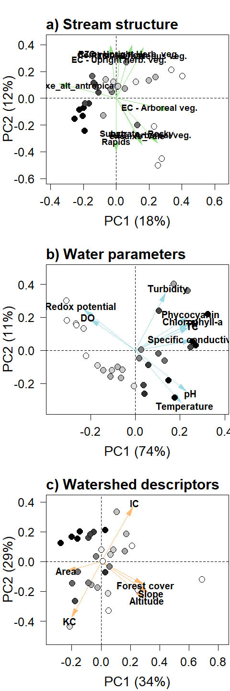

Environmental PCAs
================
Rodolfo Pelinson
2025-11-23

``` r
dir<-("C:/Users/rodol/OneDrive/repos/Urban_fish_assemblages")
```

Loading important functions and packages

``` r
library(vegan)
library(yarrr)
```

``` r
assembleia_peixes <- read.csv(paste(sep = "/",dir,"data/com_por_bacia.csv"), row.names = 1)

agua <-read.csv(paste(sep = "/",dir,"data/planilha_agua_assembleias.csv"), row.names = 1)
estrutura <-read.csv(paste(sep = "/",dir,"data/planilha_estrutura_assembleias.csv"), row.names = 1)
bacia <- read.csv(paste(sep = "/",dir,"data/planilha_bacia_assembleias.csv"), row.names = 1)
```

Removing urban cover from watershed descriptors, and a few other
predictors that are redundant

``` r
urb <- bacia$urbano_delineamento
bacia <- bacia[colnames(bacia) != "urbano_delineamento" &
                 colnames(bacia) != "URB_2021"]
names(urb) <- rownames(bacia)

estrutura <- estrutura[colnames(estrutura) != "descarga_vel_dim" &
                   colnames(estrutura) != "descarga_.L.s_sal"&
                   colnames(estrutura) != "descarga_.L.s_sal"]
```

Standardizing predictors

``` r
estrutura <- estrutura[,colnames(estrutura) != "comp_zona_riparia_plantacao"] #Variavel só com zeros

agua_st <- decostand(agua, method = "stand")
estrutura_st <- decostand(estrutura, method = "stand")
bacia_st <- decostand(bacia, method = "stand")


#numero de colunas de cada uma
ncol_agua <- ncol(agua_st)
ncol_estrutura <- ncol(estrutura_st)
ncol_bacia <- ncol(bacia_st)
```

### PCA stream structure

``` r
pca_estrutura <- rda(estrutura_st)

importance_estrutura <- round(pca_estrutura$CA$eig/sum(pca_estrutura$CA$eig),2)
Eigenvalues_estrutura <- data.frame(autovalores = pca_estrutura$CA$eig,
                                    importance = importance_estrutura)

sum(importance_estrutura[1:5])
```

    ## [1] 0.52

``` r
estrutura_PCs <- pca_estrutura$CA$u
estrutura_loadings <- pca_estrutura$CA$v

estrutura_loadings_filtrados_PC1 <- estrutura_loadings[which(estrutura_loadings[,1] > 0.2 | estrutura_loadings[,1] < -0.2),1]
estrutura_loadings_filtrados_PC1
```

    ##                      comp_ecotono_arborea 
    ##                                -0.2187643 
    ##         pert_zona_riparia_lixo_inorganico 
    ##                                 0.2006876 
    ##         estrutura_dentro_do_canal_entulho 
    ##                                 0.2139454 
    ## estrutura_dentro_do_canal_lixo_inorganico 
    ##                                 0.2091046

``` r
estrutura_loadings_filtrados_PC2 <- estrutura_loadings[which(estrutura_loadings[,2] > 0.2 | estrutura_loadings[,2] < -0.2),2]
estrutura_loadings_filtrados_PC2
```

    ##      comp_ecotono_herbacea_ereta                  substrato_rocha 
    ##                        0.2520818                       -0.2230341 
    ##         tipo_de_canal_corredeira               tipo_de_canal_poco 
    ##                       -0.2941114                       -0.2276796 
    ##     tipo_de_canal_fluxo_continuo    comp_zona_riparia_veg_arborea 
    ##                        0.2937503                       -0.2386225 
    ##   comp_zona_riparia_veg_herbacea comp_zona_riparia_veg_herb_ereta 
    ##                        0.2408681                        0.2682561

``` r
estrutura_loadings_filtrados_PC3 <- estrutura_loadings[which(estrutura_loadings[,3] > 0.2 | estrutura_loadings[,3] < -0.2),3]
estrutura_loadings_filtrados_PC3
```

    ##               comp_ecotono_flutuante            substrato_galhos_pequenos 
    ##                           -0.2952432                           -0.2697092 
    ##            pert_zona_riparia_entulho  estrutura_dentro_do_canal_macrofita 
    ##                            0.2151240                           -0.2612014 
    ## estrutura_dentro_do_canal_herb_ereta 
    ##                           -0.2198031

``` r
estrutura_loadings_filtrados_PC4 <- estrutura_loadings[which(estrutura_loadings[,4] > 0.2 | estrutura_loadings[,4] < -0.2),4]
estrutura_loadings_filtrados_PC4
```

    ##                        substrato_cascalho 
    ##                                 0.2987250 
    ##                           substrato_seixo 
    ##                                 0.2711730 
    ##                substrato_litter_grosseiro 
    ##                                -0.2398220 
    ##            comp_zona_riparia_solo_exposto 
    ##                                 0.2047686 
    ## estrutura_dentro_do_canal_banco_de_folhas 
    ##                                -0.2508407

``` r
estrutura_loadings_filtrados_PC5 <- estrutura_loadings[which(estrutura_loadings[,5] > 0.2 | estrutura_loadings[,5] < -0.2),5]
estrutura_loadings_filtrados_PC5
```

    ##                              dossel                     substrato_areia 
    ##                          -0.2447722                          -0.3033599 
    ##                      substrato_lodo           substrato_galhos_pequenos 
    ##                           0.2503019                          -0.2578395 
    ## estrutura_dentro_do_canal_macrofita 
    ##                          -0.2640236

``` r
estrutura_loadings_filtrados <- estrutura_loadings[which((estrutura_loadings[,1] > 0.2 | estrutura_loadings[,1] < -0.2) |
                                                         (estrutura_loadings[,2] > 0.2 | estrutura_loadings[,2] < -0.2)),1:2]
estrutura_loadings_filtrados
```

    ##                                                    PC1         PC2
    ## comp_ecotono_herbacea_ereta               -0.028653636  0.25208185
    ## comp_ecotono_arborea                      -0.218764251 -0.07579779
    ## substrato_rocha                           -0.101246502 -0.22303411
    ## tipo_de_canal_corredeira                   0.021045789 -0.29411137
    ## tipo_de_canal_poco                        -0.079258438 -0.22767956
    ## tipo_de_canal_fluxo_continuo               0.003990507  0.29375035
    ## pert_zona_riparia_lixo_inorganico          0.200687591  0.00184380
    ## comp_zona_riparia_veg_arborea             -0.168900012 -0.23862247
    ## comp_zona_riparia_veg_herbacea            -0.128949818  0.24086813
    ## comp_zona_riparia_veg_herb_ereta          -0.081070691  0.26825614
    ## estrutura_dentro_do_canal_entulho          0.213945418 -0.06114972
    ## estrutura_dentro_do_canal_lixo_inorganico  0.209104620 -0.08546433

``` r
#write.csv(Eigenvalues_estrutura, "data/pcas_amb/estrutura_autovalores.csv")
#write.csv(estrutura_PCs, "data/pcas_amb/estrutura_PCs.csv")
#write.csv(estrutura_loadings, "data/pcas_amb/estrutura_loadings.csv")
```

Preparing variables for plotting the PCA

``` r
#Plot parameters
scaler <- min(max(abs(estrutura_PCs[, 1]))/max(abs(estrutura_loadings_filtrados[,1])),
              max(abs(estrutura_PCs[, 2]))/max(abs(estrutura_loadings_filtrados[,2])))

estrutura_loadings_filtrados_new <- estrutura_loadings_filtrados * scaler * 0.8

#estrutura_PCs <- jitter(estrutura_PCs, amount = 0.1)

pc1_label_estrutura <- paste("PC1 (",round(importance_estrutura[1]*100,2),"%)",sep = "")
pc2_label_estrutura <- paste("PC2 (",round(importance_estrutura[2]*100,2),"%)",sep = "")

xmin <- min(c(estrutura_PCs[,1], estrutura_loadings_filtrados_new[,1]))*1.1
xmax <- max(c(estrutura_PCs[,1], estrutura_loadings_filtrados_new[,1]))*1.1
ymin <- min(c(estrutura_PCs[,2], estrutura_loadings_filtrados_new[,2]))*1.1
ymax <- max(c(estrutura_PCs[,2], estrutura_loadings_filtrados_new[,2]))*1.1


#Plot########################################################################################
names_estrutura <- rownames(estrutura_loadings_filtrados_new)

names_estrutura[names_estrutura == "comp_ecotono_herbacea_ereta"] <- "EC - Upright herb. veg." #Upright herbaceous vegetation in the ecotone
names_estrutura[names_estrutura == "comp_ecotono_arborea"] <- "EC - Arboreal veg." #Upright herbaceous vegetation in the ecotone
names_estrutura[names_estrutura == "substrato_rocha"] <- "Substrate - Rocky"
names_estrutura[names_estrutura == "tipo_de_canal_corredeira"] <- "Rapids"
names_estrutura[names_estrutura == "tipo_de_canal_poco"] <- "Pools"
names_estrutura[names_estrutura == "tipo_de_canal_fluxo_continuo"] <- "Continuous flow"
names_estrutura[names_estrutura == "pert_zona_riparia_lixo_inorganico"] <- "PITRZ - Inorganic waste"
names_estrutura[names_estrutura == "comp_zona_riparia_veg_arborea"] <- "RZC - Arboreal veg."
names_estrutura[names_estrutura == "comp_zona_riparia_veg_herbacea"] <- "RZC - Herbaceous veg."
names_estrutura[names_estrutura == "comp_zona_riparia_veg_herb_ereta"] <- "RZC - Upright Herb. veg."
names_estrutura[names_estrutura == "estrutura_dentro_do_canal_entulho"] <- "SITC - Construction waste"
names_estrutura[names_estrutura == "estrutura_dentro_do_canal_lixo_inorganico"] <- "SITC - Inorganic waste"
```

### PCA watershed descriptors

``` r
pca_bacia <- rda(bacia_st)

importance_bacia <- round(pca_bacia$CA$eig/sum(pca_bacia$CA$eig),2)
Eigenvalues_bacia <- data.frame(autovalores = pca_bacia$CA$eig,
                                    importance = importance_bacia)

sum(importance_bacia[1:3])
```

    ## [1] 0.8

``` r
bacia_PCs <- pca_bacia$CA$u
bacia_loadings <- pca_bacia$CA$v


bacia_loadings_filtrados <- bacia_loadings[which((bacia_loadings[,1] > 0.2 | bacia_loadings[,1] < -0.2) |
                                                         (bacia_loadings[,2] > 0.2 | bacia_loadings[,2] < -0.2)),1:2]
bacia_loadings_filtrados
```

    ##                       PC1         PC2
    ## Area_ha        -0.3438980 -0.09107339
    ## FOR_2021        0.4389801 -0.23146919
    ## Ic              0.3350739  0.56895419
    ## Kc             -0.3122788 -0.58224437
    ## Declividade_av  0.4965422 -0.31744215
    ## Altitude_av     0.4554975 -0.37883697

``` r
#write.csv(Eigenvalues_bacia, "data/pcas_amb/bacia_autovalores.csv")
#write.csv(bacia_PCs, "data/pcas_amb/bacia_PCs.csv")
#write.csv(bacia_loadings, "data/pcas_amb/bacia_loadings.csv")
```

Preparing variables for plotting the PCA

``` r
#Plot parameters
scaler <- min(max(abs(bacia_PCs[, 1]))/max(abs(bacia_loadings_filtrados[,1])),
              max(abs(bacia_PCs[, 2]))/max(abs(bacia_loadings_filtrados[,2])))

bacia_loadings_filtrados_new <- bacia_loadings_filtrados * scaler * 0.8

#bacia_PCs <- jitter(bacia_PCs, amount = 0.1)

pc1_label_bacia <- paste("PC1 (",round(importance_bacia[1]*100,2),"%)",sep = "")
pc2_label_bacia <- paste("PC2 (",round(importance_bacia[2]*100,2),"%)",sep = "")

xmin <- min(c(bacia_PCs[,1], bacia_loadings_filtrados_new[,1]))*1.1
xmax <- max(c(bacia_PCs[,1], bacia_loadings_filtrados_new[,1]))*1.1
ymin <- min(c(bacia_PCs[,2], bacia_loadings_filtrados_new[,2]))*1.1
ymax <- max(c(bacia_PCs[,2], bacia_loadings_filtrados_new[,2]))*1.1


#Plot########################################################################################
names_bacia <- rownames(bacia_loadings_filtrados_new)

names_bacia[names_bacia == "Area_ha"] <- "Area" 
names_bacia[names_bacia == "FOR_2021"] <- "Forest cover"
names_bacia[names_bacia == "Ic"] <- "IC"
names_bacia[names_bacia == "Kc"] <- "KC"
names_bacia[names_bacia == "Declividade_av"] <- "Slope"
names_bacia[names_bacia == "Altitude_av"] <- "Altitude"
```

### PCA water parameters

``` r
pca_agua <- rda(agua_st)

importance_agua <- round(pca_agua$CA$eig/sum(pca_agua$CA$eig),2)
Eigenvalues_agua <- data.frame(autovalores = pca_agua$CA$eig,
                                importance = importance_agua)

sum(importance_agua[1:2])
```

    ## [1] 0.85

``` r
agua_PCs <- pca_agua$CA$u
agua_loadings <- pca_agua$CA$v

agua_loadings_filtrados <- agua_loadings[which((agua_loadings[,1] > 0.2 | agua_loadings[,1] < -0.2) |
                                                         (agua_loadings[,2] > 0.2 | agua_loadings[,2] < -0.2)),1:2]

agua_loadings_filtrados
```

    ##                             PC1         PC2
    ## chlorophyll_a         0.3425946  0.22830531
    ## phycocyanin           0.3319041  0.28605404
    ## Temperature_.oC.      0.2934168 -0.45383301
    ## DO_.mg.L.            -0.2829812  0.26678802
    ## pH                    0.3275608 -0.35428677
    ## turbidity_.NTU.       0.1928304  0.49530430
    ## redox_potential_.mV. -0.3265517  0.35175488
    ## TC                    0.3390057  0.19613608
    ## TN                    0.3378084  0.22100450
    ## SPC_.uS.cm.           0.3551645  0.08378666

``` r
#write.csv(Eigenvalues_agua, "data/pcas_amb/agua_autovalores.csv")
#write.csv(agua_PCs, "data/pcas_amb/agua_PCs.csv")
#write.csv(agua_loadings, "data/pcas_amb/agua_loadings.csv")
```

Preparing variables for plotting the PCA

``` r
#Plot parameters
scaler <- min(max(abs(agua_PCs[, 1]))/max(abs(agua_loadings_filtrados[,1])),
              max(abs(agua_PCs[, 2]))/max(abs(agua_loadings_filtrados[,2])))

agua_loadings_filtrados_new <- agua_loadings_filtrados * scaler * 0.8

#agua_PCs <- jitter(agua_PCs, amount = 0.1)

pc1_label_agua <- paste("PC1 (",round(importance_agua[1]*100,2),"%)",sep = "")
pc2_label_agua <- paste("PC2 (",round(importance_agua[2]*100,2),"%)",sep = "")

xmin <- min(c(agua_PCs[,1], agua_loadings_filtrados_new[,1]))*1.1
xmax <- max(c(agua_PCs[,1], agua_loadings_filtrados_new[,1]))*1.1
ymin <- min(c(agua_PCs[,2], agua_loadings_filtrados_new[,2]))*1.1
ymax <- max(c(agua_PCs[,2], agua_loadings_filtrados_new[,2]))*1.1


#Plot########################################################################################
names_agua <- rownames(agua_loadings_filtrados_new)

names_agua[names_agua == "chlorophyll_a"] <- "Chlorophyll-a" 
names_agua[names_agua == "phycocyanin"] <- "Phycocyanin"
names_agua[names_agua == "Temperature_.oC."] <- "Temperature"
names_agua[names_agua == "pH"] <- "pH"
names_agua[names_agua == "turbidity_.NTU."] <- "Turbidity"
names_agua[names_agua == "redox_potential_.mV."] <- "Redox potential"
names_agua[names_agua == "TC"] <- "TC"
names_agua[names_agua == "TN"] <- "TN"
names_agua[names_agua == "SPC_.uS.cm."] <- "Specific conductivity"
names_agua[names_agua == "DO_.mg.L."] <- "DO"
```

## PCA plots

``` r
#pdf("plots/pcas.pdf", height = 10.5, width = 3.5, pointsize = 5)

par(mfrow =c(3,1))

par(mar = c(4,4,3,0.1), bty = "o", cex = 1.25)
xmin <- min(c(estrutura_PCs[,1], estrutura_loadings_filtrados_new[,1]))*1.2
xmax <- max(c(estrutura_PCs[,1], estrutura_loadings_filtrados_new[,1]))*1.6
ymin <- min(c(estrutura_PCs[,2], estrutura_loadings_filtrados_new[,2]))*1.2
ymax <- max(c(estrutura_PCs[,2], estrutura_loadings_filtrados_new[,2]))*1.2

plot(estrutura_PCs[,1], estrutura_PCs[,2], xlim = c(xmin,xmax), ylim = c(ymin, ymax),
     type = "n", xaxt = "n", yaxt = "n", ylab = "", xlab = "")

abline(h = 0, v = 0, lty = 2)

library(scales)
library(shape)


pal <- col_numeric(palette = c("white", "black"), domain = urb, na.color = "grey50", alpha = FALSE, reverse = FALSE)
col <-pal(urb)

Arrows(x0 <- rep(0, nrow(estrutura_loadings_filtrados_new)),
       y0 <- rep(0, nrow(estrutura_loadings_filtrados_new)),
       x1 <- estrutura_loadings_filtrados_new[,1],
       y1 <- estrutura_loadings_filtrados_new[,2], arr.type = "triangle", arr.length = 0.4, col = "#98DF8A", lwd = 1.5)

points(estrutura_PCs[,1],estrutura_PCs[,2], col = "black", bg = col, pch = 21, cex = 1.5)
#text(estrutura_PCs[,1],estrutura_PCs[,2], labels = rownames(estrutura_PCs))


text(x = estrutura_loadings_filtrados_new[,1] * 0.9, y = estrutura_loadings_filtrados_new[,2] * 0.9, labels = names_estrutura, cex = 0.9, font = 2)

axis(1, cex.axis = 1.25)
axis(2, cex.axis = 1.25, las = 2)
title(xlab = pc1_label_estrutura, cex.lab = 1.4, line = 2.75)
title(ylab = pc2_label_estrutura, cex.lab = 1.4, line = 2.75)
title(main = "a) Stream structure", line = 0.5, adj = 0, cex.main = 1.5)


par(mar = c(4,4,3,0.1), bty = "o", cex = 1.25)
xmin <- min(c(agua_PCs[,1], agua_loadings_filtrados_new[,1]))*1.2
xmax <- max(c(agua_PCs[,1], agua_loadings_filtrados_new[,1]))*1.2
ymin <- min(c(agua_PCs[,2], agua_loadings_filtrados_new[,2]))*1.2
ymax <- max(c(agua_PCs[,2], agua_loadings_filtrados_new[,2]))*1.2

plot(agua_PCs[,1], agua_PCs[,2], xlim = c(xmin,xmax), ylim = c(ymin, ymax),
     type = "n", xaxt = "n", yaxt = "n", ylab = "", xlab = "")

abline(h = 0, v = 0, lty = 2)

library(scales)
library(shape)


pal <- col_numeric(palette = c("white", "black"), domain = urb, na.color = "grey50", alpha = FALSE, reverse = FALSE)
col <-pal(urb)

Arrows(x0 <- rep(0, nrow(agua_loadings_filtrados_new)),
       y0 <- rep(0, nrow(agua_loadings_filtrados_new)),
       x1 <- agua_loadings_filtrados_new[,1],
       y1 <- agua_loadings_filtrados_new[,2], arr.type = "triangle", arr.length = 0.4, col = "#9EDAE5", lwd = 1.5)

points(agua_PCs[,1],agua_PCs[,2], col = "black", bg = col, pch = 21, cex = 1.5)
#text(agua_PCs[,1],agua_PCs[,2], labels = rownames(agua_PCs))

text(x = agua_loadings_filtrados_new[,1]*1.15, y = agua_loadings_filtrados_new[,2]*1.15, labels = names_agua, cex = 1, font = 2)

axis(1, cex.axis = 1.25)
axis(2, cex.axis = 1.25, las = 2)
title(xlab = pc1_label_agua, cex.lab = 1.4, line = 2.75)
title(ylab = pc2_label_agua, cex.lab = 1.4, line = 2.75)
title(main = "b) Water parameters", line = 0.5, adj = 0, cex.main = 1.5)


par(mar = c(4,4,3,0.1), bty = "o", cex = 1.25)
xmin <- min(c(bacia_PCs[,1], bacia_loadings_filtrados_new[,1]))*1.2
xmax <- max(c(bacia_PCs[,1], bacia_loadings_filtrados_new[,1]))*1.2
ymin <- min(c(bacia_PCs[,2], bacia_loadings_filtrados_new[,2]))*1.2
ymax <- max(c(bacia_PCs[,2], bacia_loadings_filtrados_new[,2]))*1.2

plot(bacia_PCs[,1], bacia_PCs[,2], xlim = c(xmin,xmax), ylim = c(ymin, ymax),
     type = "n", xaxt = "n", yaxt = "n", ylab = "", xlab = "")

abline(h = 0, v = 0, lty = 2)

library(scales)
library(shape)


pal <- col_numeric(palette = c("white", "black"), domain = urb, na.color = "grey50", alpha = FALSE, reverse = FALSE)
col <-pal(urb)

Arrows(x0 <- rep(0, nrow(bacia_loadings_filtrados_new)),
       y0 <- rep(0, nrow(bacia_loadings_filtrados_new)),
       x1 <- bacia_loadings_filtrados_new[,1],
       y1 <- bacia_loadings_filtrados_new[,2], arr.type = "triangle", arr.length = 0.4, col = "#FFBB78", lwd = 1.5)

points(bacia_PCs[,1],bacia_PCs[,2], col = "black", bg = col, pch = 21, cex = 1.5)
#text(bacia_PCs[,1],bacia_PCs[,2], labels = rownames(bacia_PCs))

text(x = bacia_loadings_filtrados_new[,1]*1.15, y = bacia_loadings_filtrados_new[,2]*1.15, labels = names_bacia, cex = 1, font = 2)

axis(1, cex.axis = 1.25)
axis(2, cex.axis = 1.25, las = 2)
title(xlab = pc1_label_bacia, cex.lab = 1.4, line = 2.75)
title(ylab = pc2_label_bacia, cex.lab = 1.4, line = 2.75)
title(main = "c) Watershed descriptors", line = 0.5, adj = 0, cex.main = 1.5)
```

<!-- -->

``` r
#dev.off()
```
