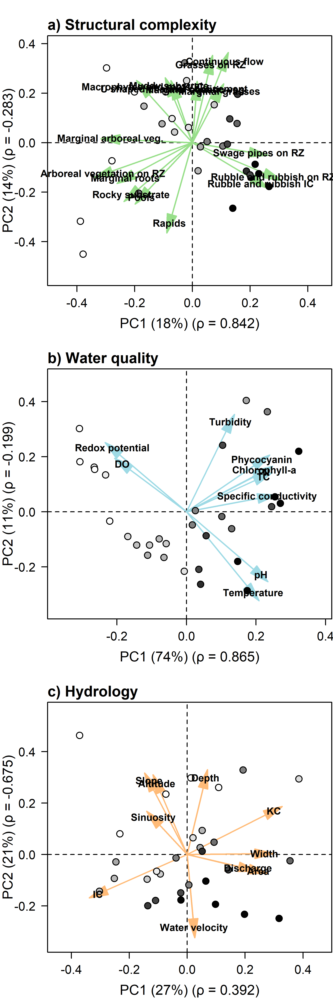

Environmental PCAs - North vs South
================
Rodolfo Pelinson
2026-06-17

``` r
dir<-("C:/Users/rodol/OneDrive/repos/Urban_fish_assemblages")
```

Loading important functions and packages

``` r
library(vegan)
library(yarrr)
library(greekLetters)
library(scales)
library(shape)
```

``` r
assembleia_peixes <- read.csv(paste(sep = "/",dir,"data/com_por_bacia.csv"), row.names = 1)

agua <-read.csv(paste(sep = "/",dir,"data/planilha_agua_assembleias.csv"), row.names = 1)
estrutura <-read.csv(paste(sep = "/",dir,"data/planilha_estrutura_assembleias.csv"), row.names = 1)
bacia <- read.csv(paste(sep = "/",dir,"data/planilha_bacia_assembleias.csv"), row.names = 1)
```

Removing urban cover from watershed descriptors, and a few other
predictors that are redundant

``` r
urb <- bacia$urbano_delineamento
bacia <- bacia[colnames(bacia) != "urbano_delineamento" &
                 colnames(bacia) != "URB_2021"]
names(urb) <- rownames(bacia)

estrutura <- estrutura[colnames(estrutura) != "descarga_vel_dim" &
                   colnames(estrutura) != "descarga_.L.s_sal"&
                   colnames(estrutura) != "descarga_.L.s_sal"]
```

``` r
comp_ecotono_arborea <- estrutura$comp_ecotono_arborea + estrutura$comp_ecotono_arbustiva + estrutura$comp_ecotono_pendurada
comp_ecotono_raizes <- estrutura$comp_ecotono_raizes_finas_em_rede + estrutura$comp_ecotono_raizes_grandes
comp_ecotono_grasses <- estrutura$comp_ecotono_gramineas + estrutura$comp_ecotono_vegetacao_herbacea + estrutura$comp_ecotono_herbacea_ereta
comp_ecotono_aquatic_veg <- estrutura$comp_ecotono_submersa + estrutura$comp_ecotono_flutuante
comp_ecotono_anthropic_complex_est <- estrutura$comp_ecotono_entulho + estrutura$comp_ecotono_arame


estrutura <- estrutura[,-which(colnames(estrutura) %in% c("comp_ecotono_arbustiva",
                                "comp_ecotono_arborea",
                                "comp_ecotono_gramineas",
                                "comp_ecotono_vegetacao_herbacea",
                                "comp_ecotono_herbacea_ereta",
                                "comp_ecotono_pendurada",
                                "comp_ecotono_submersa",
                                "comp_ecotono_flutuante",
                                "comp_ecotono_entulho",
                                "comp_ecotono_arame",
                                "comp_ecotono_raizes_finas_em_rede",
                                "comp_ecotono_raizes_grandes"))]

estrutura <- cbind(estrutura, comp_ecotono_arborea, comp_ecotono_raizes, comp_ecotono_grasses, comp_ecotono_aquatic_veg, comp_ecotono_anthropic_complex_est)
```

``` r
substrato_areia <- estrutura$substrato_silte + estrutura$substrato_areia
substrato_cascalho <- estrutura$substrato_cascalho + estrutura$substrato_seixo
substrato_litter <- estrutura$substrato_litter + estrutura$substrato_litter_grosseiro
substrato_galhos_troncos <-  estrutura$substrato_galhos_grandes_troncos + estrutura$substrato_galhos_pequenos
substrato_entulho <-  estrutura$substrato_entulho + estrutura$substrato_arame


estrutura <- estrutura[,-which(colnames(estrutura) %in% c("substrato_silte",
                                                         "substrato_areia",
                                "substrato_cascalho",
                                "substrato_seixo",
                                "substrato_litter",
                                "substrato_litter_grosseiro",
                                "substrato_galhos_grandes_troncos",
                                "substrato_galhos_pequenos",
                                "substrato_entulho",
                                "substrato_arame"))]
                                

estrutura <- cbind(estrutura, substrato_areia, substrato_cascalho, substrato_litter, substrato_galhos_troncos, substrato_entulho)
```

``` r
comp_zona_riparia_veg_arborea <- estrutura$comp_zona_riparia_veg_arborea + estrutura$comp_zona_riparia_veg_arbustiva
comp_zona_riparia_grasses <- estrutura$comp_zona_riparia_veg_herbacea + estrutura$comp_zona_riparia_veg_herb_ereta + estrutura$comp_zona_riparia_graminea
comp_zona_riparia_const_anthr <- estrutura$comp_zona_riparia_calcada + estrutura$comp_zona_riparia_asfalto + estrutura$comp_zona_riparia_constucao + estrutura$comp_zona_riparia_canal_vert + estrutura$comp_zona_riparia_grade_arame
comp_zona_riparia_agriculture <- estrutura$comp_zona_riparia_plantacao + estrutura$comp_zona_riparia_pastagem

estrutura <- estrutura[,-which(colnames(estrutura) %in% c("comp_zona_riparia_veg_arborea",                      
                                "comp_zona_riparia_veg_arbustiva",
                                "comp_zona_riparia_veg_herbacea",                     
                                "comp_zona_riparia_veg_herb_ereta",            
                                "comp_zona_riparia_graminea",
                                "comp_zona_riparia_calcada",                          
                                "comp_zona_riparia_asfalto",
                                "comp_zona_riparia_constucao",                        
                                "comp_zona_riparia_canal_vert",                       
                                "comp_zona_riparia_grade_arame",
                                "comp_zona_riparia_plantacao",                        
                                "comp_zona_riparia_pastagem"))]

estrutura <- cbind(estrutura, comp_zona_riparia_veg_arborea, comp_zona_riparia_grasses, comp_zona_riparia_const_anthr, comp_zona_riparia_agriculture)
```

``` r
pert_zona_riparia_entulho_e_lixo <- estrutura$pert_zona_riparia_entulho + estrutura$pert_zona_riparia_lixo_inorganico
pert_zona_riparia_construções <- estrutura$pert_zona_riparia_construcoes + estrutura$pert_zona_riparia_bomba

estrutura <- estrutura[,-which(colnames(estrutura) %in% c("pert_zona_riparia_entulho",
                                "pert_zona_riparia_lixo_inorganico",
                                "pert_zona_riparia_construcoes",
                                "pert_zona_riparia_bomba"))]


estrutura <- cbind(estrutura, pert_zona_riparia_entulho_e_lixo, pert_zona_riparia_construções)
```

``` r
estrutura_dentro_do_canal_pedaco_de_madeira <- estrutura$estrutura_dentro_do_canal_pedaco_de_madeira_grande + estrutura$estrutura_dentro_do_canal_pedaco_de_madeira_pequeno
estrutura_dentro_do_canal_macrofitas_e_raizes <- estrutura$estrutura_dentro_do_canal_raizes_vivas + estrutura$estrutura_dentro_do_canal_vegetacao_pendurada + estrutura$estrutura_dentro_do_canal_macrofita
estrutura_dentro_do_canal_grasses <- estrutura$estrutura_dentro_do_canal_herb_ereta + estrutura$estrutura_dentro_do_canal_graminea
estrutura_dentro_do_canal_entulho_e_lixo <- estrutura$estrutura_dentro_do_canal_entulho + estrutura$estrutura_dentro_do_canal_lixo_inorganico

estrutura <- estrutura[,-which(colnames(estrutura) %in% c("estrutura_dentro_do_canal_pedaco_de_madeira_grande", 
                                "estrutura_dentro_do_canal_pedaco_de_madeira_pequeno",
                                "estrutura_dentro_do_canal_raizes_vivas",
                                "estrutura_dentro_do_canal_vegetacao_pendurada", 
                                "estrutura_dentro_do_canal_macrofita", 
                                "estrutura_dentro_do_canal_herb_ereta",               
                                "estrutura_dentro_do_canal_graminea",   
                                "estrutura_dentro_do_canal_entulho",                  
                                "estrutura_dentro_do_canal_lixo_inorganico"))]

estrutura <- cbind(estrutura, estrutura_dentro_do_canal_pedaco_de_madeira, estrutura_dentro_do_canal_macrofitas_e_raizes, estrutura_dentro_do_canal_grasses, estrutura_dentro_do_canal_entulho_e_lixo)
```

``` r
vars <- colnames(estrutura)
estrutura <- estrutura[,order(vars)]
```

# Sctructural complexity

``` r
colnames(estrutura)
```

    ##  [1] "comp_ecotono_anthropic_complex_est"           
    ##  [2] "comp_ecotono_aquatic_veg"                     
    ##  [3] "comp_ecotono_arborea"                         
    ##  [4] "comp_ecotono_concreto"                        
    ##  [5] "comp_ecotono_grasses"                         
    ##  [6] "comp_ecotono_raizes"                          
    ##  [7] "comp_ecotono_rocha"                           
    ##  [8] "comp_ecotono_solo_exposto"                    
    ##  [9] "comp_zona_riparia_agriculture"                
    ## [10] "comp_zona_riparia_area_alagada"               
    ## [11] "comp_zona_riparia_const_anthr"                
    ## [12] "comp_zona_riparia_grasses"                    
    ## [13] "comp_zona_riparia_solo_exposto"               
    ## [14] "comp_zona_riparia_veg_arborea"                
    ## [15] "dossel"                                       
    ## [16] "encaixe_alt_antropica"                        
    ## [17] "encaixe_rocha"                                
    ## [18] "encaixe_sem_feicoes"                          
    ## [19] "encaixe_terraco"                              
    ## [20] "encaixe_vale"                                 
    ## [21] "estrutura_dentro_do_canal_banco_de_folhas"    
    ## [22] "estrutura_dentro_do_canal_banco_de_terra"     
    ## [23] "estrutura_dentro_do_canal_cianobacterias"     
    ## [24] "estrutura_dentro_do_canal_entulho_e_lixo"     
    ## [25] "estrutura_dentro_do_canal_grasses"            
    ## [26] "estrutura_dentro_do_canal_macrofitas_e_raizes"
    ## [27] "estrutura_dentro_do_canal_matacao"            
    ## [28] "estrutura_dentro_do_canal_pedaco_de_madeira"  
    ## [29] "larg_media"                                   
    ## [30] "nova_descarga_sal"                            
    ## [31] "pert_zona_riparia_animais_criacao"            
    ## [32] "pert_zona_riparia_cano_esgoto"                
    ## [33] "pert_zona_riparia_construções"                
    ## [34] "pert_zona_riparia_entulho_e_lixo"             
    ## [35] "pert_zona_riparia_lixo_organico"              
    ## [36] "prof_media"                                   
    ## [37] "sinuosidade"                                  
    ## [38] "substrato_areia"                              
    ## [39] "substrato_argila"                             
    ## [40] "substrato_cascalho"                           
    ## [41] "substrato_concreto"                           
    ## [42] "substrato_entulho"                            
    ## [43] "substrato_galhos_troncos"                     
    ## [44] "substrato_litter"                             
    ## [45] "substrato_lodo"                               
    ## [46] "substrato_matacao"                            
    ## [47] "substrato_rocha"                              
    ## [48] "tipo_de_canal_cascata"                        
    ## [49] "tipo_de_canal_corredeira"                     
    ## [50] "tipo_de_canal_fluxo_continuo"                 
    ## [51] "tipo_de_canal_poco"                           
    ## [52] "tipo_de_encaixe_concavo"                      
    ## [53] "tipo_de_encaixe_encaixado_canalizado"         
    ## [54] "tipo_de_encaixe_vale_assimetrico"             
    ## [55] "tipo_de_encaixe_vale_em_U"                    
    ## [56] "velocidade_media"

``` r
colnames(bacia)
```

    ## [1] "Area_ha"        "FOR_2021"       "AGR_2021"       "Ic"            
    ## [5] "Kc"             "Declividade_av" "Altitude_av"

``` r
colnames(agua)
```

    ##  [1] "chlorophyll_a"        "phycocyanin"          "Temperature_.oC."    
    ##  [4] "DO_.mg.L."            "pH"                   "turbidity_.NTU."     
    ##  [7] "redox_potential_.mV." "TC"                   "TN"                  
    ## [10] "SPC_.uS.cm."

``` r
structural_complexity_vars <- c("dossel",
                                "comp_ecotono_anthropic_complex_est",          
                                "comp_ecotono_aquatic_veg",                     
                                "comp_ecotono_arborea",                         
                                "comp_ecotono_concreto",                        
                                "comp_ecotono_grasses",                         
                                "comp_ecotono_raizes",                          
                                "comp_ecotono_rocha",                           
                                "comp_ecotono_solo_exposto",
                                
                                "substrato_areia",                              
                                "substrato_argila",                             
                                "substrato_cascalho",                           
                                "substrato_concreto" ,                          
                                "substrato_entulho"  ,                          
                                "substrato_galhos_troncos" ,                    
                                "substrato_litter"    ,                         
                                "substrato_lodo" ,                              
                                "substrato_matacao" ,                           
                                "substrato_rocha",
                                
                                "tipo_de_canal_corredeira",
                                "tipo_de_canal_poco",
                                "tipo_de_canal_cascata",
                                "tipo_de_canal_fluxo_continuo",
                                
                                "pert_zona_riparia_animais_criacao",            
                                "pert_zona_riparia_cano_esgoto",                
                                "pert_zona_riparia_construções",                
                                "pert_zona_riparia_entulho_e_lixo"  ,           
                                "pert_zona_riparia_lixo_organico" ,
                                
                                "comp_zona_riparia_agriculture",                
                                "comp_zona_riparia_area_alagada",               
                                "comp_zona_riparia_const_anthr",                
                                "comp_zona_riparia_grasses",                    
                                "comp_zona_riparia_solo_exposto",               
                                "comp_zona_riparia_veg_arborea",
                                
                                "estrutura_dentro_do_canal_banco_de_folhas",    
                                "estrutura_dentro_do_canal_banco_de_terra",     
                                "estrutura_dentro_do_canal_cianobacterias",     
                                "estrutura_dentro_do_canal_entulho_e_lixo",     
                                "estrutura_dentro_do_canal_grasses",            
                                "estrutura_dentro_do_canal_macrofitas_e_raizes",
                                "estrutura_dentro_do_canal_matacao",            
                                "estrutura_dentro_do_canal_pedaco_de_madeira",
                                
                               #"encaixe_rocha",                                      
                               #"encaixe_vale",                                       
                               #"encaixe_terraco",                                    
                               #"encaixe_alt_antropica",                              
                               #"encaixe_sem_feicoes",                                
                                "tipo_de_encaixe_vale_em_U",                          
                                "tipo_de_encaixe_concavo",                            
                                "tipo_de_encaixe_encaixado_canalizado",               
                                "tipo_de_encaixe_vale_assimetrico")


hydrology_vars <- c("nova_descarga_sal",
                    "sinuosidade",
                    "prof_media",
                    "larg_media",
                    "velocidade_media",
                    "Area_ha",
                    "Ic",
                    "Kc",
                    "Declividade_av",
                    "Altitude_av")

water_quality_vars <- c("chlorophyll_a",
                    "phycocyanin",
                    "Temperature_.oC.",
                    "DO_.mg.L.",
                    "pH",
                    "turbidity_.NTU.",
                    "redox_potential_.mV.",
                    "TC",
                    "TN",
                    "SPC_.uS.cm.")
```

``` r
#Join all variables
env_pred <- cbind(estrutura, bacia, agua)

structural_complexity <- env_pred[,which(colnames(env_pred) %in% structural_complexity_vars)]
hydrology <- env_pred[,which(colnames(env_pred) %in% hydrology_vars)]
water_quality <- env_pred[,which(colnames(env_pred) %in% water_quality_vars)]
```

Standardizing predictors

``` r
structural_complexity_st <- decostand(structural_complexity, method = "stand")
hydrology_st <- decostand(hydrology, method = "stand")
water_quality_st <- decostand(water_quality, method = "stand")


#numero de colunas de cada uma
ncol(water_quality_st)
```

    ## [1] 10

``` r
ncol(structural_complexity_st)
```

    ## [1] 46

``` r
ncol(hydrology_st)
```

    ## [1] 10

### PCA structural complexity

``` r
pca_structural_complexity <- rda(structural_complexity_st)

importance_structural_complexity <- round(pca_structural_complexity$CA$eig/sum(pca_structural_complexity$CA$eig),2)
Eigenvalues_structural_complexity <- data.frame(autovalores = pca_structural_complexity$CA$eig,
                                    importance = importance_structural_complexity)

Eigenvalues_structural_complexity
```

    ##      autovalores importance
    ## PC1   8.30177749       0.18
    ## PC2   6.31514314       0.14
    ## PC3   3.80504005       0.08
    ## PC4   3.67139337       0.08
    ## PC5   2.64152090       0.06
    ## PC6   2.44399418       0.05
    ## PC7   2.31182340       0.05
    ## PC8   1.97512884       0.04
    ## PC9   1.80883075       0.04
    ## PC10  1.64141223       0.04
    ## PC11  1.37633230       0.03
    ## PC12  1.28345058       0.03
    ## PC13  1.16703263       0.03
    ## PC14  1.07345628       0.02
    ## PC15  0.97028960       0.02
    ## PC16  0.82884068       0.02
    ## PC17  0.80845786       0.02
    ## PC18  0.73371859       0.02
    ## PC19  0.61180110       0.01
    ## PC20  0.47853003       0.01
    ## PC21  0.44735111       0.01
    ## PC22  0.35243815       0.01
    ## PC23  0.29374055       0.01
    ## PC24  0.23802022       0.01
    ## PC25  0.15647640       0.00
    ## PC26  0.11429065       0.00
    ## PC27  0.07148486       0.00
    ## PC28  0.05008061       0.00
    ## PC29  0.02814345       0.00

``` r
sum(importance_structural_complexity[1:2])
```

    ## [1] 0.32

``` r
structural_complexity_PCs <- pca_structural_complexity$CA$u
#structural_complexity_PCs[,1] <- structural_complexity_PCs[,1]*-1
structural_complexity_loadings <- pca_structural_complexity$CA$v
#structural_complexity_loadings[,1] <- structural_complexity_loadings[,1]*-1
  
structural_complexity_loadings_filtrados_PC1 <- structural_complexity_loadings[which(structural_complexity_loadings[,1] > 0.2 | structural_complexity_loadings[,1] < -0.2),1]
structural_complexity_loadings_filtrados_PC1
```

    ##                     comp_ecotono_arborea 
    ##                               -0.2801825 
    ##                      comp_ecotono_raizes 
    ##                               -0.2293317 
    ##            comp_zona_riparia_const_anthr 
    ##                                0.2750860 
    ##            comp_zona_riparia_veg_arborea 
    ##                               -0.3059460 
    ## estrutura_dentro_do_canal_entulho_e_lixo 
    ##                                0.2326280 
    ##            pert_zona_riparia_cano_esgoto 
    ##                                0.2264269 
    ##                          substrato_rocha 
    ##                               -0.2095774

``` r
structural_complexity_loadings_filtrados_PC2 <- structural_complexity_loadings[which(structural_complexity_loadings[,2] > 0.2 | structural_complexity_loadings[,2] < -0.2),2]
structural_complexity_loadings_filtrados_PC2
```

    ##                      comp_ecotono_aquatic_veg 
    ##                                     0.2074372 
    ##                          comp_ecotono_grasses 
    ##                                     0.2016941 
    ##                     comp_zona_riparia_grasses 
    ##                                     0.3113104 
    ## estrutura_dentro_do_canal_macrofitas_e_raizes 
    ##                                     0.2196040 
    ##                              substrato_argila 
    ##                                     0.2237124 
    ##                               substrato_rocha 
    ##                                    -0.2100462 
    ##                      tipo_de_canal_corredeira 
    ##                                    -0.3237404 
    ##                  tipo_de_canal_fluxo_continuo 
    ##                                     0.3243481 
    ##                            tipo_de_canal_poco 
    ##                                    -0.2172249 
    ##                     tipo_de_encaixe_vale_em_U 
    ##                                     0.2117184

``` r
structural_complexity_loadings_filtrados_PC3 <- structural_complexity_loadings[which(structural_complexity_loadings[,3] > 0.2 | structural_complexity_loadings[,3] < -0.2),3]
structural_complexity_loadings_filtrados_PC3
```

    ##                        comp_ecotono_grasses 
    ##                                  -0.2146595 
    ##                          comp_ecotono_rocha 
    ##                                  -0.2019409 
    ##                                      dossel 
    ##                                   0.2330821 
    ##   estrutura_dentro_do_canal_banco_de_folhas 
    ##                                   0.3076536 
    ##           estrutura_dentro_do_canal_matacao 
    ##                                  -0.2097087 
    ## estrutura_dentro_do_canal_pedaco_de_madeira 
    ##                                   0.2919831 
    ##                          substrato_cascalho 
    ##                                  -0.3456744 
    ##                            substrato_litter 
    ##                                   0.2832937 
    ##                     tipo_de_encaixe_concavo 
    ##                                  -0.2186168 
    ##        tipo_de_encaixe_encaixado_canalizado 
    ##                                   0.2451553

``` r
structural_complexity_loadings_filtrados_PC4 <- structural_complexity_loadings[which(structural_complexity_loadings[,4] > 0.2 | structural_complexity_loadings[,4] < -0.2),4]
structural_complexity_loadings_filtrados_PC4
```

    ##                    comp_ecotono_concreto 
    ##                                0.2793034 
    ##                comp_ecotono_solo_exposto 
    ##                               -0.2097233 
    ## estrutura_dentro_do_canal_entulho_e_lixo 
    ##                               -0.2571461 
    ##         pert_zona_riparia_entulho_e_lixo 
    ##                               -0.2521067 
    ##                           substrato_lodo 
    ##                                0.2345190 
    ##                 tipo_de_canal_corredeira 
    ##                               -0.2121497 
    ##                tipo_de_encaixe_vale_em_U 
    ##                               -0.2663361

``` r
structural_complexity_loadings_filtrados_PC5 <- structural_complexity_loadings[which(structural_complexity_loadings[,5] > 0.2 | structural_complexity_loadings[,5] < -0.2),5]
structural_complexity_loadings_filtrados_PC5
```

    ##        comp_ecotono_anthropic_complex_est 
    ##                                -0.2195178 
    ##                      comp_ecotono_grasses 
    ##                                -0.2300123 
    ##                 comp_ecotono_solo_exposto 
    ##                                 0.3048488 
    ##            comp_zona_riparia_solo_exposto 
    ##                                 0.2829731 
    ## estrutura_dentro_do_canal_banco_de_folhas 
    ##                                -0.2100148 
    ##             pert_zona_riparia_construções 
    ##                                 0.2435326 
    ##           pert_zona_riparia_lixo_organico 
    ##                                -0.2155873 
    ##                        substrato_concreto 
    ##                                 0.2182238 
    ##                     tipo_de_canal_cascata 
    ##                                 0.3880047

``` r
structural_complexity_loadings_filtrados_PC9 <- structural_complexity_loadings[which(structural_complexity_loadings[,9] > 0.2 | structural_complexity_loadings[,9] < -0.2),9]
structural_complexity_loadings_filtrados_PC9
```

    ##           comp_zona_riparia_area_alagada 
    ##                               -0.3110196 
    ## estrutura_dentro_do_canal_banco_de_terra 
    ##                                0.3377858 
    ## estrutura_dentro_do_canal_cianobacterias 
    ##                               -0.3648736 
    ##                         substrato_argila 
    ##                               -0.2331974 
    ##                        substrato_entulho 
    ##                               -0.3274113 
    ##                           substrato_lodo 
    ##                                0.3021531 
    ##                        substrato_matacao 
    ##                                0.2338125

``` r
structural_complexity_loadings_filtrados <- structural_complexity_loadings[which((structural_complexity_loadings[,1] > 0.2 | structural_complexity_loadings[,1] < -0.2) |
                                                         (structural_complexity_loadings[,2] > 0.2 | structural_complexity_loadings[,2] < -0.2)),1:2]
structural_complexity_loadings_filtrados
```

    ##                                                       PC1         PC2
    ## comp_ecotono_aquatic_veg                       0.01394959  0.20743715
    ## comp_ecotono_arborea                          -0.28018249  0.01418899
    ## comp_ecotono_grasses                           0.09181643  0.20169415
    ## comp_ecotono_raizes                           -0.22933175 -0.14455511
    ## comp_zona_riparia_const_anthr                  0.27508603 -0.13570699
    ## comp_zona_riparia_grasses                      0.06181975  0.31131042
    ## comp_zona_riparia_veg_arborea                 -0.30594604 -0.12611927
    ## estrutura_dentro_do_canal_entulho_e_lixo       0.23262800 -0.16276392
    ## estrutura_dentro_do_canal_macrofitas_e_raizes -0.16946454  0.21960400
    ## pert_zona_riparia_cano_esgoto                  0.22642688 -0.04382612
    ## substrato_argila                              -0.08028558  0.22371237
    ## substrato_rocha                               -0.20957741 -0.21004619
    ## tipo_de_canal_corredeira                      -0.07877498 -0.32374043
    ## tipo_de_canal_fluxo_continuo                   0.11053072  0.32434810
    ## tipo_de_canal_poco                            -0.17374284 -0.21722487
    ## tipo_de_encaixe_vale_em_U                     -0.06277497  0.21171844

``` r
urb_cors_structural_complexity <- rep(NA, ncol(structural_complexity_PCs))
for(i in 1:ncol(structural_complexity_PCs)){
  urb_cors_structural_complexity[i] <- cor(structural_complexity_PCs[,i], urb)
}

#write.csv(Eigenvalues_structural_complexity, "data/pcas_amb/structural_complexity_autovalores.csv")
#write.csv(structural_complexity_PCs, "data/pcas_amb/structural_complexity_PCs.csv")
#write.csv(structural_complexity_loadings, "data/pcas_amb/structural_complexity_loadings.csv")
```

Preparing variables for plotting the PCA

``` r
#Plot parameters
scaler <- min(max(abs(structural_complexity_PCs[, 1]))/max(abs(structural_complexity_loadings_filtrados[,1])),
              max(abs(structural_complexity_PCs[, 2]))/max(abs(structural_complexity_loadings_filtrados[,2])))

structural_complexity_loadings_filtrados_new <- structural_complexity_loadings_filtrados * scaler * 0.8

#structural_complexity_PCs <- jitter(structural_complexity_PCs, amount = 0.1)

pc1_label_structural_complexity <- paste("PC1 (",round(importance_structural_complexity[1]*100,2),"%)", " (", greeks("rho"), " = ", round(urb_cors_structural_complexity[1], 3), ")", sep = "")

pc2_label_structural_complexity <- paste("PC2 (",round(importance_structural_complexity[2]*100,2),"%)", " (", greeks("rho"), " = ", round(urb_cors_structural_complexity[2], 3), ")", sep = "")

xmin <- min(c(structural_complexity_PCs[,1], structural_complexity_loadings_filtrados_new[,1]))*1.1
xmax <- max(c(structural_complexity_PCs[,1], structural_complexity_loadings_filtrados_new[,1]))*1.1
ymin <- min(c(structural_complexity_PCs[,2], structural_complexity_loadings_filtrados_new[,2]))*1.1
ymax <- max(c(structural_complexity_PCs[,2], structural_complexity_loadings_filtrados_new[,2]))*1.1


#Plot########################################################################################
names_structural_complexity <- rownames(structural_complexity_loadings_filtrados_new)

names_structural_complexity[names_structural_complexity == "comp_ecotono_grasses"] <- "Marginal grasses"
names_structural_complexity[names_structural_complexity == "comp_ecotono_arborea"] <- "Marginal arboreal veg."
names_structural_complexity[names_structural_complexity == "comp_ecotono_aquatic_veg"] <- "Marginal aquatic veg."
names_structural_complexity[names_structural_complexity == "comp_ecotono_raizes"] <- "Marginal roots"

names_structural_complexity[names_structural_complexity == "substrato_rocha"] <- "Rocky substrate"
names_structural_complexity[names_structural_complexity == "substrato_argila"] <- "Muddy substrate"

names_structural_complexity[names_structural_complexity == "tipo_de_canal_corredeira"] <- "Rapids"
names_structural_complexity[names_structural_complexity == "tipo_de_canal_poco"] <- "Pools"
names_structural_complexity[names_structural_complexity == "tipo_de_canal_fluxo_continuo"] <- "Continuous flow"

names_structural_complexity[names_structural_complexity == "pert_zona_riparia_cano_esgoto"] <- "Swage pipes on RZ"
names_structural_complexity[names_structural_complexity == "pert_zona_riparia_lixo_inorganico"] <- "Inorganic waste on RZ"
names_structural_complexity[names_structural_complexity == "comp_zona_riparia_veg_arborea"] <- "Arboreal vegetation on RZ"
names_structural_complexity[names_structural_complexity == "comp_zona_riparia_const_anthr"] <- "Rubble and rubbish on RZ"
names_structural_complexity[names_structural_complexity == "comp_zona_riparia_grasses"] <- "Grasses on RZ"

#names_structural_complexity[names_structural_complexity == "estrutura_dentro_do_canal_entulho"] <- "Construction waste inside"
#names_structural_complexity[names_structural_complexity == "estrutura_dentro_do_canal_lixo_inorganico"] <- "Inorganic waste inside"

names_structural_complexity[names_structural_complexity == "encaixe_vale"] <- "Valley channel confinement"
names_structural_complexity[names_structural_complexity == "encaixe_alt_antropica"] <- "Anthr. channel confinement"
names_structural_complexity[names_structural_complexity == "tipo_de_encaixe_vale_em_U"] <- "U shaped channel confinement"

names_structural_complexity[names_structural_complexity == "estrutura_dentro_do_canal_entulho_e_lixo"] <- "Rubble and rubbish IC"
names_structural_complexity[names_structural_complexity == "estrutura_dentro_do_canal_macrofitas_e_raizes"] <- "Macrophytes and roots IC"
```

### PCA Hydrology

``` r
pca_hydrology <- rda(hydrology_st)

importance_hydrology <- round(pca_hydrology$CA$eig/sum(pca_hydrology$CA$eig),2)

cumulative_importance_hydrology <- rep(NA, length(importance_hydrology))
exp_importance_hydrology <- rep(NA, length(importance_hydrology))

cumulative_importance_hydrology[1] <- importance_hydrology[1]
#exp_importance_hydrology[1] <- importance_hydrology[1]
for(i in 2:length(importance_hydrology)){
  cumulative_importance_hydrology[i] <- cumulative_importance_hydrology[i-1] + importance_hydrology[i]
#  exp_importance_hydrology[i] <- importance_hydrology[i-1]/2
}


Eigenvalues_hydrology <- data.frame(autovalores = pca_hydrology$CA$eig,
                                    importance = importance_hydrology,
                                cumulative_importance_hydrology)

Eigenvalues_hydrology
```

    ##      autovalores importance cumulative_importance_hydrology
    ## PC1  2.691147242       0.27                            0.27
    ## PC2  2.139621267       0.21                            0.48
    ## PC3  1.565544137       0.16                            0.64
    ## PC4  1.202012680       0.12                            0.76
    ## PC5  0.897434946       0.09                            0.85
    ## PC6  0.793350765       0.08                            0.93
    ## PC7  0.352313434       0.04                            0.97
    ## PC8  0.238857759       0.02                            0.99
    ## PC9  0.111604010       0.01                            1.00
    ## PC10 0.008113762       0.00                            1.00

``` r
Eigenvalues_hydrology
```

    ##      autovalores importance cumulative_importance_hydrology
    ## PC1  2.691147242       0.27                            0.27
    ## PC2  2.139621267       0.21                            0.48
    ## PC3  1.565544137       0.16                            0.64
    ## PC4  1.202012680       0.12                            0.76
    ## PC5  0.897434946       0.09                            0.85
    ## PC6  0.793350765       0.08                            0.93
    ## PC7  0.352313434       0.04                            0.97
    ## PC8  0.238857759       0.02                            0.99
    ## PC9  0.111604010       0.01                            1.00
    ## PC10 0.008113762       0.00                            1.00

``` r
sum(importance_hydrology[1:3])
```

    ## [1] 0.64

``` r
hydrology_PCs <- pca_hydrology$CA$u
hydrology_PCs[,1] <- hydrology_PCs[,1]*-1
hydrology_loadings <- pca_hydrology$CA$v
hydrology_loadings[,1] <- hydrology_loadings[,1]*-1


hydrology_loadings_filtrados <- hydrology_loadings[which((hydrology_loadings[,1] > 0.2 | hydrology_loadings[,1] < -0.2) |
                                                         (hydrology_loadings[,2] > 0.2 | hydrology_loadings[,2] < -0.2)),1:2]
hydrology_loadings_filtrados
```

    ##                           PC1          PC2
    ## larg_media         0.41753600  0.004911389
    ## nova_descarga_sal  0.32871943 -0.088149698
    ## prof_media         0.09814320  0.462186152
    ## sinuosidade       -0.18459632  0.222137448
    ## velocidade_media   0.03662136 -0.450356893
    ## Area_ha            0.38466132 -0.101453358
    ## Ic                -0.48421817 -0.241441195
    ## Kc                 0.46911400  0.266500013
    ## Declividade_av    -0.20686362  0.446052666
    ## Altitude_av       -0.16512463  0.433418067

``` r
urb_cors_hydrology <- rep(NA, ncol(hydrology_PCs))
for(i in 1:ncol(hydrology_PCs)){
  urb_cors_hydrology[i] <- cor(hydrology_PCs[,i], urb)
}

#write.csv(Eigenvalues_hydrology, "data/pcas_amb/hydrology_autovalores.csv")
#write.csv(hydrology_PCs, "data/pcas_amb/hydrology_PCs.csv")
#write.csv(hydrology_loadings, "data/pcas_amb/hydrology_loadings.csv")
```

Preparing variables for plotting the PCA

``` r
#Plot parameters
scaler <- min(max(abs(hydrology_PCs[, 1]))/max(abs(hydrology_loadings_filtrados[,1])),
              max(abs(hydrology_PCs[, 2]))/max(abs(hydrology_loadings_filtrados[,2])))

hydrology_loadings_filtrados_new <- hydrology_loadings_filtrados * scaler * 0.8

#hydrology_PCs <- jitter(hydrology_PCs, amount = 0.1)

pc1_label_hydrology <- paste("PC1 (",round(importance_hydrology[1]*100,2),"%)", " (", greeks("rho"), " = ", round(urb_cors_hydrology[1], 3), ")", sep = "")

pc2_label_hydrology <- paste("PC2 (",round(importance_hydrology[2]*100,2),"%)", " (", greeks("rho"), " = ", round(urb_cors_hydrology[2], 3), ")", sep = "")

xmin <- min(c(hydrology_PCs[,1], hydrology_loadings_filtrados_new[,1]))*1.1
xmax <- max(c(hydrology_PCs[,1], hydrology_loadings_filtrados_new[,1]))*1.1
ymin <- min(c(hydrology_PCs[,2], hydrology_loadings_filtrados_new[,2]))*1.1
ymax <- max(c(hydrology_PCs[,2], hydrology_loadings_filtrados_new[,2]))*1.1


#Plot########################################################################################
names_hydrology <- rownames(hydrology_loadings_filtrados_new)

names_hydrology[names_hydrology == "larg_media"] <- "Width" 
names_hydrology[names_hydrology == "nova_descarga_sal"] <- "Discharge"
names_hydrology[names_hydrology == "prof_media"] <- "Depth"
names_hydrology[names_hydrology == "sinuosidade"] <- "Sinuosity"
names_hydrology[names_hydrology == "velocidade_media"] <- "Water velocity"
names_hydrology[names_hydrology == "Area_ha"] <- "Area"
names_hydrology[names_hydrology == "Ic"] <- "IC"
names_hydrology[names_hydrology == "Kc"] <- "KC"
names_hydrology[names_hydrology == "Declividade_av"] <- "Slope"
names_hydrology[names_hydrology == "Altitude_av"] <- "Altitude"
```

### PCA water quality

``` r
pca_water_quality <- rda(water_quality_st)

importance_water_quality <- round(pca_water_quality$CA$eig/sum(pca_water_quality$CA$eig),2)
Eigenvalues_water_quality <- data.frame(autovalores = pca_water_quality$CA$eig,
                                importance = importance_water_quality)
Eigenvalues_water_quality
```

    ##      autovalores importance
    ## PC1   7.38048541       0.74
    ## PC2   1.12488110       0.11
    ## PC3   0.66360699       0.07
    ## PC4   0.38179216       0.04
    ## PC5   0.22874250       0.02
    ## PC6   0.09347639       0.01
    ## PC7   0.06140663       0.01
    ## PC8   0.04361938       0.00
    ## PC9   0.01994704       0.00
    ## PC10  0.00204239       0.00

``` r
sum(importance_water_quality[1:2])
```

    ## [1] 0.85

``` r
water_quality_PCs <- pca_water_quality$CA$u
water_quality_loadings <- pca_water_quality$CA$v

water_quality_loadings_filtrados <- water_quality_loadings[which((water_quality_loadings[,1] > 0.2 | water_quality_loadings[,1] < -0.2) |
                                                         (water_quality_loadings[,2] > 0.2 | water_quality_loadings[,2] < -0.2)),1:2]

water_quality_loadings_filtrados
```

    ##                             PC1         PC2
    ## chlorophyll_a         0.3425946  0.22830531
    ## phycocyanin           0.3319041  0.28605404
    ## Temperature_.oC.      0.2934168 -0.45383301
    ## DO_.mg.L.            -0.2829812  0.26678802
    ## pH                    0.3275608 -0.35428677
    ## turbidity_.NTU.       0.1928304  0.49530430
    ## redox_potential_.mV. -0.3265517  0.35175488
    ## TC                    0.3390057  0.19613608
    ## TN                    0.3378084  0.22100450
    ## SPC_.uS.cm.           0.3551645  0.08378666

``` r
urb_cors_water_quality <- rep(NA, ncol(water_quality_PCs))
for(i in 1:ncol(water_quality_PCs)){
  urb_cors_water_quality[i] <- cor(water_quality_PCs[,i], urb)
}
#write.csv(Eigenvalues_water_quality, "data/pcas_amb/water_quality_autovalores.csv")
#write.csv(water_quality_PCs, "data/pcas_amb/water_quality_PCs.csv")
#write.csv(water_quality_loadings, "data/pcas_amb/water_quality_loadings.csv")
```

Preparing variables for plotting the PCA

``` r
#Plot parameters
scaler <- min(max(abs(water_quality_PCs[, 1]))/max(abs(water_quality_loadings_filtrados[,1])),
              max(abs(water_quality_PCs[, 2]))/max(abs(water_quality_loadings_filtrados[,2])))

water_quality_loadings_filtrados_new <- water_quality_loadings_filtrados * scaler * 0.8

#water_quality_PCs <- jitter(water_quality_PCs, amount = 0.1)


pc1_label_water_quality <- paste("PC1 (",round(importance_water_quality[1]*100,2),"%)", " (", greeks("rho"), " = ", round(urb_cors_water_quality[1], 3), ")", sep = "")

pc2_label_water_quality <- paste("PC2 (",round(importance_water_quality[2]*100,2),"%)", " (", greeks("rho"), " = ", round(urb_cors_water_quality[2], 3), ")", sep = "")

xmin <- min(c(water_quality_PCs[,1], water_quality_loadings_filtrados_new[,1]))*1.1
xmax <- max(c(water_quality_PCs[,1], water_quality_loadings_filtrados_new[,1]))*1.1
ymin <- min(c(water_quality_PCs[,2], water_quality_loadings_filtrados_new[,2]))*1.1
ymax <- max(c(water_quality_PCs[,2], water_quality_loadings_filtrados_new[,2]))*1.1


#Plot########################################################################################
names_water_quality <- rownames(water_quality_loadings_filtrados_new)

names_water_quality[names_water_quality == "chlorophyll_a"] <- "Chlorophyll-a" 
names_water_quality[names_water_quality == "phycocyanin"] <- "Phycocyanin"
names_water_quality[names_water_quality == "Temperature_.oC."] <- "Temperature"
names_water_quality[names_water_quality == "pH"] <- "pH"
names_water_quality[names_water_quality == "turbidity_.NTU."] <- "Turbidity"
names_water_quality[names_water_quality == "redox_potential_.mV."] <- "Redox potential"
names_water_quality[names_water_quality == "TC"] <- "TC"
names_water_quality[names_water_quality == "TN"] <- "TN"
names_water_quality[names_water_quality == "SPC_.uS.cm."] <- "Specific conductivity"
names_water_quality[names_water_quality == "DO_.mg.L."] <- "DO"
```

## PCA plots

``` r
#svg("plots/pcas_N_S.svg", height = 10.5, width = 3.5, pointsize = 6)

par(mfrow =c(3,1))

par(mar = c(4,4,3,0.1), bty = "o", cex = 1.25)
xmin <- min(c(structural_complexity_PCs[,1], structural_complexity_loadings_filtrados_new[,1]))*1.2
xmax <- max(c(structural_complexity_PCs[,1], structural_complexity_loadings_filtrados_new[,1]))*1.6
ymin <- min(c(structural_complexity_PCs[,2], structural_complexity_loadings_filtrados_new[,2]))*1.2
ymax <- max(c(structural_complexity_PCs[,2], structural_complexity_loadings_filtrados_new[,2]))*1.2

plot(structural_complexity_PCs[,1], structural_complexity_PCs[,2], xlim = c(xmin,xmax), ylim = c(ymin, ymax),
     type = "n", xaxt = "n", yaxt = "n", ylab = "", xlab = "")

abline(h = 0, v = 0, lty = 2)


pal <- col_numeric(palette = c("white", "black"), domain = urb, na.color = "grey50", alpha = FALSE, reverse = FALSE)
col <-pal(urb)

Arrows(x0 <- rep(0, nrow(structural_complexity_loadings_filtrados_new)),
       y0 <- rep(0, nrow(structural_complexity_loadings_filtrados_new)),
       x1 <- structural_complexity_loadings_filtrados_new[,1],
       y1 <- structural_complexity_loadings_filtrados_new[,2], arr.type = "triangle", arr.length = 0.4, col = "#98DF8A", lwd = 1.5)

points(structural_complexity_PCs[,1],structural_complexity_PCs[,2], col = "black", bg = col, pch = 21, cex = 1.5)
#text(structural_complexity_PCs[,1],structural_complexity_PCs[,2], labels = rownames(structural_complexity_PCs))


text(x = structural_complexity_loadings_filtrados_new[,1], y = structural_complexity_loadings_filtrados_new[,2], labels = names_structural_complexity, cex = 1, font = 2, xpd = NA)

axis(1, cex.axis = 1.25)
axis(2, cex.axis = 1.25, las = 2)
title(xlab = pc1_label_structural_complexity, cex.lab = 1.4, line = 2.75)
title(ylab = pc2_label_structural_complexity, cex.lab = 1.4, line = 2.75)
title(main = "a) Structural complexity", line = 0.5, adj = 0, cex.main = 1.5)


par(mar = c(4,4,3,0.1), bty = "o", cex = 1.25)
xmin <- min(c(water_quality_PCs[,1], water_quality_loadings_filtrados_new[,1]))*1.2
xmax <- max(c(water_quality_PCs[,1], water_quality_loadings_filtrados_new[,1]))*1.2
ymin <- min(c(water_quality_PCs[,2], water_quality_loadings_filtrados_new[,2]))*1.2
ymax <- max(c(water_quality_PCs[,2], water_quality_loadings_filtrados_new[,2]))*1.2

plot(water_quality_PCs[,1], water_quality_PCs[,2], xlim = c(xmin,xmax), ylim = c(ymin, ymax),
     type = "n", xaxt = "n", yaxt = "n", ylab = "", xlab = "")

abline(h = 0, v = 0, lty = 2)

library(scales)
library(shape)


pal <- col_numeric(palette = c("white", "black"), domain = urb, na.color = "grey50", alpha = FALSE, reverse = FALSE)
col <-pal(urb)

Arrows(x0 <- rep(0, nrow(water_quality_loadings_filtrados_new)),
       y0 <- rep(0, nrow(water_quality_loadings_filtrados_new)),
       x1 <- water_quality_loadings_filtrados_new[,1],
       y1 <- water_quality_loadings_filtrados_new[,2], arr.type = "triangle", arr.length = 0.4, col = "#9EDAE5", lwd = 1.5)

points(water_quality_PCs[,1],water_quality_PCs[,2], col = "black", bg = col, pch = 21, cex = 1.5)
#text(water_quality_PCs[,1],water_quality_PCs[,2], labels = rownames(water_quality_PCs))

text(x = water_quality_loadings_filtrados_new[,1], y = water_quality_loadings_filtrados_new[,2], labels = names_water_quality, cex = 1, font = 2, xpd = NA)

axis(1, cex.axis = 1.25)
axis(2, cex.axis = 1.25, las = 2)
title(xlab = pc1_label_water_quality, cex.lab = 1.4, line = 2.75)
title(ylab = pc2_label_water_quality, cex.lab = 1.4, line = 2.75)
title(main = "b) Water quality", line = 0.5, adj = 0, cex.main = 1.5)


par(mar = c(4,4,3,0.1), bty = "o", cex = 1.25)
xmin <- min(c(hydrology_PCs[,1], hydrology_loadings_filtrados_new[,1]))*1.2
xmax <- max(c(hydrology_PCs[,1], hydrology_loadings_filtrados_new[,1]))*1.2
ymin <- min(c(hydrology_PCs[,2], hydrology_loadings_filtrados_new[,2]))*1.2
ymax <- max(c(hydrology_PCs[,2], hydrology_loadings_filtrados_new[,2]))*1.2

plot(hydrology_PCs[,1], hydrology_PCs[,2], xlim = c(xmin,xmax), ylim = c(ymin, ymax),
     type = "n", xaxt = "n", yaxt = "n", ylab = "", xlab = "")

abline(h = 0, v = 0, lty = 2)

library(scales)
library(shape)


pal <- col_numeric(palette = c("white", "black"), domain = urb, na.color = "grey50", alpha = FALSE, reverse = FALSE)
col <-pal(urb)

Arrows(x0 <- rep(0, nrow(hydrology_loadings_filtrados_new)),
       y0 <- rep(0, nrow(hydrology_loadings_filtrados_new)),
       x1 <- hydrology_loadings_filtrados_new[,1],
       y1 <- hydrology_loadings_filtrados_new[,2], arr.type = "triangle", arr.length = 0.4, col = "#FFBB78", lwd = 1.5)

points(hydrology_PCs[,1],hydrology_PCs[,2], col = "black", bg = col, pch = 21, cex = 1.5)
#text(hydrology_PCs[,1],hydrology_PCs[,2], labels = rownames(hydrology_PCs))

text(x = hydrology_loadings_filtrados_new[,1], y = hydrology_loadings_filtrados_new[,2], labels = names_hydrology, cex = 1, font = 2, xpd = NA)

axis(1, cex.axis = 1.25)
axis(2, cex.axis = 1.25, las = 2)
title(xlab = pc1_label_hydrology, cex.lab = 1.4, line = 2.75)
title(ylab = pc2_label_hydrology, cex.lab = 1.4, line = 2.75)
title(main = "c) Hydrology", line = 0.5, adj = 0, cex.main = 1.5)
```

<!-- -->

``` r
#dev.off()
```
