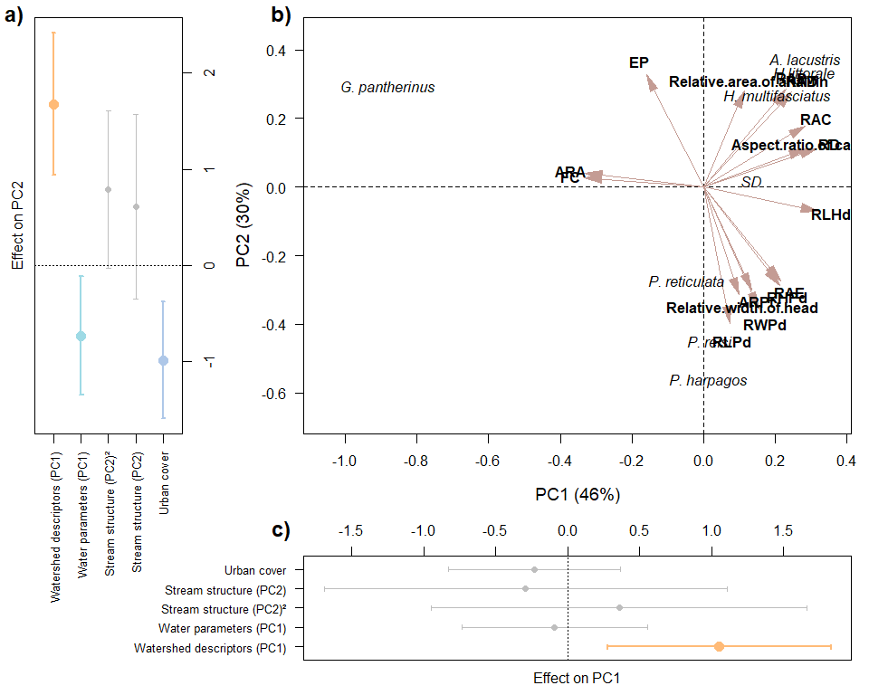

Traitglm
================
Rodolfo Pelinson
2025-05-21

``` r
dir<-("C:/Users/rodol/OneDrive/repos/Urban_fish_assemblages")
```

Loading important functions and packages

``` r
source(paste(sep = "/",dir,"functions/remove_sp.R"))
source(paste(sep = "/",dir,"functions/R2_manyglm.R"))
source(paste(sep = "/",dir,"functions/forward_sel_manyglm.R"))
source(paste(sep = "/",dir,"functions/varpart_manyglm.R"))
source(paste(sep = "/",dir,"functions/My_coefplot.R"))
source(paste(sep = "/",dir,"functions/letters.R"))
source(paste(sep = "/",dir,"functions/at_generator.R"))

library(mvabund)
library(vegan)
```

    ## Carregando pacotes exigidos: permute

    ## Carregando pacotes exigidos: lattice

    ## This is vegan 2.6-8

``` r
library(yarrr)
```

    ## Carregando pacotes exigidos: jpeg

    ## Carregando pacotes exigidos: BayesFactor

    ## Carregando pacotes exigidos: coda

    ## Carregando pacotes exigidos: Matrix

    ## ************
    ## Welcome to BayesFactor 0.9.12-4.7. If you have questions, please contact Richard Morey (richarddmorey@gmail.com).
    ## 
    ## Type BFManual() to open the manual.
    ## ************

    ## Carregando pacotes exigidos: circlize

    ## ========================================
    ## circlize version 0.4.16
    ## CRAN page: https://cran.r-project.org/package=circlize
    ## Github page: https://github.com/jokergoo/circlize
    ## Documentation: https://jokergoo.github.io/circlize_book/book/
    ## 
    ## If you use it in published research, please cite:
    ## Gu, Z. circlize implements and enhances circular visualization
    ##   in R. Bioinformatics 2014.
    ## 
    ## This message can be suppressed by:
    ##   suppressPackageStartupMessages(library(circlize))
    ## ========================================

    ## yarrr v0.1.5. Citation info at citation('yarrr'). Package guide at yarrr.guide()

    ## Email me at Nathaniel.D.Phillips.is@gmail.com

``` r
library(ade4)
library(adespatial)
```

    ## Registered S3 methods overwritten by 'adegraphics':
    ##   method         from
    ##   biplot.dudi    ade4
    ##   kplot.foucart  ade4
    ##   kplot.mcoa     ade4
    ##   kplot.mfa      ade4
    ##   kplot.pta      ade4
    ##   kplot.sepan    ade4
    ##   kplot.statis   ade4
    ##   scatter.coa    ade4
    ##   scatter.dudi   ade4
    ##   scatter.nipals ade4
    ##   scatter.pco    ade4
    ##   score.acm      ade4
    ##   score.mix      ade4
    ##   score.pca      ade4
    ##   screeplot.dudi ade4

    ## Registered S3 method overwritten by 'spdep':
    ##   method   from
    ##   plot.mst ape

    ## Registered S3 method overwritten by 'adespatial':
    ##   method          from       
    ##   plot.multispati adegraphics

``` r
library(corrplot)
```

    ## corrplot 0.95 loaded

``` r
assembleia_peixes <- read.csv(paste(sep = "/",dir,"data/com_por_bacia.csv"), row.names = 1)
agua_PCs <- read.csv(paste(sep = "/",dir,"data/pcas_amb/agua_PCs.csv"), row.names = 1)
estrutura_PCs <- read.csv(paste(sep = "/",dir,"data/pcas_amb/estrutura_PCs.csv"), row.names = 1)
bacia_PCs <- read.csv(paste(sep = "/",dir,"data/pcas_amb/bacia_PCs.csv"), row.names = 1)
delineamento <- read.csv(paste(sep = "/",dir,"data/delineamento.csv"))
dist_euclid <- read.csv(paste(sep = "/",dir,"data/dist/Matriz_distancia_matriz_euclidiana.csv"), row.names = 1)
```

Loading functional data

``` r
functional <- read.csv(paste(sep = "/",dir,"data/functional_data.csv"), row.names = 1)
functional[is.na(functional)] <- 0
```

Removing species with less than 2 presences and combining them into the
artificial “Singletons” species.

``` r
assembleia_peixes <- read.csv(paste(sep = "/",dir,"data/com_por_bacia.csv"), row.names = 1)
assembleia_peixes <- assembleia_peixes[,-c(4,11)]
assembleia_peixes_rm <- remove_sp(com = assembleia_peixes, n_sp = 2)

singletons_doubletons <- remove_sp(assembleia_peixes, 2, less_equal = TRUE)
singletons <- remove_sp(assembleia_peixes, 1, less_equal = TRUE)

sing_doub_ab <- rowSums(singletons_doubletons)
sing_ab <- rowSums(singletons)

sing_doub <- rowSums(decostand(singletons_doubletons, method = "pa")) 
sing <- rowSums(decostand(singletons, method = "pa")) 

assembleia_peixes_rm <- data.frame(assembleia_peixes_rm, Singletons_and_doubletons = sing_doub_ab)
```

Preparing predictors

``` r
urb <- data.frame(urb = delineamento$urbana)

urb <- decostand(urb, method = "stand")
agua_PCs <- decostand(agua_PCs, method = "stand")
estrutura_PCs <- decostand(estrutura_PCs, method = "stand")
bacia_PCs <- decostand(bacia_PCs, method = "stand")
```

Now, because we have an artificial species called “Singletons and
doubletons”, we will be a weighted average of traits to this species
considering the abundance of the species that compose this “taxon”.

``` r
total_ab_singletons <- colSums(singletons_doubletons)

functional_singletons <- functional[match(colnames(singletons_doubletons), rownames(functional)),]

functional_singleton <- colSums(functional_singletons * total_ab_singletons) / sum(total_ab_singletons)

functional <- rbind(functional, Singletons_and_doubletons = functional_singleton)

functional <- functional[match(colnames(assembleia_peixes_rm), rownames(functional)),]
```

Now we put these traits in a PCA to reduce dimensionality since many
traits are correlated

``` r
functional_stand <- decostand(functional, method = "stand")

pca_functional <- rda(functional_stand)

importance_funcional <- round(pca_functional$CA$eig/sum(pca_functional$CA$eig),2)
Eigenvalues_funcional <- data.frame(autovalores = pca_functional$CA$eig,
                                    importance = importance_funcional)

importance_funcional
```

    ##  PC1  PC2  PC3  PC4  PC5  PC6  PC7 
    ## 0.46 0.30 0.13 0.05 0.04 0.02 0.01

``` r
functional_PCs <- pca_functional$CA$u
functional_loadings <- pca_functional$CA$v
```

First two axis are the most important, lets see which are the traits
correlated with them.

``` r
functional_loadings_filtrados <- functional_loadings[which(functional_loadings[,1] > 0.25 | functional_loadings[,1] < -0.25 |
                                                           functional_loadings[,2] > 0.25 | functional_loadings[,2] < -0.25),1:2]
functional_loadings_filtrados
```

    ##                                           PC1         PC2
    ## Relative.depth                      0.2937138  0.10443114
    ## Fineness.ratio                     -0.3091932  0.02478346
    ## Relative.length.of.caudal.peduncle  0.0679499 -0.37305806
    ## Relative.height.of.caudal.peduncle  0.1966569 -0.26654942
    ## Relative.width.of.caudal.peduncle   0.1441188 -0.33188217
    ## Relative.area.of.dorsal.fin         0.2286982  0.25947440
    ## Relative.area.of.caudal.fin         0.2636021  0.16547672
    ## Aspect.ratio.of.pectoral.fin        0.1232431 -0.27752561
    ## Relative.length.of.head             0.2966838 -0.06529544
    ## Eye.position                       -0.1489192  0.30485284
    ## Relative.width.of.head              0.0904093 -0.29020011
    ## Relative.area.of.eye                0.1994234 -0.25451009
    ## Aspect.ratio.of.caudal.fin          0.2630180  0.10217583
    ## Relative.area.of.anal.fin           0.1048641  0.25824559
    ## Aspect.ratio.of.anal.fin           -0.3088256  0.03819022
    ## Relative.area.of.pelvic.fin         0.2142084  0.26594776

``` r
functional_loadings_filtrados_PC1 <- functional_loadings[which(functional_loadings[,1] > 0.25 | functional_loadings[,1] < -0.25),1]
functional_loadings_filtrados_PC1
```

    ##              Relative.depth              Fineness.ratio 
    ##                   0.2937138                  -0.3091932 
    ## Relative.area.of.caudal.fin     Relative.length.of.head 
    ##                   0.2636021                   0.2966838 
    ##  Aspect.ratio.of.caudal.fin    Aspect.ratio.of.anal.fin 
    ##                   0.2630180                  -0.3088256

``` r
functional_loadings_filtrados_PC2 <- functional_loadings[which(functional_loadings[,2] > 0.25 | functional_loadings[,2] < -0.25),2]
functional_loadings_filtrados_PC2
```

    ## Relative.length.of.caudal.peduncle Relative.height.of.caudal.peduncle 
    ##                         -0.3730581                         -0.2665494 
    ##  Relative.width.of.caudal.peduncle        Relative.area.of.dorsal.fin 
    ##                         -0.3318822                          0.2594744 
    ##       Aspect.ratio.of.pectoral.fin                       Eye.position 
    ##                         -0.2775256                          0.3048528 
    ##             Relative.width.of.head               Relative.area.of.eye 
    ##                         -0.2902001                         -0.2545101 
    ##          Relative.area.of.anal.fin        Relative.area.of.pelvic.fin 
    ##                          0.2582456                          0.2659478

Lets plot this PCA

``` r
pc1_label_functional <- paste("PC1 (",round(importance_funcional[1]*100,2),"%)",sep = "")
pc2_label_functional <- paste("PC2 (",round(importance_funcional[2]*100,2),"%)",sep = "")


sp_names <- rownames(functional_PCs)

sp_names[sp_names == "Gymnotus_pantherinus"] <- "G. pantherinus"
sp_names[sp_names == "Phalloceros_harpagos"] <- "P. harpagos"
sp_names[sp_names == "Phalloceros_reisi"] <- "P. reisi"
sp_names[sp_names == "Hollandichthys_multifasciatus"] <- "H. multifasciatus"
sp_names[sp_names == "Poecilia_reticulata"] <- "P. reticulata"
sp_names[sp_names == "Astyanax_lacustris"] <- "A. lacustris"
sp_names[sp_names == "Hoplosternum_littorale"] <- "H.littorale"
sp_names[sp_names == "Singletons_and_doubletons"] <- "SD"

names_func <- rownames(functional_loadings_filtrados) 

names_func[names_func == "Depression.index"] <- "DI"
names_func[names_func == "Relative.depth"] <- "RD"
names_func[names_func == "Fineness.ratio"] <- "FC"
names_func[names_func == "Relative.length.of.caudal.peduncle"] <- "RLPd"
names_func[names_func == "Relative.height.of.caudal.peduncle"] <- "RHPd"
names_func[names_func == "Relative.width.of.caudal.peduncle"] <- "RWPd"
names_func[names_func == "Relative.area.of.dorsal.fin"] <- "RAD"
names_func[names_func == "Relative.area.of.caudal.fin"] <- "RAC"
names_func[names_func == "Relative.area.of.pectoral.fin"] <- "RAPt"
names_func[names_func == "Relative.length.of.head"] <- "RLHd"
names_func[names_func == "Eye.position"] <- "EP"
names_func[names_func == "Relative.area.of.eye"] <- "RAE"
names_func[names_func == "Aspect.ratio.of.anal.fin"] <- "ARA"
names_func[names_func == "Relative.area.of.pelvic.fin"] <- "RAPv"
names_func[names_func == "Aspect.ratio.of.pectoral.fin"] <- "ARPt"
```

Assessing effects on community responses:

``` r
Model_trait_urb_null <- traitglm(L = assembleia_peixes_rm, R = urb, Q = NULL)
```

    ## No traits matrix entered, so will fit SDMs with different env response for each spp

``` r
Model_trait_urb_trait <- traitglm(L = assembleia_peixes_rm, R = urb, Q = data.frame(functional_PCs[,1:2]))
anova_trait_urb <- anova(Model_trait_urb_null, Model_trait_urb_trait, nBoot = 999)
```

    ## Resampling begins for test 1.
    ##  Resampling run 0 finished. Time elapsed: 0.00 minutes...
    ##  Resampling run 100 finished. Time elapsed: 0.06 minutes...
    ##  Resampling run 200 finished. Time elapsed: 0.10 minutes...
    ##  Resampling run 300 finished. Time elapsed: 0.15 minutes...
    ##  Resampling run 400 finished. Time elapsed: 0.19 minutes...
    ##  Resampling run 500 finished. Time elapsed: 0.24 minutes...
    ##  Resampling run 600 finished. Time elapsed: 0.28 minutes...
    ##  Resampling run 700 finished. Time elapsed: 0.33 minutes...
    ##  Resampling run 800 finished. Time elapsed: 0.38 minutes...
    ##  Resampling run 900 finished. Time elapsed: 0.44 minutes...
    ## Time elapsed: 0 hr 0 min 29 sec

``` r
est_pred <- data.frame(est_PC2 = estrutura_PCs[,2], est_PC2_squared = estrutura_PCs[,2]^2)
Model_trait_est_null <- traitglm(L = assembleia_peixes_rm, R = est_pred, Q = NULL)
```

    ## No traits matrix entered, so will fit SDMs with different env response for each spp

``` r
Model_trait_est_trait <- traitglm(L = assembleia_peixes_rm, R = est_pred, Q = data.frame(functional_PCs[,1:2]))
anova_trait_est <- anova(Model_trait_est_null, Model_trait_est_trait, nBoot = 999)
```

    ## Resampling begins for test 1.
    ##  Resampling run 0 finished. Time elapsed: 0.00 minutes...
    ##  Resampling run 100 finished. Time elapsed: 0.20 minutes...
    ##  Resampling run 200 finished. Time elapsed: 0.39 minutes...
    ##  Resampling run 300 finished. Time elapsed: 0.59 minutes...
    ##  Resampling run 400 finished. Time elapsed: 0.79 minutes...
    ##  Resampling run 500 finished. Time elapsed: 0.97 minutes...
    ##  Resampling run 600 finished. Time elapsed: 1.18 minutes...
    ##  Resampling run 700 finished. Time elapsed: 1.39 minutes...
    ##  Resampling run 800 finished. Time elapsed: 1.58 minutes...
    ##  Resampling run 900 finished. Time elapsed: 1.78 minutes...
    ## Time elapsed: 0 hr 1 min 59 sec

``` r
agua_pred <- data.frame(agua_PC1 = agua_PCs[,1])
Model_trait_agua_null <- traitglm(L = assembleia_peixes_rm, R = agua_pred, Q = NULL)
```

    ## No traits matrix entered, so will fit SDMs with different env response for each spp

``` r
Model_trait_agua_trait <- traitglm(L = assembleia_peixes_rm, R = agua_pred, Q = data.frame(functional_PCs[,1:2]))
anova_trait_agua <- anova(Model_trait_agua_null, Model_trait_agua_trait, nBoot = 999)
```

    ## Resampling begins for test 1.
    ##  Resampling run 0 finished. Time elapsed: 0.00 minutes...
    ##  Resampling run 100 finished. Time elapsed: 0.05 minutes...
    ##  Resampling run 200 finished. Time elapsed: 0.10 minutes...
    ##  Resampling run 300 finished. Time elapsed: 0.14 minutes...
    ##  Resampling run 400 finished. Time elapsed: 0.19 minutes...
    ##  Resampling run 500 finished. Time elapsed: 0.24 minutes...
    ##  Resampling run 600 finished. Time elapsed: 0.29 minutes...
    ##  Resampling run 700 finished. Time elapsed: 0.33 minutes...
    ##  Resampling run 800 finished. Time elapsed: 0.38 minutes...
    ##  Resampling run 900 finished. Time elapsed: 0.43 minutes...
    ## Time elapsed: 0 hr 0 min 28 sec

``` r
bacia_pred <- data.frame(bacia_PC1 = bacia_PCs[,1])
Model_trait_bacia_null <- traitglm(L = assembleia_peixes_rm, R = bacia_pred, Q = NULL)
```

    ## No traits matrix entered, so will fit SDMs with different env response for each spp

``` r
Model_trait_bacia_trait <- traitglm(L = assembleia_peixes_rm, R = bacia_pred, Q = data.frame(functional_PCs[,1:2]))
anova_trait_bacia <- anova(Model_trait_bacia_null, Model_trait_bacia_trait, nBoot = 999)
```

    ## Resampling begins for test 1.
    ##  Resampling run 0 finished. Time elapsed: 0.00 minutes...
    ##  Resampling run 100 finished. Time elapsed: 0.12 minutes...
    ##  Resampling run 200 finished. Time elapsed: 0.23 minutes...
    ##  Resampling run 300 finished. Time elapsed: 0.35 minutes...
    ##  Resampling run 400 finished. Time elapsed: 0.46 minutes...
    ##  Resampling run 500 finished. Time elapsed: 0.57 minutes...
    ##  Resampling run 600 finished. Time elapsed: 0.68 minutes...
    ##  Resampling run 700 finished. Time elapsed: 0.80 minutes...
    ##  Resampling run 800 finished. Time elapsed: 0.90 minutes...
    ##  Resampling run 900 finished. Time elapsed: 1.02 minutes...
    ## Time elapsed: 0 hr 1 min 8 sec

``` r
trait_urb_coef <- c(Model_trait_urb_trait$fourth.corner)
trait_urb_coef_CI <- Model_trait_urb_trait$stderr.coefficients[11:12,]*qnorm(0.975)
names(trait_urb_coef) <- names(trait_urb_coef_CI)

trait_est_coef <- c(Model_trait_est_trait$fourth.corner)
trait_est_coef_CI <- Model_trait_est_trait$stderr.coefficients[13:16,]*qnorm(0.975)
names(trait_est_coef) <- names(trait_est_coef_CI)

trait_agua_coef <- c(Model_trait_agua_trait$fourth.corner)
trait_agua_coef_CI <- Model_trait_agua_trait$stderr.coefficients[11:12,]*qnorm(0.975)
names(trait_agua_coef) <- names(trait_agua_coef_CI)

trait_bacia_coef <- c(Model_trait_bacia_trait$fourth.corner)
trait_bacia_coef_CI <- Model_trait_bacia_trait$stderr.coefficients[11:12,]*qnorm(0.975)
names(trait_bacia_coef) <- names(trait_bacia_coef_CI)
```

Lets plot those things:

``` r
coefs_PC1 <- c(trait_urb_coef[1], trait_est_coef[c(1,3)], trait_agua_coef[1], trait_bacia_coef[1])
CI_PC1 <- c(trait_urb_coef_CI[1], trait_est_coef_CI[c(1,3)], trait_agua_coef_CI[1], trait_bacia_coef_CI[1])

coefs_PC2 <- c(trait_urb_coef[2], trait_est_coef[c(2,4)], trait_agua_coef[2], trait_bacia_coef[2])
CI_PC2 <- c(trait_urb_coef_CI[2], trait_est_coef_CI[c(2,4)], trait_agua_coef_CI[2], trait_bacia_coef_CI[2])

upper_PC1 <- coefs_PC1 + CI_PC1
lower_PC1 <- coefs_PC1 - CI_PC1

upper_PC2 <- coefs_PC2 + CI_PC2
lower_PC2<- coefs_PC2 - CI_PC2

labels <- c("Urban cover", "Stream structure (PC2)", "Stream structure (PC2)²", "Water parameters (PC1)", "Watershed descriptors (PC1)")
```

Lets plot everything together

``` r
#pdf("plots/functional_effects.pdf", width = 8, height = 7, pointsize = 12)

close.screen(all.screens = TRUE)
```

    ## [1] FALSE

``` r
split.screen(matrix(c(0,0.25,0.25,1,
                      0.25,1,0.25,1,
                      0,0.25,0,0.25, 
                      0.25,1,0,0.25), ncol = 4, nrow = 4, byrow = TRUE))
```

    ## [1] 1 2 3 4

``` r
screen(2)
par(mar = c(5,5,1,1), bty = "o")
xmin <- min(c(functional_PCs[,1], functional_loadings_filtrados[,1]))*1.2
xmax <- max(c(functional_PCs[,1], functional_loadings_filtrados[,1]))*1.2
ymin <- min(c(functional_PCs[,2], functional_loadings_filtrados[,2]))*1.2
ymax <- max(c(functional_PCs[,2], functional_loadings_filtrados[,2]))*1.2

plot(functional_PCs[,1], functional_PCs[,2], xlim = c(xmin,xmax), ylim = c(ymin, ymax),
     type = "n", xaxt = "n", yaxt = "n", ylab = "", xlab = "")

abline(h = 0, v = 0, lty = 2)

library(scales)
library(shape)
```

    ## 
    ## Anexando pacote: 'shape'

    ## O seguinte objeto é mascarado por 'package:corrplot':
    ## 
    ##     colorlegend

``` r
#pal <- col_numeric(palette = c("white", "black"), domain = urb, na.color = "grey50", alpha = FALSE, reverse = FALSE)
#col <-pal(urb)

Arrows(x0 <- rep(0, nrow(functional_loadings_filtrados)),
       y0 <- rep(0, nrow(functional_loadings_filtrados)),
       x1 <- functional_loadings_filtrados[,1],
       y1 <- functional_loadings_filtrados[,2], arr.type = "triangle", arr.length = 0.4, col = "#C49C94", lwd = 1.5)

#points(functional_PCs[,1],functional_PCs[,2], col = "black", bg = "white", pch = 21, cex = 1.5)
text(functional_PCs[,1],functional_PCs[,2], labels = sp_names, col =  "black", font = 3)


text(x = functional_loadings_filtrados[,1]*1.2, y = functional_loadings_filtrados[,2]*1.2, labels = names_func, cex = 1, col = "black", font = 2)

axis(1, cex.axis = 1)
axis(2, cex.axis = 1, las = 2)
title(xlab = pc1_label_functional, cex.lab = 1.2, line = 3)
title(ylab = pc2_label_functional, cex.lab = 1.2, line = 3)
#title(main = "Morphological traits", line = 0.5, adj = 0, cex.main = 1.5)
letters(x = 10, y = 97, "b)", cex = 1.5)


col_sig <- c("#AEC7E8", "#98DF8A","#98DF8A", "#9EDAE5", "#FFBB78")


screen(4)
par(mar = c(2,5,2,1))
My_coefplot(mles = coefs_PC1, upper = upper_PC1,
            lower = lower_PC1, col_sig = col_sig,
            cex_sig = 1.5, species_labels = labels, yaxis_font = 1, invert = FALSE, axis_sp_labels = 2, cex.axis = 0.8, axis_effect_labels = 3, y_spa = 0.5)
mtext("Effect on PC1", side = 1, line = 0.5)
letters(x = 10, y = 95, "c)", cex = 1.5)


screen(1)
par(mar = c(5,2,1,2))
My_coefplot(mles = coefs_PC2, upper = upper_PC2,
            lower = lower_PC2, col_sig = col_sig,
           cex_sig = 1.5, species_labels = labels, yaxis_font = 1, invert = TRUE, axis_sp_labels = 1, cex.axis = 0.8, axis_effect_labels = 4, y_spa = 0.5)
mtext("Effect on PC2", side = 2, line = 0.5)
letters(x = 7, y = 97, "a)", cex = 1.5)

# dev.off()
```

<!-- -->
