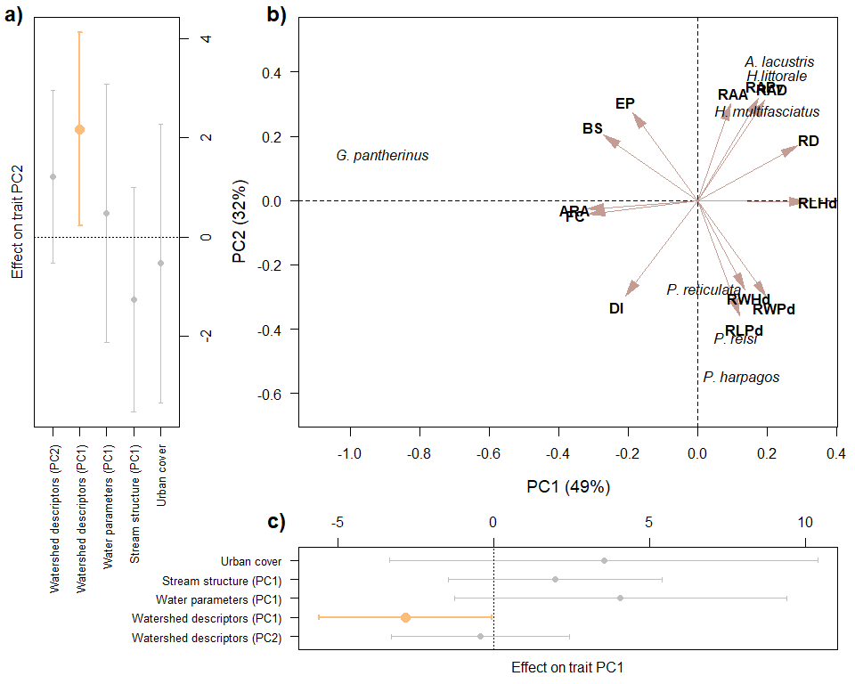

Traitglm_ONE
================
Rodolfo Pelinson
2026-01-06

``` r
dir<-("C:/Users/rodol/OneDrive/repos/Urban_fish_assemblages")
```

Loading important functions and packages

``` r
source(paste(sep = "/",dir,"functions/remove_sp.R"))
source(paste(sep = "/",dir,"functions/R2_manyglm.R"))
source(paste(sep = "/",dir,"functions/forward_sel_manyglm.R"))
source(paste(sep = "/",dir,"functions/varpart_manyglm.R"))
source(paste(sep = "/",dir,"functions/My_coefplot.R"))
source(paste(sep = "/",dir,"functions/letters.R"))
source(paste(sep = "/",dir,"functions/at_generator.R"))

library(mvabund)
library(vegan)
library(yarrr)
library(ade4)
library(adespatial)
library(corrplot)
```

Loading community and environmental data

``` r
assembleia_peixes <- read.csv(paste(sep = "/",dir,"data/com_por_bacia.csv"), row.names = 1)
agua_PCs <- read.csv(paste(sep = "/",dir,"data/pcas_amb/agua_PCs.csv"), row.names = 1)
estrutura_PCs <- read.csv(paste(sep = "/",dir,"data/pcas_amb/estrutura_PCs.csv"), row.names = 1)
bacia_PCs <- read.csv(paste(sep = "/",dir,"data/pcas_amb/bacia_PCs.csv"), row.names = 1)
delineamento <- read.csv(paste(sep = "/",dir,"data/delineamento.csv"))
dist_euclid <- read.csv(paste(sep = "/",dir,"data/dist/Matriz_distancia_matriz_euclidiana.csv"), row.names = 1)
```

Loading functional data

``` r
functional <- read.csv(paste(sep = "/",dir,"data/functional_data.csv"), row.names = 1)
functional[is.na(functional)] <- 0

functional_raw <- read.csv(paste(sep = "/",dir,"data/functional_data_raw.csv"))
functional[is.na(functional)] <- 0
```

Removing species with less than 2 presences. Here we will not use
singletons and doubletons

``` r
assembleia_peixes <- assembleia_peixes[,-c(4,11)]
ncol(assembleia_peixes)
```

    ## [1] 23

``` r
assembleia_peixes_rm <- remove_sp(com = assembleia_peixes, n_sp = 2)
ncol(assembleia_peixes_rm)
```

    ## [1] 7

Preparing predictors

``` r
urb <- data.frame(urb = delineamento$urbana)

urb <- decostand(urb, method = "stand")
agua_PCs <- decostand(agua_PCs, method = "stand")
estrutura_PCs <- decostand(estrutura_PCs, method = "stand")
bacia_PCs <- decostand(bacia_PCs, method = "stand")
```

Checking if the rows of all data frames match

``` r
data.frame(
rownames(assembleia_peixes_rm),
rownames(agua_PCs),
rownames(bacia_PCs),
rownames(estrutura_PCs),
rownames(as.matrix(dist_euclid)),
delineamento$bacia_id
)
```

    ##    rownames.assembleia_peixes_rm. rownames.agua_PCs. rownames.bacia_PCs.
    ## 1                           ebbsn               b031                b031
    ## 2                           ebbrc               b034                b034
    ## 3                            b581               b039                b039
    ## 4                            b631               b040                b040
    ## 5                            b539               b066                b066
    ## 6                            b570               b202                b202
    ## 7                            b034               b204                b204
    ## 8                            b620               b309                b309
    ## 9                            b589               b310                b310
    ## 10                           b627               b320                b320
    ## 11                           b545               b321                b321
    ## 12                           b711               b344                b344
    ## 13                           b543               b539                b539
    ## 14                           b320               b543                b543
    ## 15                           b031               b545                b545
    ## 16                           b637               b570                b570
    ## 17                           b321               b574                b574
    ## 18                           b039               b578                b578
    ## 19                           b040               b579                b579
    ## 20                           b066               b581                b581
    ## 21                           b202               b589                b589
    ## 22                           b204               b594                b594
    ## 23                           b309               b620                b620
    ## 24                           b310               b627                b627
    ## 25                           b344               b631                b631
    ## 26                           b574               b637                b637
    ## 27                           b578               b673                b673
    ## 28                           b579               b711                b711
    ## 29                           b594              ebbrc               ebbrc
    ## 30                           b673              ebbsn               ebbsn
    ##    rownames.estrutura_PCs. rownames.as.matrix.dist_euclid..
    ## 1                     b031                             b031
    ## 2                     b034                             b034
    ## 3                     b039                             b039
    ## 4                     b040                             b040
    ## 5                     b066                             b066
    ## 6                     b202                             b202
    ## 7                     b204                             b204
    ## 8                     b309                             b309
    ## 9                     b310                             b310
    ## 10                    b320                             b320
    ## 11                    b321                             b321
    ## 12                    b344                             b344
    ## 13                    b539                             b539
    ## 14                    b543                             b543
    ## 15                    b545                             b545
    ## 16                    b570                             b570
    ## 17                    b574                             b574
    ## 18                    b578                             b578
    ## 19                    b579                             b579
    ## 20                    b581                             b581
    ## 21                    b589                             b589
    ## 22                    b594                             b594
    ## 23                    b620                             b620
    ## 24                    b627                             b627
    ## 25                    b631                             b631
    ## 26                    b637                             b637
    ## 27                    b673                             b673
    ## 28                    b711                             b711
    ## 29                   ebbrc                            ebbrc
    ## 30                   ebbsn                            ebbsn
    ##    delineamento.bacia_id
    ## 1                   b031
    ## 2                   b034
    ## 3                   b039
    ## 4                   b040
    ## 5                   b066
    ## 6                   b202
    ## 7                   b204
    ## 8                   b309
    ## 9                   b310
    ## 10                  b320
    ## 11                  b321
    ## 12                  b344
    ## 13                  b539
    ## 14                  b543
    ## 15                  b545
    ## 16                  b570
    ## 17                  b574
    ## 18                  b578
    ## 19                  b579
    ## 20                  b581
    ## 21                  b589
    ## 22                  b594
    ## 23                  b620
    ## 24                  b627
    ## 25                  b631
    ## 26                  b637
    ## 27                  b673
    ## 28                  b711
    ## 29                 ebbrc
    ## 30                 ebbsn

``` r
assembleia_peixes_rm <- assembleia_peixes_rm[match(delineamento$bacia_id, rownames(assembleia_peixes_rm) ),]

data.frame(
rownames(assembleia_peixes_rm),
rownames(agua_PCs),
rownames(bacia_PCs),
rownames(estrutura_PCs),
rownames(as.matrix(dist_euclid)),
delineamento$bacia_id
)
```

    ##    rownames.assembleia_peixes_rm. rownames.agua_PCs. rownames.bacia_PCs.
    ## 1                            b031               b031                b031
    ## 2                            b034               b034                b034
    ## 3                            b039               b039                b039
    ## 4                            b040               b040                b040
    ## 5                            b066               b066                b066
    ## 6                            b202               b202                b202
    ## 7                            b204               b204                b204
    ## 8                            b309               b309                b309
    ## 9                            b310               b310                b310
    ## 10                           b320               b320                b320
    ## 11                           b321               b321                b321
    ## 12                           b344               b344                b344
    ## 13                           b539               b539                b539
    ## 14                           b543               b543                b543
    ## 15                           b545               b545                b545
    ## 16                           b570               b570                b570
    ## 17                           b574               b574                b574
    ## 18                           b578               b578                b578
    ## 19                           b579               b579                b579
    ## 20                           b581               b581                b581
    ## 21                           b589               b589                b589
    ## 22                           b594               b594                b594
    ## 23                           b620               b620                b620
    ## 24                           b627               b627                b627
    ## 25                           b631               b631                b631
    ## 26                           b637               b637                b637
    ## 27                           b673               b673                b673
    ## 28                           b711               b711                b711
    ## 29                          ebbrc              ebbrc               ebbrc
    ## 30                          ebbsn              ebbsn               ebbsn
    ##    rownames.estrutura_PCs. rownames.as.matrix.dist_euclid..
    ## 1                     b031                             b031
    ## 2                     b034                             b034
    ## 3                     b039                             b039
    ## 4                     b040                             b040
    ## 5                     b066                             b066
    ## 6                     b202                             b202
    ## 7                     b204                             b204
    ## 8                     b309                             b309
    ## 9                     b310                             b310
    ## 10                    b320                             b320
    ## 11                    b321                             b321
    ## 12                    b344                             b344
    ## 13                    b539                             b539
    ## 14                    b543                             b543
    ## 15                    b545                             b545
    ## 16                    b570                             b570
    ## 17                    b574                             b574
    ## 18                    b578                             b578
    ## 19                    b579                             b579
    ## 20                    b581                             b581
    ## 21                    b589                             b589
    ## 22                    b594                             b594
    ## 23                    b620                             b620
    ## 24                    b627                             b627
    ## 25                    b631                             b631
    ## 26                    b637                             b637
    ## 27                    b673                             b673
    ## 28                    b711                             b711
    ## 29                   ebbrc                            ebbrc
    ## 30                   ebbsn                            ebbsn
    ##    delineamento.bacia_id
    ## 1                   b031
    ## 2                   b034
    ## 3                   b039
    ## 4                   b040
    ## 5                   b066
    ## 6                   b202
    ## 7                   b204
    ## 8                   b309
    ## 9                   b310
    ## 10                  b320
    ## 11                  b321
    ## 12                  b344
    ## 13                  b539
    ## 14                  b543
    ## 15                  b545
    ## 16                  b570
    ## 17                  b574
    ## 18                  b578
    ## 19                  b579
    ## 20                  b581
    ## 21                  b589
    ## 22                  b594
    ## 23                  b620
    ## 24                  b627
    ## 25                  b631
    ## 26                  b637
    ## 27                  b673
    ## 28                  b711
    ## 29                 ebbrc
    ## 30                 ebbsn

Adding body size

``` r
body_size <- tapply(functional_raw$Comprimento_padrao_SL, INDEX = functional_raw$Especie, mean)

body_size <-  body_size[match(rownames(functional), names(body_size))]

data.frame(names(body_size), rownames(functional))
```

    ##                 names.body_size.          rownames.functional.
    ## 1            Poecilia_reticulata           Poecilia_reticulata
    ## 2              Phalloceros_reisi             Phalloceros_reisi
    ## 3        Hypostomus_ancistroides       Hypostomus_ancistroides
    ## 4                           <NA>       Callichthys_callichthys
    ## 5             Psalidodon_paranae            Psalidodon_paranae
    ## 6           Psalidodon_fasciatus          Psalidodon_fasciatus
    ## 7     Hyphessobrycon_reticulatus    Hyphessobrycon_reticulatus
    ## 8            Hoplias_malabaricus           Hoplias_malabaricus
    ## 9               Tilapia_rendalli              Tilapia_rendalli
    ## 10                          <NA>           Taunayia_bifasciata
    ## 11                          <NA>         Characidium_oiticicai
    ## 12          Gymnotus_pantherinus          Gymnotus_pantherinus
    ## 13 Hollandichthys_multifasciatus Hollandichthys_multifasciatus
    ## 14              Corydoras_aeneus              Corydoras_aeneus
    ## 15        Hoplosternum_littorale        Hoplosternum_littorale
    ## 16                          <NA>               Phalloceros_sp.
    ## 17                          <NA>         Cichlasoma_paranaense
    ## 18              Gymnotus_sylvius              Gymnotus_sylvius
    ## 19                  Poecilia_sp.                  Poecilia_sp.
    ## 20               Pareiorhina_sp.               Pareiorhina_sp.
    ## 21          Phalloceros_harpagos          Phalloceros_harpagos
    ## 22       Trichomycterus_iheringi       Trichomycterus_iheringi
    ## 23                          <NA>                Rhamdia_quelen
    ## 24            Astyanax_lacustris            Astyanax_lacustris
    ## 25             Poecilia_vivipara             Poecilia_vivipara

``` r
functional$body_size <- body_size
```

Adding the traits from Albert el al. 2025

``` r
func_albert <- read.csv(paste(sep = "/",dir,"data/dataverse_files/Albert et al NFF ecomatrix.csv"))

func_albert$Species <- gsub(" ", "_",func_albert$Species)

matches <- which(func_albert$Species %in% colnames(assembleia_peixes))

mismatches <- which(colnames(assembleia_peixes) %in% func_albert$Species == FALSE)

other_matches <- which(func_albert$Species == "Cambeva_iheringi" | func_albert$Species == "Pareiorhina_brachyrhyncha")

new_func<- func_albert[c(matches, other_matches),]

rownames(new_func) <- new_func$Species

new_func <- new_func[,-1]


rownames(new_func)[which(rownames(new_func) == "Pareiorhina_brachyrhyncha")] <- "Pareiorhina_sp."
rownames(new_func)[which(rownames(new_func) == "Cambeva_iheringi")] <- "Trichomycterus_iheringi"

new_func <- rbind(new_func, Tilapia_rendalli = rep(NA, ncol(new_func)))


functional <- functional[match(colnames(assembleia_peixes), rownames(functional)),]

new_func <- new_func[match(rownames(functional), rownames(new_func)),]

traits_select <- c(12:13, 19:26 ,27:35, 38, 37, 6:7)

new_func <- new_func[traits_select]
colnames(new_func) <- paste(colnames(new_func), traits_select, sep = "_")
```

Creating the “exotic” trait

``` r
new_func$exotic <- rep(0, nrow(new_func))
new_func$exotic[rownames(new_func) == "Tilapia_rendalli" | rownames(new_func) == "Poecilia_reticulata" | rownames(new_func) == "Poecilia_vivipara"] <- 1

non_morph_func <- new_func
```

Adding diet

``` r
niche_amplitude <- read.csv(paste(sep = "/",dir,"data/niche_amplitude.csv"))

niche_amplitude$Assemblage[niche_amplitude$Assemblage == "al"] <- "Astyanax_lacustris"
niche_amplitude$Assemblage[niche_amplitude$Assemblage == "co"] <- "Characidium_oiticicai"
niche_amplitude$Assemblage[niche_amplitude$Assemblage == "gp"] <- "Gymnotus_pantherinus"
niche_amplitude$Assemblage[niche_amplitude$Assemblage == "hm"] <- "Hollandichthys_multifasciatus"
niche_amplitude$Assemblage[niche_amplitude$Assemblage == "pr"] <- "Poecilia_reticulata"
niche_amplitude$Assemblage[niche_amplitude$Assemblage == "pv"] <- "Poecilia_vivipara"
niche_amplitude$Assemblage[niche_amplitude$Assemblage == "phr"] <- "Phalloceros_reisi"
niche_amplitude$Assemblage[niche_amplitude$Assemblage == "ph"] <- "Phalloceros_harpagos"
niche_amplitude$Assemblage[niche_amplitude$Assemblage == "hmb"] <- "Hoplias_malabaricus"

rownames(niche_amplitude) <- niche_amplitude$Assemblage
niche_amplitude <- niche_amplitude[,-c(1:2)]

non_morph_func$niche_amplitude <- rep(NA, nrow(non_morph_func))


for(i in 1:nrow(non_morph_func)){
  for(j in 1:nrow(niche_amplitude)){
      if(rownames(non_morph_func)[i] == rownames(niche_amplitude)[j]){
        non_morph_func$niche_amplitude[i] <- niche_amplitude$q2[j]
      }
  }
}

functional <- functional[match(colnames(assembleia_peixes_rm), rownames(functional)),]
```

### Trait PCAs

#### Morphological traits

Now we put these traits in a PCA to reduce dimensionality since many
traits are correlated

``` r
functional <- functional[,colSums(functional, na.rm = TRUE) > 0]
functional <- functional[,colSums(functional, na.rm = TRUE)/nrow(functional) != 1]

functional_stand <- decostand(functional, method = "stand")

pca_functional <- rda(functional_stand)

importance_funcional <- round(pca_functional$CA$eig/sum(pca_functional$CA$eig),2)
Eigenvalues_funcional <- data.frame(autovalores = pca_functional$CA$eig,
                                    importance = importance_funcional)

importance_funcional
```

    ##  PC1  PC2  PC3  PC4  PC5  PC6 
    ## 0.49 0.32 0.12 0.04 0.03 0.01

``` r
functional_PCs <- pca_functional$CA$u
functional_loadings <- pca_functional$CA$v
```

First two axis are the most important, lets see which are the traits
correlated with them.

``` r
functional_loadings_filtrados <- functional_loadings[which(functional_loadings[,1] > 0.25 | functional_loadings[,1] < -0.25 |
                                                           functional_loadings[,2] > 0.25 | functional_loadings[,2] < -0.25),1:2]
functional_loadings_filtrados
```

    ##                                            PC1          PC2
    ## Depression.index                   -0.19505900 -0.277132921
    ## Relative.depth                      0.26611709  0.157911050
    ## Fineness.ratio                     -0.29351309 -0.038315462
    ## Relative.length.of.caudal.peduncle  0.11151631 -0.333439896
    ## Relative.width.of.caudal.peduncle   0.18365505 -0.278128615
    ## Relative.area.of.dorsal.fin         0.17904665  0.289859885
    ## Relative.length.of.head             0.28749674 -0.004539565
    ## Eye.position                       -0.17374445  0.253600112
    ## Relative.width.of.head              0.12295083 -0.253574918
    ## Relative.area.of.anal.fin           0.08573597  0.277235138
    ## Aspect.ratio.of.anal.fin           -0.29590095 -0.024452691
    ## Relative.area.of.pelvic.fin         0.16241243  0.296336776
    ## body_size                          -0.25183025  0.188769506

``` r
functional_loadings_filtrados_PC1 <- functional_loadings[which(functional_loadings[,1] > 0.25 | functional_loadings[,1] < -0.25),1]
functional_loadings_filtrados_PC1
```

    ##           Relative.depth           Fineness.ratio  Relative.length.of.head 
    ##                0.2661171               -0.2935131                0.2874967 
    ## Aspect.ratio.of.anal.fin                body_size 
    ##               -0.2959010               -0.2518302

``` r
functional_loadings_filtrados_PC2 <- functional_loadings[which(functional_loadings[,2] > 0.25 | functional_loadings[,2] < -0.25),2]
functional_loadings_filtrados_PC2
```

    ##                   Depression.index Relative.length.of.caudal.peduncle 
    ##                         -0.2771329                         -0.3334399 
    ##  Relative.width.of.caudal.peduncle        Relative.area.of.dorsal.fin 
    ##                         -0.2781286                          0.2898599 
    ##                       Eye.position             Relative.width.of.head 
    ##                          0.2536001                         -0.2535749 
    ##          Relative.area.of.anal.fin        Relative.area.of.pelvic.fin 
    ##                          0.2772351                          0.2963368

Lets plot this PCA

``` r
pc1_label_functional <- paste("PC1 (",round(importance_funcional[1]*100,2),"%)",sep = "")
pc2_label_functional <- paste("PC2 (",round(importance_funcional[2]*100,2),"%)",sep = "")


sp_names <- rownames(functional_PCs)

sp_names[sp_names == "Gymnotus_pantherinus"] <- "G. pantherinus"
sp_names[sp_names == "Phalloceros_harpagos"] <- "P. harpagos"
sp_names[sp_names == "Phalloceros_reisi"] <- "P. reisi"
sp_names[sp_names == "Hollandichthys_multifasciatus"] <- "H. multifasciatus"
sp_names[sp_names == "Poecilia_reticulata"] <- "P. reticulata"
sp_names[sp_names == "Astyanax_lacustris"] <- "A. lacustris"
sp_names[sp_names == "Hoplosternum_littorale"] <- "H.littorale"
sp_names[sp_names == "Singletons_and_doubletons"] <- "SD"

names_func <- rownames(functional_loadings_filtrados) 

names_func[names_func == "Depression.index"] <- "DI"
names_func[names_func == "Relative.depth"] <- "RD"
names_func[names_func == "Fineness.ratio"] <- "FC"
names_func[names_func == "Relative.length.of.caudal.peduncle"] <- "RLPd"
#names_func[names_func == "Relative.height.of.caudal.peduncle"] <- "RHPd"
names_func[names_func == "Relative.width.of.caudal.peduncle"] <- "RWPd"
names_func[names_func == "Relative.area.of.dorsal.fin"] <- "RAD"
#names_func[names_func == "Relative.area.of.caudal.fin"] <- "RAC"
#names_func[names_func == "Relative.area.of.pectoral.fin"] <- "RAPt"
names_func[names_func == "Relative.length.of.head"] <- "RLHd"
names_func[names_func == "Eye.position"] <- "EP"
names_func[names_func == "Relative.width.of.head"] <- "RWHd"
#names_func[names_func == "Relative.area.of.eye"] <- "RAE"
names_func[names_func == "Relative.area.of.anal.fin"] <- "RAA"
names_func[names_func == "Relative.area.of.pelvic.fin"] <- "RAPv"
#names_func[names_func == "Aspect.ratio.of.pectoral.fin"] <- "ARPt"
names_func[names_func == "Aspect.ratio.of.anal.fin"] <- "ARA"
names_func[names_func == "body_size"] <- "BS"
```

Assessing effects on community responses:

``` r
urb_pred <- data.frame(urb = urb, urb_squared = urb^2)
colnames(urb_pred) <- c("urb", "urb_squared")

Model_trait_urb_trait <- traitglm(L = assembleia_peixes_rm, R = urb_pred, Q = data.frame(functional_PCs[,1:2]), formula = ~ urb + urb_squared + PC1 + PC2 + I(PC1^2) + I(PC2^2) + urb:PC1 + urb:PC2)

Model_trait_urb_trait_null <- traitglm(L = assembleia_peixes_rm, R = urb_pred, Q = data.frame(functional_PCs[,1:2]), formula = ~ urb + urb_squared + PC1 + PC2 + I(PC1^2) + I(PC2^2))

anova_urb_trait_morph <- anova(Model_trait_urb_trait_null, Model_trait_urb_trait, nBoot=999, resamp="pit.trap")
```

    ## Resampling begins for test 1.
    ##  Resampling run 0 finished. Time elapsed: 0.00 minutes...
    ##  Resampling run 100 finished. Time elapsed: 0.05 minutes...
    ##  Resampling run 200 finished. Time elapsed: 0.11 minutes...
    ##  Resampling run 300 finished. Time elapsed: 0.19 minutes...
    ##  Resampling run 400 finished. Time elapsed: 0.27 minutes...
    ##  Resampling run 500 finished. Time elapsed: 0.34 minutes...
    ##  Resampling run 600 finished. Time elapsed: 0.39 minutes...
    ##  Resampling run 700 finished. Time elapsed: 0.45 minutes...
    ##  Resampling run 800 finished. Time elapsed: 0.50 minutes...
    ##  Resampling run 900 finished. Time elapsed: 0.56 minutes...
    ## Time elapsed: 0 hr 0 min 37 sec

``` r
anova_urb_trait_morph
```

    ## Analysis of Deviance Table
    ## 
    ## Model 1: ~urb + urb_squared + PC1 + PC2 + I(PC1^2) + I(PC2^2)
    ## Model 2: ~urb + urb_squared + PC1 + PC2 + I(PC1^2) + I(PC2^2) + urb:PC1 + urb:PC2
    ## 
    ## Multivariate test:
    ##         Res.Df Df.diff   Dev Pr(>Dev)
    ## Model 1    201                       
    ## Model 2    199       2 1.201    0.528
    ## Arguments: P-value calculated using 999 iterations via PIT-trap block resampling.

``` r
est_pred <- data.frame(est_PC1 = estrutura_PCs[,1], est_PC1_squared = estrutura_PCs[,1]^2)
Model_trait_est_trait <- traitglm(L = assembleia_peixes_rm, R = est_pred, Q = data.frame(functional_PCs[,1:2]), formula = ~ est_PC1  + est_PC1_squared + PC1 + PC2 + I(PC1^2) + I(PC2^2) + est_PC1:PC1 + est_PC1:PC2)

Model_trait_est_trait_null <- traitglm(L = assembleia_peixes_rm, R = est_pred, Q = data.frame(functional_PCs[,1:2]), formula = ~ est_PC1  + est_PC1_squared + PC1 + PC2 + I(PC1^2) + I(PC2^2) + est_PC1:PC1 + est_PC1:PC2)

anova_est_trait_morph <- anova(Model_trait_est_trait_null, Model_trait_est_trait, nBoot=999, resamp="pit.trap")
```

    ## Resampling begins for test 1.
    ##  Resampling run 0 finished. Time elapsed: 0.00 minutes...
    ##  Resampling run 100 finished. Time elapsed: 0.09 minutes...
    ##  Resampling run 200 finished. Time elapsed: 0.18 minutes...
    ##  Resampling run 300 finished. Time elapsed: 0.27 minutes...
    ##  Resampling run 400 finished. Time elapsed: 0.34 minutes...
    ##  Resampling run 500 finished. Time elapsed: 0.42 minutes...
    ##  Resampling run 600 finished. Time elapsed: 0.51 minutes...
    ##  Resampling run 700 finished. Time elapsed: 0.59 minutes...
    ##  Resampling run 800 finished. Time elapsed: 0.67 minutes...
    ##  Resampling run 900 finished. Time elapsed: 0.75 minutes...
    ## Time elapsed: 0 hr 0 min 49 sec

``` r
anova_est_trait_morph
```

    ## Analysis of Deviance Table
    ## 
    ## Model 1: ~est_PC1 + est_PC1_squared + PC1 + PC2 + I(PC1^2) + I(PC2^2) + est_PC1:PC1 + est_PC1:PC2
    ## Model 2: ~est_PC1 + est_PC1_squared + PC1 + PC2 + I(PC1^2) + I(PC2^2) + est_PC1:PC1 + est_PC1:PC2
    ## 
    ## Multivariate test:
    ##         Res.Df Df.diff Dev Pr(>Dev)
    ## Model 1    199                     
    ## Model 2    199       0   0    0.854
    ## Arguments: P-value calculated using 999 iterations via PIT-trap block resampling.

``` r
agua_pred <- data.frame(agua_PC1 = agua_PCs[,1], agua_PC1_squared = agua_PCs[,1]^2)
Model_trait_agua_trait <- traitglm(L = assembleia_peixes_rm, R = agua_pred, Q = data.frame(functional_PCs[,1:2]), formula = ~ agua_PC1  + agua_PC1_squared + PC1 + PC2 + I(PC1^2) + I(PC2^2) + agua_PC1:PC1 + agua_PC1:PC2)

Model_trait_agua_trait_null <- traitglm(L = assembleia_peixes_rm, R = agua_pred, Q = data.frame(functional_PCs[,1:2]), formula = ~ agua_PC1  + agua_PC1_squared + PC1 + PC2 + I(PC1^2) + I(PC2^2))

anova_agua_trait_morph <- anova(Model_trait_agua_trait_null, Model_trait_agua_trait, nBoot=999, resamp="pit.trap")
```

    ## Resampling begins for test 1.
    ##  Resampling run 0 finished. Time elapsed: 0.00 minutes...
    ##  Resampling run 100 finished. Time elapsed: 0.05 minutes...
    ##  Resampling run 200 finished. Time elapsed: 0.10 minutes...
    ##  Resampling run 300 finished. Time elapsed: 0.14 minutes...
    ##  Resampling run 400 finished. Time elapsed: 0.18 minutes...
    ##  Resampling run 500 finished. Time elapsed: 0.23 minutes...
    ##  Resampling run 600 finished. Time elapsed: 0.28 minutes...
    ##  Resampling run 700 finished. Time elapsed: 0.32 minutes...
    ##  Resampling run 800 finished. Time elapsed: 0.36 minutes...
    ##  Resampling run 900 finished. Time elapsed: 0.41 minutes...
    ## Time elapsed: 0 hr 0 min 27 sec

``` r
anova_agua_trait_morph
```

    ## Analysis of Deviance Table
    ## 
    ## Model 1: ~agua_PC1 + agua_PC1_squared + PC1 + PC2 + I(PC1^2) + I(PC2^2)
    ## Model 2: ~agua_PC1 + agua_PC1_squared + PC1 + PC2 + I(PC1^2) + I(PC2^2) + agua_PC1:PC1 + agua_PC1:PC2
    ## 
    ## Multivariate test:
    ##         Res.Df Df.diff   Dev Pr(>Dev)
    ## Model 1    201                       
    ## Model 2    199       2 2.634    0.336
    ## Arguments: P-value calculated using 999 iterations via PIT-trap block resampling.

``` r
bacia_pred <- data.frame(bacia_PC1 = bacia_PCs[,1],
                         bacia_PC1_squared = bacia_PCs[,1]^2,
                         bacia_PC2 = bacia_PCs[,2],
                         bacia_PC2_squared = bacia_PCs[,2]^2)
Model_trait_bacia_trait <- traitglm(L = assembleia_peixes_rm, R = bacia_pred, Q = data.frame(functional_PCs[,1:2]), formula = ~ bacia_PC1  + bacia_PC1_squared + bacia_PC2  + bacia_PC2_squared + PC1 + PC2 + I(PC1^2) + I(PC2^2) + bacia_PC1:PC1 + bacia_PC1:PC2 + bacia_PC2:PC1 + bacia_PC2:PC2)

Model_trait_bacia_trait_PC1 <- traitglm(L = assembleia_peixes_rm, R = bacia_pred, Q = data.frame(functional_PCs[,1:2]), formula = ~ bacia_PC1  + bacia_PC1_squared + bacia_PC2  + bacia_PC2_squared + PC1 + PC2 + I(PC1^2) + I(PC2^2) + bacia_PC1:PC1 + bacia_PC1:PC2)

Model_trait_bacia_trait_PC2 <- traitglm(L = assembleia_peixes_rm, R = bacia_pred, Q = data.frame(functional_PCs[,1:2]), formula = ~ bacia_PC1  + bacia_PC1_squared + bacia_PC2  + bacia_PC2_squared + PC1 + PC2 + I(PC1^2) + I(PC2^2) + bacia_PC2:PC1 + bacia_PC2:PC2)

anova_bacia_trait_morph_PC1 <- anova(Model_trait_bacia_trait_PC2, Model_trait_bacia_trait, nBoot=999, resamp="pit.trap")
```

    ## Resampling begins for test 1.
    ##  Resampling run 0 finished. Time elapsed: 0.00 minutes...
    ##  Resampling run 100 finished. Time elapsed: 0.13 minutes...
    ##  Resampling run 200 finished. Time elapsed: 0.27 minutes...
    ##  Resampling run 300 finished. Time elapsed: 0.41 minutes...
    ##  Resampling run 400 finished. Time elapsed: 0.54 minutes...
    ##  Resampling run 500 finished. Time elapsed: 0.66 minutes...
    ##  Resampling run 600 finished. Time elapsed: 0.79 minutes...
    ##  Resampling run 700 finished. Time elapsed: 0.91 minutes...
    ##  Resampling run 800 finished. Time elapsed: 1.04 minutes...
    ##  Resampling run 900 finished. Time elapsed: 1.17 minutes...
    ## Time elapsed: 0 hr 1 min 17 sec

``` r
anova_bacia_trait_morph_PC1
```

    ## Analysis of Deviance Table
    ## 
    ## Model 1: ~bacia_PC1 + bacia_PC1_squared + bacia_PC2 + bacia_PC2_squared + PC1 + PC2 + I(PC1^2) + I(PC2^2) + bacia_PC2:PC1 + bacia_PC2:PC2
    ## Model 2: ~bacia_PC1 + bacia_PC1_squared + bacia_PC2 + bacia_PC2_squared + PC1 + PC2 + I(PC1^2) + I(PC2^2) + bacia_PC1:PC1 + bacia_PC1:PC2 + bacia_PC2:PC1 + bacia_PC2:PC2
    ## 
    ## Multivariate test:
    ##         Res.Df Df.diff   Dev Pr(>Dev)
    ## Model 1    197                       
    ## Model 2    195       2 2.604    0.363
    ## Arguments: P-value calculated using 999 iterations via PIT-trap block resampling.

``` r
anova_bacia_trait_morph_PC2 <- anova(Model_trait_bacia_trait_PC1, Model_trait_bacia_trait, nBoot=999, resamp="pit.trap")
```

    ## Resampling begins for test 1.
    ##  Resampling run 0 finished. Time elapsed: 0.00 minutes...
    ##  Resampling run 100 finished. Time elapsed: 0.12 minutes...
    ##  Resampling run 200 finished. Time elapsed: 0.24 minutes...
    ##  Resampling run 300 finished. Time elapsed: 0.37 minutes...
    ##  Resampling run 400 finished. Time elapsed: 0.50 minutes...
    ##  Resampling run 500 finished. Time elapsed: 0.62 minutes...
    ##  Resampling run 600 finished. Time elapsed: 0.73 minutes...
    ##  Resampling run 700 finished. Time elapsed: 0.86 minutes...
    ##  Resampling run 800 finished. Time elapsed: 0.98 minutes...
    ##  Resampling run 900 finished. Time elapsed: 1.10 minutes...
    ## Time elapsed: 0 hr 1 min 12 sec

``` r
anova_bacia_trait_morph_PC2
```

    ## Analysis of Deviance Table
    ## 
    ## Model 1: ~bacia_PC1 + bacia_PC1_squared + bacia_PC2 + bacia_PC2_squared + PC1 + PC2 + I(PC1^2) + I(PC2^2) + bacia_PC1:PC1 + bacia_PC1:PC2
    ## Model 2: ~bacia_PC1 + bacia_PC1_squared + bacia_PC2 + bacia_PC2_squared + PC1 + PC2 + I(PC1^2) + I(PC2^2) + bacia_PC1:PC1 + bacia_PC1:PC2 + bacia_PC2:PC1 + bacia_PC2:PC2
    ## 
    ## Multivariate test:
    ##         Res.Df Df.diff   Dev Pr(>Dev)
    ## Model 1    197                       
    ## Model 2    195       2 1.139    0.592
    ## Arguments: P-value calculated using 999 iterations via PIT-trap block resampling.

``` r
trait_urb_coef <- c(Model_trait_urb_trait$fourth.corner)
trait_urb_coef_CI <- Model_trait_urb_trait$stderr.coefficients[14:15,]*qnorm(0.975)
names(trait_urb_coef) <- names(trait_urb_coef_CI)

trait_est_coef <- c(Model_trait_est_trait$fourth.corner)
trait_est_coef_CI <- Model_trait_est_trait$stderr.coefficients[14:15,]*qnorm(0.975)
names(trait_est_coef) <- names(trait_est_coef_CI)

trait_agua_coef <- c(Model_trait_agua_trait$fourth.corner)
trait_agua_coef_CI <- Model_trait_agua_trait$stderr.coefficients[14:15,]*qnorm(0.975)
names(trait_agua_coef) <- names(trait_agua_coef_CI)

trait_bacia_coef <- c(Model_trait_bacia_trait$fourth.corner)
trait_bacia_coef_CI <- Model_trait_bacia_trait$stderr.coefficients[16:19,]*qnorm(0.975)
names(trait_bacia_coef) <- names(trait_bacia_coef_CI)
```

Lets plot everything together:

``` r
coefs_PC1 <- c(trait_urb_coef[c(1)], trait_est_coef[c(1)], trait_agua_coef[c(1)], trait_bacia_coef[c(1)], trait_bacia_coef[c(3)])
CI_PC1 <- c(trait_urb_coef_CI[c(1)], trait_est_coef_CI[c(1)], trait_agua_coef_CI[c(1)], trait_bacia_coef_CI[c(1)], trait_bacia_coef_CI[c(3)])

coefs_PC2 <- c(trait_urb_coef[c(2)], trait_est_coef[c(2)], trait_agua_coef[c(2)], trait_bacia_coef[c(2)], trait_bacia_coef[c(4)])
CI_PC2 <- c(trait_urb_coef_CI[c(2)], trait_est_coef_CI[c(2)], trait_agua_coef_CI[c(2)], trait_bacia_coef_CI[c(2)], trait_bacia_coef_CI[c(4)])

upper_PC1 <- coefs_PC1 + CI_PC1
lower_PC1 <- coefs_PC1 - CI_PC1

upper_PC2 <- coefs_PC2 + CI_PC2
lower_PC2<- coefs_PC2 - CI_PC2

#labels <- c("Urban cover", "(Urban cover)²", "Stream structure (PC2)", "Stream structure (PC2)²", "Water parameters (PC1)","Water parameters (PC1)²", "Watershed descriptors (PC1)", "Watershed descriptors (PC1)²")

labels <- c("Urban cover", "Stream structure (PC1)",  "Water parameters (PC1)", "Watershed descriptors (PC1)", "Watershed descriptors (PC2)")
```

``` r
#pdf("plots/functional_effects_quad.pdf", width = 9, height = 8, pointsize = 12)

close.screen(all.screens = TRUE)
```

    ## [1] FALSE

``` r
split.screen(matrix(c(0,0.25,0.25,1,
                      0.25,1,0.25,1,
                      0,0.25,0,0.25, 
                      0.25,1,0,0.25), ncol = 4, nrow = 4, byrow = TRUE))
```

    ## [1] 1 2 3 4

``` r
screen(2)
par(mar = c(5,5,1,1), bty = "o")
xmin <- min(c(functional_PCs[,1], functional_loadings_filtrados[,1]))*1.2
xmax <- max(c(functional_PCs[,1], functional_loadings_filtrados[,1]))*1.2
ymin <- min(c(functional_PCs[,2], functional_loadings_filtrados[,2]))*1.2
ymax <- max(c(functional_PCs[,2], functional_loadings_filtrados[,2]))*1.2

plot(functional_PCs[,1], functional_PCs[,2], xlim = c(xmin,xmax), ylim = c(ymin, ymax),
     type = "n", xaxt = "n", yaxt = "n", ylab = "", xlab = "")

abline(h = 0, v = 0, lty = 2)

library(scales)
library(shape)
```

    ## 
    ## Anexando pacote: 'shape'

    ## O seguinte objeto é mascarado por 'package:corrplot':
    ## 
    ##     colorlegend

``` r
#pal <- col_numeric(palette = c("white", "black"), domain = urb, na.color = "grey50", alpha = FALSE, reverse = FALSE)
#col <-pal(urb)

Arrows(x0 <- rep(0, nrow(functional_loadings_filtrados)),
       y0 <- rep(0, nrow(functional_loadings_filtrados)),
       x1 <- functional_loadings_filtrados[,1],
       y1 <- functional_loadings_filtrados[,2], arr.type = "triangle", arr.length = 0.4, col = "#C49C94", lwd = 1.5)

#points(functional_PCs[,1],functional_PCs[,2], col = "black", bg = "white", pch = 21, cex = 1.5)
text(functional_PCs[,1],functional_PCs[,2], labels = sp_names, col =  "black", font = 3)


text(x = functional_loadings_filtrados[,1]*1.2, y = functional_loadings_filtrados[,2]*1.2, labels = names_func, cex = 1, col = "black", font = 2)

axis(1, cex.axis = 1)
axis(2, cex.axis = 1, las = 2)
title(xlab = pc1_label_functional, cex.lab = 1.2, line = 3)
title(ylab = pc2_label_functional, cex.lab = 1.2, line = 3)
#title(main = "Morphological traits", line = 0.5, adj = 0, cex.main = 1.5)
letters(x = 10, y = 97, "b)", cex = 1.5)


#col_sig <- c("#AEC7E8","#AEC7E8", "#98DF8A","#98DF8A", "#9EDAE5", "#9EDAE5", "#FFBB78",  "#FFBB78")
col_sig <- c("#AEC7E8", "#98DF8A", "#9EDAE5",  "#FFBB78", "#FFBB78")


screen(4)
par(mar = c(2,5,2,1))
My_coefplot(mles = coefs_PC1, upper = upper_PC1,
            lower = lower_PC1, col_sig = col_sig,
            cex_sig = 1.5, species_labels = labels, yaxis_font = 1, invert = FALSE, axis_sp_labels = 2, cex.axis = 0.8, axis_effect_labels = 3, y_spa = 0.5)
mtext("Effect on trait PC1", side = 1, line = 0.5)
letters(x = 10, y = 95, "c)", cex = 1.5)


screen(1)
par(mar = c(5,2,1,2))
My_coefplot(mles = coefs_PC2, upper = upper_PC2,
            lower = lower_PC2, col_sig = col_sig,
           cex_sig = 1.5, species_labels = labels, yaxis_font = 1, invert = TRUE, axis_sp_labels = 1, cex.axis = 0.8, axis_effect_labels = 4, y_spa = 0.5)
mtext("Effect on trait PC2", side = 2, line = 0.5)
letters(x = 7, y = 97, "a)", cex = 1.5)

#dev.off()
```

<!-- -->

#### Non morphological traits

Now we put these traits in a PCA to reduce dimensionality since many
traits are correlated

``` r
non_morph_func <- non_morph_func[match(colnames(assembleia_peixes_rm), rownames(non_morph_func)),]
non_morph_func$niche_amplitude[7] <- mean(non_morph_func$niche_amplitude, na.rm = TRUE)

non_morph_func <- non_morph_func[,colSums(non_morph_func, na.rm = TRUE) > 0]
non_morph_func <- non_morph_func[,colSums(non_morph_func, na.rm = TRUE)/nrow(non_morph_func) != 1]

non_morph_func_stand <- decostand(non_morph_func, method = "stand", na.rm = TRUE)

pca_non_morph_func <- rda(non_morph_func_stand, na.action = na.omit)

importance_non_morph_funcional <- round(pca_non_morph_func$CA$eig/sum(pca_non_morph_func$CA$eig),2)
Eigenvalues_non_morph_funcional <- data.frame(autovalores = pca_non_morph_func$CA$eig, importance = importance_non_morph_funcional)

importance_non_morph_funcional
```

    ##  PC1  PC2  PC3  PC4  PC5  PC6 
    ## 0.35 0.27 0.17 0.15 0.04 0.02

``` r
non_morph_func_PCs <- pca_non_morph_func$CA$u
non_morph_func_loadings <- pca_non_morph_func$CA$v
```

First two axis are the most important, lets see which are the traits
correlated with them.

``` r
non_morph_func_loadings_filtrados <- non_morph_func_loadings[which(non_morph_func_loadings[,1] > 0.25 | non_morph_func_loadings[,1] < -0.25 |
                                                           non_morph_func_loadings[,2] > 0.25 | non_morph_func_loadings[,2] < -0.25),1:2]
non_morph_func_loadings_filtrados
```

    ##                         PC1         PC2
    ## Mes_sm_len_13    0.45159411  0.07240607
    ## Mic_ben_uns_19   0.14821955 -0.54491672
    ## Mic_ben_wd_23    0.36245894  0.32280230
    ## Mic_ben_lf_24    0.36245894  0.32280230
    ## MAD_ben_inv_27   0.02919593  0.47415800
    ## MAD_omn_35      -0.29284113 -0.26121254
    ## B_Viv_38        -0.41183011  0.27419011
    ## exotic          -0.34886034  0.13693406
    ## niche_amplitude -0.29117704  0.22325075

``` r
non_morph_func_loadings_filtrados_PC1 <- non_morph_func_loadings[which(non_morph_func_loadings[,1] > 0.25 | non_morph_func_loadings[,1] < -0.25),1]
non_morph_func_loadings_filtrados_PC1
```

    ##   Mes_sm_len_13   Mic_ben_wd_23   Mic_ben_lf_24      MAD_omn_35        B_Viv_38 
    ##       0.4515941       0.3624589       0.3624589      -0.2928411      -0.4118301 
    ##          exotic niche_amplitude 
    ##      -0.3488603      -0.2911770

``` r
non_morph_func_loadings_filtrados_PC2 <- non_morph_func_loadings[which(non_morph_func_loadings[,2] > 0.25 | non_morph_func_loadings[,2] < -0.25),2]
non_morph_func_loadings_filtrados_PC2
```

    ## Mic_ben_uns_19  Mic_ben_wd_23  Mic_ben_lf_24 MAD_ben_inv_27     MAD_omn_35 
    ##     -0.5449167      0.3228023      0.3228023      0.4741580     -0.2612125 
    ##       B_Viv_38 
    ##      0.2741901

Lets plot this PCA

``` r
pc1_label_non_morph_func <- paste("PC1 (",round(importance_non_morph_funcional[1]*100,2),"%)",sep = "")
pc2_label_non_morph_func <- paste("PC2 (",round(importance_non_morph_funcional[2]*100,2),"%)",sep = "")


sp_names <- rownames(non_morph_func_PCs)

sp_names[sp_names == "Gymnotus_pantherinus"] <- "G. pantherinus"
sp_names[sp_names == "Phalloceros_harpagos"] <- "P. harpagos"
sp_names[sp_names == "Phalloceros_reisi"] <- "P. reisi"
sp_names[sp_names == "Hollandichthys_multifasciatus"] <- "H. multifasciatus"
sp_names[sp_names == "Poecilia_reticulata"] <- "P. reticulata"
sp_names[sp_names == "Astyanax_lacustris"] <- "A. lacustris"
sp_names[sp_names == "Hoplosternum_littorale"] <- "H.littorale"
#sp_names[sp_names == "Singletons_and_doubletons"] <- "SD"

names_func <- rownames(non_morph_func_loadings_filtrados) 

names_func[names_func == "Mes_sm_len_13"] <- "Lentic waters"
names_func[names_func == "Mic_ben_uns_19"] <- "Generally benthic"
names_func[names_func == "Mic_ben_wd_23"] <- "Benthic wood and veg."
names_func[names_func == "Mic_ben_lf_24"] <- "Benthic leafs"
names_func[names_func == "MAD_ben_inv_27"] <- "Invertivores"
names_func[names_func == "MAD_omn_35"] <- "Omnivores"
names_func[names_func == "B_Viv_38"] <- "Viviparous"
names_func[names_func == "exotic"] <- "Non-native"
names_func[names_func == "niche_amplitude"] <- "Troph. generalist"
```

Assessing effects on community responses:

``` r
urb_pred <- data.frame(urb = urb, urb_squared = urb^2)
colnames(urb_pred) <- c("urb", "urb_squared")

Model_trait_urb_trait <- traitglm(L = assembleia_peixes_rm, R = urb_pred, Q = data.frame(non_morph_func_PCs[,1:2]), formula = ~ urb + urb_squared + PC1 + PC2 + I(PC1^2) + I(PC2^2) + urb:PC1 + urb:PC2)

Model_trait_urb_trait_null <- traitglm(L = assembleia_peixes_rm, R = urb_pred, Q = data.frame(non_morph_func_PCs[,1:2]), formula = ~ urb + urb_squared + PC1 + PC2 + I(PC1^2) + I(PC2^2))

anova_urb_trait_non_morph <- anova(Model_trait_urb_trait_null, Model_trait_urb_trait, nBoot=999, resamp="pit.trap")
```

    ## Resampling begins for test 1.
    ##  Resampling run 0 finished. Time elapsed: 0.00 minutes...
    ##  Resampling run 100 finished. Time elapsed: 0.05 minutes...
    ##  Resampling run 200 finished. Time elapsed: 0.10 minutes...
    ##  Resampling run 300 finished. Time elapsed: 0.15 minutes...
    ##  Resampling run 400 finished. Time elapsed: 0.20 minutes...
    ##  Resampling run 500 finished. Time elapsed: 0.24 minutes...
    ##  Resampling run 600 finished. Time elapsed: 0.30 minutes...
    ##  Resampling run 700 finished. Time elapsed: 0.36 minutes...
    ##  Resampling run 800 finished. Time elapsed: 0.40 minutes...
    ##  Resampling run 900 finished. Time elapsed: 0.45 minutes...
    ## Time elapsed: 0 hr 0 min 29 sec

``` r
anova_urb_trait_non_morph
```

    ## Analysis of Deviance Table
    ## 
    ## Model 1: ~urb + urb_squared + PC1 + PC2 + I(PC1^2) + I(PC2^2)
    ## Model 2: ~urb + urb_squared + PC1 + PC2 + I(PC1^2) + I(PC2^2) + urb:PC1 + urb:PC2
    ## 
    ## Multivariate test:
    ##         Res.Df Df.diff Dev Pr(>Dev)
    ## Model 1    201                     
    ## Model 2    199       2   0        1
    ## Arguments: P-value calculated using 999 iterations via PIT-trap block resampling.

``` r
est_pred <- data.frame(est_PC1 = estrutura_PCs[,1], est_PC1_squared = estrutura_PCs[,1]^2)
Model_trait_est_trait <- traitglm(L = assembleia_peixes_rm, R = est_pred, Q = data.frame(non_morph_func_PCs[,1:2]), formula = ~ est_PC1  + est_PC1_squared + PC1 + PC2 + I(PC1^2) + I(PC2^2) + est_PC1:PC1 + est_PC1:PC2)

Model_trait_est_trait_null <- traitglm(L = assembleia_peixes_rm, R = est_pred, Q = data.frame(non_morph_func_PCs[,1:2]), formula = ~ est_PC1  + est_PC1_squared + PC1 + PC2 + I(PC1^2) + I(PC2^2))

anova_est_trait_non_morph <- anova(Model_trait_est_trait_null, Model_trait_est_trait, nBoot=999, resamp="pit.trap")
```

    ## Resampling begins for test 1.
    ##  Resampling run 0 finished. Time elapsed: 0.00 minutes...
    ##  Resampling run 100 finished. Time elapsed: 0.07 minutes...
    ##  Resampling run 200 finished. Time elapsed: 0.13 minutes...
    ##  Resampling run 300 finished. Time elapsed: 0.20 minutes...
    ##  Resampling run 400 finished. Time elapsed: 0.26 minutes...
    ##  Resampling run 500 finished. Time elapsed: 0.31 minutes...
    ##  Resampling run 600 finished. Time elapsed: 0.36 minutes...
    ##  Resampling run 700 finished. Time elapsed: 0.41 minutes...
    ##  Resampling run 800 finished. Time elapsed: 0.46 minutes...
    ##  Resampling run 900 finished. Time elapsed: 0.51 minutes...
    ## Time elapsed: 0 hr 0 min 34 sec

``` r
anova_est_trait_non_morph
```

    ## Analysis of Deviance Table
    ## 
    ## Model 1: ~est_PC1 + est_PC1_squared + PC1 + PC2 + I(PC1^2) + I(PC2^2)
    ## Model 2: ~est_PC1 + est_PC1_squared + PC1 + PC2 + I(PC1^2) + I(PC2^2) + est_PC1:PC1 + est_PC1:PC2
    ## 
    ## Multivariate test:
    ##         Res.Df Df.diff  Dev Pr(>Dev)
    ## Model 1    201                      
    ## Model 2    199       2 11.9    0.101
    ## Arguments: P-value calculated using 999 iterations via PIT-trap block resampling.

``` r
agua_pred <- data.frame(agua_PC1 = agua_PCs[,1], agua_PC1_squared = agua_PCs[,1]^2)
Model_trait_agua_trait <- traitglm(L = assembleia_peixes_rm, R = agua_pred, Q = data.frame(non_morph_func_PCs[,1:2]), formula = ~ agua_PC1  + agua_PC1_squared + PC1 + PC2 + I(PC1^2) + I(PC2^2) + agua_PC1:PC1 + agua_PC1:PC2)

Model_trait_agua_trait_null <- traitglm(L = assembleia_peixes_rm, R = agua_pred, Q = data.frame(non_morph_func_PCs[,1:2]), formula = ~ agua_PC1  + agua_PC1_squared + PC1 + PC2 + I(PC1^2) + I(PC2^2))

anova_agua_trait_non_morph <- anova(Model_trait_agua_trait_null, Model_trait_agua_trait, nBoot=999, resamp="pit.trap")
```

    ## Resampling begins for test 1.
    ##  Resampling run 0 finished. Time elapsed: 0.00 minutes...
    ##  Resampling run 100 finished. Time elapsed: 0.05 minutes...
    ##  Resampling run 200 finished. Time elapsed: 0.09 minutes...
    ##  Resampling run 300 finished. Time elapsed: 0.14 minutes...
    ##  Resampling run 400 finished. Time elapsed: 0.18 minutes...
    ##  Resampling run 500 finished. Time elapsed: 0.23 minutes...
    ##  Resampling run 600 finished. Time elapsed: 0.27 minutes...
    ##  Resampling run 700 finished. Time elapsed: 0.31 minutes...
    ##  Resampling run 800 finished. Time elapsed: 0.36 minutes...
    ##  Resampling run 900 finished. Time elapsed: 0.40 minutes...
    ## Time elapsed: 0 hr 0 min 26 sec

``` r
anova_agua_trait_non_morph
```

    ## Analysis of Deviance Table
    ## 
    ## Model 1: ~agua_PC1 + agua_PC1_squared + PC1 + PC2 + I(PC1^2) + I(PC2^2)
    ## Model 2: ~agua_PC1 + agua_PC1_squared + PC1 + PC2 + I(PC1^2) + I(PC2^2) + agua_PC1:PC1 + agua_PC1:PC2
    ## 
    ## Multivariate test:
    ##         Res.Df Df.diff   Dev Pr(>Dev)
    ## Model 1    201                       
    ## Model 2    199       2 0.317    0.858
    ## Arguments: P-value calculated using 999 iterations via PIT-trap block resampling.

``` r
bacia_pred <- data.frame(bacia_PC1 = bacia_PCs[,1],
                         bacia_PC1_squared = bacia_PCs[,1]^2,
                         bacia_PC2 = bacia_PCs[,2],
                         bacia_PC2_squared = bacia_PCs[,2]^2)

Model_trait_bacia_trait <- traitglm(L = assembleia_peixes_rm, R = bacia_pred, Q = data.frame(non_morph_func_PCs[,1:2]), formula = ~ bacia_PC1  + bacia_PC1_squared + bacia_PC2  + bacia_PC2_squared + PC1 + PC2 + I(PC1^2) + I(PC2^2) + bacia_PC1:PC1 + bacia_PC1:PC2 + bacia_PC2:PC1 + bacia_PC2:PC2)

Model_trait_bacia_trait_PC1 <- traitglm(L = assembleia_peixes_rm, R = bacia_pred, Q = data.frame(non_morph_func_PCs[,1:2]), formula = ~ bacia_PC1  + bacia_PC1_squared + bacia_PC2  + bacia_PC2_squared + PC1 + PC2 + I(PC1^2) + I(PC2^2) + bacia_PC1:PC1 + bacia_PC1:PC2)

Model_trait_bacia_trait_PC2 <- traitglm(L = assembleia_peixes_rm, R = bacia_pred, Q = data.frame(non_morph_func_PCs[,1:2]), formula = ~ bacia_PC1  + bacia_PC1_squared + bacia_PC2  + bacia_PC2_squared + PC1 + PC2 + I(PC1^2) + I(PC2^2) + bacia_PC2:PC1 + bacia_PC2:PC2)

anova_bacia_trait_non_morph_PC1 <- anova(Model_trait_bacia_trait_PC2, Model_trait_bacia_trait, nBoot=999, resamp="pit.trap")
```

    ## Resampling begins for test 1.
    ##  Resampling run 0 finished. Time elapsed: 0.00 minutes...
    ##  Resampling run 100 finished. Time elapsed: 0.11 minutes...
    ##  Resampling run 200 finished. Time elapsed: 0.23 minutes...
    ##  Resampling run 300 finished. Time elapsed: 0.34 minutes...
    ##  Resampling run 400 finished. Time elapsed: 0.45 minutes...
    ##  Resampling run 500 finished. Time elapsed: 0.57 minutes...
    ##  Resampling run 600 finished. Time elapsed: 0.70 minutes...
    ##  Resampling run 700 finished. Time elapsed: 0.82 minutes...
    ##  Resampling run 800 finished. Time elapsed: 0.93 minutes...
    ##  Resampling run 900 finished. Time elapsed: 1.07 minutes...
    ## Time elapsed: 0 hr 1 min 11 sec

``` r
anova_bacia_trait_non_morph_PC1
```

    ## Analysis of Deviance Table
    ## 
    ## Model 1: ~bacia_PC1 + bacia_PC1_squared + bacia_PC2 + bacia_PC2_squared + PC1 + PC2 + I(PC1^2) + I(PC2^2) + bacia_PC2:PC1 + bacia_PC2:PC2
    ## Model 2: ~bacia_PC1 + bacia_PC1_squared + bacia_PC2 + bacia_PC2_squared + PC1 + PC2 + I(PC1^2) + I(PC2^2) + bacia_PC1:PC1 + bacia_PC1:PC2 + bacia_PC2:PC1 + bacia_PC2:PC2
    ## 
    ## Multivariate test:
    ##         Res.Df Df.diff   Dev Pr(>Dev)
    ## Model 1    197                       
    ## Model 2    195       2 5.212     0.23
    ## Arguments: P-value calculated using 999 iterations via PIT-trap block resampling.

``` r
anova_bacia_trait_non_morph_PC2 <- anova(Model_trait_bacia_trait_PC1, Model_trait_bacia_trait, nBoot=999, resamp="pit.trap")
```

    ## Resampling begins for test 1.
    ##  Resampling run 0 finished. Time elapsed: 0.00 minutes...
    ##  Resampling run 100 finished. Time elapsed: 0.13 minutes...
    ##  Resampling run 200 finished. Time elapsed: 0.26 minutes...
    ##  Resampling run 300 finished. Time elapsed: 0.37 minutes...
    ##  Resampling run 400 finished. Time elapsed: 0.50 minutes...
    ##  Resampling run 500 finished. Time elapsed: 0.63 minutes...
    ##  Resampling run 600 finished. Time elapsed: 0.74 minutes...
    ##  Resampling run 700 finished. Time elapsed: 0.88 minutes...
    ##  Resampling run 800 finished. Time elapsed: 1.00 minutes...
    ##  Resampling run 900 finished. Time elapsed: 1.13 minutes...
    ## Time elapsed: 0 hr 1 min 14 sec

``` r
anova_bacia_trait_non_morph_PC2
```

    ## Analysis of Deviance Table
    ## 
    ## Model 1: ~bacia_PC1 + bacia_PC1_squared + bacia_PC2 + bacia_PC2_squared + PC1 + PC2 + I(PC1^2) + I(PC2^2) + bacia_PC1:PC1 + bacia_PC1:PC2
    ## Model 2: ~bacia_PC1 + bacia_PC1_squared + bacia_PC2 + bacia_PC2_squared + PC1 + PC2 + I(PC1^2) + I(PC2^2) + bacia_PC1:PC1 + bacia_PC1:PC2 + bacia_PC2:PC1 + bacia_PC2:PC2
    ## 
    ## Multivariate test:
    ##         Res.Df Df.diff   Dev Pr(>Dev)
    ## Model 1    197                       
    ## Model 2    195       2 1.361    0.614
    ## Arguments: P-value calculated using 999 iterations via PIT-trap block resampling.

``` r
trait_urb_coef <- c(Model_trait_urb_trait$fourth.corner)
trait_urb_coef_CI <- Model_trait_urb_trait$stderr.coefficients[14:15,]*qnorm(0.975)
names(trait_urb_coef) <- names(trait_urb_coef_CI)

trait_est_coef <- c(Model_trait_est_trait$fourth.corner)
trait_est_coef_CI <- Model_trait_est_trait$stderr.coefficients[14:15,]*qnorm(0.975)
names(trait_est_coef) <- names(trait_est_coef_CI)

trait_agua_coef <- c(Model_trait_agua_trait$fourth.corner)
trait_agua_coef_CI <- Model_trait_agua_trait$stderr.coefficients[14:15,]*qnorm(0.975)
names(trait_agua_coef) <- names(trait_agua_coef_CI)

trait_bacia_coef <- c(Model_trait_bacia_trait$fourth.corner)
trait_bacia_coef_CI <- Model_trait_bacia_trait$stderr.coefficients[16:19,]*qnorm(0.975)
names(trait_bacia_coef) <- names(trait_bacia_coef_CI)
```

Lets plot everything together:

``` r
coefs_PC1 <- c(trait_urb_coef[c(1)], trait_est_coef[c(1)], trait_agua_coef[c(1)], trait_bacia_coef[c(1)], trait_bacia_coef[c(3)])
CI_PC1 <- c(trait_urb_coef_CI[c(1)], trait_est_coef_CI[c(1)], trait_agua_coef_CI[c(1)], trait_bacia_coef_CI[c(1)], trait_bacia_coef_CI[c(3)])

coefs_PC2 <- c(trait_urb_coef[c(2)], trait_est_coef[c(2)], trait_agua_coef[c(2)], trait_bacia_coef[c(2)], trait_bacia_coef[c(4)])
CI_PC2 <- c(trait_urb_coef_CI[c(2)], trait_est_coef_CI[c(2)], trait_agua_coef_CI[c(2)], trait_bacia_coef_CI[c(2)], trait_bacia_coef_CI[c(4)])

upper_PC1 <- coefs_PC1 + CI_PC1
lower_PC1 <- coefs_PC1 - CI_PC1

upper_PC2 <- coefs_PC2 + CI_PC2
lower_PC2<- coefs_PC2 - CI_PC2

#labels <- c("Urban cover", "(Urban cover)²", "Stream structure (PC2)", "Stream structure (PC2)²", "Water parameters (PC1)","Water parameters (PC1)²", "Watershed descriptors (PC1)", "Watershed descriptors (PC1)²")

labels <- c("Urban cover", "Stream structure (PC1)",  "Water parameters (PC1)", "Watershed descriptors (PC1)", "Watershed descriptors (PC2)")
```

``` r
#pdf("plots/non_morph_func_effects_quad.pdf", width = 9, height = 8, pointsize = 12)

close.screen(all.screens = TRUE)
split.screen(matrix(c(0,0.25,0.25,1,
                      0.25,1,0.25,1,
                      0,0.25,0,0.25, 
                      0.25,1,0,0.25), ncol = 4, nrow = 4, byrow = TRUE))
```

    ## [1] 1 2 3 4

``` r
screen(2)
par(mar = c(5,5,1,1), bty = "o")
xmin <- min(c(non_morph_func_PCs[,1], non_morph_func_loadings_filtrados[,1]))*1.2
xmax <- max(c(non_morph_func_PCs[,1], non_morph_func_loadings_filtrados[,1]))*1.2
ymin <- min(c(non_morph_func_PCs[,2], non_morph_func_loadings_filtrados[,2]))*1.2
ymax <- max(c(non_morph_func_PCs[,2], non_morph_func_loadings_filtrados[,2]))*1.2

plot(non_morph_func_PCs[,1], non_morph_func_PCs[,2], xlim = c(xmin,xmax), ylim = c(ymin, ymax),
     type = "n", xaxt = "n", yaxt = "n", ylab = "", xlab = "")

abline(h = 0, v = 0, lty = 2)

library(scales)
library(shape)


#pal <- col_numeric(palette = c("white", "black"), domain = urb, na.color = "grey50", alpha = FALSE, reverse = FALSE)
#col <-pal(urb)

Arrows(x0 <- rep(0, nrow(non_morph_func_loadings_filtrados)),
       y0 <- rep(0, nrow(non_morph_func_loadings_filtrados)),
       x1 <- non_morph_func_loadings_filtrados[,1],
       y1 <- non_morph_func_loadings_filtrados[,2], arr.type = "triangle", arr.length = 0.4, col = "#F4CAE4", lwd = 1.5)

#points(non_morph_func_PCs[,1],non_morph_func_PCs[,2], col = "black", bg = "white", pch = 21, cex = 1.5)
text(jitter(non_morph_func_PCs[,1], amount = 0.1),
     jitter(non_morph_func_PCs[,2], amount = 0.1),
     labels = sp_names, col =  "black", font = 3)


text(x = non_morph_func_loadings_filtrados[,1], y = non_morph_func_loadings_filtrados[,2], labels = names_func, cex = 1, col = "black", font = 2)

axis(1, cex.axis = 1)
axis(2, cex.axis = 1, las = 2)
title(xlab = pc1_label_non_morph_func, cex.lab = 1.2, line = 3)
title(ylab = pc2_label_non_morph_func, cex.lab = 1.2, line = 3)
#title(main = "Morphological traits", line = 0.5, adj = 0, cex.main = 1.5)
letters(x = 10, y = 97, "b)", cex = 1.5)


#col_sig <- c("#AEC7E8","#AEC7E8", "#98DF8A","#98DF8A", "#9EDAE5", "#9EDAE5", "#FFBB78",  "#FFBB78")
col_sig <- c("#AEC7E8", "#98DF8A", "#9EDAE5", "#FFBB78",  "#FFBB78")


screen(4)
par(mar = c(2,5,2,1))
My_coefplot(mles = coefs_PC1, upper = upper_PC1,
            lower = lower_PC1, col_sig = col_sig,
            cex_sig = 1.5, species_labels = labels, yaxis_font = 1, invert = FALSE, axis_sp_labels = 2, cex.axis = 0.8, axis_effect_labels = 3, y_spa = 0.5)
mtext("Effect on trait PC1", side = 1, line = 0.5)
letters(x = 10, y = 95, "c)", cex = 1.5)


screen(1)
par(mar = c(5,2,1,2))
My_coefplot(mles = coefs_PC2, upper = upper_PC2,
            lower = lower_PC2, col_sig = col_sig,
           cex_sig = 1.5, species_labels = labels, yaxis_font = 1, invert = TRUE, axis_sp_labels = 1, cex.axis = 0.8, axis_effect_labels = 4, y_spa = 0.5)
mtext("Effect on trait PC2", side = 2, line = 0.5)
letters(x = 7, y = 97, "a)", cex = 1.5)

#dev.off()
```

<!-- -->
