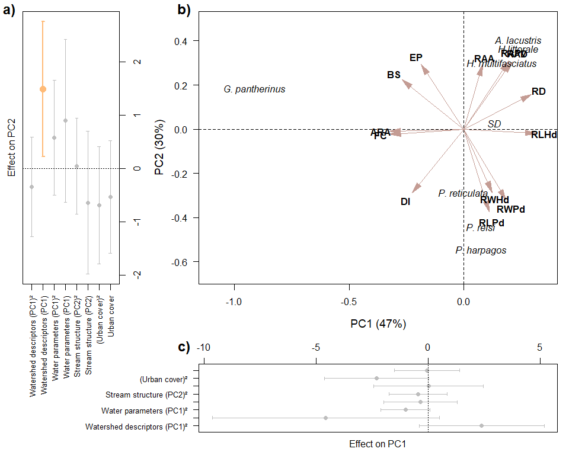

Traitglm_ONE
================
Rodolfo Pelinson
2025-06-29

``` r
dir<-("C:/Users/rodol/OneDrive/repos/Urban_fish_assemblages")
```

Loading important functions and packages

``` r
source(paste(sep = "/",dir,"functions/remove_sp.R"))
source(paste(sep = "/",dir,"functions/R2_manyglm.R"))
source(paste(sep = "/",dir,"functions/forward_sel_manyglm.R"))
source(paste(sep = "/",dir,"functions/varpart_manyglm.R"))
source(paste(sep = "/",dir,"functions/My_coefplot.R"))
source(paste(sep = "/",dir,"functions/letters.R"))
source(paste(sep = "/",dir,"functions/at_generator.R"))

library(mvabund)
library(vegan)
```

    ## Loading required package: permute

``` r
library(yarrr)
```

    ## Loading required package: jpeg

    ## Loading required package: BayesFactor

    ## Loading required package: coda

    ## Loading required package: Matrix

    ## ************
    ## Welcome to BayesFactor 0.9.12-4.7. If you have questions, please contact Richard Morey (richarddmorey@gmail.com).
    ## 
    ## Type BFManual() to open the manual.
    ## ************

    ## Loading required package: circlize

    ## ========================================
    ## circlize version 0.4.16
    ## CRAN page: https://cran.r-project.org/package=circlize
    ## Github page: https://github.com/jokergoo/circlize
    ## Documentation: https://jokergoo.github.io/circlize_book/book/
    ## 
    ## If you use it in published research, please cite:
    ## Gu, Z. circlize implements and enhances circular visualization
    ##   in R. Bioinformatics 2014.
    ## 
    ## This message can be suppressed by:
    ##   suppressPackageStartupMessages(library(circlize))
    ## ========================================

    ## yarrr v0.1.5. Citation info at citation('yarrr'). Package guide at yarrr.guide()

    ## Email me at Nathaniel.D.Phillips.is@gmail.com

``` r
library(ade4)
library(adespatial)
```

    ## Registered S3 methods overwritten by 'adegraphics':
    ##   method         from
    ##   biplot.dudi    ade4
    ##   kplot.foucart  ade4
    ##   kplot.mcoa     ade4
    ##   kplot.mfa      ade4
    ##   kplot.pta      ade4
    ##   kplot.sepan    ade4
    ##   kplot.statis   ade4
    ##   scatter.coa    ade4
    ##   scatter.dudi   ade4
    ##   scatter.nipals ade4
    ##   scatter.pco    ade4
    ##   score.acm      ade4
    ##   score.mix      ade4
    ##   score.pca      ade4
    ##   screeplot.dudi ade4

    ## Registered S3 method overwritten by 'spdep':
    ##   method   from
    ##   plot.mst ape

    ## Registered S3 method overwritten by 'adespatial':
    ##   method          from       
    ##   plot.multispati adegraphics

``` r
library(corrplot)
```

    ## corrplot 0.95 loaded

``` r
assembleia_peixes <- read.csv(paste(sep = "/",dir,"data/com_por_bacia.csv"), row.names = 1)
agua_PCs <- read.csv(paste(sep = "/",dir,"data/pcas_amb/agua_PCs.csv"), row.names = 1)
estrutura_PCs <- read.csv(paste(sep = "/",dir,"data/pcas_amb/estrutura_PCs.csv"), row.names = 1)
bacia_PCs <- read.csv(paste(sep = "/",dir,"data/pcas_amb/bacia_PCs.csv"), row.names = 1)
delineamento <- read.csv(paste(sep = "/",dir,"data/delineamento.csv"))
dist_euclid <- read.csv(paste(sep = "/",dir,"data/dist/Matriz_distancia_matriz_euclidiana.csv"), row.names = 1)
```

Loading functional data

``` r
functional <- read.csv(paste(sep = "/",dir,"data/functional_data.csv"), row.names = 1)
functional[is.na(functional)] <- 0

functional_raw <- read.csv(paste(sep = "/",dir,"data/functional_data_raw.csv"))
functional[is.na(functional)] <- 0
```

Removing species with less than 2 presences and combining them into the
artificial “Singletons” species.

Number of species before:

``` r
assembleia_peixes <- read.csv(paste(sep = "/",dir,"data/com_por_bacia.csv"), row.names = 1)
assembleia_peixes <- assembleia_peixes[,-c(4,11)]
ncol(assembleia_peixes)
```

    ## [1] 23

``` r
assembleia_peixes_rm <- remove_sp(com = assembleia_peixes, n_sp = 2)

singletons_doubletons <- remove_sp(assembleia_peixes, 2, less_equal = TRUE)
singletons <- remove_sp(assembleia_peixes, 1, less_equal = TRUE)

sing_doub_ab <- rowSums(singletons_doubletons)
sing_ab <- rowSums(singletons)

sing_doub <- rowSums(decostand(singletons_doubletons, method = "pa")) 
sing <- rowSums(decostand(singletons, method = "pa")) 

assembleia_peixes_rm <- data.frame(assembleia_peixes_rm, Singletons_and_doubletons = sing_doub_ab)
```

Number of species after:

``` r
ncol(assembleia_peixes_rm)
```

    ## [1] 8

Preparing predictors

``` r
urb <- data.frame(urb = delineamento$urbana)

urb <- decostand(urb, method = "stand")
agua_PCs <- decostand(agua_PCs, method = "stand")
estrutura_PCs <- decostand(estrutura_PCs, method = "stand")
bacia_PCs <- decostand(bacia_PCs, method = "stand")
```

``` r
data.frame(
rownames(assembleia_peixes_rm),
rownames(agua_PCs),
rownames(bacia_PCs),
rownames(estrutura_PCs),
rownames(as.matrix(dist_euclid)),
delineamento$bacia_id
)
```

    ##    rownames.assembleia_peixes_rm. rownames.agua_PCs. rownames.bacia_PCs.
    ## 1                           ebbsn               b031                b031
    ## 2                           ebbrc               b034                b034
    ## 3                            b581               b039                b039
    ## 4                            b631               b040                b040
    ## 5                            b539               b066                b066
    ## 6                            b570               b202                b202
    ## 7                            b034               b204                b204
    ## 8                            b620               b309                b309
    ## 9                            b589               b310                b310
    ## 10                           b627               b320                b320
    ## 11                           b545               b321                b321
    ## 12                           b711               b344                b344
    ## 13                           b543               b539                b539
    ## 14                           b320               b543                b543
    ## 15                           b031               b545                b545
    ## 16                           b637               b570                b570
    ## 17                           b321               b574                b574
    ## 18                           b039               b578                b578
    ## 19                           b040               b579                b579
    ## 20                           b066               b581                b581
    ## 21                           b202               b589                b589
    ## 22                           b204               b594                b594
    ## 23                           b309               b620                b620
    ## 24                           b310               b627                b627
    ## 25                           b344               b631                b631
    ## 26                           b574               b637                b637
    ## 27                           b578               b673                b673
    ## 28                           b579               b711                b711
    ## 29                           b594              ebbrc               ebbrc
    ## 30                           b673              ebbsn               ebbsn
    ##    rownames.estrutura_PCs. rownames.as.matrix.dist_euclid..
    ## 1                     b031                             b031
    ## 2                     b034                             b034
    ## 3                     b039                             b039
    ## 4                     b040                             b040
    ## 5                     b066                             b066
    ## 6                     b202                             b202
    ## 7                     b204                             b204
    ## 8                     b309                             b309
    ## 9                     b310                             b310
    ## 10                    b320                             b320
    ## 11                    b321                             b321
    ## 12                    b344                             b344
    ## 13                    b539                             b539
    ## 14                    b543                             b543
    ## 15                    b545                             b545
    ## 16                    b570                             b570
    ## 17                    b574                             b574
    ## 18                    b578                             b578
    ## 19                    b579                             b579
    ## 20                    b581                             b581
    ## 21                    b589                             b589
    ## 22                    b594                             b594
    ## 23                    b620                             b620
    ## 24                    b627                             b627
    ## 25                    b631                             b631
    ## 26                    b637                             b637
    ## 27                    b673                             b673
    ## 28                    b711                             b711
    ## 29                   ebbrc                            ebbrc
    ## 30                   ebbsn                            ebbsn
    ##    delineamento.bacia_id
    ## 1                   b031
    ## 2                   b034
    ## 3                   b039
    ## 4                   b040
    ## 5                   b066
    ## 6                   b202
    ## 7                   b204
    ## 8                   b309
    ## 9                   b310
    ## 10                  b320
    ## 11                  b321
    ## 12                  b344
    ## 13                  b539
    ## 14                  b543
    ## 15                  b545
    ## 16                  b570
    ## 17                  b574
    ## 18                  b578
    ## 19                  b579
    ## 20                  b581
    ## 21                  b589
    ## 22                  b594
    ## 23                  b620
    ## 24                  b627
    ## 25                  b631
    ## 26                  b637
    ## 27                  b673
    ## 28                  b711
    ## 29                 ebbrc
    ## 30                 ebbsn

``` r
assembleia_peixes_rm <- assembleia_peixes_rm[match(delineamento$bacia_id, rownames(assembleia_peixes_rm) ),]

data.frame(
rownames(assembleia_peixes_rm),
rownames(agua_PCs),
rownames(bacia_PCs),
rownames(estrutura_PCs),
rownames(as.matrix(dist_euclid)),
delineamento$bacia_id
)
```

    ##    rownames.assembleia_peixes_rm. rownames.agua_PCs. rownames.bacia_PCs.
    ## 1                            b031               b031                b031
    ## 2                            b034               b034                b034
    ## 3                            b039               b039                b039
    ## 4                            b040               b040                b040
    ## 5                            b066               b066                b066
    ## 6                            b202               b202                b202
    ## 7                            b204               b204                b204
    ## 8                            b309               b309                b309
    ## 9                            b310               b310                b310
    ## 10                           b320               b320                b320
    ## 11                           b321               b321                b321
    ## 12                           b344               b344                b344
    ## 13                           b539               b539                b539
    ## 14                           b543               b543                b543
    ## 15                           b545               b545                b545
    ## 16                           b570               b570                b570
    ## 17                           b574               b574                b574
    ## 18                           b578               b578                b578
    ## 19                           b579               b579                b579
    ## 20                           b581               b581                b581
    ## 21                           b589               b589                b589
    ## 22                           b594               b594                b594
    ## 23                           b620               b620                b620
    ## 24                           b627               b627                b627
    ## 25                           b631               b631                b631
    ## 26                           b637               b637                b637
    ## 27                           b673               b673                b673
    ## 28                           b711               b711                b711
    ## 29                          ebbrc              ebbrc               ebbrc
    ## 30                          ebbsn              ebbsn               ebbsn
    ##    rownames.estrutura_PCs. rownames.as.matrix.dist_euclid..
    ## 1                     b031                             b031
    ## 2                     b034                             b034
    ## 3                     b039                             b039
    ## 4                     b040                             b040
    ## 5                     b066                             b066
    ## 6                     b202                             b202
    ## 7                     b204                             b204
    ## 8                     b309                             b309
    ## 9                     b310                             b310
    ## 10                    b320                             b320
    ## 11                    b321                             b321
    ## 12                    b344                             b344
    ## 13                    b539                             b539
    ## 14                    b543                             b543
    ## 15                    b545                             b545
    ## 16                    b570                             b570
    ## 17                    b574                             b574
    ## 18                    b578                             b578
    ## 19                    b579                             b579
    ## 20                    b581                             b581
    ## 21                    b589                             b589
    ## 22                    b594                             b594
    ## 23                    b620                             b620
    ## 24                    b627                             b627
    ## 25                    b631                             b631
    ## 26                    b637                             b637
    ## 27                    b673                             b673
    ## 28                    b711                             b711
    ## 29                   ebbrc                            ebbrc
    ## 30                   ebbsn                            ebbsn
    ##    delineamento.bacia_id
    ## 1                   b031
    ## 2                   b034
    ## 3                   b039
    ## 4                   b040
    ## 5                   b066
    ## 6                   b202
    ## 7                   b204
    ## 8                   b309
    ## 9                   b310
    ## 10                  b320
    ## 11                  b321
    ## 12                  b344
    ## 13                  b539
    ## 14                  b543
    ## 15                  b545
    ## 16                  b570
    ## 17                  b574
    ## 18                  b578
    ## 19                  b579
    ## 20                  b581
    ## 21                  b589
    ## 22                  b594
    ## 23                  b620
    ## 24                  b627
    ## 25                  b631
    ## 26                  b637
    ## 27                  b673
    ## 28                  b711
    ## 29                 ebbrc
    ## 30                 ebbsn

Adding body size

``` r
body_size <- tapply(functional_raw$Comprimento_padrao_SL, INDEX = functional_raw$Especie, mean)

body_size <-  body_size[match(rownames(functional), names(body_size))]

data.frame(names(body_size), rownames(functional))
```

    ##                 names.body_size.          rownames.functional.
    ## 1            Poecilia_reticulata           Poecilia_reticulata
    ## 2              Phalloceros_reisi             Phalloceros_reisi
    ## 3        Hypostomus_ancistroides       Hypostomus_ancistroides
    ## 4      Callichthyis_callichthyis     Callichthyis_callichthyis
    ## 5             Psalidodon_paranae            Psalidodon_paranae
    ## 6           Psalidodon_fasciatus          Psalidodon_fasciatus
    ## 7     Hyphessobrycon_reticulatus    Hyphessobrycon_reticulatus
    ## 8            Hoplias_malabaricus           Hoplias_malabaricus
    ## 9               Tilapia_rendalli              Tilapia_rendalli
    ## 10            Taunaya_bifasciata            Taunaya_bifasciata
    ## 11          Characidium_oiticiai          Characidium_oiticiai
    ## 12          Gymnotus_pantherinus          Gymnotus_pantherinus
    ## 13 Hollandichthys_multifasciatus Hollandichthys_multifasciatus
    ## 14              Corydoras_aeneus              Corydoras_aeneus
    ## 15        Hoplosternum_littorale        Hoplosternum_littorale
    ## 16                Phalloceros_sp                Phalloceros_sp
    ## 17         Cichlasoma_parendense         Cichlasoma_parendense
    ## 18              Gymnotus_sylvius              Gymnotus_sylvius
    ## 19                  Poecilia_sp.                  Poecilia_sp.
    ## 20               Pareiorhina_sp.               Pareiorhina_sp.
    ## 21          Phalloceros_harpagos          Phalloceros_harpagos
    ## 22       Trichomycterus_iheringi       Trichomycterus_iheringi
    ## 23                 Ramdia_quelen                 Ramdia_quelen
    ## 24            Astyanax_lacustris            Astyanax_lacustris
    ## 25             Poecilia_vivipara             Poecilia_vivipara

``` r
functional$body_size <- body_size
```

Now, because we have an artificial species called “Singletons and
doubletons”, we will be a weighted average of traits to this species
considering the abundance of the species that compose this “taxon”.

``` r
total_ab_singletons <- colSums(singletons_doubletons)

functional_singletons <- functional[match(colnames(singletons_doubletons), rownames(functional)),]

functional_singleton <- colSums(functional_singletons * total_ab_singletons) / sum(total_ab_singletons)

functional <- rbind(functional, Singletons_and_doubletons = functional_singleton)

functional <- functional[match(colnames(assembleia_peixes_rm), rownames(functional)),]
```

Now we put these traits in a PCA to reduce dimensionality since many
traits are correlated

``` r
functional_stand <- decostand(functional, method = "stand")

pca_functional <- rda(functional_stand)

importance_funcional <- round(pca_functional$CA$eig/sum(pca_functional$CA$eig),2)
Eigenvalues_funcional <- data.frame(autovalores = pca_functional$CA$eig,
                                    importance = importance_funcional)

importance_funcional
```

    ##  PC1  PC2  PC3  PC4  PC5  PC6  PC7 
    ## 0.47 0.30 0.12 0.04 0.04 0.02 0.01

``` r
functional_PCs <- pca_functional$CA$u
functional_loadings <- pca_functional$CA$v
```

First two axis are the most important, lets see which are the traits
correlated with them.

``` r
functional_loadings_filtrados <- functional_loadings[which(functional_loadings[,1] > 0.25 | functional_loadings[,1] < -0.25 |
                                                           functional_loadings[,2] > 0.25 | functional_loadings[,2] < -0.25),1:2]
functional_loadings_filtrados
```

    ##                                            PC1          PC2
    ## Depression.index                   -0.21067395 -0.269587692
    ## Relative.depth                      0.27269044  0.145504848
    ## Fineness.ratio                     -0.30073837 -0.021720824
    ## Relative.length.of.caudal.peduncle  0.10160817 -0.350924222
    ## Relative.width.of.caudal.peduncle   0.17096994 -0.299621984
    ## Relative.area.of.dorsal.fin         0.19517054  0.285391657
    ## Relative.length.of.head             0.29122846 -0.017396659
    ## Eye.position                       -0.17371217  0.274017532
    ## Relative.width.of.head              0.11286031 -0.263990450
    ## Relative.area.of.anal.fin           0.07406314  0.268857439
    ## Aspect.ratio.of.anal.fin           -0.30163247 -0.008767638
    ## Relative.area.of.pelvic.fin         0.18121595  0.288495727
    ## body_size                          -0.25157372  0.207743151

``` r
functional_loadings_filtrados_PC1 <- functional_loadings[which(functional_loadings[,1] > 0.25 | functional_loadings[,1] < -0.25),1]
functional_loadings_filtrados_PC1
```

    ##           Relative.depth           Fineness.ratio  Relative.length.of.head 
    ##                0.2726904               -0.3007384                0.2912285 
    ## Aspect.ratio.of.anal.fin                body_size 
    ##               -0.3016325               -0.2515737

``` r
functional_loadings_filtrados_PC2 <- functional_loadings[which(functional_loadings[,2] > 0.25 | functional_loadings[,2] < -0.25),2]
functional_loadings_filtrados_PC2
```

    ##                   Depression.index Relative.length.of.caudal.peduncle 
    ##                         -0.2695877                         -0.3509242 
    ##  Relative.width.of.caudal.peduncle        Relative.area.of.dorsal.fin 
    ##                         -0.2996220                          0.2853917 
    ##                       Eye.position             Relative.width.of.head 
    ##                          0.2740175                         -0.2639904 
    ##          Relative.area.of.anal.fin        Relative.area.of.pelvic.fin 
    ##                          0.2688574                          0.2884957

Lets plot this PCA

``` r
pc1_label_functional <- paste("PC1 (",round(importance_funcional[1]*100,2),"%)",sep = "")
pc2_label_functional <- paste("PC2 (",round(importance_funcional[2]*100,2),"%)",sep = "")


sp_names <- rownames(functional_PCs)

sp_names[sp_names == "Gymnotus_pantherinus"] <- "G. pantherinus"
sp_names[sp_names == "Phalloceros_harpagos"] <- "P. harpagos"
sp_names[sp_names == "Phalloceros_reisi"] <- "P. reisi"
sp_names[sp_names == "Hollandichthys_multifasciatus"] <- "H. multifasciatus"
sp_names[sp_names == "Poecilia_reticulata"] <- "P. reticulata"
sp_names[sp_names == "Astyanax_lacustris"] <- "A. lacustris"
sp_names[sp_names == "Hoplosternum_littorale"] <- "H.littorale"
sp_names[sp_names == "Singletons_and_doubletons"] <- "SD"

names_func <- rownames(functional_loadings_filtrados) 

names_func[names_func == "Depression.index"] <- "DI"
names_func[names_func == "Relative.depth"] <- "RD"
names_func[names_func == "Fineness.ratio"] <- "FC"
names_func[names_func == "Relative.length.of.caudal.peduncle"] <- "RLPd"
#names_func[names_func == "Relative.height.of.caudal.peduncle"] <- "RHPd"
names_func[names_func == "Relative.width.of.caudal.peduncle"] <- "RWPd"
names_func[names_func == "Relative.area.of.dorsal.fin"] <- "RAD"
#names_func[names_func == "Relative.area.of.caudal.fin"] <- "RAC"
#names_func[names_func == "Relative.area.of.pectoral.fin"] <- "RAPt"
names_func[names_func == "Relative.length.of.head"] <- "RLHd"
names_func[names_func == "Eye.position"] <- "EP"
names_func[names_func == "Relative.width.of.head"] <- "RWHd"
#names_func[names_func == "Relative.area.of.eye"] <- "RAE"
names_func[names_func == "Relative.area.of.anal.fin"] <- "RAA"
names_func[names_func == "Relative.area.of.pelvic.fin"] <- "RAPv"
#names_func[names_func == "Aspect.ratio.of.pectoral.fin"] <- "ARPt"
names_func[names_func == "Aspect.ratio.of.anal.fin"] <- "ARA"
names_func[names_func == "body_size"] <- "BS"
```

Assessing effects on community responses:

``` r
urb_pred <- data.frame(urb = urb, urb_squared = urb^2)
Model_trait_urb_null <- traitglm(L = assembleia_peixes_rm, R = urb_pred, Q = NULL)
```

    ## No traits matrix entered, so will fit SDMs with different env response for each spp

``` r
Model_trait_urb_trait <- traitglm(L = assembleia_peixes_rm, R = urb_pred, Q = data.frame(functional_PCs[,1:2]))
Model_trait_urb_trait1 <- traitglm(L = assembleia_peixes_rm, R = urb_pred, Q = data.frame(functional_PCs[,1]))
Model_trait_urb_trait2 <- traitglm(L = assembleia_peixes_rm, R = urb_pred, Q = data.frame(functional_PCs[,2]))

anova_trait_urb1 <- anova(Model_trait_urb_null, Model_trait_urb_trait1, nBoot = 999)
```

    ## Resampling begins for test 1.
    ##  Resampling run 0 finished. Time elapsed: 0.00 minutes...
    ##  Resampling run 100 finished. Time elapsed: 0.17 minutes...
    ##  Resampling run 200 finished. Time elapsed: 0.33 minutes...
    ##  Resampling run 300 finished. Time elapsed: 0.49 minutes...
    ##  Resampling run 400 finished. Time elapsed: 0.66 minutes...
    ##  Resampling run 500 finished. Time elapsed: 0.84 minutes...
    ##  Resampling run 600 finished. Time elapsed: 1.01 minutes...
    ##  Resampling run 700 finished. Time elapsed: 1.18 minutes...
    ##  Resampling run 800 finished. Time elapsed: 1.34 minutes...
    ##  Resampling run 900 finished. Time elapsed: 1.51 minutes...
    ## Time elapsed: 0 hr 1 min 40 sec

``` r
anova_trait_urb2 <- anova(Model_trait_urb_null, Model_trait_urb_trait2, nBoot = 999)
```

    ## Resampling begins for test 1.
    ##  Resampling run 0 finished. Time elapsed: 0.00 minutes...
    ##  Resampling run 100 finished. Time elapsed: 0.18 minutes...
    ##  Resampling run 200 finished. Time elapsed: 0.34 minutes...
    ##  Resampling run 300 finished. Time elapsed: 0.51 minutes...
    ##  Resampling run 400 finished. Time elapsed: 0.69 minutes...
    ##  Resampling run 500 finished. Time elapsed: 0.84 minutes...
    ##  Resampling run 600 finished. Time elapsed: 1.00 minutes...
    ##  Resampling run 700 finished. Time elapsed: 1.17 minutes...
    ##  Resampling run 800 finished. Time elapsed: 1.34 minutes...
    ##  Resampling run 900 finished. Time elapsed: 1.51 minutes...
    ## Time elapsed: 0 hr 1 min 40 sec

``` r
est_pred <- data.frame(est_PC1 = estrutura_PCs[,1], est_PC1_squared = estrutura_PCs[,1]^2)
Model_trait_est_null <- traitglm(L = assembleia_peixes_rm, R = est_pred, Q = NULL)
```

    ## No traits matrix entered, so will fit SDMs with different env response for each spp

``` r
Model_trait_est_trait <- traitglm(L = assembleia_peixes_rm, R = est_pred, Q = data.frame(functional_PCs[,1:2]))
Model_trait_est_trait1 <- traitglm(L = assembleia_peixes_rm, R = est_pred, Q = data.frame(functional_PCs[,1]))
Model_trait_est_trait2 <- traitglm(L = assembleia_peixes_rm, R = est_pred, Q = data.frame(functional_PCs[,2]))

anova_trait_est1 <- anova(Model_trait_est_null, Model_trait_est_trait1, nBoot = 999)
```

    ## Resampling begins for test 1.
    ##  Resampling run 0 finished. Time elapsed: 0.00 minutes...
    ##  Resampling run 100 finished. Time elapsed: 0.16 minutes...
    ##  Resampling run 200 finished. Time elapsed: 0.33 minutes...
    ##  Resampling run 300 finished. Time elapsed: 0.48 minutes...
    ##  Resampling run 400 finished. Time elapsed: 0.64 minutes...
    ##  Resampling run 500 finished. Time elapsed: 0.79 minutes...
    ##  Resampling run 600 finished. Time elapsed: 0.95 minutes...
    ##  Resampling run 700 finished. Time elapsed: 1.11 minutes...
    ##  Resampling run 800 finished. Time elapsed: 1.26 minutes...
    ##  Resampling run 900 finished. Time elapsed: 1.42 minutes...
    ## Time elapsed: 0 hr 1 min 35 sec

``` r
anova_trait_est2 <- anova(Model_trait_est_null, Model_trait_est_trait2, nBoot = 999)
```

    ## Resampling begins for test 1.
    ##  Resampling run 0 finished. Time elapsed: 0.00 minutes...
    ##  Resampling run 100 finished. Time elapsed: 0.16 minutes...
    ##  Resampling run 200 finished. Time elapsed: 0.32 minutes...
    ##  Resampling run 300 finished. Time elapsed: 0.48 minutes...
    ##  Resampling run 400 finished. Time elapsed: 0.65 minutes...
    ##  Resampling run 500 finished. Time elapsed: 0.80 minutes...
    ##  Resampling run 600 finished. Time elapsed: 0.98 minutes...
    ##  Resampling run 700 finished. Time elapsed: 1.15 minutes...
    ##  Resampling run 800 finished. Time elapsed: 1.31 minutes...
    ##  Resampling run 900 finished. Time elapsed: 1.48 minutes...
    ## Time elapsed: 0 hr 1 min 38 sec

``` r
agua_pred <- data.frame(agua_PC1 = agua_PCs[,1], agua_PC1_squared = agua_PCs[,1]^2)
Model_trait_agua_null <- traitglm(L = assembleia_peixes_rm, R = agua_pred, Q = NULL)
```

    ## No traits matrix entered, so will fit SDMs with different env response for each spp

``` r
Model_trait_agua_trait <- traitglm(L = assembleia_peixes_rm, R = agua_pred, Q = data.frame(functional_PCs[,1:2]))
Model_trait_agua_trait1 <- traitglm(L = assembleia_peixes_rm, R = agua_pred, Q = data.frame(functional_PCs[,1]))
Model_trait_agua_trait2 <- traitglm(L = assembleia_peixes_rm, R = agua_pred, Q = data.frame(functional_PCs[,2]))

anova_trait_agua1 <- anova(Model_trait_agua_null, Model_trait_agua_trait1, nBoot = 999)
```

    ## Resampling begins for test 1.
    ##  Resampling run 0 finished. Time elapsed: 0.00 minutes...
    ##  Resampling run 100 finished. Time elapsed: 0.17 minutes...
    ##  Resampling run 200 finished. Time elapsed: 0.35 minutes...
    ##  Resampling run 300 finished. Time elapsed: 0.52 minutes...
    ##  Resampling run 400 finished. Time elapsed: 0.69 minutes...
    ##  Resampling run 500 finished. Time elapsed: 0.86 minutes...
    ##  Resampling run 600 finished. Time elapsed: 1.04 minutes...
    ##  Resampling run 700 finished. Time elapsed: 1.21 minutes...
    ##  Resampling run 800 finished. Time elapsed: 1.38 minutes...
    ##  Resampling run 900 finished. Time elapsed: 1.55 minutes...
    ## Time elapsed: 0 hr 1 min 43 sec

``` r
anova_trait_agua2 <- anova(Model_trait_agua_null, Model_trait_agua_trait2, nBoot = 999)
```

    ## Resampling begins for test 1.
    ##  Resampling run 0 finished. Time elapsed: 0.00 minutes...
    ##  Resampling run 100 finished. Time elapsed: 0.16 minutes...
    ##  Resampling run 200 finished. Time elapsed: 0.32 minutes...
    ##  Resampling run 300 finished. Time elapsed: 0.49 minutes...
    ##  Resampling run 400 finished. Time elapsed: 0.65 minutes...
    ##  Resampling run 500 finished. Time elapsed: 0.81 minutes...
    ##  Resampling run 600 finished. Time elapsed: 0.98 minutes...
    ##  Resampling run 700 finished. Time elapsed: 1.13 minutes...
    ##  Resampling run 800 finished. Time elapsed: 1.30 minutes...
    ##  Resampling run 900 finished. Time elapsed: 1.45 minutes...
    ## Time elapsed: 0 hr 1 min 36 sec

``` r
bacia_pred <- data.frame(bacia_PC1 = bacia_PCs[,1], bacia_PC1_squared = bacia_PCs[,1]^2)
Model_trait_bacia_null <- traitglm(L = assembleia_peixes_rm, R = bacia_pred, Q = NULL)
```

    ## No traits matrix entered, so will fit SDMs with different env response for each spp

``` r
Model_trait_bacia_trait <- traitglm(L = assembleia_peixes_rm, R = bacia_pred, Q = data.frame(functional_PCs[,1:2]))
Model_trait_bacia_trait1 <- traitglm(L = assembleia_peixes_rm, R = bacia_pred, Q = data.frame(functional_PCs[,1]))
Model_trait_bacia_trait2 <- traitglm(L = assembleia_peixes_rm, R = bacia_pred, Q = data.frame(functional_PCs[,2]))

anova_trait_bacia1 <- anova(Model_trait_bacia_null, Model_trait_bacia_trait1, nBoot = 999)
```

    ## Resampling begins for test 1.
    ##  Resampling run 0 finished. Time elapsed: 0.00 minutes...
    ##  Resampling run 100 finished. Time elapsed: 0.18 minutes...
    ##  Resampling run 200 finished. Time elapsed: 0.34 minutes...
    ##  Resampling run 300 finished. Time elapsed: 0.53 minutes...
    ##  Resampling run 400 finished. Time elapsed: 0.70 minutes...
    ##  Resampling run 500 finished. Time elapsed: 0.88 minutes...
    ##  Resampling run 600 finished. Time elapsed: 1.04 minutes...
    ##  Resampling run 700 finished. Time elapsed: 1.20 minutes...
    ##  Resampling run 800 finished. Time elapsed: 1.37 minutes...
    ##  Resampling run 900 finished. Time elapsed: 1.54 minutes...
    ## Time elapsed: 0 hr 1 min 42 sec

``` r
anova_trait_bacia2 <- anova(Model_trait_bacia_null, Model_trait_bacia_trait2, nBoot = 999)
```

    ## Resampling begins for test 1.
    ##  Resampling run 0 finished. Time elapsed: 0.00 minutes...
    ##  Resampling run 100 finished. Time elapsed: 0.15 minutes...
    ##  Resampling run 200 finished. Time elapsed: 0.31 minutes...
    ##  Resampling run 300 finished. Time elapsed: 0.44 minutes...
    ##  Resampling run 400 finished. Time elapsed: 0.59 minutes...
    ##  Resampling run 500 finished. Time elapsed: 0.75 minutes...
    ##  Resampling run 600 finished. Time elapsed: 0.90 minutes...
    ##  Resampling run 700 finished. Time elapsed: 1.06 minutes...
    ##  Resampling run 800 finished. Time elapsed: 1.22 minutes...
    ##  Resampling run 900 finished. Time elapsed: 1.37 minutes...
    ## Time elapsed: 0 hr 1 min 31 sec

``` r
trait_urb_coef <- c(Model_trait_urb_trait$fourth.corner)
trait_urb_coef_CI <- Model_trait_urb_trait$stderr.coefficients[13:16,]*qnorm(0.975)
names(trait_urb_coef) <- names(trait_urb_coef_CI)

trait_est_coef <- c(Model_trait_est_trait$fourth.corner)
trait_est_coef_CI <- Model_trait_est_trait$stderr.coefficients[13:16,]*qnorm(0.975)
names(trait_est_coef) <- names(trait_est_coef_CI)

trait_agua_coef <- c(Model_trait_agua_trait$fourth.corner)
trait_agua_coef_CI <- Model_trait_agua_trait$stderr.coefficients[13:16,]*qnorm(0.975)
names(trait_agua_coef) <- names(trait_agua_coef_CI)

trait_bacia_coef <- c(Model_trait_bacia_trait$fourth.corner)
trait_bacia_coef_CI <- Model_trait_bacia_trait$stderr.coefficients[13:16,]*qnorm(0.975)
names(trait_bacia_coef) <- names(trait_bacia_coef_CI)
```

Lets plot those things:

``` r
coefs_PC1 <- c(trait_urb_coef[c(1,3)], trait_est_coef[c(1,3)], trait_agua_coef[c(1,3)], trait_bacia_coef[c(1,3)])
CI_PC1 <- c(trait_urb_coef_CI[c(1,3)], trait_est_coef_CI[c(1,3)], trait_agua_coef_CI[c(1,3)], trait_bacia_coef_CI[c(1,3)])

coefs_PC2 <- c(trait_urb_coef[c(2,4)], trait_est_coef[c(2,4)], trait_agua_coef[c(2,4)], trait_bacia_coef[c(2,4)])
CI_PC2 <- c(trait_urb_coef_CI[c(2,4)], trait_est_coef_CI[c(2,4)], trait_agua_coef_CI[c(2,4)], trait_bacia_coef_CI[c(2,4)])

upper_PC1 <- coefs_PC1 + CI_PC1
lower_PC1 <- coefs_PC1 - CI_PC1

upper_PC2 <- coefs_PC2 + CI_PC2
lower_PC2<- coefs_PC2 - CI_PC2

labels <- c("Urban cover", "(Urban cover)²", "Stream structure (PC2)", "Stream structure (PC2)²", "Water parameters (PC1)","Water parameters (PC1)²", "Watershed descriptors (PC1)", "Watershed descriptors (PC1)²")
```

Lets plot everything together

``` r
#pdf("plots/functional_effects_quad.pdf", width = 8, height = 8, pointsize = 12)

close.screen(all.screens = TRUE)
```

    ## [1] FALSE

``` r
split.screen(matrix(c(0,0.25,0.25,1,
                      0.25,1,0.25,1,
                      0,0.25,0,0.25, 
                      0.25,1,0,0.25), ncol = 4, nrow = 4, byrow = TRUE))
```

    ## [1] 1 2 3 4

``` r
screen(2)
par(mar = c(5,5,1,1), bty = "o")
xmin <- min(c(functional_PCs[,1], functional_loadings_filtrados[,1]))*1.2
xmax <- max(c(functional_PCs[,1], functional_loadings_filtrados[,1]))*1.2
ymin <- min(c(functional_PCs[,2], functional_loadings_filtrados[,2]))*1.2
ymax <- max(c(functional_PCs[,2], functional_loadings_filtrados[,2]))*1.2

plot(functional_PCs[,1], functional_PCs[,2], xlim = c(xmin,xmax), ylim = c(ymin, ymax),
     type = "n", xaxt = "n", yaxt = "n", ylab = "", xlab = "")

abline(h = 0, v = 0, lty = 2)

library(scales)
library(shape)


#pal <- col_numeric(palette = c("white", "black"), domain = urb, na.color = "grey50", alpha = FALSE, reverse = FALSE)
#col <-pal(urb)

Arrows(x0 <- rep(0, nrow(functional_loadings_filtrados)),
       y0 <- rep(0, nrow(functional_loadings_filtrados)),
       x1 <- functional_loadings_filtrados[,1],
       y1 <- functional_loadings_filtrados[,2], arr.type = "triangle", arr.length = 0.4, col = "#C49C94", lwd = 1.5)

#points(functional_PCs[,1],functional_PCs[,2], col = "black", bg = "white", pch = 21, cex = 1.5)
text(functional_PCs[,1],functional_PCs[,2], labels = sp_names, col =  "black", font = 3)


text(x = functional_loadings_filtrados[,1]*1.2, y = functional_loadings_filtrados[,2]*1.2, labels = names_func, cex = 1, col = "black", font = 2)

axis(1, cex.axis = 1)
axis(2, cex.axis = 1, las = 2)
title(xlab = pc1_label_functional, cex.lab = 1.2, line = 3)
title(ylab = pc2_label_functional, cex.lab = 1.2, line = 3)
#title(main = "Morphological traits", line = 0.5, adj = 0, cex.main = 1.5)
letters(x = 10, y = 97, "b)", cex = 1.5)


col_sig <- c("#AEC7E8","#AEC7E8", "#98DF8A","#98DF8A", "#9EDAE5", "#9EDAE5", "#FFBB78",  "#FFBB78")


screen(4)
par(mar = c(2,5,2,1))
My_coefplot(mles = coefs_PC1, upper = upper_PC1,
            lower = lower_PC1, col_sig = col_sig,
            cex_sig = 1.5, species_labels = labels, yaxis_font = 1, invert = FALSE, axis_sp_labels = 2, cex.axis = 0.8, axis_effect_labels = 3, y_spa = 0.5)
mtext("Effect on PC1", side = 1, line = 0.5)
letters(x = 10, y = 95, "c)", cex = 1.5)


screen(1)
par(mar = c(5,2,1,2))
My_coefplot(mles = coefs_PC2, upper = upper_PC2,
            lower = lower_PC2, col_sig = col_sig,
           cex_sig = 1.5, species_labels = labels, yaxis_font = 1, invert = TRUE, axis_sp_labels = 1, cex.axis = 0.8, axis_effect_labels = 4, y_spa = 0.5)
mtext("Effect on PC2", side = 2, line = 0.5)
letters(x = 7, y = 97, "a)", cex = 1.5)

#dev.off()
```

<!-- -->

Assessing only linear effects on community responses:

``` r
urb_pred <- data.frame(urb = urb[,1])
Model_trait_urb_null <- traitglm(L = assembleia_peixes_rm, R = urb_pred, Q = NULL)
```

    ## No traits matrix entered, so will fit SDMs with different env response for each spp

``` r
Model_trait_urb_trait <- traitglm(L = assembleia_peixes_rm, R = urb_pred, Q = data.frame(functional_PCs[,1:2]))
anova_trait_urb <- anova(Model_trait_urb_null, Model_trait_urb_trait, nBoot = 999)
```

    ## Resampling begins for test 1.
    ##  Resampling run 0 finished. Time elapsed: 0.00 minutes...
    ##  Resampling run 100 finished. Time elapsed: 0.08 minutes...
    ##  Resampling run 200 finished. Time elapsed: 0.16 minutes...
    ##  Resampling run 300 finished. Time elapsed: 0.23 minutes...
    ##  Resampling run 400 finished. Time elapsed: 0.31 minutes...
    ##  Resampling run 500 finished. Time elapsed: 0.37 minutes...
    ##  Resampling run 600 finished. Time elapsed: 0.45 minutes...
    ##  Resampling run 700 finished. Time elapsed: 0.52 minutes...
    ##  Resampling run 800 finished. Time elapsed: 0.59 minutes...
    ##  Resampling run 900 finished. Time elapsed: 0.67 minutes...
    ## Time elapsed: 0 hr 0 min 44 sec

``` r
est_pred <- data.frame(est_PC1 = estrutura_PCs[,1])
Model_trait_est_null <- traitglm(L = assembleia_peixes_rm, R = est_pred, Q = NULL)
```

    ## No traits matrix entered, so will fit SDMs with different env response for each spp

``` r
Model_trait_est_trait <- traitglm(L = assembleia_peixes_rm, R = est_pred, Q = data.frame(functional_PCs[,1:2]))
anova_trait_est <- anova(Model_trait_est_null, Model_trait_est_trait, nBoot = 999)
```

    ## Resampling begins for test 1.
    ##  Resampling run 0 finished. Time elapsed: 0.00 minutes...
    ##  Resampling run 100 finished. Time elapsed: 0.08 minutes...
    ##  Resampling run 200 finished. Time elapsed: 0.17 minutes...
    ##  Resampling run 300 finished. Time elapsed: 0.28 minutes...
    ##  Resampling run 400 finished. Time elapsed: 0.38 minutes...
    ##  Resampling run 500 finished. Time elapsed: 0.47 minutes...
    ##  Resampling run 600 finished. Time elapsed: 0.57 minutes...
    ##  Resampling run 700 finished. Time elapsed: 0.66 minutes...
    ##  Resampling run 800 finished. Time elapsed: 0.74 minutes...
    ##  Resampling run 900 finished. Time elapsed: 0.82 minutes...
    ## Time elapsed: 0 hr 0 min 54 sec

``` r
agua_pred <- data.frame(agua_PC1 = agua_PCs[,1])
Model_trait_agua_null <- traitglm(L = assembleia_peixes_rm, R = agua_pred, Q = NULL)
```

    ## No traits matrix entered, so will fit SDMs with different env response for each spp

``` r
Model_trait_agua_trait <- traitglm(L = assembleia_peixes_rm, R = agua_pred, Q = data.frame(functional_PCs[,1:2]))
anova_trait_agua <- anova(Model_trait_agua_null, Model_trait_agua_trait, nBoot = 999)
```

    ## Resampling begins for test 1.
    ##  Resampling run 0 finished. Time elapsed: 0.00 minutes...
    ##  Resampling run 100 finished. Time elapsed: 0.07 minutes...
    ##  Resampling run 200 finished. Time elapsed: 0.14 minutes...
    ##  Resampling run 300 finished. Time elapsed: 0.21 minutes...
    ##  Resampling run 400 finished. Time elapsed: 0.28 minutes...
    ##  Resampling run 500 finished. Time elapsed: 0.36 minutes...
    ##  Resampling run 600 finished. Time elapsed: 0.42 minutes...
    ##  Resampling run 700 finished. Time elapsed: 0.50 minutes...
    ##  Resampling run 800 finished. Time elapsed: 0.57 minutes...
    ##  Resampling run 900 finished. Time elapsed: 0.65 minutes...
    ## Time elapsed: 0 hr 0 min 44 sec

``` r
bacia_pred <- data.frame(bacia_PC1 = bacia_PCs[,1])
Model_trait_bacia_null <- traitglm(L = assembleia_peixes_rm, R = bacia_pred, Q = NULL)
```

    ## No traits matrix entered, so will fit SDMs with different env response for each spp

``` r
Model_trait_bacia_trait <- traitglm(L = assembleia_peixes_rm, R = bacia_pred, Q = data.frame(functional_PCs[,1:2]))
anova_trait_bacia <- anova(Model_trait_bacia_null, Model_trait_bacia_trait, nBoot = 999)
```

    ## Resampling begins for test 1.
    ##  Resampling run 0 finished. Time elapsed: 0.00 minutes...
    ##  Resampling run 100 finished. Time elapsed: 0.10 minutes...
    ##  Resampling run 200 finished. Time elapsed: 0.20 minutes...
    ##  Resampling run 300 finished. Time elapsed: 0.30 minutes...
    ##  Resampling run 400 finished. Time elapsed: 0.41 minutes...
    ##  Resampling run 500 finished. Time elapsed: 0.51 minutes...
    ##  Resampling run 600 finished. Time elapsed: 0.62 minutes...
    ##  Resampling run 700 finished. Time elapsed: 0.72 minutes...
    ##  Resampling run 800 finished. Time elapsed: 0.83 minutes...
    ##  Resampling run 900 finished. Time elapsed: 0.94 minutes...
    ## Time elapsed: 0 hr 1 min 2 sec

``` r
trait_urb_coef <- c(Model_trait_urb_trait$fourth.corner)
trait_urb_coef_CI <- Model_trait_urb_trait$stderr.coefficients[11:12,]*qnorm(0.975)
names(trait_urb_coef) <- names(trait_urb_coef_CI)

trait_est_coef <- c(Model_trait_est_trait$fourth.corner)
trait_est_coef_CI <- Model_trait_est_trait$stderr.coefficients[11:12,]*qnorm(0.975)
names(trait_est_coef) <- names(trait_est_coef_CI)

trait_agua_coef <- c(Model_trait_agua_trait$fourth.corner)
trait_agua_coef_CI <- Model_trait_agua_trait$stderr.coefficients[11:12,]*qnorm(0.975)
names(trait_agua_coef) <- names(trait_agua_coef_CI)

trait_bacia_coef <- c(Model_trait_bacia_trait$fourth.corner)
trait_bacia_coef_CI <- Model_trait_bacia_trait$stderr.coefficients[11:12,]*qnorm(0.975)
names(trait_bacia_coef) <- names(trait_bacia_coef_CI)
```

Lets plot those things:

``` r
coefs_PC1 <- c(trait_urb_coef[c(1)], trait_est_coef[c(1)], trait_agua_coef[c(1)], trait_bacia_coef[c(1)])
CI_PC1 <- c(trait_urb_coef_CI[c(1)], trait_est_coef_CI[c(1)], trait_agua_coef_CI[c(1)], trait_bacia_coef_CI[c(1)])

coefs_PC2 <- c(trait_urb_coef[c(2)], trait_est_coef[c(2)], trait_agua_coef[c(2)], trait_bacia_coef[c(2)])
CI_PC2 <- c(trait_urb_coef_CI[c(2)], trait_est_coef_CI[c(2)], trait_agua_coef_CI[c(2)], trait_bacia_coef_CI[c(2)])

upper_PC1 <- coefs_PC1 + CI_PC1
lower_PC1 <- coefs_PC1 - CI_PC1

upper_PC2 <- coefs_PC2 + CI_PC2
lower_PC2<- coefs_PC2 - CI_PC2

labels <- c("Urban cover", "Stream structure (PC2)", "Water parameters (PC1)","Watershed descriptors (PC1)")
```

Lets plot everything together

``` r
#pdf("plots/functional_effects_linear.pdf", width = 8, height = 8, pointsize = 12)

close.screen(all.screens = TRUE)
split.screen(matrix(c(0,0.25,0.25,1,
                      0.25,1,0.25,1,
                      0,0.25,0,0.25, 
                      0.25,1,0,0.25), ncol = 4, nrow = 4, byrow = TRUE))
```

    ## [1] 1 2 3 4

``` r
screen(2)
par(mar = c(5,5,1,1), bty = "o")
xmin <- min(c(functional_PCs[,1], functional_loadings_filtrados[,1]))*1.2
xmax <- max(c(functional_PCs[,1], functional_loadings_filtrados[,1]))*1.2
ymin <- min(c(functional_PCs[,2], functional_loadings_filtrados[,2]))*1.2
ymax <- max(c(functional_PCs[,2], functional_loadings_filtrados[,2]))*1.2

plot(functional_PCs[,1], functional_PCs[,2], xlim = c(xmin,xmax), ylim = c(ymin, ymax),
     type = "n", xaxt = "n", yaxt = "n", ylab = "", xlab = "")

abline(h = 0, v = 0, lty = 2)

library(scales)
library(shape)


#pal <- col_numeric(palette = c("white", "black"), domain = urb, na.color = "grey50", alpha = FALSE, reverse = FALSE)
#col <-pal(urb)

Arrows(x0 <- rep(0, nrow(functional_loadings_filtrados)),
       y0 <- rep(0, nrow(functional_loadings_filtrados)),
       x1 <- functional_loadings_filtrados[,1],
       y1 <- functional_loadings_filtrados[,2], arr.type = "triangle", arr.length = 0.4, col = "#C49C94", lwd = 1.5)

#points(functional_PCs[,1],functional_PCs[,2], col = "black", bg = "white", pch = 21, cex = 1.5)
text(functional_PCs[,1],functional_PCs[,2], labels = sp_names, col =  "black", font = 3)


text(x = functional_loadings_filtrados[,1]*1.2, y = functional_loadings_filtrados[,2]*1.2, labels = names_func, cex = 1, col = "black", font = 2)

axis(1, cex.axis = 1)
axis(2, cex.axis = 1, las = 2)
title(xlab = pc1_label_functional, cex.lab = 1.2, line = 3)
title(ylab = pc2_label_functional, cex.lab = 1.2, line = 3)
#title(main = "Morphological traits", line = 0.5, adj = 0, cex.main = 1.5)
letters(x = 10, y = 97, "b)", cex = 1.5)


col_sig <- c("#AEC7E8", "#98DF8A", "#9EDAE5",  "#FFBB78")


screen(4)
par(mar = c(2,5,2,1))
My_coefplot(mles = coefs_PC1, upper = upper_PC1,
            lower = lower_PC1, col_sig = col_sig,
            cex_sig = 1.5, species_labels = labels, yaxis_font = 1, invert = FALSE, axis_sp_labels = 2, cex.axis = 0.8, axis_effect_labels = 3, y_spa = 0.5)
mtext("Effect on PC1", side = 1, line = 0.5)
letters(x = 10, y = 95, "c)", cex = 1.5)


screen(1)
par(mar = c(5,2,1,2))
My_coefplot(mles = coefs_PC2, upper = upper_PC2,
            lower = lower_PC2, col_sig = col_sig,
           cex_sig = 1.5, species_labels = labels, yaxis_font = 1, invert = TRUE, axis_sp_labels = 1, cex.axis = 0.8, axis_effect_labels = 4, y_spa = 0.5)
mtext("Effect on PC2", side = 2, line = 0.5)
letters(x = 7, y = 97, "a)", cex = 1.5)

#dev.off()
```

<!-- -->
