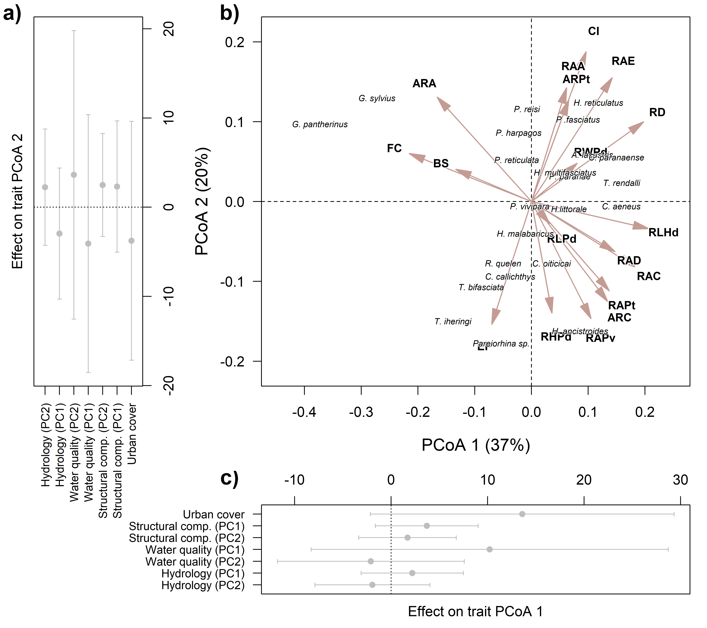
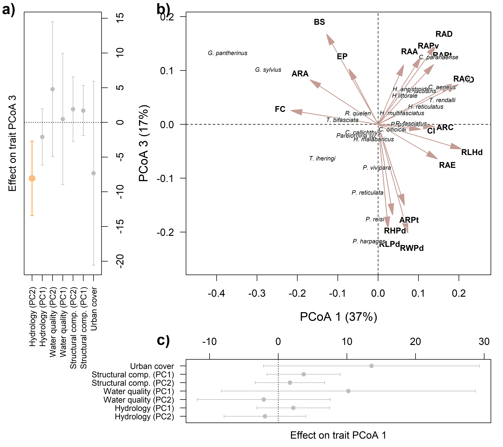
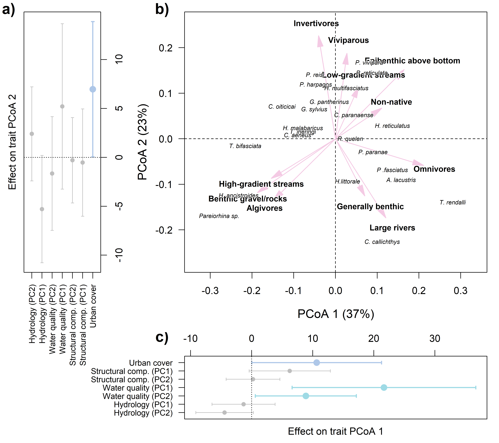
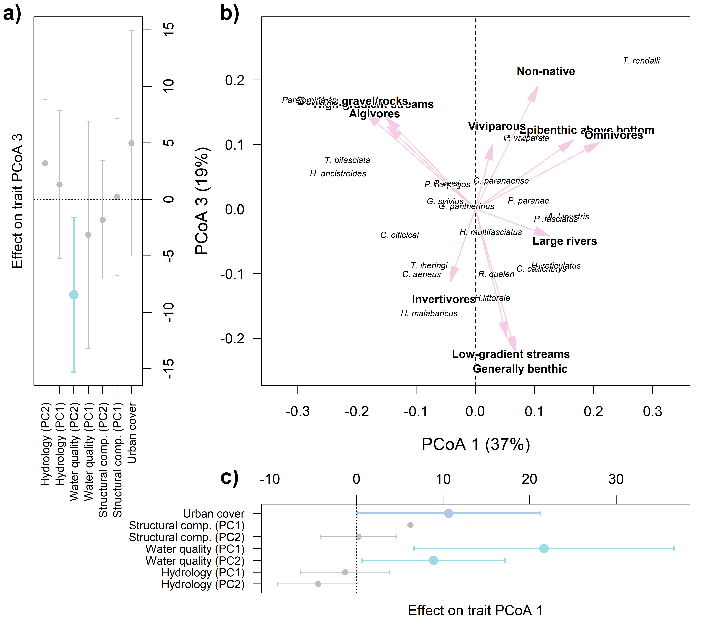

Traitglm_ONE
================
Rodolfo Pelinson
2026-07-20

``` r
dir<-("C:/Users/rodol/OneDrive/repos/Urban_fish_assemblages")
```

Loading important functions and packages

``` r
source(paste(sep = "/",dir,"functions/remove_sp.R"))
source(paste(sep = "/",dir,"functions/R2_manyglm.R"))
source(paste(sep = "/",dir,"functions/forward_sel_manyglm.R"))
source(paste(sep = "/",dir,"functions/varpart_manyglm.R"))
source(paste(sep = "/",dir,"functions/My_coefplot.R"))
source(paste(sep = "/",dir,"functions/letters.R"))
source(paste(sep = "/",dir,"functions/at_generator.R"))
source(paste(sep = "/",dir,"functions/text_contour.R"))
source(paste(sep = "/",dir,"functions/text_repositioning.R"))
library(mvabund)
library(vegan)
library(yarrr)
library(ade4)
library(adespatial)
library(corrplot)
```

Loading community and environmental data

``` r
assembleia_peixes <- read.csv(paste(sep = "/",dir,"data/com_por_bacia.csv"), row.names = 1)
water_quality_PCs <- read.csv(paste(sep = "/",dir,"data/pcas_amb/water_quality_PCs.csv"), row.names = 1)
structural_complexity_PCs <- read.csv(paste(sep = "/",dir,"data/pcas_amb/structural_complexity_PCs.csv"), row.names = 1)
hydrology_PCs <- read.csv(paste(sep = "/",dir,"data/pcas_amb/hydrology_PCs.csv"), row.names = 1)
delineamento <- read.csv(paste(sep = "/",dir,"data/delineamento.csv"))
dist_euclid <- read.csv(paste(sep = "/",dir,"data/dist/Matriz_distancia_matriz_euclidiana.csv"), row.names = 1)
```

Loading functional data

``` r
functional <- read.csv(paste(sep = "/",dir,"data/functional_data.csv"), row.names = 1)
functional[is.na(functional)] <- 0

functional_raw <- read.csv(paste(sep = "/",dir,"data/functional_data_raw.csv"))
functional[is.na(functional)] <- 0
```

``` r
assembleia_peixes <- assembleia_peixes[,-c(4,11)]
ncol(assembleia_peixes)
```

    ## [1] 23

``` r
assembleia_peixes_rm <- remove_sp(com = assembleia_peixes, n_sp = 0)
ncol(assembleia_peixes_rm)
```

    ## [1] 23

Preparing predictors

``` r
urb <- data.frame(urb = delineamento$urbana)

urb <- decostand(urb, method = "stand")
water_quality_PCs <- decostand(water_quality_PCs, method = "stand")
structural_complexity_PCs <- decostand(structural_complexity_PCs, method = "stand")
hydrology_PCs <- decostand(hydrology_PCs, method = "stand")
```

Checking if the rows of all data frames match

``` r
data.frame(
rownames(assembleia_peixes_rm),
rownames(water_quality_PCs),
rownames(hydrology_PCs),
rownames(structural_complexity_PCs),
rownames(as.matrix(dist_euclid)),
delineamento$bacia_id
)
```

    ##    rownames.assembleia_peixes_rm. rownames.water_quality_PCs.
    ## 1                           ebbsn                        b031
    ## 2                           ebbrc                        b034
    ## 3                            b581                        b039
    ## 4                            b631                        b040
    ## 5                            b539                        b066
    ## 6                            b570                        b202
    ## 7                            b034                        b204
    ## 8                            b620                        b309
    ## 9                            b589                        b310
    ## 10                           b627                        b320
    ## 11                           b545                        b321
    ## 12                           b711                        b344
    ## 13                           b543                        b539
    ## 14                           b320                        b543
    ## 15                           b031                        b545
    ## 16                           b637                        b570
    ## 17                           b321                        b574
    ## 18                           b039                        b578
    ## 19                           b040                        b579
    ## 20                           b066                        b581
    ## 21                           b202                        b589
    ## 22                           b204                        b594
    ## 23                           b309                        b620
    ## 24                           b310                        b627
    ## 25                           b344                        b631
    ## 26                           b574                        b637
    ## 27                           b578                        b673
    ## 28                           b579                        b711
    ## 29                           b594                       ebbrc
    ## 30                           b673                       ebbsn
    ##    rownames.hydrology_PCs. rownames.structural_complexity_PCs.
    ## 1                     b031                                b031
    ## 2                     b034                                b034
    ## 3                     b039                                b039
    ## 4                     b040                                b040
    ## 5                     b066                                b066
    ## 6                     b202                                b202
    ## 7                     b204                                b204
    ## 8                     b309                                b309
    ## 9                     b310                                b310
    ## 10                    b320                                b320
    ## 11                    b321                                b321
    ## 12                    b344                                b344
    ## 13                    b539                                b539
    ## 14                    b543                                b543
    ## 15                    b545                                b545
    ## 16                    b570                                b570
    ## 17                    b574                                b574
    ## 18                    b578                                b578
    ## 19                    b579                                b579
    ## 20                    b581                                b581
    ## 21                    b589                                b589
    ## 22                    b594                                b594
    ## 23                    b620                                b620
    ## 24                    b627                                b627
    ## 25                    b631                                b631
    ## 26                    b637                                b637
    ## 27                    b673                                b673
    ## 28                    b711                                b711
    ## 29                   ebbrc                               ebbrc
    ## 30                   ebbsn                               ebbsn
    ##    rownames.as.matrix.dist_euclid.. delineamento.bacia_id
    ## 1                              b031                  b031
    ## 2                              b034                  b034
    ## 3                              b039                  b039
    ## 4                              b040                  b040
    ## 5                              b066                  b066
    ## 6                              b202                  b202
    ## 7                              b204                  b204
    ## 8                              b309                  b309
    ## 9                              b310                  b310
    ## 10                             b320                  b320
    ## 11                             b321                  b321
    ## 12                             b344                  b344
    ## 13                             b539                  b539
    ## 14                             b543                  b543
    ## 15                             b545                  b545
    ## 16                             b570                  b570
    ## 17                             b574                  b574
    ## 18                             b578                  b578
    ## 19                             b579                  b579
    ## 20                             b581                  b581
    ## 21                             b589                  b589
    ## 22                             b594                  b594
    ## 23                             b620                  b620
    ## 24                             b627                  b627
    ## 25                             b631                  b631
    ## 26                             b637                  b637
    ## 27                             b673                  b673
    ## 28                             b711                  b711
    ## 29                            ebbrc                 ebbrc
    ## 30                            ebbsn                 ebbsn

``` r
assembleia_peixes_rm <- assembleia_peixes_rm[match(delineamento$bacia_id, rownames(assembleia_peixes_rm) ),]

data.frame(
rownames(assembleia_peixes_rm),
rownames(water_quality_PCs),
rownames(hydrology_PCs),
rownames(structural_complexity_PCs),
rownames(as.matrix(dist_euclid)),
delineamento$bacia_id
)
```

    ##    rownames.assembleia_peixes_rm. rownames.water_quality_PCs.
    ## 1                            b031                        b031
    ## 2                            b034                        b034
    ## 3                            b039                        b039
    ## 4                            b040                        b040
    ## 5                            b066                        b066
    ## 6                            b202                        b202
    ## 7                            b204                        b204
    ## 8                            b309                        b309
    ## 9                            b310                        b310
    ## 10                           b320                        b320
    ## 11                           b321                        b321
    ## 12                           b344                        b344
    ## 13                           b539                        b539
    ## 14                           b543                        b543
    ## 15                           b545                        b545
    ## 16                           b570                        b570
    ## 17                           b574                        b574
    ## 18                           b578                        b578
    ## 19                           b579                        b579
    ## 20                           b581                        b581
    ## 21                           b589                        b589
    ## 22                           b594                        b594
    ## 23                           b620                        b620
    ## 24                           b627                        b627
    ## 25                           b631                        b631
    ## 26                           b637                        b637
    ## 27                           b673                        b673
    ## 28                           b711                        b711
    ## 29                          ebbrc                       ebbrc
    ## 30                          ebbsn                       ebbsn
    ##    rownames.hydrology_PCs. rownames.structural_complexity_PCs.
    ## 1                     b031                                b031
    ## 2                     b034                                b034
    ## 3                     b039                                b039
    ## 4                     b040                                b040
    ## 5                     b066                                b066
    ## 6                     b202                                b202
    ## 7                     b204                                b204
    ## 8                     b309                                b309
    ## 9                     b310                                b310
    ## 10                    b320                                b320
    ## 11                    b321                                b321
    ## 12                    b344                                b344
    ## 13                    b539                                b539
    ## 14                    b543                                b543
    ## 15                    b545                                b545
    ## 16                    b570                                b570
    ## 17                    b574                                b574
    ## 18                    b578                                b578
    ## 19                    b579                                b579
    ## 20                    b581                                b581
    ## 21                    b589                                b589
    ## 22                    b594                                b594
    ## 23                    b620                                b620
    ## 24                    b627                                b627
    ## 25                    b631                                b631
    ## 26                    b637                                b637
    ## 27                    b673                                b673
    ## 28                    b711                                b711
    ## 29                   ebbrc                               ebbrc
    ## 30                   ebbsn                               ebbsn
    ##    rownames.as.matrix.dist_euclid.. delineamento.bacia_id
    ## 1                              b031                  b031
    ## 2                              b034                  b034
    ## 3                              b039                  b039
    ## 4                              b040                  b040
    ## 5                              b066                  b066
    ## 6                              b202                  b202
    ## 7                              b204                  b204
    ## 8                              b309                  b309
    ## 9                              b310                  b310
    ## 10                             b320                  b320
    ## 11                             b321                  b321
    ## 12                             b344                  b344
    ## 13                             b539                  b539
    ## 14                             b543                  b543
    ## 15                             b545                  b545
    ## 16                             b570                  b570
    ## 17                             b574                  b574
    ## 18                             b578                  b578
    ## 19                             b579                  b579
    ## 20                             b581                  b581
    ## 21                             b589                  b589
    ## 22                             b594                  b594
    ## 23                             b620                  b620
    ## 24                             b627                  b627
    ## 25                             b631                  b631
    ## 26                             b637                  b637
    ## 27                             b673                  b673
    ## 28                             b711                  b711
    ## 29                            ebbrc                 ebbrc
    ## 30                            ebbsn                 ebbsn

Adding body size

``` r
body_size <- tapply(functional_raw$Comprimento_padrao_SL, INDEX = functional_raw$Especie, mean)

rownames(functional)[rownames(functional) %in% names(body_size) == FALSE]
```

    ## character(0)

``` r
body_size <-  body_size[match(rownames(functional), names(body_size))]

data.frame(names(body_size), rownames(functional))
```

    ##                 names.body_size.          rownames.functional.
    ## 1            Poecilia_reticulata           Poecilia_reticulata
    ## 2              Phalloceros_reisi             Phalloceros_reisi
    ## 3        Hypostomus_ancistroides       Hypostomus_ancistroides
    ## 4        Callichthys_callichthys       Callichthys_callichthys
    ## 5             Psalidodon_paranae            Psalidodon_paranae
    ## 6           Psalidodon_fasciatus          Psalidodon_fasciatus
    ## 7     Hyphessobrycon_reticulatus    Hyphessobrycon_reticulatus
    ## 8            Hoplias_malabaricus           Hoplias_malabaricus
    ## 9               Tilapia_rendalli              Tilapia_rendalli
    ## 10           Taunayia_bifasciata           Taunayia_bifasciata
    ## 11         Characidium_oiticicai         Characidium_oiticicai
    ## 12          Gymnotus_pantherinus          Gymnotus_pantherinus
    ## 13 Hollandichthys_multifasciatus Hollandichthys_multifasciatus
    ## 14              Corydoras_aeneus              Corydoras_aeneus
    ## 15        Hoplosternum_littorale        Hoplosternum_littorale
    ## 16               Phalloceros_sp.               Phalloceros_sp.
    ## 17         Cichlasoma_paranaense         Cichlasoma_paranaense
    ## 18              Gymnotus_sylvius              Gymnotus_sylvius
    ## 19                  Poecilia_sp.                  Poecilia_sp.
    ## 20               Pareiorhina_sp.               Pareiorhina_sp.
    ## 21          Phalloceros_harpagos          Phalloceros_harpagos
    ## 22       Trichomycterus_iheringi       Trichomycterus_iheringi
    ## 23                Rhamdia_quelen                Rhamdia_quelen
    ## 24            Astyanax_lacustris            Astyanax_lacustris
    ## 25             Poecilia_vivipara             Poecilia_vivipara

``` r
functional$body_size <- body_size
```

Adding the traits from Albert el al. 2025

``` r
func_albert <- read.csv(paste(sep = "/",dir,"data/dataverse_files/Albert et al NFF ecomatrix.csv"))

func_albert$Species <- gsub(" ", "_",func_albert$Species)

matches <- which(func_albert$Species %in% colnames(assembleia_peixes))

mismatches <- which(colnames(assembleia_peixes) %in% func_albert$Species == FALSE)

other_matches <- which(func_albert$Species == "Cambeva_iheringi" | func_albert$Species == "Pareiorhina_brachyrhyncha")

new_func<- func_albert[c(matches, other_matches),]

rownames(new_func) <- new_func$Species

new_func <- new_func[,-1]


rownames(new_func)[which(rownames(new_func) == "Pareiorhina_brachyrhyncha")] <- "Pareiorhina_sp."
rownames(new_func)[which(rownames(new_func) == "Cambeva_iheringi")] <- "Trichomycterus_iheringi"

new_func <- rbind(new_func, Tilapia_rendalli = rep(NA, ncol(new_func)))


functional <- functional[match(colnames(assembleia_peixes), rownames(functional)),]

new_func <- new_func[match(rownames(functional), rownames(new_func)),]

traits_select <- c(6,7,10, 12:13, 19:26 ,27:35, 37:38)

new_func <- new_func[traits_select]
colnames(new_func) <- paste(colnames(new_func), traits_select, sep = "_")


new_func[which(rownames(new_func) == "Tilapia_rendalli"),] <- c(
  0,0,1, #6, 7, 10
  1,1, #12, 13
  0,0,0,0,0,0,1,0,  #19,20,21,22,23,24,25,26
  0,0,0,0,0,1,0,0,1, # 27:35
  0,0) #37,38
```

Creating the “exotic” trait

``` r
new_func$exotic <- rep(0, nrow(new_func))
new_func$exotic[rownames(new_func) == "Tilapia_rendalli" | rownames(new_func) == "Poecilia_reticulata" | rownames(new_func) == "Poecilia_vivipara"] <- 1

non_morph_func <- new_func
```

### Trait PCAs

#### Morphological traits

Now we put these traits in a PCoA to reduce dimensionality since many
traits are correlated

``` r
functional <- functional[,colSums(functional, na.rm = TRUE) > 0]
functional <- functional[,colSums(functional, na.rm = TRUE)/nrow(functional) != 1]


#functional_st <- decostand(functional, method = "stand")
gower_dist <- vegdist(functional, method = "gower")

pcoa <- wcmdscale(gower_dist, eig = TRUE)


importance_funcional <- round(pcoa$eig[pcoa$eig>0]/sum(pcoa$eig[pcoa$eig>0]),2)
importance_funcional
```

    ##  [1] 0.37 0.20 0.17 0.08 0.04 0.03 0.03 0.02 0.02 0.01 0.01 0.01 0.01 0.00 0.00

``` r
efit <- envfit(pcoa$points, functional, choices = c(1,2,3))
trait_scores <- scores(efit, display = "vectors")

sig_traits <- which(efit$vectors$pvals < 0.05 & efit$vectors$r > 0.5)

functional_PCs <- pcoa$points[,1:3]
colnames(functional_PCs) <- c("PC1","PC2", "PC3")
functional_loadings <- trait_scores
```

Assessing effects on community responses:

``` r
urb_pred <- data.frame(urb = urb)
colnames(urb_pred) <- c("urb")
Model_trait_urb_trait <- traitglm(L = assembleia_peixes_rm, R = urb_pred, Q = data.frame(functional_PCs[,1:3]), formula = ~ urb + PC1 + PC2 + PC3 + I(PC1^2) + I(PC2^2) + I(PC3^2) + urb:PC1 + urb:PC2 + urb:PC3)


structural_complexity_pred <- data.frame(structural_complexity_PC1 = structural_complexity_PCs[,1],
                                         structural_complexity_PC2 = structural_complexity_PCs[,2])
Model_trait_structural_complexity_trait <- traitglm(L = assembleia_peixes_rm, R = structural_complexity_pred, Q = data.frame(functional_PCs[,1:3]), formula = ~ structural_complexity_PC1 + structural_complexity_PC2 + PC1 + PC2 + PC3 + I(PC1^2) + I(PC2^2) + I(PC3^2) + structural_complexity_PC1:PC1 + structural_complexity_PC1:PC2 + structural_complexity_PC2:PC1 + structural_complexity_PC2:PC2 + structural_complexity_PC1:PC3 + structural_complexity_PC2:PC3)

water_quality_pred <- data.frame(water_quality_PC1 = water_quality_PCs[,1],
                                         water_quality_PC2 = water_quality_PCs[,2])
Model_trait_water_quality_trait <- traitglm(L = assembleia_peixes_rm, R = water_quality_pred, Q = data.frame(functional_PCs[,1:3]), formula = ~ water_quality_PC1 + water_quality_PC2 + PC1 + PC2 + PC3 + I(PC1^2) + I(PC2^2) + I(PC3^2) + water_quality_PC1:PC1 + water_quality_PC1:PC2 + water_quality_PC2:PC1 + water_quality_PC2:PC2 + water_quality_PC1:PC3 + water_quality_PC2:PC3)

hydrology_pred <- data.frame(hydrology_PC1 = hydrology_PCs[,1],
                                         hydrology_PC2 = hydrology_PCs[,2])
Model_trait_hydrology_trait <- traitglm(L = assembleia_peixes_rm, R = hydrology_pred, Q = data.frame(functional_PCs[,1:3]), formula = ~ hydrology_PC1 + hydrology_PC2 + PC1 + PC2 + PC3 + I(PC1^2) + I(PC2^2) + I(PC3^2) + hydrology_PC1:PC1 + hydrology_PC1:PC2 + hydrology_PC2:PC1 + hydrology_PC2:PC2 + hydrology_PC1:PC3 + hydrology_PC2:PC3)


trait_urb_coef <- c(Model_trait_urb_trait$fourth.corner)
nlines <- nrow(Model_trait_urb_trait$stderr.coefficients)
trait_urb_coef_CI <- Model_trait_urb_trait$stderr.coefficients[(nlines-2):nlines,]*qnorm(0.975)
names(trait_urb_coef) <- names(trait_urb_coef_CI)

trait_structural_complexity_coef <- c(Model_trait_structural_complexity_trait$fourth.corner)
nlines <- nrow(Model_trait_structural_complexity_trait$stderr.coefficients)
trait_structural_complexity_coef_CI <- Model_trait_structural_complexity_trait$stderr.coefficients[(nlines-5):nlines,]*qnorm(0.975)
names(trait_structural_complexity_coef) <- names(trait_structural_complexity_coef_CI)

trait_water_quality_coef <- c(Model_trait_water_quality_trait$fourth.corner)
nlines <- nrow(Model_trait_water_quality_trait$stderr.coefficients)
trait_water_quality_coef_CI <- Model_trait_water_quality_trait$stderr.coefficients[(nlines-5):nlines,]*qnorm(0.975)
names(trait_water_quality_coef) <- names(trait_water_quality_coef_CI)

trait_hydrology_coef <- c(Model_trait_hydrology_trait$fourth.corner)
nlines <- nrow(Model_trait_hydrology_trait$stderr.coefficients)
trait_hydrology_coef_CI <- Model_trait_hydrology_trait$stderr.coefficients[(nlines-5):nlines,]*qnorm(0.975)
names(trait_hydrology_coef) <- names(trait_hydrology_coef_CI)
```

First two axis are the most important, lets see which are the traits
correlated with them.

``` r
#Scale loadings
scaler <- min(max(abs(functional_PCs[, 1]))/max(abs(functional_loadings[,1])),
              max(abs(functional_PCs[, 2]))/max(abs(functional_loadings[,2])),
              max(abs(functional_PCs[, 3]))/max(abs(functional_loadings[,3])))

functional_loadings_sc <- functional_loadings * scaler

#threshold <- quantile(abs(c(functional_loadings_sc)), probs = 0.5)


#functional_loadings_filtrados <- functional_loadings_sc[which(functional_loadings_sc[,1] > threshold | functional_loadings_sc[,1] < -threshold |
#                                                           functional_loadings_sc[,2] > threshold | functional_loadings_sc[,2] < #-threshold),1:2]
#functional_loadings_filtrados

functional_loadings_filtrados <- functional_loadings_sc[sig_traits,]                                                   
```

Lets plot this PCA

``` r
pc1_label_functional <- paste("PCoA 1 (",round(importance_funcional[1]*100,2),"%)",sep = "")
pc2_label_functional <- paste("PCoA 2 (",round(importance_funcional[2]*100,2),"%)",sep = "")
pc3_label_functional <- paste("PCoA 3 (",round(importance_funcional[3]*100,2),"%)",sep = "")


sp_names <- rownames(functional_PCs)

sp_names[sp_names == "Gymnotus_pantherinus"] <- "G. pantherinus"
sp_names[sp_names == "Phalloceros_harpagos"] <- "P. harpagos"
sp_names[sp_names == "Phalloceros_reisi"] <- "P. reisi"
sp_names[sp_names == "Hollandichthys_multifasciatus"] <- "H. multifasciatus"
sp_names[sp_names == "Poecilia_reticulata"] <- "P. reticulata"
sp_names[sp_names == "Astyanax_lacustris"] <- "A. lacustris"
sp_names[sp_names == "Hoplosternum_littorale"] <- "H.littorale"
#sp_names[sp_names == "Singletons_and_doubletons"] <- "SD"
sp_names[sp_names == "Trichomycterus_iheringi"] <- "T. iheringi"
sp_names[sp_names == "Pareiorhina_sp."] <- "Pareiorhina sp."
sp_names[sp_names == "Psalidodon_paranae"] <- "P. paranae"
sp_names[sp_names == "Hypostomus_ancistroides"] <- "H. ancistroides"
sp_names[sp_names == "Callichthys_callichthys"] <- "C. callichthys"
sp_names[sp_names == "Rhamdia_quelen"] <- "R. quelen"
sp_names[sp_names == "Hoplias_malabaricus"] <- "H. malabaricus"
sp_names[sp_names == "Gymnotus_sylvius"] <- "G. sylvius"
sp_names[sp_names == "Hyphessobrycon_reticulatus"] <- "H. reticulatus"
sp_names[sp_names == "Corydoras_aeneus"] <- "C. aeneus"
sp_names[sp_names == "Poecilia_vivipara"] <- "P. vivipara"
sp_names[sp_names == "Tilapia_rendalli"] <- "T. rendalli"
sp_names[sp_names == "Psalidodon_fasciatus"] <- "P .fasciatus"
sp_names[sp_names == "Cichlasoma_paranaense"] <- "C. paranaense"
sp_names[sp_names == "Characidium_oiticicai"] <- "C. oiticicai"
sp_names[sp_names == "Taunayia_bifasciata"] <- "T. bifasciata"


names_func <- rownames(functional_loadings_filtrados) 

names_func[names_func == "Compression.index"] <- "CI"
names_func[names_func == "Depression.index"] <- "DI"
names_func[names_func == "Relative.depth"] <- "RD"
names_func[names_func == "Fineness.ratio"] <- "FC"
names_func[names_func == "Relative.length.of.caudal.peduncle"] <- "RLPd"
names_func[names_func == "Relative.height.of.caudal.peduncle"] <- "RHPd"
names_func[names_func == "Relative.width.of.caudal.peduncle"] <- "RWPd"
names_func[names_func == "Relative.area.of.dorsal.fin"] <- "RAD"
names_func[names_func == "Relative.area.of.caudal.fin"] <- "RAC"
names_func[names_func == "Relative.length.of.head"] <- "RLHd"
names_func[names_func == "Eye.position"] <- "EP"
names_func[names_func == "Relative.width.of.head"] <- "RWHd"
names_func[names_func == "Relative.area.of.anal.fin"] <- "RAA"
names_func[names_func == "Relative.area.of.pelvic.fin"] <- "RAPv"
names_func[names_func == "Aspect.ratio.of.anal.fin"] <- "ARA"
names_func[names_func == "body_size"] <- "BS"
names_func[names_func == "Relative.height.of.head"] <- "RHHd"
names_func[names_func == "Relative.height.of.mouth"] <- "RHM"
names_func[names_func == "Relative.area.of.eye"] <- "RAE"
names_func[names_func == "Relative.area.of.pectoral.fin"] <- "RAPt"
names_func[names_func == "Aspect.ratio.of.pectoral.fin"] <- "ARPt"
names_func[names_func == "Aspect.ratio.of.caudal.fin"] <- "ARC"
```

Lets plot everything together:

``` r
coefs_PC1 <- c(trait_urb_coef[c(1)],
               trait_structural_complexity_coef[c(1,3)],
               trait_water_quality_coef[c(1,4)],
               trait_hydrology_coef[c(1,4)])
CI_PC1 <- c(trait_urb_coef_CI[c(1)],
            trait_structural_complexity_coef_CI[c(1,4)],
            trait_water_quality_coef_CI[c(1,4)],
            trait_hydrology_coef_CI[c(1,4)])

coefs_PC2 <- c(trait_urb_coef[c(2)],
               trait_structural_complexity_coef[c(2,5)],
               trait_water_quality_coef[c(2,5)],
               trait_hydrology_coef[c(2,5)])
CI_PC2 <- c(trait_urb_coef_CI[c(2)],
            trait_structural_complexity_coef_CI[c(2,5)],
            trait_water_quality_coef_CI[c(2,5)],
            trait_hydrology_coef_CI[c(2,5)])

coefs_PC3 <- c(trait_urb_coef[c(3)],
               trait_structural_complexity_coef[c(3,6)],
               trait_water_quality_coef[c(3,6)],
               trait_hydrology_coef[c(3,6)])
CI_PC3 <- c(trait_urb_coef_CI[c(3)],
            trait_structural_complexity_coef_CI[c(3,6)],
            trait_water_quality_coef_CI[c(3,6)],
            trait_hydrology_coef_CI[c(3,6)])

upper_PC1 <- coefs_PC1 + CI_PC1
lower_PC1 <- coefs_PC1 - CI_PC1

upper_PC2 <- coefs_PC2 + CI_PC2
lower_PC2<- coefs_PC2 - CI_PC2

upper_PC3 <- coefs_PC3 + CI_PC3
lower_PC3<- coefs_PC3 - CI_PC3


#labels <- c("Urban cover", "(Urban cover)²", "Stream structure (PC2)", "Stream structure (PC2)²", "Water parameters (PC1)","Water parameters (PC1)²", "Watershed descriptors (PC1)", "Watershed descriptors (PC1)²")

labels <- c("Urban cover", "Structural comp. (PC1)",  "Structural comp. (PC2)","Water quality (PC1)", "Water quality (PC2)","Hydrology (PC1)", "Hydrology (PC2)")
```

``` r
#svg("plots/functional_effects_quad_1_2.svg", width = 9, height = 8, pointsize = 13)

close.screen(all.screens = TRUE)
```

    ## [1] FALSE

``` r
split.screen(matrix(c(0,0.25,0.25,1,
                      0.25,1,0.25,1,
                      0,0.25,0,0.25, 
                      0.25,1,0,0.25), ncol = 4, nrow = 4, byrow = TRUE))
```

    ## [1] 1 2 3 4

``` r
screen(2)
par(mar = c(5,5,1,1), bty = "o")
xmin <- min(c(functional_PCs[,1], functional_loadings_filtrados[,1]))*1.2
xmax <- max(c(functional_PCs[,1], functional_loadings_filtrados[,1]))*1.3
ymin <- min(c(functional_PCs[,2], functional_loadings_filtrados[,2]))*1.2
ymax <- max(c(functional_PCs[,2], functional_loadings_filtrados[,2]))*1.2

plot(functional_PCs[,1], functional_PCs[,2], xlim = c(xmin,xmax), ylim = c(ymin, ymax),
     type = "n", xaxt = "n", yaxt = "n", ylab = "", xlab = "")

abline(h = 0, v = 0, lty = 2)

library(scales)
library(shape)
```

    ## 
    ## Anexando pacote: 'shape'

    ## O seguinte objeto é mascarado por 'package:corrplot':
    ## 
    ##     colorlegend

``` r
#pal <- col_numeric(palette = c("white", "black"), domain = urb, na.color = "grey50", alpha = FALSE, reverse = FALSE)
#col <-pal(urb)

Arrows(x0 <- rep(0, nrow(functional_loadings_filtrados)),
       y0 <- rep(0, nrow(functional_loadings_filtrados)),
       x1 <- functional_loadings_filtrados[,1],
       y1 <- functional_loadings_filtrados[,2], arr.type = "triangle", arr.length = 0.4, col = "#C49C94", lwd = 1.5)

#points(functional_PCs[,1],functional_PCs[,2], col = "black", bg = "white", pch = 21, cex = 1.5)

functional_loadings_filtrados_rp <- text_repositioning(functional_loadings_filtrados[,c(1,2)], amount = 0.04)
for(i in 1:nrow(functional_loadings_filtrados_rp)){
  text_contour(x = functional_loadings_filtrados_rp[i,1], y = functional_loadings_filtrados_rp[i,2], labels = names_func[i], cex = 0.8, col = "white", font = 2, thick = 0.004)
text(x = functional_loadings_filtrados_rp[i,1], y = functional_loadings_filtrados_rp[i,2], labels = names_func[i], cex = 0.8, col = "black", font = 2)
}


for(i in 1:nrow(functional_PCs)){
    text_contour(x = functional_PCs[i,1], y = functional_PCs[i,2], labels = sp_names[i], col =  "white", font = 3, cex = 0.6)
    text(functional_PCs[i,1],functional_PCs[i,2], labels = sp_names[i], col =  "black", font = 3, cex = 0.6)
}


axis(1, cex.axis = 1)
axis(2, cex.axis = 1, las = 2)
title(xlab = pc1_label_functional, cex.lab = 1.2, line = 3)
title(ylab = pc2_label_functional, cex.lab = 1.2, line = 3)
#title(main = "Morphological traits", line = 0.5, adj = 0, cex.main = 1.5)
letters(x = 10, y = 97, "b)", cex = 1.5)


#col_sig <- c("#AEC7E8","#AEC7E8", "#98DF8A","#98DF8A", "#9EDAE5", "#9EDAE5", "#FFBB78",  "#FFBB78")
col_sig <- c("#AEC7E8", "#98DF8A", "#98DF8A", "#9EDAE5", "#9EDAE5",  "#FFBB78", "#FFBB78")


screen(4)
par(mar = c(2,5,2,1))
My_coefplot(mles = coefs_PC1, upper = upper_PC1,
            lower = lower_PC1, col_sig = col_sig,
            cex_sig = 1.5, species_labels = labels, yaxis_font = 1, invert = FALSE, axis_sp_labels = 2, cex.axis = 0.8, axis_effect_labels = 3, y_spa = 0.5)
mtext("Effect on trait PCoA 1", side = 1, line = 0.5)
letters(x = 10, y = 95, "c)", cex = 1.5)


screen(1)
par(mar = c(5,2,1,2))
My_coefplot(mles = coefs_PC2, upper = upper_PC2,
            lower = lower_PC2, col_sig = col_sig,
           cex_sig = 1.5, species_labels = labels, yaxis_font = 1, invert = TRUE, axis_sp_labels = 1, cex.axis = 0.8, axis_effect_labels = 4, y_spa = 0.5)
mtext("Effect on trait PCoA 2", side = 2, line = 0.5)
letters(x = 7, y = 97, "a)", cex = 1.5)

#dev.off()
```

<!-- -->

``` r
#svg("plots/functional_effects_quad_1_2.svg", width = 9, height = 8, pointsize = 13)

close.screen(all.screens = TRUE)
split.screen(matrix(c(0,0.25,0.25,1,
                      0.25,1,0.25,1,
                      0,0.25,0,0.25, 
                      0.25,1,0,0.25), ncol = 4, nrow = 4, byrow = TRUE))
```

    ## [1] 1 2 3 4

``` r
screen(2)
par(mar = c(5,5,1,1), bty = "o")
xmin <- min(c(functional_PCs[,1], functional_loadings_filtrados[,1]))*1.2
xmax <- max(c(functional_PCs[,1], functional_loadings_filtrados[,1]))*1.3
ymin <- min(c(functional_PCs[,3], functional_loadings_filtrados[,3]))*1.2
ymax <- max(c(functional_PCs[,3], functional_loadings_filtrados[,3]))*1.2

plot(functional_PCs[,1], functional_PCs[,3], xlim = c(xmin,xmax), ylim = c(ymin, ymax),
     type = "n", xaxt = "n", yaxt = "n", ylab = "", xlab = "")

abline(h = 0, v = 0, lty = 2)

library(scales)
library(shape)


#pal <- col_numeric(palette = c("white", "black"), domain = urb, na.color = "grey50", alpha = FALSE, reverse = FALSE)
#col <-pal(urb)

Arrows(x0 <- rep(0, nrow(functional_loadings_filtrados)),
       y0 <- rep(0, nrow(functional_loadings_filtrados)),
       x1 <- functional_loadings_filtrados[,1],
       y1 <- functional_loadings_filtrados[,3], arr.type = "triangle", arr.length = 0.4, col = "#C49C94", lwd = 1.5)

#points(functional_PCs[,1],functional_PCs[,2], col = "black", bg = "white", pch = 21, cex = 1.5)

functional_loadings_filtrados_rp <- text_repositioning(functional_loadings_filtrados[,c(1,3)], amount = 0.04)
for(i in 1:nrow(functional_loadings_filtrados_rp)){
  text_contour(x = functional_loadings_filtrados_rp[i,1], y = functional_loadings_filtrados_rp[i,2], labels = names_func[i], cex = 0.8, col = "white", font = 2, thick = 0.004)
text(x = functional_loadings_filtrados_rp[i,1], y = functional_loadings_filtrados_rp[i,2], labels = names_func[i], cex = 0.8, col = "black", font = 2)
}


for(i in 1:nrow(functional_PCs)){
    text_contour(x = functional_PCs[i,1], y = functional_PCs[i,3], labels = sp_names[i], col =  "white", font = 3, cex = 0.6)
    text(functional_PCs[i,1],functional_PCs[i,3], labels = sp_names[i], col =  "black", font = 3, cex = 0.6)
}


axis(1, cex.axis = 1)
axis(2, cex.axis = 1, las = 2)
title(xlab = pc1_label_functional, cex.lab = 1.2, line = 3)
title(ylab = pc3_label_functional, cex.lab = 1.2, line = 3)
#title(main = "Morphological traits", line = 0.5, adj = 0, cex.main = 1.5)
letters(x = 10, y = 97, "b)", cex = 1.5)


#col_sig <- c("#AEC7E8","#AEC7E8", "#98DF8A","#98DF8A", "#9EDAE5", "#9EDAE5", "#FFBB78",  "#FFBB78")
col_sig <- c("#AEC7E8", "#98DF8A", "#98DF8A", "#9EDAE5", "#9EDAE5",  "#FFBB78", "#FFBB78")


screen(4)
par(mar = c(2,5,2,1))
My_coefplot(mles = coefs_PC1, upper = upper_PC1,
            lower = lower_PC1, col_sig = col_sig,
            cex_sig = 1.5, species_labels = labels, yaxis_font = 1, invert = FALSE, axis_sp_labels = 2, cex.axis = 0.8, axis_effect_labels = 3, y_spa = 0.5)
mtext("Effect on trait PCoA 1", side = 1, line = 0.5)
letters(x = 10, y = 95, "c)", cex = 1.5)


screen(1)
par(mar = c(5,2,1,2))
My_coefplot(mles = coefs_PC3, upper = upper_PC3,
            lower = lower_PC3, col_sig = col_sig,
           cex_sig = 1.5, species_labels = labels, yaxis_font = 1, invert = TRUE, axis_sp_labels = 1, cex.axis = 0.8, axis_effect_labels = 4, y_spa = 0.5)
mtext("Effect on trait PCoA 3", side = 2, line = 0.5)
letters(x = 7, y = 97, "a)", cex = 1.5)

#dev.off()
```

<!-- -->

#### Non morphological traits

Now we put these traits in a PCA to reduce dimensionality since many
traits are correlated

``` r
non_morph_func <- non_morph_func[match(colnames(assembleia_peixes_rm), rownames(non_morph_func)),]
#non_morph_func$niche_amplitude[7] <- mean(non_morph_func$niche_amplitude, na.rm = TRUE)

non_morph_func <- non_morph_func[,colMeans(non_morph_func, na.rm = TRUE) != 0 & colMeans(non_morph_func, na.rm = TRUE) != 1]
#non_morph_func <- non_morph_func[,colSums(non_morph_func, na.rm = TRUE)/nrow(non_morph_func) != 1]


#functional_st <- decostand(functional, method = "stand")
gower_dist_non_morph <- vegdist(non_morph_func, method = "gower")

pcoa_non_morph <- wcmdscale(gower_dist_non_morph, eig = TRUE)


importance_funcional_non_morph <- round(pcoa_non_morph$eig[pcoa_non_morph$eig > 0]/sum(pcoa_non_morph$eig[pcoa_non_morph$eig > 0]),2)
importance_funcional_non_morph
```

    ## [1] 0.37 0.23 0.19 0.09 0.06 0.03 0.02 0.01 0.00

``` r
efit_non_morph <- envfit(pcoa_non_morph$points, non_morph_func, choices = c(1,2,3))
trait_scores_non_mortph <- scores(efit_non_morph, display = "vectors")

sig_traits <- which(efit_non_morph$vectors$pvals < 0.05 & efit_non_morph$vectors$r > 0.5)


non_morph_func_PCs <- pcoa_non_morph$points[,1:3]
colnames(non_morph_func_PCs) <- c("PC1","PC2", "PC3")
non_morph_func_loadings <- trait_scores_non_mortph
```

First three axis are the most important, lets see which are the traits
correlated with them.

Assessing effects on community responses:

``` r
urb_pred <- data.frame(urb = urb)
colnames(urb_pred) <- c("urb")
Model_trait_urb_trait <- traitglm(L = assembleia_peixes_rm, R = urb_pred, Q = data.frame(non_morph_func_PCs[,1:3]), formula = ~ urb + PC1 + PC2 + PC3 + I(PC1^2) + I(PC2^2) + I(PC3^2) + urb:PC1 + urb:PC2 + urb:PC3)


structural_complexity_pred <- data.frame(structural_complexity_PC1 = structural_complexity_PCs[,1],
                                         structural_complexity_PC2 = structural_complexity_PCs[,2])
Model_trait_structural_complexity_trait <- traitglm(L = assembleia_peixes_rm, R = structural_complexity_pred, Q = data.frame(non_morph_func_PCs[,1:3]), formula = ~ structural_complexity_PC1 + structural_complexity_PC2 + PC1 + PC2 + PC3 + I(PC1^2) + I(PC2^2) + I(PC3^2) + structural_complexity_PC1:PC1 + structural_complexity_PC1:PC2 + structural_complexity_PC1:PC3 + structural_complexity_PC2:PC1 + structural_complexity_PC2:PC2 + structural_complexity_PC2:PC3)


water_quality_pred <- data.frame(water_quality_PC1 = water_quality_PCs[,1],
                                         water_quality_PC2 = water_quality_PCs[,2])
Model_trait_water_quality_trait <- traitglm(L = assembleia_peixes_rm, R = water_quality_pred, Q = data.frame(non_morph_func_PCs[,1:3]), formula = ~ water_quality_PC1 + water_quality_PC2 + PC1 + PC2 + PC3 + I(PC1^2) + I(PC2^2) + I(PC3^2) + water_quality_PC1:PC1 + water_quality_PC1:PC2 + water_quality_PC1:PC3 + water_quality_PC2:PC1 + water_quality_PC2:PC2 + water_quality_PC2:PC3)

hydrology_pred <- data.frame(hydrology_PC1 = hydrology_PCs[,1],
                                         hydrology_PC2 = hydrology_PCs[,2])
Model_trait_hydrology_trait <- traitglm(L = assembleia_peixes_rm, R = hydrology_pred, Q = data.frame(non_morph_func_PCs[,1:3]), formula = ~ hydrology_PC1 + hydrology_PC2 + PC1 + PC2 + PC3 + I(PC1^2) + I(PC2^2) + I(PC3^2) + hydrology_PC1:PC1 + hydrology_PC1:PC2 + hydrology_PC1:PC3 + hydrology_PC2:PC1 + hydrology_PC2:PC2 + hydrology_PC2:PC3)


trait_urb_coef <- c(Model_trait_urb_trait$fourth.corner)
nlines <- nrow(Model_trait_urb_trait$stderr.coefficients)
trait_urb_coef_CI <- Model_trait_urb_trait$stderr.coefficients[(nlines-2):nlines,]*qnorm(0.975)
names(trait_urb_coef) <- names(trait_urb_coef_CI)

trait_structural_complexity_coef <- c(Model_trait_structural_complexity_trait$fourth.corner)
nlines <- nrow(Model_trait_structural_complexity_trait$stderr.coefficients)
trait_structural_complexity_coef_CI <- Model_trait_structural_complexity_trait$stderr.coefficients[(nlines-5):nlines,]*qnorm(0.975)
names(trait_structural_complexity_coef) <- names(trait_structural_complexity_coef_CI)

trait_water_quality_coef <- c(Model_trait_water_quality_trait$fourth.corner)
nlines <- nrow(Model_trait_water_quality_trait$stderr.coefficients)
trait_water_quality_coef_CI <- Model_trait_water_quality_trait$stderr.coefficients[(nlines-5):nlines,]*qnorm(0.975)
names(trait_water_quality_coef) <- names(trait_water_quality_coef_CI)

trait_hydrology_coef <- c(Model_trait_hydrology_trait$fourth.corner)
nlines <- nrow(Model_trait_hydrology_trait$stderr.coefficients)
trait_hydrology_coef_CI <- Model_trait_hydrology_trait$stderr.coefficients[(nlines-5):nlines,]*qnorm(0.975)
names(trait_hydrology_coef) <- names(trait_hydrology_coef_CI)
```

Lets plot everything together:

``` r
coefs_PC1 <- c(trait_urb_coef[c(1)],
               trait_structural_complexity_coef[c(1,3)],
               trait_water_quality_coef[c(1,4)],
               trait_hydrology_coef[c(1,4)])
CI_PC1 <- c(trait_urb_coef_CI[c(1)],
            trait_structural_complexity_coef_CI[c(1,4)],
            trait_water_quality_coef_CI[c(1,4)],
            trait_hydrology_coef_CI[c(1,4)])

coefs_PC2 <- c(trait_urb_coef[c(2)],
               trait_structural_complexity_coef[c(2,5)],
               trait_water_quality_coef[c(2,5)],
               trait_hydrology_coef[c(2,5)])
CI_PC2 <- c(trait_urb_coef_CI[c(2)],
            trait_structural_complexity_coef_CI[c(2,5)],
            trait_water_quality_coef_CI[c(2,5)],
            trait_hydrology_coef_CI[c(2,5)])

coefs_PC3 <- c(trait_urb_coef[c(3)],
               trait_structural_complexity_coef[c(3,6)],
               trait_water_quality_coef[c(3,6)],
               trait_hydrology_coef[c(3,6)])
CI_PC3 <- c(trait_urb_coef_CI[c(3)],
            trait_structural_complexity_coef_CI[c(3,6)],
            trait_water_quality_coef_CI[c(3,6)],
            trait_hydrology_coef_CI[c(3,6)])

upper_PC1 <- coefs_PC1 + CI_PC1
lower_PC1 <- coefs_PC1 - CI_PC1

upper_PC2 <- coefs_PC2 + CI_PC2
lower_PC2<- coefs_PC2 - CI_PC2

upper_PC3 <- coefs_PC3 + CI_PC3
lower_PC3<- coefs_PC3 - CI_PC3

#labels <- c("Urban cover", "(Urban cover)²", "Stream structure (PC2)", "Stream structure (PC2)²", "Water parameters (PC1)","Water parameters (PC1)²", "Watershed descriptors (PC1)", "Watershed descriptors (PC1)²")

labels <- c("Urban cover", "Structural comp. (PC1)",  "Structural comp. (PC2)","Water quality (PC1)", "Water quality (PC2)","Hydrology (PC1)", "Hydrology (PC2)")
```

``` r
#Scale loadings
scaler <- min(max(abs(non_morph_func_PCs[, 1]))/max(abs(non_morph_func_loadings[,1])),
              max(abs(non_morph_func_PCs[, 2]))/max(abs(non_morph_func_loadings[,2])),
              max(abs(non_morph_func_PCs[, 3]))/max(abs(non_morph_func_loadings[,3])))

non_morph_func_loadings_sc <- non_morph_func_loadings * scaler

#threshold <- quantile(abs(c(non_morph_func_loadings_sc)), probs = 0.5)

#non_morph_func_loadings_filtrados <- non_morph_func_loadings_sc[which(non_morph_func_loadings_sc[,1] > threshold | non_morph_func_loadings_sc[,1] < -threshold |
#                                                           non_morph_func_loadings_sc[,2] > threshold | #non_morph_func_loadings_sc[,2] < -threshold),1:2]
#non_morph_func_loadings_filtrados


non_morph_func_loadings_filtrados <- non_morph_func_loadings_sc[sig_traits,]                                                   
```

Lets plot this PCA

``` r
pc1_label_non_morph_func <- paste("PCoA 1 (",round(importance_funcional_non_morph[1]*100,2),"%)",sep = "")
pc2_label_non_morph_func <- paste("PCoA 2 (",round(importance_funcional_non_morph[2]*100,2),"%)",sep = "")
pc3_label_non_morph_func <- paste("PCoA 3 (",round(importance_funcional_non_morph[3]*100,2),"%)",sep = "")

sp_names <- rownames(non_morph_func_PCs)

sp_names[sp_names == "Gymnotus_pantherinus"] <- "G. pantherinus"
sp_names[sp_names == "Phalloceros_harpagos"] <- "P. harpagos"
sp_names[sp_names == "Phalloceros_reisi"] <- "P. reisi"
sp_names[sp_names == "Hollandichthys_multifasciatus"] <- "H. multifasciatus"
sp_names[sp_names == "Poecilia_reticulata"] <- "P. reticulata"
sp_names[sp_names == "Astyanax_lacustris"] <- "A. lacustris"
sp_names[sp_names == "Hoplosternum_littorale"] <- "H.littorale"
#sp_names[sp_names == "Singletons_and_doubletons"] <- "SD"
sp_names[sp_names == "Trichomycterus_iheringi"] <- "T. iheringi"
sp_names[sp_names == "Pareiorhina_sp."] <- "Pareiorhina sp."
sp_names[sp_names == "Psalidodon_paranae"] <- "P. paranae"
sp_names[sp_names == "Hypostomus_ancistroides"] <- "H. ancistroides"
sp_names[sp_names == "Callichthys_callichthys"] <- "C. callichthys"
sp_names[sp_names == "Rhamdia_quelen"] <- "R. quelen"
sp_names[sp_names == "Hoplias_malabaricus"] <- "H. malabaricus"
sp_names[sp_names == "Gymnotus_sylvius"] <- "G. sylvius"
sp_names[sp_names == "Hyphessobrycon_reticulatus"] <- "H. reticulatus"
sp_names[sp_names == "Corydoras_aeneus"] <- "C. aeneus"
sp_names[sp_names == "Poecilia_vivipara"] <- "P. vivipara"
sp_names[sp_names == "Tilapia_rendalli"] <- "T. rendalli"
sp_names[sp_names == "Psalidodon_fasciatus"] <- "P .fasciatus"
sp_names[sp_names == "Cichlasoma_paranaense"] <- "C. paranaense"
sp_names[sp_names == "Characidium_oiticicai"] <- "C. oiticicai"
sp_names[sp_names == "Taunayia_bifasciata"] <- "T. bifasciata"

names_func <- rownames(non_morph_func_loadings_filtrados) 

names_func[names_func == "Mes_sm_len_13"] <- "Lentic waters"
names_func[names_func == "Mic_ben_uns_19"] <- "Generally benthic"
names_func[names_func == "Mic_ben_wd_23"] <- "Benthic wood and veg."
names_func[names_func == "Mic_ben_lf_24"] <- "Benthic leafs"
names_func[names_func == "MAD_ben_inv_27"] <- "Invertivores"
names_func[names_func == "MAD_omn_35"] <- "Omnivores"
names_func[names_func == "B_Viv_38"] <- "Viviparous"
names_func[names_func == "exotic"] <- "Non-native"
names_func[names_func == "niche_amplitude"] <- "Troph. generalist"
names_func[names_func == "Mac_sm_lo_6"] <- "Low-gradient streams"
names_func[names_func == "Mac_sm_hi_7"] <- "High-gradient streams"
names_func[names_func == "Mac_lg_lo_10"] <- "Large rivers"
names_func[names_func == "Mic_ben_grv_22"] <- "Benthic gravel/rocks"
names_func[names_func == "Mic_epi_col_25"] <- "Epibenthic above bottom"
names_func[names_func == "MAD_det_29"] <- "Planktivores"
names_func[names_func == "MAD_alg_31"] <- "Algivores"
names_func[names_func == "MAD_fol_32"] <- "Folivores"
```

``` r
set.seed(7)

#svg("plots/non_morph_func_effects_quad_1_2.svg", width = 9, height = 8, pointsize = 13)

close.screen(all.screens = TRUE)
split.screen(matrix(c(0,0.25,0.25,1,
                      0.25,1,0.25,1,
                      0,0.25,0,0.25, 
                      0.25,1,0,0.25), ncol = 4, nrow = 4, byrow = TRUE))
```

    ## [1] 1 2 3 4

``` r
screen(2)

non_morph_func_PCs_jt <- jitter(non_morph_func_PCs, amount = 0.02)

par(mar = c(5,5,1,1), bty = "o")
xmin <- min(c(non_morph_func_PCs_jt[,1], non_morph_func_loadings_filtrados[,1]))*1.2
xmax <- max(c(non_morph_func_PCs_jt[,1], non_morph_func_loadings_filtrados[,1]))*1.2
ymin <- min(c(non_morph_func_PCs_jt[,2], non_morph_func_loadings_filtrados[,2]))*1.2
ymax <- max(c(non_morph_func_PCs_jt[,2], non_morph_func_loadings_filtrados[,2]))*1.2

plot(non_morph_func_PCs_jt[,1]*1.2, non_morph_func_PCs_jt[,2]*1.2, xlim = c(xmin,xmax), ylim = c(ymin, ymax),
     type = "n", xaxt = "n", yaxt = "n", ylab = "", xlab = "")

abline(h = 0, v = 0, lty = 2)

library(scales)
library(shape)


#pal <- col_numeric(palette = c("white", "black"), domain = urb, na.color = "grey50", alpha = FALSE, reverse = FALSE)
#col <-pal(urb)

Arrows(x0 <- rep(0, nrow(non_morph_func_loadings_filtrados)),
       y0 <- rep(0, nrow(non_morph_func_loadings_filtrados)),
       x1 <- non_morph_func_loadings_filtrados[,1],
       y1 <- non_morph_func_loadings_filtrados[,2], arr.type = "triangle", arr.length = 0.4, col = "#F4CAE4", lwd = 1.5)

non_morph_func_loadings_filtrados_rp <- text_repositioning(non_morph_func_loadings_filtrados[,c(1,2)], amount = 0.04)
for(i in 1:nrow(non_morph_func_loadings_filtrados_rp)){
  text_contour(x = non_morph_func_loadings_filtrados_rp[i,1], y = non_morph_func_loadings_filtrados_rp[i,2], labels = names_func[i], cex = 0.8, col = "white", font = 2, thick = 0.004)
text(x = non_morph_func_loadings_filtrados_rp[i,1], y = non_morph_func_loadings_filtrados_rp[i,2], labels = names_func[i], cex = 0.8, col = "black", font = 2)
}

for(i in 1:nrow(non_morph_func_PCs_jt)){
    text_contour(x = non_morph_func_PCs_jt[i,1], y = non_morph_func_PCs_jt[i,2], labels = sp_names[i], col =  "white", font = 3, cex = 0.6)
    text(non_morph_func_PCs_jt[i,1],non_morph_func_PCs_jt[i,2], labels = sp_names[i], col =  "black", font = 3, cex = 0.6)
}


axis(1, cex.axis = 1)
axis(2, cex.axis = 1, las = 2)
title(xlab = pc1_label_non_morph_func, cex.lab = 1.2, line = 3)
title(ylab = pc2_label_non_morph_func, cex.lab = 1.2, line = 3)
#title(main = "Morphological traits", line = 0.5, adj = 0, cex.main = 1.5)
letters(x = 10, y = 97, "b)", cex = 1.5)


#col_sig <- c("#AEC7E8","#AEC7E8", "#98DF8A","#98DF8A", "#9EDAE5", "#9EDAE5", "#FFBB78",  "#FFBB78")
col_sig <- c("#AEC7E8", "#98DF8A", "#98DF8A", "#9EDAE5", "#9EDAE5", "#FFBB78",  "#FFBB78")


screen(4)
par(mar = c(2,5,2,1))
My_coefplot(mles = coefs_PC1, upper = upper_PC1,
            lower = lower_PC1, col_sig = col_sig,
            cex_sig = 1.5, species_labels = labels, yaxis_font = 1, invert = FALSE, axis_sp_labels = 2, cex.axis = 0.8, axis_effect_labels = 3, y_spa = 0.5)
mtext("Effect on trait PCoA 1", side = 1, line = 0.5)
letters(x = 10, y = 95, "c)", cex = 1.5)


screen(1)
par(mar = c(5,2,1,2))
My_coefplot(mles = coefs_PC2, upper = upper_PC2,
            lower = lower_PC2, col_sig = col_sig,
           cex_sig = 1.5, species_labels = labels, yaxis_font = 1, invert = TRUE, axis_sp_labels = 1, cex.axis = 0.8, axis_effect_labels = 4, y_spa = 0.5)
mtext("Effect on trait PCoA 2", side = 2, line = 0.5)
letters(x = 7, y = 97, "a)", cex = 1.5)

#dev.off()
```

<!-- -->

``` r
set.seed(7)

#svg("plots/non_morph_func_effects_quad_1_2.svg", width = 9, height = 8, pointsize = 13)

close.screen(all.screens = TRUE)
split.screen(matrix(c(0,0.25,0.25,1,
                      0.25,1,0.25,1,
                      0,0.25,0,0.25, 
                      0.25,1,0,0.25), ncol = 4, nrow = 4, byrow = TRUE))
```

    ## [1] 1 2 3 4

``` r
screen(2)

non_morph_func_PCs_jt <- jitter(non_morph_func_PCs, amount = 0.02)

par(mar = c(5,5,1,1), bty = "o")
xmin <- min(c(non_morph_func_PCs_jt[,1], non_morph_func_loadings_filtrados[,1]))*1.2
xmax <- max(c(non_morph_func_PCs_jt[,1], non_morph_func_loadings_filtrados[,1]))*1.2
ymin <- min(c(non_morph_func_PCs_jt[,3], non_morph_func_loadings_filtrados[,3]))*1.2
ymax <- max(c(non_morph_func_PCs_jt[,3], non_morph_func_loadings_filtrados[,3]))*1.2

plot(non_morph_func_PCs_jt[,1]*1.2, non_morph_func_PCs_jt[,3]*1.2, xlim = c(xmin,xmax), ylim = c(ymin, ymax),
     type = "n", xaxt = "n", yaxt = "n", ylab = "", xlab = "")

abline(h = 0, v = 0, lty = 2)

library(scales)
library(shape)


#pal <- col_numeric(palette = c("white", "black"), domain = urb, na.color = "grey50", alpha = FALSE, reverse = FALSE)
#col <-pal(urb)

Arrows(x0 <- rep(0, nrow(non_morph_func_loadings_filtrados)),
       y0 <- rep(0, nrow(non_morph_func_loadings_filtrados)),
       x1 <- non_morph_func_loadings_filtrados[,1],
       y1 <- non_morph_func_loadings_filtrados[,3], arr.type = "triangle", arr.length = 0.4, col = "#F4CAE4", lwd = 1.5)

non_morph_func_loadings_filtrados_rp <- text_repositioning(non_morph_func_loadings_filtrados[,c(1,3)], amount = 0.04)
for(i in 1:nrow(non_morph_func_loadings_filtrados_rp)){
  text_contour(x = non_morph_func_loadings_filtrados_rp[i,1], y = non_morph_func_loadings_filtrados_rp[i,2], labels = names_func[i], cex = 0.8, col = "white", font = 2, thick = 0.004)
text(x = non_morph_func_loadings_filtrados_rp[i,1], y = non_morph_func_loadings_filtrados_rp[i,2], labels = names_func[i], cex = 0.8, col = "black", font = 2)
}

for(i in 1:nrow(non_morph_func_PCs_jt)){
    text_contour(x = non_morph_func_PCs_jt[i,1], y = non_morph_func_PCs_jt[i,3], labels = sp_names[i], col =  "white", font = 3, cex = 0.6)
    text(non_morph_func_PCs_jt[i,1],non_morph_func_PCs_jt[i,3], labels = sp_names[i], col =  "black", font = 3, cex = 0.6)
}


axis(1, cex.axis = 1)
axis(2, cex.axis = 1, las = 2)
title(xlab = pc1_label_non_morph_func, cex.lab = 1.2, line = 3)
title(ylab = pc3_label_non_morph_func, cex.lab = 1.2, line = 3)
#title(main = "Morphological traits", line = 0.5, adj = 0, cex.main = 1.5)
letters(x = 10, y = 97, "b)", cex = 1.5)


#col_sig <- c("#AEC7E8","#AEC7E8", "#98DF8A","#98DF8A", "#9EDAE5", "#9EDAE5", "#FFBB78",  "#FFBB78")
col_sig <- c("#AEC7E8", "#98DF8A", "#98DF8A", "#9EDAE5", "#9EDAE5", "#FFBB78",  "#FFBB78")


screen(4)
par(mar = c(2,5,2,1))
My_coefplot(mles = coefs_PC1, upper = upper_PC1,
            lower = lower_PC1, col_sig = col_sig,
            cex_sig = 1.5, species_labels = labels, yaxis_font = 1, invert = FALSE, axis_sp_labels = 2, cex.axis = 0.8, axis_effect_labels = 3, y_spa = 0.5)
mtext("Effect on trait PCoA 1", side = 1, line = 0.5)
letters(x = 10, y = 95, "c)", cex = 1.5)


screen(1)
par(mar = c(5,2,1,2))
My_coefplot(mles = coefs_PC3, upper = upper_PC3,
            lower = lower_PC3, col_sig = col_sig,
           cex_sig = 1.5, species_labels = labels, yaxis_font = 1, invert = TRUE, axis_sp_labels = 1, cex.axis = 0.8, axis_effect_labels = 4, y_spa = 0.5)
mtext("Effect on trait PCoA 3", side = 2, line = 0.5)
letters(x = 7, y = 97, "a)", cex = 1.5)

#dev.off()
```

<!-- -->
